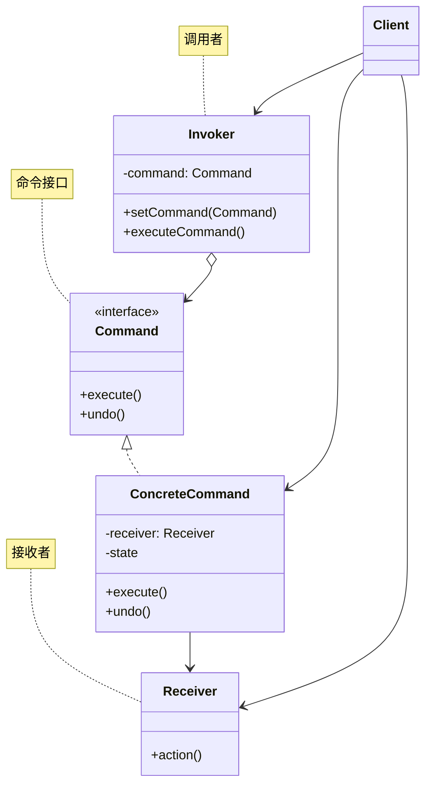
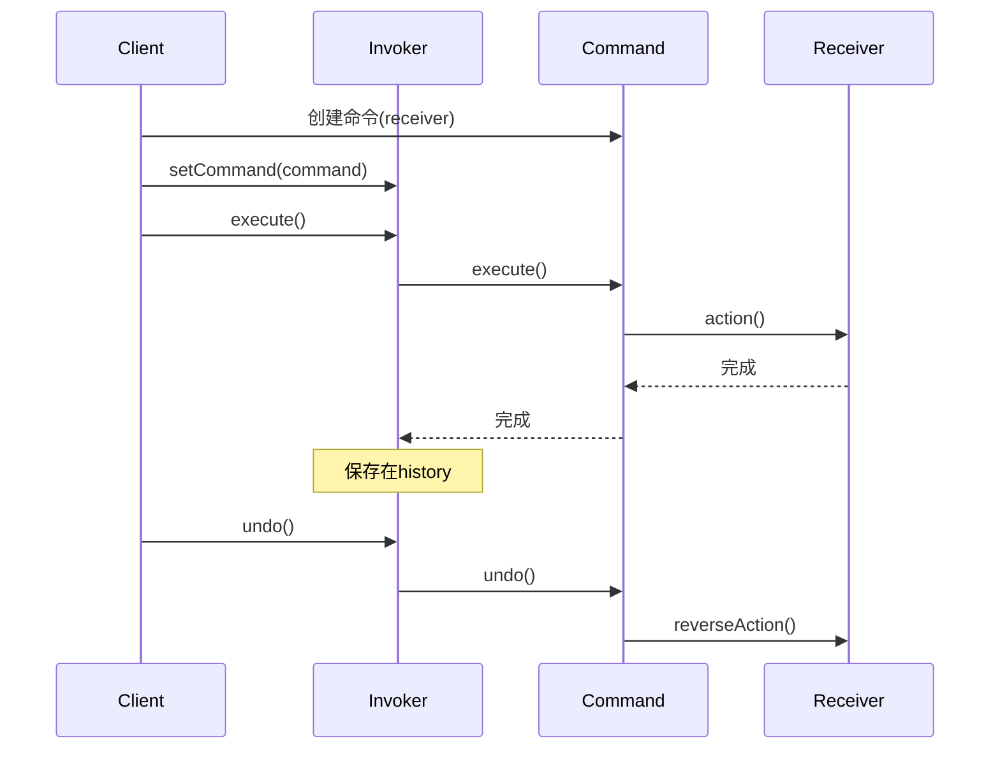

# 命令模式 (Command Pattern)

## 模式定义

**命令模式**是一种行为型设计模式，它将请求封装为一个对象，从而使你可用不同的请求对客户端进行参数化、对请求排队或记录请求日志，以及支持可撤销的操作。



## 问题分析

当需要对操作进行撤销、重做、排队等高级控制时，直接调用会导致：

```java
// ❌ 不好的做法：直接调用，无法撤销
public class TextEditor {
    private Document document;

    public void addText(String text) {
        document.append(text);
        // 无法撤销！
    }

    public void deleteText(int length) {
        document.delete(length);
        // 无法撤销！
    }
}
```

**问题**：

- ❌ 操作与执行者紧耦合
- ❌ 难以支持撤销/重做
- ❌ 难以实现延迟执行
- ❌ 难以记录操作日志
- ❌ 难以实现宏命令和事务

> [!WARNING] > **无法撤销的困扰**：很多应用（文本编辑器、图形编辑器、IDE 等）都需要撤销/重做功能，直接调用方法无法实现！

## 解决方案

将操作封装成命令对象：



> [!IMPORTANT] > **命令模式的核心**：
>
> - 将请求封装为命令对象
> - 命令对象包含接收者和参数
> - 调用者只知道命令接口
> - 支持撤销/重做/排队等操作

## 代码实现

### 场景：文本编辑器

实现支持撤销/重做的文本编辑器。

#### 1. 定义命令接口

```java
/**
 * 命令接口（Command）
 */
public interface Command {
    /**
     * 执行命令
     */
    void execute();

    /**
     * 撤销命令
     */
    void undo();
}
```

#### 2. 接收者（Receiver）

````java
/**
 * 文档类（Receiver）
 * 真正执行操作的对象
 */
public class Document {
    private StringBuilder content;

    public Document() {
        this.content = new StringBuilder();
    }

    /**
     * 添加文本
     */
    public void insertText(String text) {
        content.append(text);
        System.out.println("📝 插入文本: \"" + text + "\"");
    }

    /**
     * 删除文本
     */
    public void deleteText(int length) {
        if (length > 0 && length <= content.length()) {
            String deleted = content.substring(content.length() - length);
            content.delete(content.length() - length, content.length());
            System.out.println("🗑️  删除文本: \"" + deleted + "\"");
        }
    }

    /**
     * 获取内容
     */
    public String getContent() {
        return content.toString();
    }

    /**
     * 显示内容
     */
    public void display() {
        System.out.println("📄 当前内容: \"" + content + "\"");
    }
}\n```\n\n#### 3. 具体命令（ConcreteCommand）\n\n```java\n/**\n * 插入文本命令\n */\npublic class InsertTextCommand implements Command {\n    private Document document;\n    private String text;\n    \n    public InsertTextCommand(Document document, String text) {\n        this.document = document;\n        this.text = text;\n    }\n    \n    @Override\n    public void execute() {\n        document.insertText(text);\n    }\n    \n    @Override\n    public void undo() {\n        // 撤销：删除刚才插入的文本\n        document.deleteText(text.length());\n        System.out.println(\"↩️  撤销插入: \\\"\" + text + \"\\\"\");\n    }\n}\n\n/**\n * 删除文本命令\n */\npublic class DeleteTextCommand implements Command {\n    private Document document;\n    private String deletedText;  // 保存被删除的文本\n    private int length;\n    \n    public DeleteTextCommand(Document document, int length) {\n        this.document = document;\n        this.length = length;\n    }\n    \n    @Override\n    public void execute() {\n        // 执行前保存将要删除的文本（用于撤销）\n        String content = document.getContent();\n        if (length <= content.length()) {\n            deletedText = content.substring(content.length() - length);\n        }\n        document.deleteText(length);\n    }\n    \n    @Override\n    public void undo() {\n        // 撤销：重新插入被删除的文本\n        if (deletedText != null) {\n            document.insertText(deletedText);\n            System.out.println(\"↩️  撤销删除，恢复: \\\"\" + deletedText + \"\\\"\");\n        }\n    }\n}\n```\n\n> [!TIP]\n> **命令保存状态**：命令对象需要保存足够的信息以支持撤销操作（如 `deletedText`）。\n\n#### 4. 调用者（Invoker）\n\n```java\nimport java.util.Stack;\n\n/**\n * 文本编辑器（Invoker）\n * 管理命令的执行和撤销\n */\npublic class TextEditor {\n    private Document document;\n    private Stack<Command> history;      // 命令历史（已执行）\n    private Stack<Command> redoStack;    // 重做栈\n    \n    public TextEditor() {\n        this.document = new Document();\n        this.history = new Stack<>();\n        this.redoStack = new Stack<>();\n    }\n    \n    /**\n     * 执行命令\n     */\n    public void executeCommand(Command command) {\n        command.execute();\n        history.push(command);\n        redoStack.clear();  // 执行新命令后清空重做栈\n    }\n    \n    /**\n     * 撤销\n     */\n    public void undo() {\n        if (!history.isEmpty()) {\n            Command command = history.pop();\n            command.undo();\n            redoStack.push(command);\n            System.out.println(\"➡️  可以重做\");\n        } else {\n            System.out.println(\"❌ 没有可撤销的操作\");\n        }\n    }\n    \n    /**\n     * 重做\n     */\n    public void redo() {\n        if (!redoStack.isEmpty()) {\n            Command command = redoStack.pop();\n            command.execute();\n            history.push(command);\n            System.out.println(\"➡️  重做完成\");\n        } else {\n            System.out.println(\"❌ 没有可重做的操作\");\n        }\n    }\n    \n    /**\n     * 获取文档\n     */\n    public Document getDocument() {\n        return document;\n    }\n    \n    /**\n     * 显示内容\n     */\n    public void show() {\n        document.display();\n    }\n}\n```\n\n#### 5. 客户端使用\n\n```java\n/**\n * 命令模式演示\n */\npublic class CommandPatternDemo {\n    public static void main(String[] args) {\n        // 创建编辑器\n        TextEditor editor = new TextEditor();\n        Document doc = editor.getDocument();\n        \n        System.out.println(\"========== 文本编辑器演示 ==========\\n\");\n        \n        // 执行命令：插入文本\n        System.out.println(\"--- 操作1：插入 'Hello' ---\");\n        Command cmd1 = new InsertTextCommand(doc, \"Hello\");\n        editor.executeCommand(cmd1);\n        editor.show();\n        System.out.println();\n        \n        // 执行命令：插入文本\n        System.out.println(\"--- 操作2：插入 ' World' ---\");\n        Command cmd2 = new InsertTextCommand(doc, \" World\");\n        editor.executeCommand(cmd2);\n        editor.show();\n        System.out.println();\n        \n        // 执行命令：插入文本\n        System.out.println(\"--- 操作3：插入 '!' ---\");\n        Command cmd3 = new InsertTextCommand(doc, \"!\");\n        editor.executeCommand(cmd3);\n        editor.show();\n        System.out.println();\n        \n        // 撤销最后一个操作\n        System.out.println(\"--- 撤销操作3 ---\");\n        editor.undo();\n        editor.show();\n        System.out.println();\n        \n        // 撤销倒数第二个操作\n        System.out.println(\"--- 撤销操作2 ---\");\n        editor.undo();\n        editor.show();\n        System.out.println();\n        \n        // 重做\n        System.out.println(\"--- 重做操作2 ---\");\n        editor.redo();\n        editor.show();\n        System.out.println();\n        \n        // 执行删除命令\n        System.out.println(\"--- 操作4：删除5个字符 ---\");\n        Command cmd4 = new DeleteTextCommand(doc, 5);\n        editor.executeCommand(cmd4);\n        editor.show();\n        System.out.println();\n        \n        // 撤销删除\n        System.out.println(\"--- 撤销删除 ---\");\n        editor.undo();\n        editor.show();\n    }\n}\n```\n\n**输出：**\n```\n========== 文本编辑器演示 ==========\n\n--- 操作1：插入 'Hello' ---\n📝 插入文本: \"Hello\"\n📄 当前内容: \"Hello\"\n\n--- 操作2：插入 ' World' ---\n📝 插入文本: \" World\"\n📄 当前内容: \"Hello World\"\n\n--- 操作3：插入 '!' ---\n📝 插入文本: \"!\"\n📄 当前内容: \"Hello World!\"\n\n--- 撤销操作3 ---\n🗑️  删除文本: \"!\"\n↩️  撤销插入: \"!\"\n➡️  可以重做\n📄 当前内容: \"Hello World\"\n\n--- 撤销操作2 ---\n🗑️  删除文本: \" World\"\n↩️  撤销插入: \" World\"\n➡️  可以重做\n📄 当前内容: \"Hello\"\n\n--- 重做操作2 ---\n📝 插入文本: \" World\"\n➡️  重做完成\n📄 当前内容: \"Hello World\"\n\n--- 操作4：删除5个字符 ---\n🗑️  删除文本: \"World\"\n📄 当前内容: \"Hello \"\n\n--- 撤销删除 ---\n📝 插入文本: \"World\"\n↩️  撤销删除，恢复: \"World\"\n📄 当前内容: \"Hello World\"\n```\n\n> [!NOTE]\n> **撤销/重做实现**：\n> - history 栈保存已执行的命令\n> - redoStack 保存被撤销的命令\n> - 执行新命令时清空 redoStack\n\n## 实际应用示例\n\n### 示例1：智能家居遥控器\n\n```java\n/**\n * 设备接口（Receiver）\n */\npublic interface HomeDevice {\n    void turnOn();\n    void turnOff();\n    void setLevel(int level);\n}\n\n/**\n * 电视（ConcreteReceiver）\n */\npublic class Television implements HomeDevice {\n    private boolean isOn = false;\n    private int volume = 50;\n    \n    @Override\n    public void turnOn() {\n        isOn = true;\n        System.out.println(\"📺 电视已打开\");\n    }\n    \n    @Override\n    public void turnOff() {\n        isOn = false;\n        System.out.println(\"📺 电视已关闭\");\n    }\n    \n    @Override\n    public void setLevel(int level) {\n        this.volume = level;\n        System.out.println(\"📺 电视音量: \" + volume);\n    }\n}\n\n/**\n * 打开设备命令\n */\npublic class TurnOnCommand implements Command {\n    private HomeDevice device;\n    \n    public TurnOnCommand(HomeDevice device) {\n        this.device = device;\n    }\n    \n    @Override\n    public void execute() {\n        device.turnOn();\n    }\n    \n    @Override\n    public void undo() {\n        device.turnOff();\n    }\n}\n\n/**\n * 宏命令：回家模式\n */\npublic class HomeArrivalMacro implements Command {\n    private List<Command> commands = new ArrayList<>();\n    \n    public HomeArrivalMacro(Television tv, Light light, AirConditioner ac) {\n        commands.add(new TurnOnCommand(light));\n        commands.add(new TurnOnCommand(tv));\n        commands.add(new TurnOnCommand(ac));\n    }\n    \n    @Override\n    public void execute() {\n        System.out.println(\"\\n🏠 === 回家模式 ===\");\n        for (Command cmd : commands) {\n            cmd.execute();\n        }\n    }\n    \n    @Override\n    public void undo() {\n        System.out.println(\"\\n🚪 === 离家模式 ===\");\n        // 逆序撤销\n        for (int i = commands.size() - 1; i >= 0; i--) {\n            commands.get(i).undo();\n        }\n    }\n}\n```\n\n### 示例2：绘图应用\n\n```java\n/**\n * 画布（Receiver）\n */\npublic class Canvas {\n    private List<Shape> shapes = new ArrayList<>();\n    \n    public void addShape(Shape shape) {\n        shapes.add(shape);\n        System.out.println(\"➕ 添加图形: \" + shape);\n    }\n    \n    public void removeShape(Shape shape) {\n        shapes.remove(shape);\n        System.out.println(\"➖ 删除图形: \" + shape);\n    }\n}\n\n/**\n * 添加图形命令\n */\npublic class AddShapeCommand implements Command {\n    private Canvas canvas;\n    private Shape shape;\n    \n    public AddShapeCommand(Canvas canvas, Shape shape) {\n        this.canvas = canvas;\n        this.shape = shape;\n    }\n    \n    @Override\n    public void execute() {\n        canvas.addShape(shape);\n    }\n    \n    @Override\n    public void undo() {\n        canvas.removeShape(shape);\n    }\n}\n\nclass Shape {\n    private String type;\n    public Shape(String type) { this.type = type; }\n    public String toString() { return type; }\n}\n```\n\n### 示例3：数据库事务\n\n```java\n/**\n * 数据库事务管理器\n */\npublic class TransactionManager {\n    private List<Command> commands = new ArrayList<>();\n    private List<Command> executedCommands = new ArrayList<>();\n    \n    /**\n     * 添加命令到事务\n     */\n    public void addCommand(Command command) {\n        commands.add(command);\n    }\n    \n    /**\n     * 提交事务\n     */\n    public boolean commit() {\n        System.out.println(\"\\n💾 === 开始事务 ===\");\n        try {\n            for (Command cmd : commands) {\n                cmd.execute();\n                executedCommands.add(cmd);\n            }\n            System.out.println(\"✅ 事务提交成功\\n\");\n            return true;\n        } catch (Exception e) {\n            System.out.println(\"❌ 事务执行失败，开始回滚...\");\n            rollback();\n            return false;\n        }\n    }\n    \n    /**\n     * 回滚事务\n     */\n    public void rollback() {\n        System.out.println(\"\\n⚠️  === 回滚事务 ===\");\n        for (int i = executedCommands.size() - 1; i >= 0; i--) {\n            executedCommands.get(i).undo();\n        }\n        executedCommands.clear();\n        System.out.println(\"✅ 回滚完成\\n\");\n    }\n}\n```\n\n## Java 标准库中的应用\n\n### 1. Runnable接口\n\n```java\n/**\n * Runnable 就是一个命令\n */\nRunnable command = () -> System.out.println(\"执行任务\");\nThread thread = new Thread(command);\nthread.start();\n```\n\n### 2. Swing的Action\n\n```java\n/**\n * Action 是命令模式的经典应用\n */\nAction saveAction = new AbstractAction(\"保存\") {\n    @Override\n    public void actionPerformed(ActionEvent e) {\n        // 执行保存操作\n    }\n};\n\nJButton button = new JButton(saveAction);\n```\n\n### 3. Spring的ApplicationEvent\n\n```java\n/**\n * Spring 事件也是命令模式\n */\n@EventListener\npublic void handleEvent(CustomEvent event) {\n    // 处理事件\n}\n```\n\n## 优缺点\n\n### 优点\n\n- ✅ **解耦调用者和接收者** - 调用者无需知道接收者细节\n- ✅ **支持撤销/重做** - 轻松实现复杂的撤销机制\n- ✅ **支持宏命令** - 组合多个命令\n- ✅ **支持命令队列** - 延迟执行、批量执行\n- ✅ **支持事务** - 全部成功或全部回滚\n- ✅ **易于扩展** - 添加新命令无需修改现有代码\n\n### 缺点\n\n- ❌ **类数量增多** - 每个命令都是一个类\n- ❌ **内存开销** - 保存命令历史占用内存\n- ❌ **复杂度增加** - 简单操作也要封装成命令\n\n## 适用场景\n\n### 何时使用命令模式\n\n- ✓ **需要撤销/重做** - 文本编辑器、图形编辑器\n- ✓ **需要命令队列** - 任务调度、批处理\n- ✓ **需要事务** - 数据库操作、分布式系统\n- ✓ **需要宏命令** - 脚本录制、快捷键\n- ✓ **需要日志记录** - 审计、调试\n\n### 实际应用场景\n\n- 📝 **文本/图形编辑器** - 撤销/重做\n- 🎮 **游戏** - 命令回放、录像\n- 🏠 **智能家居** - 场景模式、定时任务\n- 💾 **数据库** - 事务管理\n- 🤖 **任务调度** - 队列、延迟执行\n\n## 最佳实践\n\n### 1. 命令保存必要状态\n\n```java\n// ✅ 好的命令：保存撤销所需的状态\npublic class GoodCommand implements Command {\n    private String originalState;  // 保存原始状态\n    \n    @Override\n    public void execute() {\n        originalState = getCurrentState();  // 保存\n        // 执行操作\n    }\n    \n    @Override\n    public void undo() {\n        restoreState(originalState);  // 恢复\n    }\n}\n```\n\n### 2. 使用宏命令组合命令\n\n```java\n/**\n * 宏命令：批量操作\n */\npublic class MacroCommand implements Command {\n    private List<Command> commands;\n    \n    public MacroCommand(List<Command> commands) {\n        this.commands = commands;\n    }\n    \n    @Override\n    public void execute() {\n        commands.forEach(Command::execute);\n    }\n    \n    @Override\n    public void undo() {\n        // 逆序撤销\n        for (int i = commands.size() - 1; i >= 0; i--) {\n            commands.get(i).undo();\n        }\n    }\n}\n```\n\n### 3. 限制历史记录大小\n\n```java\n/**\n * 限制历史记录，避免内存溢出\n */\npublic class LimitedHistoryEditor {\n    private static final int MAX_HISTORY = 100;\n    private Deque<Command> history = new LinkedList<>();\n    \n    public void execute(Command command) {\n        command.execute();\n        history.push(command);\n        \n        // 限制历史记录大小\n        if (history.size() > MAX_HISTORY) {\n            history.removeLast();\n        }\n    }\n}\n```\n\n### 4. 清空重做栈\n\n```java\n// ✅ 执行新命令时清空重做栈\npublic void execute(Command command) {\n    command.execute();\n    history.push(command);\n    redoStack.clear();  // 重要！\n}\n```\n\n## 与其他模式的关系\n\n- **命令 + 备忘录** - 备忘录保存命令执行前的状态\n- **命令 + 组合** - 宏命令使用组合模式\n- **命令 + 责任链** - 命令可以沿责任链传递\n- **命令 + 原型** - 复制命令对象\n\n## 总结\n\n命令模式是实现撤销/重做的最佳方案：\n\n- **核心思想** - 将请求封装为对象\n- **关键优势** - 支持撤销、重做、队列、事务\n- **主要缺点** - 类数量增多、内存开销\n- **经典应用** - Runnable、Swing Action\n- **适用场景** - 需要撤销/重做的系统\n\n> [!TIP]\n> **命令模式的精髓**：\n> - **封装请求为对象**\n> - **保存执行所需的所有信息**\n> - **支持撤销需保存原始状态**\n> - **可以组合、排队、延迟执行**\n\n**已完成：15个文档**\n\n继续批量优化...\n
````
