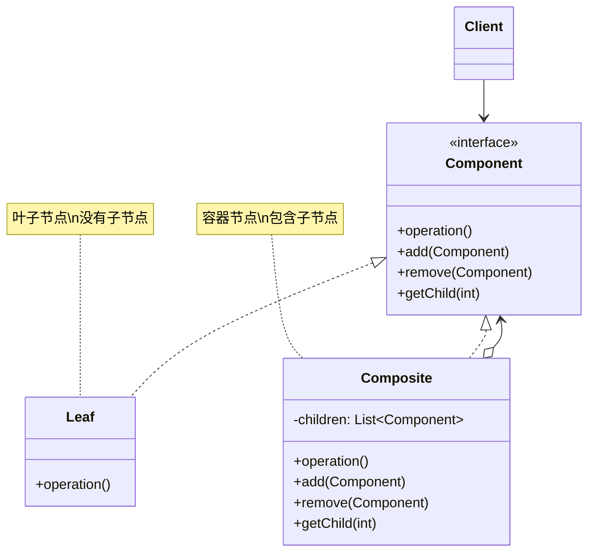
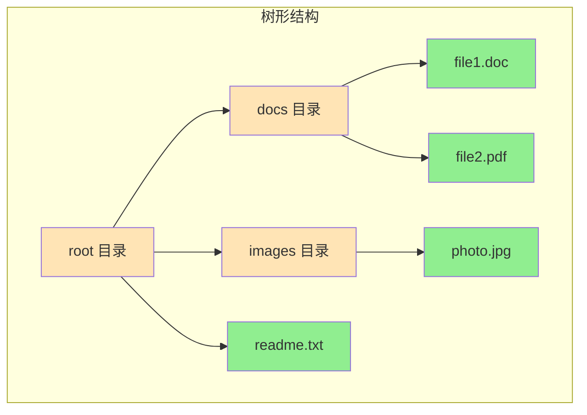

# 组合模式 (Composite Pattern)

## 模式定义

**组合模式**是一种结构型设计模式，它允许你将对象组合成树形结构来表示"部分-整体"的层次结构，使得客户端可以以统一的方式处理单个对象和对象的组合。



## 问题分析

在处理树形结构时，如果区分对待叶子节点和容器节点，会导致代码复杂：

```java
// ❌ 不好的做法：区分处理叶子和容器
public void displayFileSystem(Object obj) {
    if (obj instanceof File) {
        File file = (File) obj;
        System.out.println("文件: " + file.getName());
    } else if (obj instanceof Directory) {
        Directory dir = (Directory) obj;
        System.out.println("目录: " + dir.getName());
        for (Object child : dir.getChildren()) {
            displayFileSystem(child);  // 递归处理
        }
    }
    // 难以维护！
}
```

**问题**：

- ❌ 需要判断对象类型（instanceof）
- ❌ 代码充满 if-else 分支
- ❌ 添加新类型需要修改代码
- ❌ 无法统一处理单个对象和组合对象

> [!NOTE] > **现实类比**：无论是单个文件还是包含多个文件的文件夹，你都可以用同样的方式操作它们（复制、移动、删除等）。组合模式让代码也能这样做。

## 解决方案

将叶子节点和容器节点统一为一个接口：



> [!IMPORTANT] > **组合模式的核心**：
>
> - 叶子和容器实现相同的接口
> - 客户端无需区分叶子和容器
> - 可以递归地组合对象
> - 树形结构的统一处理

## 代码实现

### 场景：文件系统

文件系统是组合模式的经典应用：文件（叶子）和文件夹（容器）。

#### 1. 定义组件接口

```java
/**
 * 文件系统组件接口（Component）
 * 文件和文件夹都实现此接口
 */
public interface FileSystemComponent {
    /**
     * 获取名称
     */
    String getName();

    /**
     * 显示信息
     * @param indent 缩进级别，用于显示层次结构
     */
    void display(int indent);

    /**
     * 获取大小
     */
    long getSize();
}
```

#### 2. 叶子节点（文件）

```java
/**
 * 文件类（Leaf）
 * 叶子节点，没有子节点
 */
public class File implements FileSystemComponent {
    private String name;
    private long size;

    public File(String name, long size) {
        this.name = name;
        this.size = size;
    }

    @Override
    public String getName() {
        return name;
    }

    /**
     * 显示文件信息
     */
    @Override
    public void display(int indent) {
        String indentation = "  ".repeat(indent);
        System.out.println(indentation + "📄 " + name + " (" + formatSize(size) + ")");
    }

    @Override
    public long getSize() {
        return size;
    }

    /**
     * 格式化文件大小
     */
    private String formatSize(long bytes) {
        if (bytes < 1024) return bytes + " B";
        if (bytes < 1024 * 1024) return (bytes / 1024) + " KB";
        return (bytes / 1024 / 1024) + " MB";
    }
}
```

> [!TIP] > **叶子节点的特点**：
>
> - 实现组件接口
> - 没有子节点
> - 是树形结构的终端节点

#### 3. 容器节点（文件夹）

```java
import java.util.ArrayList;
import java.util.List;

/**
 * 文件夹类（Composite）
 * 容器节点，可以包含文件和子文件夹
 */
public class Directory implements FileSystemComponent {
    private String name;
    private List<FileSystemComponent> children;

    public Directory(String name) {
        this.name = name;
        this.children = new ArrayList<>();
    }

    /**
     * 添加子组件（文件或文件夹）
     */
    public void add(FileSystemComponent component) {
        children.add(component);
    }

    /**
     * 移除子组件
     */
    public void remove(FileSystemComponent component) {
        children.remove(component);
    }

    /**
     * 获取子组件
     */
    public List<FileSystemComponent> getChildren() {
        return children;
    }

    @Override
    public String getName() {
        return name;
    }

    /**
     * 递归显示文件夹及其内容
     */
    @Override
    public void display(int indent) {
        String indentation = "  ".repeat(indent);
        System.out.println(indentation + "📁 " + name + "/ (" + formatSize(getSize()) + ")");

        // 递归显示所有子组件
        for (FileSystemComponent child : children) {
            child.display(indent + 1);
        }
    }

    /**
     * 递归计算文件夹总大小
     */
    @Override
    public long getSize() {
        long totalSize = 0;
        for (FileSystemComponent child : children) {
            totalSize += child.getSize();
        }
        return totalSize;
    }

    private String formatSize(long bytes) {
        if (bytes < 1024) return bytes + " B";
        if (bytes < 1024 * 1024) return (bytes / 1024) + " KB";
        return (bytes / 1024 / 1024) + " MB";
    }
}
```

> [!IMPORTANT] > **容器节点的关键**：
>
> - 维护子组件列表
> - 递归调用子组件的方法
> - 聚合子组件的结果（如计算总大小）

#### 4. 客户端使用

```java
/**
 * 文件系统演示
 */
public class FileSystemDemo {
    public static void main(String[] args) {
        // 创建根目录
        Directory root = new Directory("root");

        // 创建子目录
        Directory documents = new Directory("Documents");
        Directory pictures = new Directory("Pictures");
        Directory work = new Directory("Work");

        // 创建文件
        File resume = new File("resume.pdf", 1024 * 100);    // 100 KB
        File photo1 = new File("vacation.jpg", 1024 * 2048); // 2 MB
        File photo2 = new File("family.jpg", 1024 * 1536);   // 1.5 MB
        File report = new File("report.docx", 1024 * 512);   // 512 KB
        File code = new File("Main.java", 1024 * 5);         // 5 KB

        // 构建树形结构
        root.add(documents);
        root.add(pictures);

        documents.add(resume);
        documents.add(work);

        work.add(report);
        work.add(code);

        pictures.add(photo1);
        pictures.add(photo2);

        // 统一处理：显示整个文件系统
        System.out.println("========== 文件系统结构 ==========");
        root.display(0);

        System.out.println("\n========== 文件系统统计 ==========");
        System.out.println("根目录总大小: " + (root.getSize() / 1024) + " KB");

        // 也可以单独操作子目录
        System.out.println("\n========== Documents 目录 ==========");
        documents.display(0);
    }
}
```

**输出：**

```
========== 文件系统结构 ==========
📁 root/ (4 MB)
  📁 Documents/ (612 KB)
    📄 resume.pdf (100 KB)
    📁 Work/ (512 KB)
      📄 report.docx (512 KB)
      📄 Main.java (5 KB)
  📁 Pictures/ (3 MB)
    📄 vacation.jpg (2 MB)
    📄 family.jpg (1 MB)

========== 文件系统统计 ==========
根目录总大小: 4196 KB

========== Documents 目录 ==========
📁 Documents/ (612 KB)
  📄 resume.pdf (100 KB)
  📁 Work/ (512 KB)
    📄 report.docx (512 KB)
    📄 Main.java (5 KB)
```

> [!TIP] > **组合模式的优势**：
>
> - 无需区分文件和文件夹
> - 使用相同的方法处理它们
> - 自然地支持递归结构
> - 易于添加新类型的组件

## 实际应用示例

### 示例 1：UI 组件树

```java
/**
 * UI 组件接口
 */
public interface UIComponent {
    void render(int indent);
    void onClick();
}

/**
 * 按钮（叶子节点）
 */
public class Button implements UIComponent {
    private String label;
    private String action;

    public Button(String label, String action) {
        this.label = label;
        this.action = action;
    }

    @Override
    public void render(int indent) {
        String indentation = "  ".repeat(indent);
        System.out.println(indentation + "🔘 Button: " + label);
    }

    @Override
    public void onClick() {
        System.out.println("执行操作: " + action);
    }
}

/**
 * 文本框（叶子节点）
 */
public class TextField implements UIComponent {
    private String placeholder;

    public TextField(String placeholder) {
        this.placeholder = placeholder;
    }

    @Override
    public void render(int indent) {
        String indentation = "  ".repeat(indent);
        System.out.println(indentation + "📝 TextField: " + placeholder);
    }

    @Override
    public void onClick() {
        System.out.println("聚焦到文本框");
    }
}

/**
 * 面板（容器节点）
 */
public class Panel implements UIComponent {
    private String title;
    private List<UIComponent> children = new ArrayList<>();

    public Panel(String title) {
        this.title = title;
    }

    public void add(UIComponent component) {
        children.add(component);
    }

    public void remove(UIComponent component) {
        children.remove(component);
    }

    @Override
    public void render(int indent) {
        String indentation = "  ".repeat(indent);
        System.out.println(indentation + "📦 Panel: " + title);
        for (UIComponent child : children) {
            child.render(indent + 1);
        }
    }

    @Override
    public void onClick() {
        System.out.println("点击面板");
    }
}

// 使用示例
class UIDemo {
    public static void main(String[] args) {
        // 创建主窗口
        Panel mainWindow = new Panel("主窗口");

        // 创建左侧面板
        Panel leftPanel = new Panel("左侧栏");
        leftPanel.add(new Button("新建", "create"));
        leftPanel.add(new Button("打开", "open"));
        leftPanel.add(new Button("保存", "save"));

        // 创建右侧面板
        Panel rightPanel = new Panel("内容区");
        rightPanel.add(new TextField("请输入标题"));
        rightPanel.add(new TextField("请输入内容"));
        rightPanel.add(new Button("提交", "submit"));

        // 组装
        mainWindow.add(leftPanel);
        mainWindow.add(rightPanel);

        // 渲染整个 UI
        mainWindow.render(0);
    }
}
```

**输出：**

```
📦 Panel: 主窗口
  📦 Panel: 左侧栏
    🔘 Button: 新建
    🔘 Button: 打开
    🔘 Button: 保存
  📦 Panel: 内容区
    📝 TextField: 请输入标题
    📝 TextField: 请输入内容
    🔘 Button: 提交
```

### 示例 2：组织结构

```java
/**
 * 员工接口
 */
public interface Employee {
    String getName();
    String getPosition();
    double getSalary();
    void display(int indent);
    void addSubordinate(Employee employee);
}

/**
 * 普通员工（叶子节点）
 */
public class Developer implements Employee {
    private String name;
    private String position;
    private double salary;

    public Developer(String name, String position, double salary) {
        this.name = name;
        this.position = position;
        this.salary = salary;
    }

    @Override
    public String getName() {
        return name;
    }

    @Override
    public String getPosition() {
        return position;
    }

    @Override
    public double getSalary() {
        return salary;
    }

    @Override
    public void display(int indent) {
        String indentation = "  ".repeat(indent);
        System.out.println(indentation + "👨‍💻 " + position + ": " + name +
            " (¥" + String.format("%.0f", salary) + ")");
    }

    @Override
    public void addSubordinate(Employee employee) {
        throw new UnsupportedOperationException("普通员工不能有下属");
    }
}

/**
 * 管理者（容器节点）
 */
public class Manager implements Employee {
    private String name;
    private String position;
    private double salary;
    private List<Employee> subordinates = new ArrayList<>();

    public Manager(String name, String position, double salary) {
        this.name = name;
        this.position = position;
        this.salary = salary;
    }

    @Override
    public String getName() {
        return name;
    }

    @Override
    public String getPosition() {
        return position;
    }

    @Override
    public double getSalary() {
        // 管理者的总薪资 = 自己的薪资 + 所有下属的薪资
        double totalSalary = salary;
        for (Employee emp : subordinates) {
            totalSalary += emp.getSalary();
        }
        return totalSalary;
    }

    @Override
    public void display(int indent) {
        String indentation = "  ".repeat(indent);
        System.out.println(indentation + "👔 " + position + ": " + name +
            " (¥" + String.format("%.0f", salary) + ", 团队总计: ¥" +
            String.format("%.0f", getSalary()) + ")");

        for (Employee emp : subordinates) {
            emp.display(indent + 1);
        }
    }

    @Override
    public void addSubordinate(Employee employee) {
        subordinates.add(employee);
    }
}

// 使用示例
class OrganizationDemo {
    public static void main(String[] args) {
        // 创建组织结构
        Manager ceo = new Manager("张三", "CEO", 100000);

        Manager cto = new Manager("李四", "CTO", 50000);
        Manager cfo = new Manager("王五", "CFO", 50000);

        Manager techManager = new Manager("赵六", "技术经理", 30000);

        Developer dev1 = new Developer("孙七", "Java开发", 15000);
        Developer dev2 = new Developer("周八", "前端开发", 14000);
        Developer dev3 = new Developer("吴九", "测试工程师", 12000);

        Developer accountant = new Developer("郑十", "会计", 10000);

        // 构建组织树
        ceo.addSubordinate(cto);
        ceo.addSubordinate(cfo);

        cto.addSubordinate(techManager);

        techManager.addSubordinate(dev1);
        techManager.addSubordinate(dev2);
        techManager.addSubordinate(dev3);

        cfo.addSubordinate(accountant);

        // 显示组织结构
        System.out.println("========== 公司组织结构 ==========");
        ceo.display(0);

        System.out.println("\n========== 技术部门 ==========");
        cto.display(0);
    }
}
```

### 示例 3：菜单系统

```java
/**
 * 菜单组件接口
 */
public interface MenuComponent {
    void add(MenuComponent component);
    void print(int depth);
    void click();
}

/**
 * 菜单项（叶子节点）
 */
public class MenuItem implements MenuComponent {
    private String name;
    private String action;

    public MenuItem(String name, String action) {
        this.name = name;
        this.action = action;
    }

    @Override
    public void add(MenuComponent component) {
        throw new UnsupportedOperationException("菜单项不能添加子项");
    }

    @Override
    public void print(int depth) {
        String indentation = "  ".repeat(depth);
        System.out.println(indentation + "• " + name);
    }

    @Override
    public void click() {
        System.out.println("执行: " + action);
    }
}

/**
 * 菜单（容器节点）
 */
public class Menu implements MenuComponent {
    private String name;
    private List<MenuComponent> items = new ArrayList<>();

    public Menu(String name) {
        this.name = name;
    }

    @Override
    public void add(MenuComponent component) {
        items.add(component);
    }

    @Override
    public void print(int depth) {
        String indentation = "  ".repeat(depth);
        System.out.println(indentation + "▼ " + name);
        for (MenuComponent item : items) {
            item.print(depth + 1);
        }
    }

    @Override
    public void click() {
        System.out.println("展开菜单: " + name);
    }
}

// 使用示例
class MenuDemo {
    public static void main(String[] args) {
        // 创建菜单栏
        Menu menuBar = new Menu("菜单栏");

        // 文件菜单
        Menu fileMenu = new Menu("文件");
        fileMenu.add(new MenuItem("新建", "new_file"));
        fileMenu.add(new MenuItem("打开", "open_file"));
        fileMenu.add(new MenuItem("保存", "save_file"));

        Menu recentFiles = new Menu("最近文件");
        recentFiles.add(new MenuItem("file1.txt", "open_file1"));
        recentFiles.add(new MenuItem("file2.txt", "open_file2"));
        fileMenu.add(recentFiles);

        fileMenu.add(new MenuItem("退出", "exit"));

        // 编辑菜单
        Menu editMenu = new Menu("编辑");
        editMenu.add(new MenuItem("复制", "copy"));
        editMenu.add(new MenuItem("粘贴", "paste"));

        // 查看菜单
        Menu viewMenu = new Menu("查看");
        viewMenu.add(new MenuItem("全屏", "fullscreen"));
        viewMenu.add(new MenuItem("缩放", "zoom"));

        // 组装菜单栏
        menuBar.add(fileMenu);
        menuBar.add(editMenu);
        menuBar.add(viewMenu);

        // 显示菜单结构
        menuBar.print(0);
    }
}
```

## 组合模式的两种实现

### 1. 透明组合（Transparent Composite）

所有组件都有相同的接口，包括管理子组件的方法：

```java
/**
 * 透明组合：所有方法都在接口中
 * 优点：客户端统一处理
 * 缺点：叶子节点也有 add/remove 方法，不安全
 */
public interface Component {
    void operation();
    void add(Component component);
    void remove(Component component);
    Component getChild(int index);
}

public class Leaf implements Component {
    @Override
    public void operation() {
        // 实现
    }

    @Override
    public void add(Component component) {
        // 叶子节点不应该有这个方法，但必须实现
        throw new UnsupportedOperationException("叶子节点不能添加子节点");
    }

    @Override
    public void remove(Component component) {
        throw new UnsupportedOperationException();
    }

    @Override
    public Component getChild(int index) {
        throw new UnsupportedOperationException();
    }
}
```

### 2. 安全组合（Safe Composite）

容器节点有额外的管理方法，更安全但客户端需要区分类型：

```java
/**
 * 安全组合：只在容器类中定义管理方法
 * 优点：类型安全
 * 缺点：客户端需要区分叶子和容器
 */
public interface Component {
    void operation();
}

public class Leaf implements Component {
    @Override
    public void operation() {
        // 实现
    }
}

public class Composite implements Component {
    private List<Component> children = new ArrayList<>();

    @Override
    public void operation() {
        for (Component child : children) {
            child.operation();
        }
    }

    // 只有 Composite 有这些方法
    public void add(Component component) {
        children.add(component);
    }

    public void remove(Component component) {
        children.remove(component);
    }

    public Component getChild(int index) {
        return children.get(index);
    }
}
```

| 特性         | 透明组合      | 安全组合        |
| ------------ | ------------- | --------------- |
| **接口统一** | ✅ 完全统一   | ❌ 需要区分类型 |
| **类型安全** | ❌ 不安全     | ✅ 安全         |
| **易用性**   | ⭐⭐⭐ 简单   | ⭐⭐ 稍复杂     |
| **推荐度**   | ⭐⭐⭐⭐ 常用 | ⭐⭐⭐ 谨慎使用 |

> [!IMPORTANT] > **一般推荐透明组合**：虽然不太安全，但提供了更好的统一性。在叶子节点的 add/remove 方法中抛出异常即可。

## Java 标准库中的应用

### 1. Swing 组件

```java
/**
 * Swing 使用组合模式构建 UI
 */
import javax.swing.*;

JFrame frame = new JFrame("窗口");           // 容器
JPanel panel = new JPanel();                 // 容器
JButton button = new JButton("按钮");        // 叶子
JLabel label = new JLabel("标签");           // 叶子

// 组合
panel.add(button);
panel.add(label);
frame.add(panel);
```

### 2. XML DOM

```java
/**
 * XML DOM 树是组合模式
 */
import org.w3c.dom.*;

Document doc = ...;
Element root = doc.getDocumentElement();      // 容器
Element child = doc.createElement("div");     // 容器
Text text = doc.createTextNode("文本");       // 叶子

root.appendChild(child);
child.appendChild(text);
```

### 3. Java AWT 容器

```java
/**
 * AWT 的 Container 类
 */
import java.awt.*;

Container container = new Container();        // 容器
Button button = new Button("按钮");          // 叶子
container.add(button);
```

## 优缺点

### 优点

- ✅ **简化客户端代码** - 统一处理叶子和容器
- ✅ **易于扩展** - 添加新类型的组件很简单
- ✅**符合开闭原则** - 不修改现有代码
- ✅ **天然支持递归** - 适合树形结构
- ✅ **灵活组合** - 可以构建任意复杂的层次结构

### 缺点

- ❌ **设计较复杂** - 需要抽象出公共接口
- ❌ **限制类型** - 难以限制容器的子组件类型
- ❌ **可能降低性能** - 递归调用可能有性能开销

## 适用场景

### 何时使用组合模式

- ✓ **树形结构** - 需要表示对象的"部分-整体"层次
- ✓ **统一处理** - 希望统一处理单个对象和组合对象
- ✓ **递归遍历** - 需要递归遍历对象结构
- ✓ **忽略组合** - 客户端不需要知道对象是叶子还是容器

### 实际应用场景

- 📁 **文件系统** - 文件和文件夹
- 🎨 **UI 组件** - 窗口、面板、按钮
- 🏢 **组织结构** - 公司的层级关系
- 📝 **菜单系统** - 菜单和菜单项
- 🌳 **XML/HTML** - DOM 树结构

## 最佳实践

### 1. 使用接口而非抽象类

```java
// ✅ 推荐：使用接口
public interface Component {
    void operation();
}

// 如果有默认实现，可以提供抽象类
public abstract class AbstractComponent implements Component {
    protected String name;

    public AbstractComponent(String name) {
        this.name = name;
    }

    public String getName() {
        return name;
    }
}
```

### 2. 提供遍历方法

```java
/**
 * 为容器提供遍历子组件的方法
 */
public class CompositeWithIterator implements Component {
    private List<Component> children = new ArrayList<>();

    public Iterator<Component> iterator() {
        return children.iterator();
    }

    public Stream<Component> stream() {
        return children.stream();
    }
}
```

### 3. 缓存计算结果

```java
/**
 * 对于耗时的计算，可以缓存结果
 */
public class CachedDirectory implements FileSystemComponent {
    private List<FileSystemComponent> children = new ArrayList<>();
    private Long cachedSize;  // 缓存大小

    @Override
    public long getSize() {
        if (cachedSize == null) {
            long total = 0;
            for (FileSystemComponent child : children) {
                total += child.getSize();
            }
            cachedSize = total;
        }
        return cachedSize;
    }

    public void add(FileSystemComponent component) {
        children.add(component);
        cachedSize = null;  // 清除缓存
    }
}
```

### 4. 使用访问者模式增强

```java
/**
 * 组合模式 + 访问者模式
 * 可以在不修改组件类的情况下添加新操作
 */
public interface ComponentVisitor {
    void visit(Leaf leaf);
    void visit(Composite composite);
}

public interface Component {
    void accept(ComponentVisitor visitor);
}
```

## 与其他模式的关系

- **组合 + 迭代器** - 遍历组合结构
- **组合 + 访问者** - 对组合结构执行操作
- **组合 + 装饰器** - 都使用递归组合
- **组合 + 责任链** - 可以在组合树中传递请求

## 总结

组合模式是处理树形结构的利器：

- **核心思想** - 统一处理单个对象和对象组合
- **关键结构** - 树形层次，递归组合
- **主要优势** - 简化客户端代码，易于扩展
- **经典应用** - 文件系统、UI 组件、组织结构
- **注意事项** - 选择透明或安全组合，考虑性能优化

> [!TIP] > **组合模式的精髓**：
>
> - 部分-整体的层次结构
> - 叶子和容器统一接口
> - 客户端透明地使用
> - 递归地处理对象树

**已完成优化：10 个文档**

继续优化下一个...
