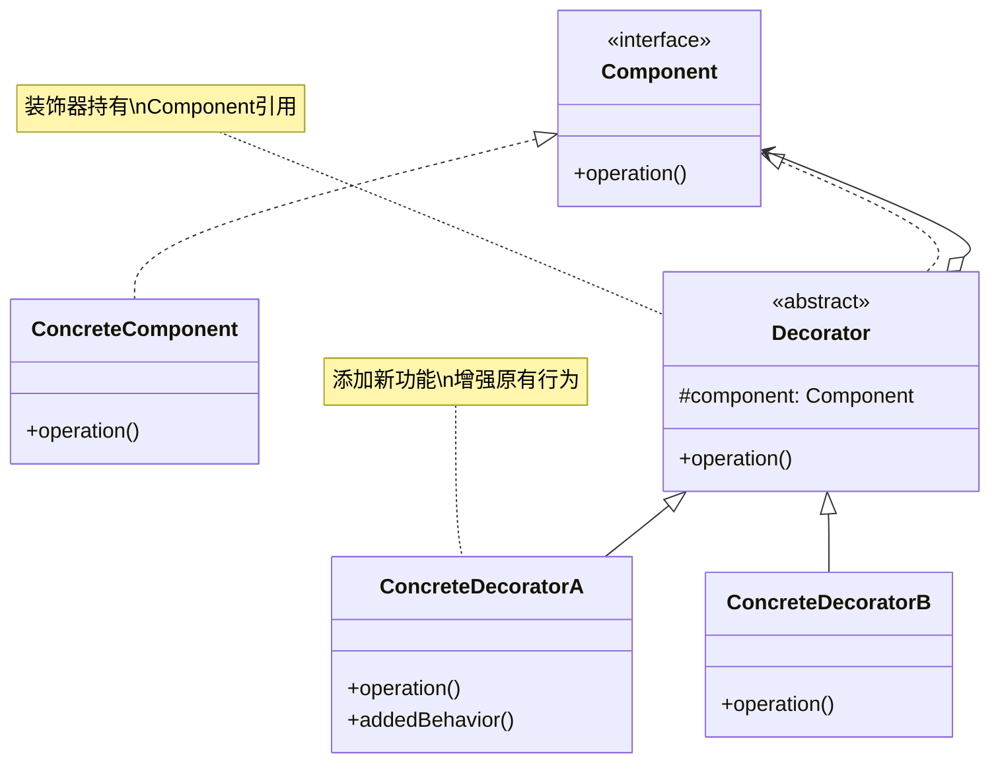
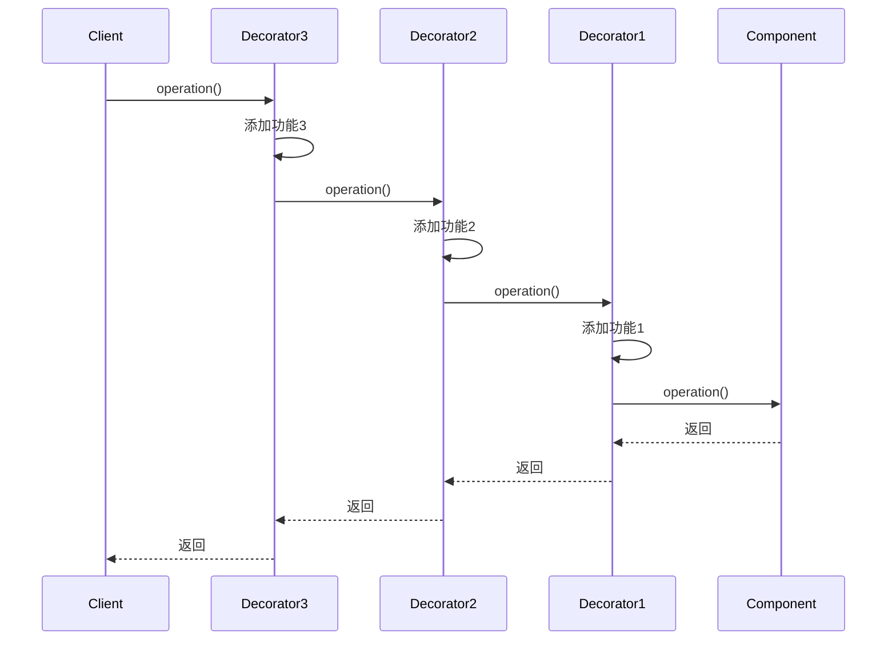
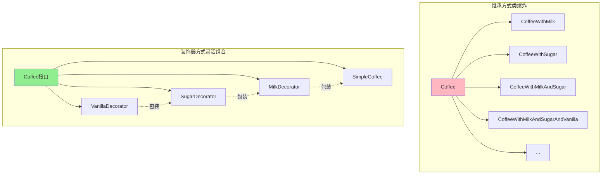

# 装饰器模式 (Decorator Pattern)

## 模式定义

**装饰器模式**是一种结构型设计模式，它允许在不改变对象自身结构的情况下，动态地向对象添加新的功能。装饰器模式是继承的一个灵活替代方案。



## 问题分析

如果需要为对象添加新功能，传统方法是使用继承：

```java
// ❌ 不好的做法 - 类爆炸问题
public class SimpleCoffee { }
public class CoffeeWithMilk extends SimpleCoffee { }
public class CoffeeWithSugar extends SimpleCoffee { }
public class CoffeeWithMilkAndSugar extends SimpleCoffee { }
public class CoffeeWithMilkAndSugarAndVanilla extends SimpleCoffee { }
public class CoffeeWithMilkAndSugarAndVanillaAndCaramel extends SimpleCoffee { }
// ... 组合爆炸！
```

**问题**：

- ❌ 类的数量呈**指数级增长**（n 个配料需要 2^n 个类!)
- ❌ 代码重复，难以维护
- ❌ 违反单一职责原则
- ❌ 无法动态组合功能

> [!WARNING] > **类爆炸问题**：假设咖啡有 5 种配料（牛奶、糖、香草、焦糖、奶油），理论上需要创建 2^5 = 32 个类来覆盖所有组合！这显然不可行。

## 解决方案

使用**组合**而不是**继承**，通过装饰器动态添加功能：



> [!TIP] > **装饰器的本质**：像俄罗斯套娃一样，一层一层包装对象，每一层都添加新功能，但保持接口不变。

## 代码实现

### 场景：咖啡店订单系统

让我们构建一个灵活的咖啡订单系统，可以动态添加各种配料。

#### 1. 定义组件接口

```java
/**
 * 咖啡接口（Component）
 * 定义了所有咖啡（包括装饰后的）都应该实现的方法
 */
public interface Coffee {
    /**
     * 获取价格
     * @return 咖啡价格
     */
    double getCost();

    /**
     * 获取描述
     * @return 咖啡描述
     */
    String getDescription();
}
```

#### 2. 具体组件

```java
/**
 * 简单咖啡（ConcreteComponent）
 * 基础咖啡，没有任何配料
 */
public class SimpleCoffee implements Coffee {
    @Override
    public double getCost() {
        return 10.0;
    }

    @Override
    public String getDescription() {
        return "简单咖啡";
    }
}

/**
 * 浓缩咖啡（ConcreteComponent）
 */
public class Espresso implements Coffee {
    @Override
    public double getCost() {
        return 15.0;
    }

    @Override
    public String getDescription() {
        return "浓缩咖啡";
    }
}

/**
 * 拿铁（ConcreteComponent）
 */
public class Latte implements Coffee {
    @Override
    public double getCost() {
        return 18.0;
    }

    @Override
    public String getDescription() {
        return "拿铁";
    }
}
```

#### 3. 定义装饰器抽象类

```java
/**
 * 咖啡装饰器抽象类（Decorator）
 * 实现 Coffee 接口，并持有一个 Coffee 对象的引用
 */
public abstract class CoffeeDecorator implements Coffee {
    // 被装饰的咖啡对象
    protected Coffee coffee;

    /**
     * 构造函数：包装一个 Coffee 对象
     */
    public CoffeeDecorator(Coffee coffee) {
        this.coffee = coffee;
    }

    /**
     * 默认实现：委托给被装饰对象
     */
    @Override
    public double getCost() {
        return coffee.getCost();
    }

    /**
     * 默认实现：委托给被装饰对象
     */
    @Override
    public String getDescription() {
        return coffee.getDescription();
    }
}
```

> [!IMPORTANT] > **装饰器的关键设计**：
>
> 1. 实现与被装饰对象相同的接口（`implements Coffee`）
> 2. 持有被装饰对象的引用（`protected Coffee coffee`）
> 3. 在添加新功能的同时，调用被装饰对象的方法

#### 4. 具体装饰器

```java
/**
 * 牛奶装饰器（ConcreteDecorator）
 * 为咖啡添加牛奶
 */
public class MilkDecorator extends CoffeeDecorator {
    public MilkDecorator(Coffee coffee) {
        super(coffee);
    }

    @Override
    public double getCost() {
        // 在原价格基础上加上牛奶的价格
        return super.getCost() + 2.0;
    }

    @Override
    public String getDescription() {
        // 在原描述基础上添加"加牛奶"
        return super.getDescription() + " + 牛奶";
    }
}

/**
 * 糖装饰器
 */
public class SugarDecorator extends CoffeeDecorator {
    public SugarDecorator(Coffee coffee) {
        super(coffee);
    }

    @Override
    public double getCost() {
        return super.getCost() + 0.5;
    }

    @Override
    public String getDescription() {
        return super.getDescription() + " + 糖";
    }
}

/**
 * 香草装饰器
 */
public class VanillaDecorator extends CoffeeDecorator {
    public VanillaDecorator(Coffee coffee) {
        super(coffee);
    }

    @Override
    public double getCost() {
        return super.getCost() + 3.0;
    }

    @Override
    public String getDescription() {
        return super.getDescription() + " + 香草糖浆";
    }
}

/**
 * 焦糖装饰器
 */
public class CaramelDecorator extends CoffeeDecorator {
    public CaramelDecorator(Coffee coffee) {
        super(coffee);
    }

    @Override
    public double getCost() {
        return super.getCost() + 3.5;
    }

    @Override
    public String getDescription() {
        return super.getDescription() + " + 焦糖";
    }
}

/**
 * 奶油装饰器
 */
public class WhipCreamDecorator extends CoffeeDecorator {
    public WhipCreamDecorator(Coffee coffee) {
        super(coffee);
    }

    @Override
    public double getCost() {
        return super.getCost() + 4.0;
    }

    @Override
    public String getDescription() {
        return super.getDescription() + " + 奶油";
    }
}
```

#### 5. 客户端使用

```java
/**
 * 咖啡店演示
 */
public class CoffeeShopDemo {
    public static void main(String[] args) {
        System.out.println("========== 欢迎来到咖啡店 ==========\n");

        // 订单1：简单咖啡
        Coffee order1 = new SimpleCoffee();
        printOrder(order1);

        // 订单2：简单咖啡 + 牛奶
        Coffee order2 = new SimpleCoffee();
        order2 = new MilkDecorator(order2);
        printOrder(order2);

        // 订单3：简单咖啡 + 牛奶 + 糖
        Coffee order3 = new SimpleCoffee();
        order3 = new MilkDecorator(order3);
        order3 = new SugarDecorator(order3);
        printOrder(order3);

        // 订单4：浓缩咖啡 + 牛奶 + 香草 + 焦糖 + 奶油（多层装饰）
        Coffee order4 = new Espresso();
        order4 = new MilkDecorator(order4);
        order4 = new VanillaDecorator(order4);
        order4 = new CaramelDecorator(order4);
        order4 = new WhipCreamDecorator(order4);
        printOrder(order4);

        // 订单5：拿铁 + 双份牛奶（可以重复装饰）
        Coffee order5 = new Latte();
        order5 = new MilkDecorator(order5);
        order5 = new MilkDecorator(order5);  // 再加一份牛奶！
        printOrder(order5);

        System.out.println("====================================");
    }

    private static void printOrder(Coffee coffee) {
        System.out.println("订单: " + coffee.getDescription());
        System.out.println("价格: ¥" + coffee.getCost());
        System.out.println();
    }
}
```

**输出：**

```
========== 欢迎来到咖啡店 ==========

订单: 简单咖啡
价格: ¥10.0

订单: 简单咖啡 + 牛奶
价格: ¥12.0

订单: 简单咖啡 + 牛奶 + 糖
价格: ¥12.5

订单: 浓缩咖啡 + 牛奶 + 香草糖浆 + 焦糖 + 奶油
价格: ¥25.5

订单: 拿铁 + 牛奶 + 牛奶
价格: ¥22.0

====================================
```

> [!TIP] > **装饰器的灵活性**：
>
> - 可以任意组合多个装饰器
> - 可以重复使用同一个装饰器
> - 装饰顺序可以任意调整
> - 运行时动态决定装饰方式

## 实际应用示例

### 示例 1：Java I/O 流（装饰器模式的经典应用）

Java 的 I/O 类库是装饰器模式最著名的应用！

```java
import java.io.*;

/**
 * Java I/O 流使用装饰器模式
 */
public class IODecoratorExample {
    public static void main(String[] args) throws IOException {
        // 创建基础组件：文件输入流
        InputStream fileInput = new FileInputStream("data.txt");

        // 装饰1：添加缓冲功能
        InputStream bufferedInput = new BufferedInputStream(fileInput);

        // 装饰2：添加数据类型读取功能
        DataInputStream dataInput = new DataInputStream(bufferedInput);

        // 或者链式调用（更常见）
        DataInputStream input = new DataInputStream(
            new BufferedInputStream(
                new FileInputStream("data.txt")
            )
        );

        // 读取数据
        int data = input.readInt();

        // 关闭流
        input.close();
    }
}
```

**I/O 流的装饰器层次：**

```
DataInputStream          （装饰器：添加读取基本数据类型的功能）
    ↓
BufferedInputStream      （装饰器：添加缓冲功能）
    ↓
FileInputStream          （具体组件：读取文件）
```

> [!NOTE] > **为什么 I/O 要用装饰器**：
>
> - 基础流：FileInputStream、ByteArrayInputStream 等
> - 功能装饰：BufferedInputStream（缓冲）、DataInputStream（数据类型）
> - 压缩装饰：GZIPInputStream、ZipInputStream
> - 可以自由组合不同功能

### 示例 2：UI 组件装饰

```java
/**
 * UI 组件接口
 */
public interface UIComponent {
    void draw();
    int getWidth();
    int getHeight();
}

/**
 * 基础文本框组件
 */
public class TextField implements UIComponent {
    private int width;
    private int height;

    public TextField(int width, int height) {
        this.width = width;
        this.height = height;
    }

    @Override
    public void draw() {
        System.out.println("绘制文本框 [" + width + "x" + height + "]");
    }

    @Override
    public int getWidth() {
        return width;
    }

    @Override
    public int getHeight() {
        return height;
    }
}

/**
 * UI 装饰器抽象类
 */
public abstract class UIDecorator implements UIComponent {
    protected UIComponent component;

    public UIDecorator(UIComponent component) {
        this.component = component;
    }

    @Override
    public void draw() {
        component.draw();
    }

    @Override
    public int getWidth() {
        return component.getWidth();
    }

    @Override
    public int getHeight() {
        return component.getHeight();
    }
}

/**
 * 边框装饰器
 */
public class BorderDecorator extends UIDecorator {
    private int borderWidth;

    public BorderDecorator(UIComponent component, int borderWidth) {
        super(component);
        this.borderWidth = borderWidth;
    }

    @Override
    public void draw() {
        System.out.println("绘制边框 (宽度: " + borderWidth + "px)");
        component.draw();
    }

    @Override
    public int getWidth() {
        return component.getWidth() + 2 * borderWidth;
    }

    @Override
    public int getHeight() {
        return component.getHeight() + 2 * borderWidth;
    }
}

/**
 * 滚动条装饰器
 */
public class ScrollDecorator extends UIDecorator {
    public ScrollDecorator(UIComponent component) {
        super(component);
    }

    @Override
    public void draw() {
        System.out.println("绘制滚动条");
        component.draw();
    }

    @Override
    public int getWidth() {
        return component.getWidth() + 15; // 滚动条宽度
    }
}

/**
 * 阴影装饰器
 */
public class ShadowDecorator extends UIDecorator {
    public ShadowDecorator(UIComponent component) {
        super(component);
    }

    @Override
    public void draw() {
        component.draw();
        System.out.println("添加阴影效果");
    }
}

// 使用示例
class UIDemo {
    public static void main(String[] args) {
        // 创建基础文本框
        UIComponent textField = new TextField(200, 30);

        // 添加边框
        textField = new BorderDecorator(textField, 2);

        // 添加滚动条
        textField = new ScrollDecorator(textField);

        // 添加阴影
        textField = new ShadowDecorator(textField);

        // 绘制
        textField.draw();
        System.out.println("最终尺寸: " + textField.getWidth() + "x" + textField.getHeight());
    }
}
```

**输出：**

```
绘制滚动条
绘制边框 (宽度: 2px)
绘制文本框 [200x30]
添加阴影效果
最终尺寸: 219x34
```

### 示例 3：文本处理装饰器

```java
/**
 * 文本处理接口
 */
public interface TextProcessor {
    String process(String text);
}

/**
 * 原始文本处理器
 */
public class PlainTextProcessor implements TextProcessor {
    @Override
    public String process(String text) {
        return text;
    }
}

/**
 * 文本装饰器基类
 */
public abstract class TextDecorator implements TextProcessor {
    protected TextProcessor processor;

    public TextDecorator(TextProcessor processor) {
        this.processor = processor;
    }

    @Override
    public String process(String text) {
        return processor.process(text);
    }
}

/**
 * HTML 转义装饰器
 */
public class HtmlEscapeDecorator extends TextDecorator {
    public HtmlEscapeDecorator(TextProcessor processor) {
        super(processor);
    }

    @Override
    public String process(String text) {
        String processed = super.process(text);
        return processed
            .replace("&", "&amp;")
            .replace("<", "&lt;")
            .replace(">", "&gt;")
            .replace("\"", "&quot;");
    }
}

/**
 * 加密装饰器
 */
public class EncryptDecorator extends TextDecorator {
    public EncryptDecorator(TextProcessor processor) {
        super(processor);
    }

    @Override
    public String process(String text) {
        String processed = super.process(text);
        // 简单的 Base64 加密（实际应使用更安全的加密）
        return java.util.Base64.getEncoder().encodeToString(processed.getBytes());
    }
}

/**
 * 压缩装饰器
 */
public class CompressionDecorator extends TextDecorator {
    public CompressionDecorator(TextProcessor processor) {
        super(processor);
    }

    @Override
    public String process(String text) {
        String processed = super.process(text);
        // 简化示例：实际应使用 GZIP 等压缩算法
        return "[COMPRESSED]" + processed;
    }
}

// 使用示例
class TextProcessingDemo {
    public static void main(String[] args) {
        String text = "<script>alert('XSS')</script>";

        // 创建处理器链：HTML转义 -> 加密 -> 压缩
        TextProcessor processor = new PlainTextProcessor();
        processor = new HtmlEscapeDecorator(processor);
        processor = new EncryptDecorator(processor);
        processor = new CompressionDecorator(processor);

        String result = processor.process(text);
        System.out.println("处理结果: " + result);
    }
}
```

## 装饰器模式 vs 继承



| 特性           | 装饰器模式                 | 继承          |
| -------------- | -------------------------- | ------------- |
| **灵活性**     | ⭐⭐⭐⭐⭐ 极高            | ⭐⭐ 低       |
| **运行时扩展** | ✅ 可以                    | ❌ 不能       |
| **类数量**     | ⭐⭐⭐ n 个功能需要 n 个类 | ⭐ 2^n 个类！ |
| **功能组合**   | ✅ 任意组合                | ❌ 固定组合   |
| **代码复用**   | ✅ 高                      | ❌ 低         |
| **学习曲线**   | ⭐⭐⭐ 中等                | ⭐ 简单       |

> [!IMPORTANT] > **何时使用装饰器而非继承**：
>
> - 功能可以任意组合时
> - 需要运行时动态添加功能时
> - 有多个独立的功能维度时
> - 想避免类爆炸时

## Java 标准库中的装饰器

### 1. I/O 流

```java
// 最著名的装饰器应用
InputStream input = new BufferedInputStream(      // 装饰器
    new DataInputStream(                          // 装饰器
        new FileInputStream("file.txt")           // 具体组件
    )
);
```

### 2. Collections 包装器

```java
// Collections 提供的装饰器
List<String> list = new ArrayList<>();

// 装饰为线程安全
List<String> syncList = Collections.synchronizedList(list);

// 装饰为只读
List<String> readOnly = Collections.unmodifiableList(list);

// 装饰为检查类型
List<String> checked = Collections.checkedList(list, String.class);
```

### 3. Reader/Writer

```java
// Reader 装饰器
Reader reader = new BufferedReader(          // 装饰器
    new InputStreamReader(                   // 适配器+装饰器
        new FileInputStream("file.txt")
    )
);
```

## 优缺点

### 优点

- ✅ **比继承更灵活** - 避免类爆炸，运行时动态组合
- ✅ **符合开闭原则** - 无需修改现有代码，通过扩展添加功能
- ✅ **符合单一职责原则** - 每个装饰器只负责一个功能
- ✅ **功能可组合** - 可以任意组合多个装饰器
- ✅ **透明性** - 装饰后的对象与原对象接口相同

### 缺点

- ❌ **产生大量小类** - 每个功能需要一个装饰器类
- ❌ **调试困难** - 多层装饰导致调用栈深
- ❌ **装饰顺序重要** - 某些情况下顺序会影响结果
- ❌ **对象类型识别困难** - instanceof 判断会失效

> [!WARNING] > **装饰器顺序问题**：有些情况下装饰顺序很重要！
>
> ```java
> // 先加密再压缩 vs 先压缩再加密，结果不同！
> Text processor1 = new Compress(new Encrypt(text));
> Text processor2 = new Encrypt(new Compress(text));
> ```

## 适用场景

### 何时使用装饰器模式

- ✓ **需要动态添加功能** - 运行时决定添加哪些功能
- ✓ **功能可以撤销** - 可以移除某些装饰
- ✓ **功能可以组合** - 多个功能可以任意组合
- ✓ **不适合用继承** - 继承会导致类爆炸
- ✓ **保持接口一致** - 装饰前后接口不变

### 实际应用场景

- 📄 **I/O 流** - BufferedInputStream、DataInputStream 等
- 🎨 **UI 组件** - 边框、滚动条、阴影等装饰
- 🔐 **数据处理** - 加密、压缩、转义等
- 📝 **文本格式化** - Markdown、HTML 渲染
- 🌐 **HTTP 请求** - 添加认证、日志、缓存等

## 装饰器 vs 其他模式

### 装饰器 vs 代理

| 特性       | 装饰器         | 代理             |
| ---------- | -------------- | ---------------- |
| **目的**   | 增强功能       | 控制访问         |
| **关注点** | 添加新功能     | 访问控制、懒加载 |
| **透明性** | 客户端知道装饰 | 客户端不知道代理 |
| **层次**   | 可多层嵌套     | 通常一层         |

### 装饰器 vs 适配器

| 特性     | 装饰器   | 适配器   |
| -------- | -------- | -------- |
| **目的** | 增强功能 | 接口转换 |
| **接口** | 保持不变 | 改变接口 |
| **数量** | 可多个   | 通常一个 |

### 装饰器 vs 组合

| 特性       | 装饰器       | 组合          |
| ---------- | ------------ | ------------- |
| **结构**   | 包装单个对象 | 树形结构      |
| **关注点** | 功能增强     | 整体-部分关系 |
| **递归**   | 装饰器链     | 树形递归      |

## 最佳实践

### 1. 保持装饰器简单

```java
// ✅ 好的装饰器：只做一件事
public class MilkDecorator extends CoffeeDecorator {
    @Override
    public double getCost() {
        return super.getCost() + 2.0;  // 只添加价格
    }

    @Override
    public String getDescription() {
        return super.getDescription() + " + 牛奶";  // 只添加描述
    }
}

// ❌ 不好的装饰器：做太多事
public class BadDecorator extends CoffeeDecorator {
    @Override
    public double getCost() {
        double cost = super.getCost();
        // ❌ 不应该在装饰器中添加复杂业务逻辑
        if (isHappyHour()) {
            cost *= 0.8;
        }
        if (hasLoyaltyCard()) {
            cost -= 5.0;
        }
        return cost + 2.0;
    }
}
```

### 2. 考虑提供便捷方法

```java
/**
 * 提供工厂方法简化装饰器使用
 */
public class CoffeeFactory {
    public static Coffee makeCaramelLatte() {
        Coffee coffee = new Latte();
        coffee = new MilkDecorator(coffee);
        coffee = new CaramelDecorator(coffee);
        return coffee;
    }

    public static Coffee makeVanillaMocha() {
        Coffee coffee = new Espresso();
        coffee = new MilkDecorator(coffee);
        coffee = new VanillaDecorator(coffee);
        coffee = new WhipCreamDecorator(coffee);
        return coffee;
    }
}
```

### 3. 使用接口而非抽象类

```java
// 在某些情况下，接口比抽象类更灵活
public interface Coffee {
    double getCost();
    String getDescription();

    // Java 8+ 可以提供默认实现
    default Coffee withMilk() {
        return new MilkDecorator(this);
    }

    default Coffee withSugar() {
        return new SugarDecorator(this);
    }
}

// 使用链式调用
Coffee coffee = new SimpleCoffee()
    .withMilk()
    .withSugar()
    .withVanilla();
```

### 4. 处理装饰顺序

```java
/**
 * 某些情况下需要确保装饰顺序
 */
public class OrderedDecorator extends CoffeeDecorator {
    private int order;

    public OrderedDecorator(Coffee coffee, int order) {
        super(coffee);
        this.order = order;
    }

    public int getOrder() {
        return order;
    }
}

// 可以实现一个管理器来确保顺序
public class DecoratorManager {
    public Coffee applyInOrder(Coffee base, List<OrderedDecorator> decorators) {
        decorators.sort(Comparator.comparingInt(OrderedDecorator::getOrder));
        Coffee result = base;
        for (OrderedDecorator decorator : decorators) {
            result = decorator;
        }
        return result;
    }
}
```

## 与其他模式的关系

- **装饰器 + 工厂** - 用工厂创建预配置的装饰器组合
- **装饰器 + 策略** - 装饰器可以改变对象行为，策略也可以
- **装饰器 + 组合** - 都使用递归组合结构
- **装饰器 + 责任链** - 装饰器链类似责任链

## 总结

装饰器模式是一个非常实用的结构型模式：

- **核心思想** - 通过组合而非继承动态添加功能
- **关键优势** - 灵活、可组合、符合开闭原则
- **经典应用** - Java I/O 流、Collections 包装器
- **注意事项** - 避免过度装饰、注意装饰顺序
- **适用场景** - 需要动态、可组合的功能扩展

> [!TIP] > **装饰器模式的精髓**：
>
> - 组合优于继承
> - 保持接口一致性
> - 每个装饰器只做一件事
> - 可以无限层嵌套

**下一步优化：** `facade-pattern.md`（外观模式）
