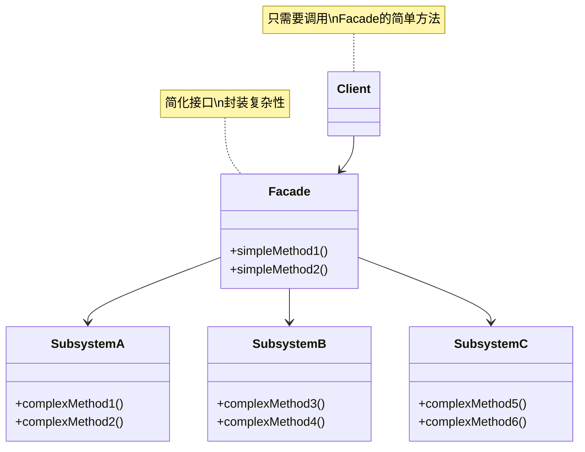
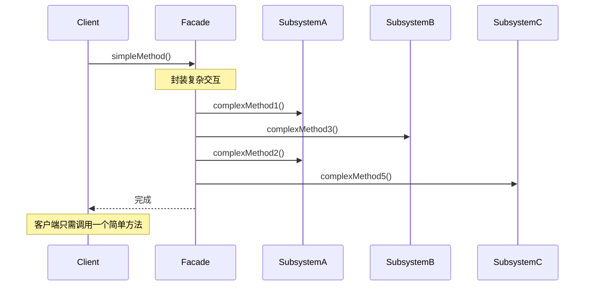
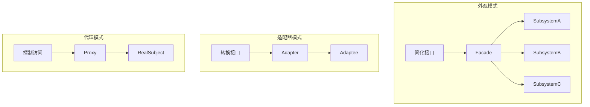

# 外观模式 (Facade Pattern)

## 模式定义

**外观模式**是一种结构型设计模式，它为复杂的子系统提供一个统一的、简化的高层接口，使得子系统更易于使用。



## 问题分析

当一个系统由多个复杂的子系统组成时，直接使用这些子系统会导致：

- ❌ 客户端代码复杂，难以理解
- ❌ 需要了解多个类的接口和调用顺序
- ❌ 系统之间的依赖关系错综复杂
- ❌ 难以维护和扩展
- ❌ 每次使用都要重复相同的操作序列

**问题示例：**

```java
// ❌ 客户端直接使用复杂子系统
CPU cpu = new CPU();
Memory memory = new Memory();
HardDrive hardDrive = new HardDrive();
Display display = new Display();

// 每次启动计算机都要执行这一系列复杂操作
display.displayBIOS();
cpu.freeze();
memory.load(0, hardDrive.read(0, 1024));
cpu.jump(0);
cpu.execute();
display.displayLoading();
// ... 太复杂了！
```

> [!NOTE] > **现实类比**：就像汽车的启动按钮（外观），它封装了启动发动机、检查油量、初始化仪表盘等一系列复杂操作。你只需按一个按钮，不需要了解内部细节。

## 解决方案

提供一个简单的 Facade 类来封装复杂的子系统调用：



> [!IMPORTANT] > **外观模式的关键**：
>
> - 不是替换子系统，而是提供简化访问
> - 客户端仍可直接访问子系统（如果需要）
> - Facade 不添加新功能，只是组织现有功能

## 代码实现

### 场景：计算机启动系统

计算机启动涉及 CPU、内存、硬盘、显示器等多个子系统的协同工作，过程复杂。

#### 1. 定义复杂的子系统

```java
/**
 * CPU 子系统
 */
public class CPU {
    /**
     * 冻结 CPU
     */
    public void freeze() {
        System.out.println("[CPU] 冻结处理器");
    }

    /**
     * 跳转到指定位置
     */
    public void jump(long position) {
        System.out.println("[CPU] 跳转到内存位置: 0x" + Long.toHexString(position));
    }

    /**
     * 执行指令
     */
    public void execute() {
        System.out.println("[CPU] 开始执行指令");
    }
}

/**
 * 内存子系统
 */
public class Memory {
    /**
     * 加载数据到内存
     */
    public void load(long position, byte[] data) {
        System.out.println("[内存] 在位置 0x" + Long.toHexString(position) +
            " 加载 " + data.length + " 字节数据");
    }
}

/**
 * 硬盘子系统
 */
public class HardDrive {
    /**
     * 从硬盘读取数据
     * @param lba 逻辑块地址
     * @param size 数据大小
     */
    public byte[] read(long lba, int size) {
        System.out.println("[硬盘] 从 LBA " + lba + " 读取 " + size + " 字节");
        return new byte[size];
    }
}

/**
 * 显示器子系统
 */
public class Display {
    /**
     * 显示 BIOS 信息
     */
    public void displayBIOS() {
        System.out.println("[显示器] 显示 BIOS 自检信息");
    }

    /**
     * 显示加载画面
     */
    public void displayLoading() {
        System.out.println("[显示器] 显示操作系统加载画面");
    }

    /**
     * 显示桌面
     */
    public void displayDesktop() {
        System.out.println("[显示器] 显示桌面");
    }
}
```

#### 2. 创建外观类

```java
/**
 * 计算机外观类（Facade）
 * 封装了计算机启动和关闭的复杂过程
 */
public class ComputerFacade {
    // 持有所有子系统的引用
    private CPU cpu;
    private Memory memory;
    private HardDrive hardDrive;
    private Display display;

    /**
     * 构造函数：初始化所有子系统
     */
    public ComputerFacade() {
        this.cpu = new CPU();
        this.memory = new Memory();
        this.hardDrive = new HardDrive();
        this.display = new Display();
    }

    /**
     * 简化的启动方法
     * 封装了启动计算机的所有复杂步骤
     */
    public void start() {
        System.out.println("========== 计算机启动 ==========");

        // 步骤1：显示 BIOS
        display.displayBIOS();

        // 步骤2：冻结 CPU
        cpu.freeze();

        // 步骤3：从硬盘读取引导扇区到内存
        byte[] bootSector = hardDrive.read(0, 512);
        memory.load(0x0000, bootSector);

        // 步骤4：CPU 跳转到引导代码
        cpu.jump(0x0000);

        // 步骤5：执行引导代码
        cpu.execute();

        // 步骤6：显示加载画面
        display.displayLoading();

        // 步骤7：加载操作系统内核
        byte[] kernel = hardDrive.read(1, 2048);
        memory.load(0x1000, kernel);

        // 步骤8：显示桌面
        display.displayDesktop();

        System.out.println("✅ 启动完成！\n");
    }

    /**
     * 简化的关闭方法
     */
    public void shutdown() {
        System.out.println("========== 计算机关闭 ==========");
        cpu.freeze();
        System.out.println("✅ 关闭完成！\n");
    }

    /**
     * 重启方法
     */
    public void restart() {
        System.out.println("========== 计算机重启 ==========");
        shutdown();
        try {
            Thread.sleep(1000);  // 模拟重启延迟
        } catch (InterruptedException e) {
            e.printStackTrace();
        }
        start();
    }
}
```

> [!TIP] > **外观类的职责**：
>
> 1. 组合多个子系统对象
> 2. 按正确顺序调用子系统方法
> 3. 处理子系统之间的协调
> 4. 提供简单易用的接口

#### 3. 客户端使用

```java
/**
 * 客户端演示
 */
public class Demo {
    public static void main(String[] args) {
        // 创建计算机外观
        ComputerFacade computer = new ComputerFacade();

        // 用户只需要调用简单的方法
        // 无需了解CPU、内存、硬盘等复杂的交互细节
        computer.start();

        // 使用计算机...
        System.out.println("使用计算机办公...\n");

        // 重启
        computer.restart();

        // 关闭
        computer.shutdown();
    }
}
```

**输出：**

```
========== 计算机启动 ==========
[显示器] 显示 BIOS 自检信息
[CPU] 冻结处理器
[硬盘] 从 LBA 0 读取 512 字节
[内存] 在位置 0x0 加载 512 字节数据
[CPU] 跳转到内存位置: 0x0
[CPU] 开始执行指令
[显示器] 显示操作系统加载画面
[硬盘] 从 LBA 1 读取 2048 字节
[内存] 在位置 0x1000 加载 2048 字节数据
[显示器] 显示桌面
✅ 启动完成！

使用计算机办公...

========== 计算机关闭 ==========
[CPU] 冻结处理器
✅ 关闭完成！
```

## 实际应用示例

### 示例 1：视频转换外观

```java
/**
 * 视频文件
 */
public class VideoFile {
    private String filename;

    public VideoFile(String filename) {
        this.filename = filename;
    }

    public String getFilename() {
        return filename;
    }

    public String getCodecType() {
        if (filename.endsWith(".mp4")) return "MPEG4";
        if (filename.endsWith(".ogg")) return "OGG";
        return "UNKNOWN";
    }
}

/**
 * 编解码器
 */
public interface Codec {
    String getType();
}

public class MPEG4Codec implements Codec {
    @Override
    public String getType() {
        return "MPEG4";
    }
}

public class OGGCodec implements Codec {
    @Override
    public String getType() {
        return "OGG";
    }
}

/**
 * 编解码器工厂
 */
public class CodecFactory {
    public static Codec extract(VideoFile file) {
        String type = file.getCodecType();
        System.out.println("[编解码器] 检测格式: " + type);

        if ("MPEG4".equals(type)) {
            return new MPEG4Codec();
        } else if ("OGG".equals(type)) {
            return new OGGCodec();
        }
        throw new IllegalArgumentException("不支持的格式");
    }
}

/**
 * 比特率读取器
 */
public class BitrateReader {
    public static VideoFile read(VideoFile file, Codec codec) {
        System.out.println("[比特率读取] 使用 " + codec.getType() + " 解码");
        return file;
    }

    public static VideoFile convert(VideoFile buffer, Codec codec) {
        System.out.println("[编码转换] 转换为 " + codec.getType() + " 格式");
        return buffer;
    }
}

/**
 * 音频混合器
 */
public class AudioMixer {
    public File fix(VideoFile file) {
        System.out.println("[音频混合] 同步音视频");
        return new File("output_" + file.getFilename());
    }
}

/**
 * 视频转换外观（Facade）
 * 封装了视频转换的所有复杂步骤
 */
public class VideoConversionFacade {
    /**
     * 简化的视频转换方法
     * @param filename 输入文件名
     * @param format 目标格式
     * @return 转换后的文件
     */
    public File convertVideo(String filename, String format) {
        System.out.println("========== 开始转换视频 ==========");
        System.out.println("输入: " + filename);
        System.out.println("目标格式: " + format);
        System.out.println();

        // 步骤1：创建视频文件对象
        VideoFile file = new VideoFile(filename);

        // 步骤2：提取源文件的编解码器
        Codec sourceCodec = CodecFactory.extract(file);

        // 步骤3：确定目标编解码器
        Codec destinationCodec;
        if (format.equals("mp4")) {
            destinationCodec = new MPEG4Codec();
        } else {
            destinationCodec = new OGGCodec();
        }

        // 步骤4：读取并解码
        VideoFile buffer = BitrateReader.read(file, sourceCodec);

        // 步骤5：重新编码为目标格式
        VideoFile intermediateResult = BitrateReader.convert(buffer, destinationCodec);

        // 步骤6：修复音频
        File result = new AudioMixer().fix(intermediateResult);

        System.out.println();
        System.out.println("✅ 转换完成：" + result.getName());
        System.out.println("==============================\n");

        return result;
    }
}

// 使用示例
class VideoConversionDemo {
    public static void main(String[] args) {
        VideoConversionFacade converter = new VideoConversionFacade();

        // 客户端只需一行代码即可完成复杂的视频转换
        File mp4Video = converter.convertVideo("video.ogg", "mp4");
    }
}
```

### 示例 2：智能家居外观

```java
/**
 * 灯光子系统
 */
public class Light {
    private String location;

    public Light(String location) {
        this.location = location;
    }

    public void on() {
        System.out.println("[灯光] " + location + " 灯光打开");
    }

    public void off() {
        System.out.println("[灯光] " + location + " 灯光关闭");
    }

    public void dim(int level) {
        System.out.println("[灯光] " + location + " 亮度调至 " + level + "%");
    }
}

/**
 * 空调子系统
 */
public class AirConditioner {
    public void on() {
        System.out.println("[空调] 开机");
    }

    public void off() {
        System.out.println("[空调] 关机");
    }

    public void setTemperature(int temp) {
        System.out.println("[空调] 温度设置为 " + temp + "°C");
    }

    public void setMode(String mode) {
        System.out.println("[空调] 模式设置为 " + mode);
    }
}

/**
 * 电视子系统
 */
public class Television {
    public void on() {
        System.out.println("[电视] 开机");
    }

    public void off() {
        System.out.println("[电视] 关机");
    }

    public void setChannel(int channel) {
        System.out.println("[电视] 切换到频道 " + channel);
    }

    public void setVolume(int volume) {
        System.out.println("[电视] 音量设置为 " + volume);
    }
}

/**
 * 窗帘子系统
 */
public class Curtains {
    public void open() {
        System.out.println("[窗帘] 打开窗帘");
    }

    public void close() {
        System.out.println("[窗帘] 关闭窗帘");
    }
}

/**
 * 门锁子系统
 */
public class DoorLock {
    public void lock() {
        System.out.println("[门锁] 锁门");
    }

    public void unlock() {
        System.out.println("[门锁] 开锁");
    }
}

/**
 * 音响子系统
 */
public class SoundSystem {
    public void on() {
        System.out.println("[音响] 开机");
    }

    public void off() {
        System.out.println("[音响] 关机");
    }

    public void playMusic(String song) {
        System.out.println("[音响] 播放音乐: " + song);
    }
}

/**
 * 智能家居外观（Facade）
 * 提供各种生活场景模式
 */
public class SmartHomeFacade {
    private Light livingRoomLight;
    private Light bedroomLight;
    private AirConditioner ac;
    private Television tv;
    private Curtains curtains;
    private DoorLock doorLock;
    private SoundSystem soundSystem;

    public SmartHomeFacade() {
        this.livingRoomLight = new Light("客厅");
        this.bedroomLight = new Light("卧室");
        this.ac = new AirConditioner();
        this.tv = new Television();
        this.curtains = new Curtains();
        this.doorLock = new DoorLock();
        this.soundSystem = new SoundSystem();
    }

    /**
     * 离家模式
     */
    public void leaveHome() {
        System.out.println("========== 离家模式 ==========");
        livingRoomLight.off();
        bedroomLight.off();
        tv.off();
        soundSystem.off();
        ac.off();
        curtains.close();
        doorLock.lock();
        System.out.println("✅ 已进入离家模式\n");
    }

    /**
     * 回家模式
     */
    public void arriveHome() {
        System.out.println("========== 欢迎回家 ==========");
        doorLock.unlock();
        livingRoomLight.on();
        curtains.open();
        ac.on();
        ac.setTemperature(24);
        ac.setMode("自动");
        System.out.println("✅ 欢迎回家！\n");
    }

    /**
     * 观影模式
     */
    public void movieMode() {
        System.out.println("========== 观影模式 ==========");
        livingRoomLight.dim(20);
        tv.on();
        tv.setChannel(5);
        tv.setVolume(30);
        curtains.close();
        soundSystem.on();
        System.out.println("✅ 观影模式已就绪\n");
    }

    /**
     * 睡眠模式
     */
    public void sleepMode() {
        System.out.println("========== 睡眠模式 ==========");
        livingRoomLight.off();
        bedroomLight.dim(10);
        tv.off();
        soundSystem.off();
        ac.setTemperature(26);
        ac.setMode("睡眠");
        curtains.close();
        doorLock.lock();
        System.out.println("✅ 晚安！\n");
    }

    /**
     * 派对模式
     */
    public void partyMode() {
        System.out.println("========== 派对模式 ==========");
        livingRoomLight.on();
        tv.off();
        soundSystem.on();
        soundSystem.playMusic("Party Mix");
        ac.setTemperature(22);
        System.out.println("✅ Let's Party!\n");
    }
}

// 使用示例
class SmartHomeDemo {
    public static void main(String[] args) {
        SmartHomeFacade home = new SmartHomeFacade();

        // 早上离开家
        home.leaveHome();

        // 晚上回家
        home.arriveHome();

        // 看电影
        home.movieMode();

        // 准备睡觉
        home.sleepMode();
    }
}
```

### 示例 3：订单处理外观

```java
/**
 * 库存服务
 */
public class InventoryService {
    public boolean checkStock(String productId, int quantity) {
        System.out.println("[库存] 检查商品 " + productId + " 库存: " + quantity + " 件");
        return true;  // 简化示例
    }

    public void reduceStock(String productId, int quantity) {
        System.out.println("[库存] 减少库存: " + productId + " x " + quantity);
    }
}

/**
 * 支付服务
 */
public class PaymentService {
    public boolean processPayment(String userId, double amount) {
        System.out.println("[支付] 处理用户 " + userId + " 的支付: ¥" + amount);
        return true;  // 简化示例
    }
}

/**
 * 物流服务
 */
public class ShippingService {
    public String createShipment(String orderId, String address) {
        System.out.println("[物流] 创建订单 " + orderId + " 的运单");
        System.out.println("[物流] 配送地址: " + address);
        return "SHIP_" + System.currentTimeMillis();
    }
}

/**
 * 通知服务
 */
public class NotificationService {
    public void sendEmail(String userId, String subject, String content) {
        System.out.println("[通知] 发送邮件给用户 " + userId);
        System.out.println("       主题: " + subject);
    }

    public void sendSMS(String phone, String message) {
        System.out.println("[通知] 发送短信到 " + phone);
    }
}

/**
 * 订单外观（Facade）
 * 封装订单处理的所有步骤
 */
public class OrderFacade {
    private InventoryService inventoryService;
    private PaymentService paymentService;
    private ShippingService shippingService;
    private NotificationService notificationService;

    public OrderFacade() {
        this.inventoryService = new InventoryService();
        this.paymentService = new PaymentService();
        this.shippingService = new ShippingService();
        this.notificationService = new NotificationService();
    }

    /**
     * 简化的下单方法
     * 封装了检查库存、支付、发货、通知等所有步骤
     */
    public boolean placeOrder(String userId, String productId, int quantity,
                            double price, String address, String phone) {
        System.out.println("========== 处理订单 ==========");
        String orderId = "ORDER_" + System.currentTimeMillis();

        try {
            // 步骤1：检查库存
            if (!inventoryService.checkStock(productId, quantity)) {
                System.out.println("❌ 库存不足");
                return false;
            }

            // 步骤2：处理支付
            double totalAmount = price * quantity;
            if (!paymentService.processPayment(userId, totalAmount)) {
                System.out.println("❌ 支付失败");
                return false;
            }

            // 步骤3：减少库存
            inventoryService.reduceStock(productId, quantity);

            // 步骤4：创建运单
            String shipmentId = shippingService.createShipment(orderId, address);

            // 步骤5：发送通知
            notificationService.sendEmail(userId, "订单确认",
                "您的订单 " + orderId + " 已确认");
            notificationService.sendSMS(phone,
                "您的订单已发货，运单号: " + shipmentId);

            System.out.println("✅ 订单处理成功: " + orderId);
            System.out.println("============================\n");
            return true;

        } catch (Exception e) {
            System.out.println("❌ 处理订单时出错: " + e.getMessage());
            return false;
        }
    }
}

// 使用示例
class OrderDemo {
    public static void main(String[] args) {
        OrderFacade orderFacade = new OrderFacade();

        // 客户端只需调用一个方法即可完成下单
        orderFacade.placeOrder(
            "user123",           // 用户ID
            "product456",        // 商品ID
            2,                   // 数量
            99.99,              // 单价
            "北京市朝阳区...",   // 地址
            "138****8888"       // 电话
        );
    }
}
```

## Java 标准库中的应用

### 1. JDBC

```java
/**
 * JDBC 是外观模式的经典应用
 * DriverManager 封装了复杂的驱动管理
 */
// 简单的接口
Connection conn = DriverManager.getConnection(
    "jdbc:mysql://localhost:3306/mydb",
    "username",
    "password"
);

// 实际上封装了：
// 1. 加载数据库驱动
// 2. 解析连接URL
// 3. 建立TCP连接
// 4. 进行认证
// 5. 初始化连接参数
```

### 2. SLF4J

```java
/**
 * SLF4J 是日志框架的外观
 */
import org.slf4j.Logger;
import org.slf4j.LoggerFactory;

// 简单的接口
Logger logger = LoggerFactory.getLogger(MyClass.class);
logger.info("Hello World");

// 封装了不同日志框架的复杂性（Log4j、Logback等）
```

### 3. Spring Framework

```java
/**
 * Spring 的很多类都是外观模式
 */
// JdbcTemplate 是 JDBC 的外观
JdbcTemplate jdbcTemplate = new JdbcTemplate(dataSource);
List<User> users = jdbcTemplate.query("SELECT * FROM users", rowMapper);

// HibernateTemplate 是 Hibernate 的外观
HibernateTemplate hibernateTemplate = new HibernateTemplate(sessionFactory);
List<User> users = hibernateTemplate.find("from User");
```

## 外观模式 vs 其他模式



| 模式       | 目的     | 接口数量    | 关注点         |
| ---------- | -------- | ----------- | -------------- |
| **外观**   | 简化调用 | 多个 → 一个 | 简化复杂子系统 |
| **适配器** | 接口转换 | 一个 → 一个 | 解决不兼容     |
| **代理**   | 控制访问 | 一个 → 一个 | 访问控制、增强 |
| **装饰器** | 添加功能 | 一个 → 一个 | 功能扩展       |

> [!IMPORTANT] > **外观 vs 适配器的区别**：
>
> - 外观：简化多个类的接口
> - 适配器：转换一个类的接口

## 优缺点

### 优点

- ✅ **降低复杂度** - 为客户端提供简单接口
- ✅ **降低耦合度** - 客户端与子系统解耦
- ✅ **提高灵活性** - 修改子系统不影响客户端
- ✅ **提高安全性** - 隐藏实现细节
- ✅ **分层设计** - 有助于构建层次化系统

### 缺点

- ❌ **不符合开闭原则** - 添加新功能需要修改 Facade
- ❌ **可能成为上帝对象** - Facade 可能变得过于庞大
- ❌ **功能受限** - 只能使用 Facade 提供的功能

> [!WARNING] > **避免上帝外观**：如果 Facade 提供太多功能，它会变成难以维护的"上帝对象"。应该根据职责划分多个 Facade。

## 适用场景

### 何时使用外观模式

- ✓ **简化复杂系统** - 系统非常复杂，需要简单接口
- ✓ **分层架构** - 在各层之间定义入口点
- ✓ **解耦子系统** - 减少客户端与子系统的依赖
- ✓ **遗留系统集成** - 为旧系统提供新接口
- ✓ **提供默认配置** - 为常见用例提供便捷方法

### 实际应用场景

- 💻 **计算机启动** - 封装硬件初始化
- 🎬 **多媒体处理** - 视频转换、音频处理
- 🏠 **智能家居** - 场景模式（离家、回家、睡眠）
- 🛒 **电商系统** - 下单流程（库存、支付、物流）
- 📚 **框架和库** - JDBC、SLF4J、Spring

## 最佳实践

### 1. 保持 Facade 轻量

```java
// ✅ 好的 Facade：简单清晰
public class SimpleFacade {
    public void doSomething() {
        subsystem1.method1();
        subsystem2.method2();
    }
}

// ❌ 不好的 Facade：过于复杂
public class ComplexFacade {
    public void doSomething() {
        // 包含大量业务逻辑
        if (condition1) {
            // 复杂逻辑...
        } else {
            // 更多复杂逻辑...
        }
    }
}
```

### 2. 允许直接访问子系统

```java
/**
 * Facade 不应阻止客户端直接访问子系统
 */
public class GoodFacade {
    private SubsystemA subsystemA;

    // 提供获取子系统的方法
    public SubsystemA getSubsystemA() {
        return subsystemA;
    }

    // 同时提供简化方法
    public void simplifiedMethod() {
        subsystemA.complexMethod();
    }
}
```

### 3. 根据职责划分多个 Facade

```java
/**
 * 不要创建一个巨大的 Facade，而是按职责划分
 */
public class UserManagementFacade {
    // 只负责用户相关操作
}

public class OrderManagementFacade {
    // 只负责订单相关操作
}

public class PaymentFacade {
    // 只负责支付相关操作
}
```

### 4. 使用依赖注入

```java
/**
 * 使用依赖注入提高可测试性
 */
public class ModernFacade {
    private final SubsystemA subsystemA;
    private final SubsystemB subsystemB;

    // 通过构造器注入
    public ModernFacade(SubsystemA subsystemA, SubsystemB subsystemB) {
        this.subsystemA = subsystemA;
        this.subsystemB = subsystemB;
    }
}
```

## 与其他模式的关系

- **外观 + 单例** - Facade 通常实现为单例
- **外观 + 抽象工厂** - Facade 可以使用工厂创建子系统
- **外观 + 中介者** - 两者都简化通信，但中介者是双向的
- **外观 + 适配器** - 可以结合使用

## 总结

外观模式是一个非常实用的结构型模式：

- **核心思想** - 为复杂子系统提供简单统一的接口
- **关键优势** - 降低复杂度、解耦、易于使用
- **注意事项** - 避免上帝对象，保持 Facade 简单
- **经典应用** - JDBC、SLF4J、Spring Template
- **适用场景** - 简化复杂系统、分层架构、遗留系统集成

> [!TIP] > **外观模式的精髓**：
>
> - 不是隐藏子系统，而是简化访问
> - 不是替换子系统，而是提供便捷入口
> - 让常见任务变得简单，保留高级功能的访问

**已完成优化的文档数：9 个**

本次会话持续优化中，无需用户确认...
