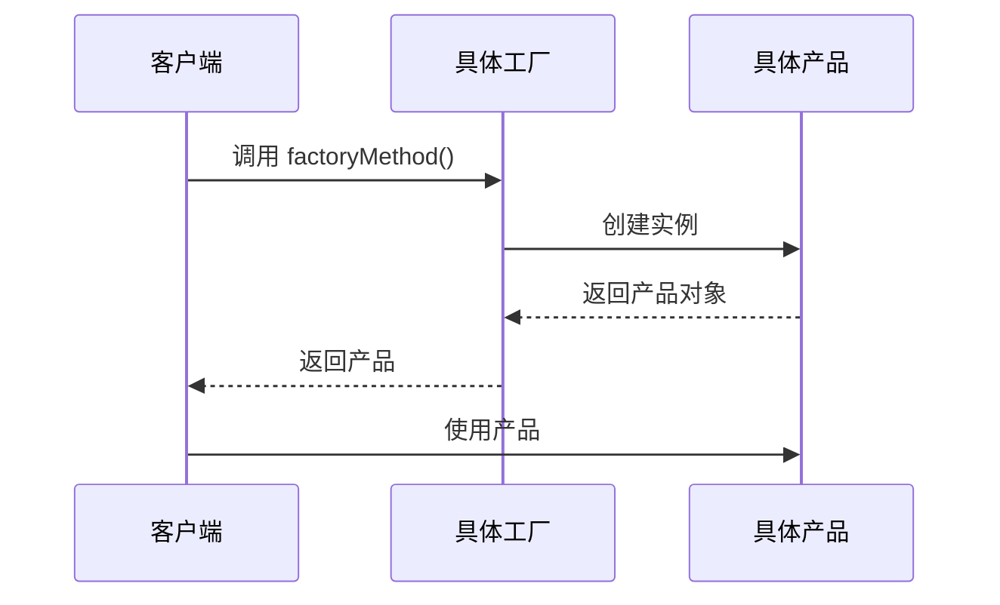
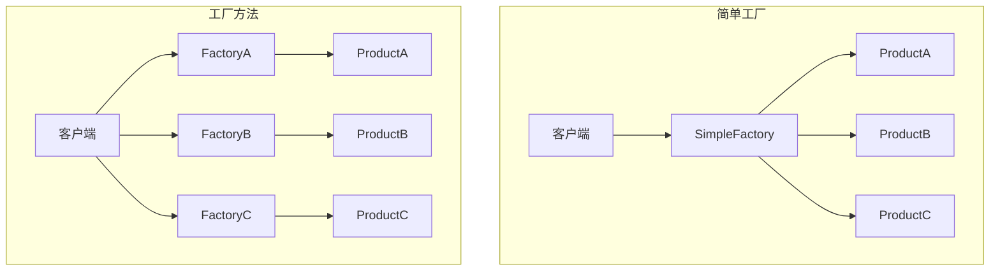
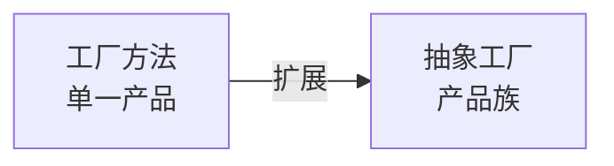

# 工厂方法模式 (Factory Method Pattern)

## 模式定义

**工厂方法模式**是一种创建型设计模式，它定义了一个创建对象的接口，让子类来决定实例化哪个具体类。工厂方法让类的实例化延迟到子类。

```mermaid
classDiagram
    class Creator {
        <<abstract>>
        +factoryMethod()* Product
        +operation()
    }
    class ConcreteCreatorA {
        +factoryMethod() ProductA
    }
    class ConcreteCreatorB {
        +factoryMethod() ProductB
    }
    class Product {
        <<interface>>
        +doSomething()
    }
    class ProductA {
        +doSomething()
    }
    class ProductB {
        +doSomething()
    }

    Creator <|-- ConcreteCreatorA
    Creator <|-- ConcreteCreatorB
    Product <|.. ProductA
    Product <|.. ProductB
    Creator ..> Product : creates
    ConcreteCreatorA ..> ProductA : creates
    ConcreteCreatorB ..> ProductB : creates

    note for Creator "定义工厂方法\n由子类实现具体创建逻辑"
```



## 问题分析

当系统需要创建多种类型的对象时，直接使用 `new` 关键字会导致：

- ❌ 客户端与具体产品类紧耦合
- ❌ 扩展新产品类型需要修改客户端代码
- ❌ 创建逻辑分散在各处，难以维护
- ❌ 违反开闭原则

> [!NOTE]
> 工厂方法模式通过将对象创建委托给工厂子类，使得添加新产品类型时无需修改现有代码，符合开闭原则。

## 解决方案

通过定义抽象的工厂方法，将具体的产品创建延迟到子类中实现：



## 代码实现

### 1. 定义产品接口

```java
/**
 * 抽象产品接口
 * 定义所有具体产品必须实现的方法
 */
public interface Button {
    /**
     * 渲染按钮
     */
    void render();

    /**
     * 处理点击事件
     */
    void onClick();
}
```

### 2. 具体产品实现

```java
/**
 * 具体产品A: Windows风格按钮
 */
public class WindowsButton implements Button {
    @Override
    public void render() {
        System.out.println("渲染 Windows 风格按钮");
        System.out.println("┌─────────────┐");
        System.out.println("│  [ 确定 ]  │");
        System.out.println("└─────────────┘");
    }

    @Override
    public void onClick() {
        System.out.println("检测到 Windows 按钮点击事件");
    }
}

/**
 * 具体产品B: Mac风格按钮
 */
public class MacButton implements Button {
    @Override
    public void render() {
        System.out.println("渲染 Mac 风格按钮");
        System.out.println("╭─────────────╮");
        System.out.println("│   确定     │");
        System.out.println("╰─────────────╯");
    }

    @Override
    public void onClick() {
        System.out.println("检测到 Mac 按钮点击事件");
    }
}

/**
 * 具体产品C: Linux风格按钮
 */
public class LinuxButton implements Button {
    @Override
    public void render() {
        System.out.println("渲染 Linux 风格按钮");
        System.out.println("[  确定  ]");
    }

    @Override
    public void onClick() {
        System.out.println("检测到 Linux 按钮点击事件");
    }
}
```

### 3. 定义抽象创建者

```java
/**
 * 抽象创建者类
 * 定义工厂方法，由子类实现具体的产品创建
 */
public abstract class Dialog {

    /**
     * 工厂方法 - 抽象方法，由子类实现
     * 这是模式的核心：将对象创建延迟到子类
     */
    public abstract Button createButton();

    /**
     * 业务方法 - 使用工厂方法创建的产品
     * 此方法不关心具体创建的是什么类型的按钮
     */
    public void render() {
        // 调用工厂方法获取产品
        Button button = createButton();

        // 使用产品
        button.render();

        // 绑定事件
        System.out.println("绑定点击事件...");
        button.onClick();
    }

    /**
     * 其他业务方法
     */
    public void closeDialog() {
        System.out.println("关闭对话框");
    }
}
```

> [!IMPORTANT] > **工厂方法的关键**：抽象创建者定义工厂方法但不实现，具体创建过程由子类完成。这样客户端代码（如 `render()` 方法）不依赖具体产品类。

### 4. 具体创建者实现

```java
/**
 * 具体创建者A: Windows对话框工厂
 */
public class WindowsDialog extends Dialog {
    @Override
    public Button createButton() {
        // 创建并返回 Windows 风格按钮
        return new WindowsButton();
    }
}

/**
 * 具体创建者B: Mac对话框工厂
 */
public class MacDialog extends Dialog {
    @Override
    public Button createButton() {
        // 创建并返回 Mac 风格按钮
        return new MacButton();
    }
}

/**
 * 具体创建者C: Linux对话框工厂
 */
public class LinuxDialog extends Dialog {
    @Override
    public Button createButton() {
        // 创建并返回 Linux 风格按钮
        return new LinuxButton();
    }
}
```

### 5. 客户端使用

```java
/**
 * 客户端应用程序
 */
public class Application {
    private Dialog dialog;

    /**
     * 根据配置初始化应用
     */
    public Application(String osType) {
        // 根据操作系统类型选择不同的工厂
        // 这里是唯一需要知道具体类的地方
        if ("Windows".equalsIgnoreCase(osType)) {
            dialog = new WindowsDialog();
        } else if ("Mac".equalsIgnoreCase(osType)) {
            dialog = new MacDialog();
        } else {
            dialog = new LinuxDialog();
        }
    }

    /**
     * 运行应用
     * 后续代码完全不依赖具体的产品类
     */
    public void run() {
        dialog.render();
    }

    public static void main(String[] args) {
        // 模拟从配置或系统属性获取操作系统类型
        String osType = System.getProperty("os.name");

        // 创建应用
        Application app;
        if (osType.contains("Windows")) {
            app = new Application("Windows");
        } else if (osType.contains("Mac")) {
            app = new Application("Mac");
        } else {
            app = new Application("Linux");
        }

        // 运行应用
        app.run();
    }
}
```

> [!TIP]
> 在实际应用中，可以使用配置文件、依赖注入框架（如 Spring）或反射来避免在客户端代码中硬编码工厂类的选择。

## 实际应用示例

### 示例 1: 数据库连接工厂

```java
/**
 * 抽象产品：数据库连接接口
 */
public interface DatabaseConnection {
    void connect();
    void executeQuery(String sql);
    void close();
}

/**
 * 具体产品：MySQL连接
 */
public class MySQLConnection implements DatabaseConnection {
    private String url = "jdbc:mysql://localhost:3306/mydb";

    @Override
    public void connect() {
        System.out.println("连接到 MySQL 数据库: " + url);
    }

    @Override
    public void executeQuery(String sql) {
        System.out.println("MySQL 执行查询: " + sql);
    }

    @Override
    public void close() {
        System.out.println("关闭 MySQL 连接");
    }
}

/**
 * 具体产品：PostgreSQL连接
 */
public class PostgreSQLConnection implements DatabaseConnection {
    private String url = "jdbc:postgresql://localhost:5432/mydb";

    @Override
    public void connect() {
        System.out.println("连接到 PostgreSQL 数据库: " + url);
    }

    @Override
    public void executeQuery(String sql) {
        System.out.println("PostgreSQL 执行查询: " + sql);
    }

    @Override
    public void close() {
        System.out.println("关闭 PostgreSQL 连接");
    }
}

/**
 * 具体产品：Oracle连接
 */
public class OracleConnection implements DatabaseConnection {
    private String url = "jdbc:oracle:thin:@localhost:1521:orcl";

    @Override
    public void connect() {
        System.out.println("连接到 Oracle 数据库: " + url);
    }

    @Override
    public void executeQuery(String sql) {
        System.out.println("Oracle 执行查询: " + sql);
    }

    @Override
    public void close() {
        System.out.println("关闭 Oracle 连接");
    }
}

/**
 * 抽象创建者：数据库工厂
 */
public abstract class DatabaseFactory {

    /**
     * 工厂方法：创建数据库连接
     */
    public abstract DatabaseConnection createConnection();

    /**
     * 业务方法：执行数据库查询
     */
    public void executeQuery(String sql) {
        // 使用工厂方法创建连接
        DatabaseConnection conn = createConnection();

        // 执行操作
        conn.connect();
        conn.executeQuery(sql);
        conn.close();
    }
}

/**
 * 具体创建者：MySQL工厂
 */
public class MySQLFactory extends DatabaseFactory {
    @Override
    public DatabaseConnection createConnection() {
        return new MySQLConnection();
    }
}

/**
 * 具体创建者：PostgreSQL工厂
 */
public class PostgreSQLFactory extends DatabaseFactory {
    @Override
    public DatabaseConnection createConnection() {
        return new PostgreSQLConnection();
    }
}

/**
 * 具体创建者：Oracle工厂
 */
public class OracleFactory extends DatabaseFactory {
    @Override
    public DatabaseConnection createConnection() {
        return new OracleConnection();
    }
}

// 使用示例
class DatabaseDemo {
    public static void main(String[] args) {
        // 从配置文件读取数据库类型
        String dbType = "MySQL"; // 实际应该从配置文件读取

        DatabaseFactory factory;
        switch (dbType) {
            case "MySQL":
                factory = new MySQLFactory();
                break;
            case "PostgreSQL":
                factory = new PostgreSQLFactory();
                break;
            default:
                factory = new OracleFactory();
        }

        // 执行查询，不需要关心具体使用哪个数据库
        factory.executeQuery("SELECT * FROM users");
    }
}
```

### 示例 2: 日志记录器工厂

```java
/**
 * 抽象产品：日志记录器
 */
public interface Logger {
    void info(String message);
    void error(String message);
    void debug(String message);
}

/**
 * 具体产品：文件日志记录器
 */
public class FileLogger implements Logger {
    private String filePath = "app.log";

    @Override
    public void info(String message) {
        System.out.println("[FILE] [INFO] " + message + " -> " + filePath);
    }

    @Override
    public void error(String message) {
        System.out.println("[FILE] [ERROR] " + message + " -> " + filePath);
    }

    @Override
    public void debug(String message) {
        System.out.println("[FILE] [DEBUG] " + message + " -> " + filePath);
    }
}

/**
 * 具体产品：控制台日志记录器
 */
public class ConsoleLogger implements Logger {
    @Override
    public void info(String message) {
        System.out.println("[CONSOLE] [INFO] " + message);
    }

    @Override
    public void error(String message) {
        System.err.println("[CONSOLE] [ERROR] " + message);
    }

    @Override
    public void debug(String message) {
        System.out.println("[CONSOLE] [DEBUG] " + message);
    }
}

/**
 * 具体产品：远程日志记录器
 */
public class RemoteLogger implements Logger {
    private String serverUrl = "http://log-server.com/api/logs";

    @Override
    public void info(String message) {
        System.out.println("[REMOTE] [INFO] 发送到 " + serverUrl + ": " + message);
    }

    @Override
    public void error(String message) {
        System.out.println("[REMOTE] [ERROR] 发送到 " + serverUrl + ": " + message);
    }

    @Override
    public void debug(String message) {
        System.out.println("[REMOTE] [DEBUG] 发送到 " + serverUrl + ": " + message);
    }
}

/**
 * 抽象创建者：日志工厂
 */
public abstract class LoggerFactory {
    public abstract Logger createLogger();

    /**
     * 业务方法：记录应用程序事件
     */
    public void logApplicationEvent(String event) {
        Logger logger = createLogger();
        logger.info("应用程序事件: " + event);
    }
}

/**
 * 具体创建者
 */
public class FileLoggerFactory extends LoggerFactory {
    @Override
    public Logger createLogger() {
        return new FileLogger();
    }
}

public class ConsoleLoggerFactory extends LoggerFactory {
    @Override
    public Logger createLogger() {
        return new ConsoleLogger();
    }
}

public class RemoteLoggerFactory extends LoggerFactory {
    @Override
    public Logger createLogger() {
        return new RemoteLogger();
    }
}
```

## 工厂方法 vs 简单工厂

### 简单工厂（不是标准设计模式）

```java
/**
 * 简单工厂 - 不是标准的设计模式
 * 所有创建逻辑集中在一个工厂类中
 */
public class SimpleButtonFactory {
    /**
     * 静态工厂方法
     * 缺点：添加新类型需要修改此方法，违反开闭原则
     */
    public static Button createButton(String type) {
        if ("Windows".equalsIgnoreCase(type)) {
            return new WindowsButton();
        } else if ("Mac".equalsIgnoreCase(type)) {
            return new MacButton();
        } else if ("Linux".equalsIgnoreCase(type)) {
            return new LinuxButton();
        }
        throw new IllegalArgumentException("未知的按钮类型: " + type);
    }
}

// 使用
class SimpleFactoryDemo {
    public static void main(String[] args) {
        Button button = SimpleButtonFactory.createButton("Windows");
        button.render();
    }
}
```

### 对比分析

| 特性         | 简单工厂                  | 工厂方法                      |
| ------------ | ------------------------- | ----------------------------- |
| **结构**     | 单一工厂类                | 抽象工厂+多个具体工厂         |
| **扩展性**   | ❌ 添加新产品需修改工厂类 | ✅ 添加新产品只需新增工厂子类 |
| **开闭原则** | ❌ 违反                   | ✅ 符合                       |
| **复杂度**   | ⭐ 简单                   | ⭐⭐⭐ 中等                   |
| **类的数量** | 少                        | 多                            |
| **适用场景** | 产品类型少且稳定          | 产品类型多且需要扩展          |
| **创建逻辑** | 集中在一个方法            | 分散在各个子类                |

> [!TIP] > **何时使用简单工厂**：产品类型少、稳定、不需要频繁扩展的场景。
>
> **何时使用工厂方法**：产品类型多、需要经常添加新产品、希望符合开闭原则的场景。



## Java 标准库中的应用

### 1. Collection.iterator()

```java
/**
 * Java 集合框架中的工厂方法
 */
public interface Collection<E> {
    // 工厂方法：由具体集合类实现
    Iterator<E> iterator();
}

// 具体实现
public class ArrayList<E> implements List<E> {
    @Override
    public Iterator<E> iterator() {
        // 返回 ArrayList 特有的迭代器
        return new ArrayListIterator();
    }
}

public class LinkedList<E> implements List<E> {
    @Override
    public Iterator<E> iterator() {
        // 返回 LinkedList 特有的迭代器
        return new LinkedListIterator();
    }
}
```

### 2. Calendar.getInstance()

```java
/**
 * Calendar 类使用工厂方法创建实例
 */
Calendar calendar = Calendar.getInstance();

// 内部实现
public abstract class Calendar {
    public static Calendar getInstance() {
        // 根据地区创建不同的日历实现
        return createCalendar(TimeZone.getDefault(), Locale.getDefault());
    }

    private static Calendar createCalendar(TimeZone zone, Locale locale) {
        // 返回具体的日历实现，如 GregorianCalendar
        return new GregorianCalendar(zone, locale);
    }
}
```

### 3. NumberFormat.getInstance()

```java
/**
 * NumberFormat 工厂方法
 */
NumberFormat formatter = NumberFormat.getInstance();
NumberFormat currencyFormat = NumberFormat.getCurrencyInstance();
NumberFormat percentFormat = NumberFormat.getPercentInstance();
```

## Spring 框架中的应用

```java
/**
 * Spring BeanFactory 本身就是一个工厂方法的应用
 */
public interface BeanFactory {
    // 工厂方法：根据名称获取bean
    Object getBean(String name);
    <T> T getBean(String name, Class<T> requiredType);
}

/**
 * FactoryBean 接口允许自定义 bean 的创建逻辑
 */
public interface FactoryBean<T> {
    // 工厂方法：创建对象
    T getObject() throws Exception;
    Class<?> getObjectType();
    boolean isSingleton();
}

// 使用示例
@Component
public class ConnectionFactoryBean implements FactoryBean<Connection> {
    @Override
    public Connection getObject() throws Exception {
        // 自定义创建逻辑
        return DriverManager.getConnection("jdbc:mysql://localhost/db");
    }

    @Override
    public Class<?> getObjectType() {
        return Connection.class;
    }

    @Override
    public boolean isSingleton() {
        return false;
    }
}
```

## 优缺点

### 优点

- ✅ **解耦** - 客户端不依赖具体产品类
- ✅ **符合开闭原则** - 添加新产品无需修改现有代码
- ✅ **符合单一职责原则** - 每个工厂只负责创建一种产品
- ✅ **灵活性高** - 可以通过子类化引入新产品类型
- ✅ **代码复用** - 抽象创建者中的业务逻辑可被复用

### 缺点

- ❌ **类数量增多** - 每个产品需要对应的工厂类
- ❌ **增加复杂度** - 引入了抽象层，代码结构更复杂
- ❌ **理解成本** - 新手可能难以理解工厂层次结构
- ❌ **过度设计** - 简单场景下使用会显得繁琐

> [!WARNING]
> 不要过度使用工厂方法模式。如果产品类型很少且不会扩展，直接使用 `new` 或简单工厂更合适。

## 适用场景

### 何时使用工厂方法

- ✓ **不确定具体类型** - 编码时不知道需要创建哪种具体类的对象
- ✓ **需要扩展** - 未来可能需要添加新的产品类型
- ✓ **希望复用创建逻辑** - 抽象创建者中包含通用的业务逻辑
- ✓ **希望提供库** - 为客户端提供产品创建接口，具体产品由客户端决定
- ✓ **依赖注入** - 需要通过配置或注入决定创建哪种对象

### 实际应用场景

- 🔧 **数据库连接** - 支持多种数据库的 JDBC 驱动
- 📝 **文档处理** - 创建不同格式的文档 (PDF, Word, Excel)
- 🎨 **UI 组件** - 跨平台 UI 框架的组件创建
- 📨 **消息发送** - 支持多种消息协议 (Email, SMS, Push)
- 🔐 **加密算法** - 创建不同的加密器 (AES, RSA, DES)

## 与其他模式的关系

### 工厂方法 → 抽象工厂



- **工厂方法** - 创建单一类型的产品
- **抽象工厂** - 创建相关或相依对象的族

### 工厂方法 + 单例

```java
/**
 * 工厂类本身可以是单例
 */
public class DatabaseFactoryManager {
    private static DatabaseFactoryManager instance;

    public static synchronized DatabaseFactoryManager getInstance() {
        if (instance == null) {
            instance = new DatabaseFactoryManager();
        }
        return instance;
    }

    public DatabaseFactory getFactory(String type) {
        // 返回对应的工厂
        switch (type) {
            case "MySQL": return new MySQLFactory();
            case "PostgreSQL": return new PostgreSQLFactory();
            default: return new OracleFactory();
        }
    }
}
```

### 工厂方法 + 策略模式

```java
/**
 * 策略模式可以消除工厂方法中的 if-else
 */
public class StrategyBasedFactory {
    private Map<String, Supplier<Button>> strategies = new HashMap<>();

    public StrategyBasedFactory() {
        strategies.put("Windows", WindowsButton::new);
        strategies.put("Mac", MacButton::new);
        strategies.put("Linux", LinuxButton::new);
    }

    public Button createButton(String type) {
        return strategies.get(type).get();
    }
}
```

## 最佳实践

### 1. 使用配置文件

```java
/**
 * 从配置文件读取工厂类型，避免硬编码
 */
public class ConfigurableFactory {
    public static DatabaseFactory createFactory() {
        // 从配置文件读取
        Properties props = loadConfig();
        String factoryClass = props.getProperty("database.factory");

        try {
            return (DatabaseFactory) Class.forName(factoryClass).newInstance();
        } catch (Exception e) {
            return new MySQLFactory(); // 默认工厂
        }
    }
}
```

### 2. 使用依赖注入

```java
/**
 * Spring 依赖注入示例
 */
@Configuration
public class FactoryConfig {

    @Bean
    @ConditionalOnProperty(name = "db.type", havingValue = "mysql")
    public DatabaseFactory mySqlFactory() {
        return new MySQLFactory();
    }

    @Bean
    @ConditionalOnProperty(name = "db.type", havingValue = "postgresql")
    public DatabaseFactory postgreSqlFactory() {
        return new PostgreSQLFactory();
    }
}

@Service
public class UserService {
    private final DatabaseFactory factory;

    // 通过构造器注入
    public UserService(DatabaseFactory factory) {
        this.factory = factory;
    }
}
```

### 3. 提供默认实现

```java
/**
 * 为工厂方法提供默认实现
 */
public abstract class Dialog {
    // 提供默认实现，子类可以选择性覆盖
    public Button createButton() {
        return new DefaultButton();
    }

    public void render() {
        Button button = createButton();
        button.render();
    }
}
```

### 4. 命名规范

```java
/**
 * 工厂方法的命名规范
 */
public interface Product {
    // 推荐的命名方式：
    Product create();           // 简洁
    Product createProduct();    // 明确
    Product getInstance();      // 获取实例
    Product newInstance();      // 创建新实例
    Product build();           // 构建对象
    Product of(...);           // 基于参数创建
    Product from(...);         // 转换创建
}
```

## 总结

工厂方法模式是一个非常实用的创建型模式：

- **核心思想** - 定义创建接口，让子类决定实例化哪个类
- **关键优势** - 符合开闭原则，易于扩展
- **适用场景** - 产品类型多、需要扩展、希望解耦的场景
- **与简单工厂的选择** - 简单场景用简单工厂，复杂场景用工厂方法
- **实际应用** - Java 集合、JDBC 驱动、Spring 容器等大量使用

> [!TIP]
> 在 Spring 等现代框架中，通常使用依赖注入来代替手动的工厂方法实现，这样代码更简洁且易于测试。
