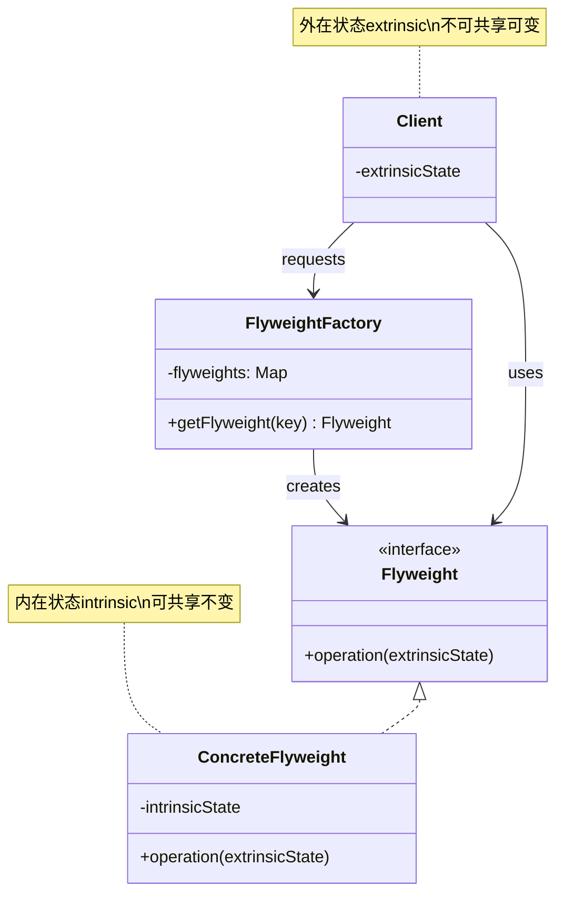
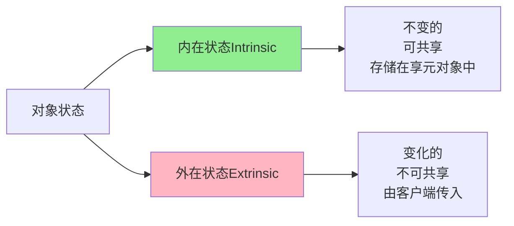
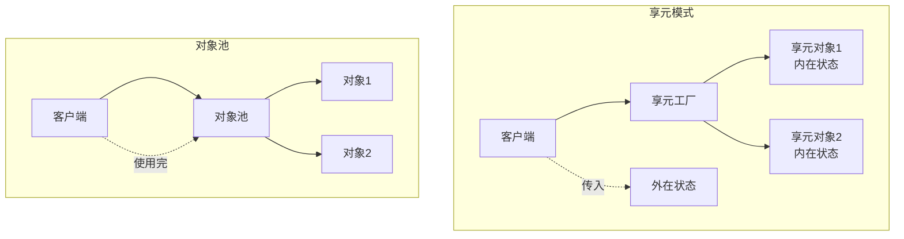

# 享元模式 (Flyweight Pattern)

## 模式定义

**享元模式**是一种结构型设计模式，它通过共享技术有效地支持大量细粒度的对象，减少内存使用和对象创建开销。



## 问题分析

当系统中需要创建大量相似对象时，会导致严重的内存问题：

```java
// ❌ 不好的做法：每个字符都是独立对象
public class TextEditor {
    private List<Character> characters = new ArrayList<>();

    public void addCharacter(char c, String font, int size, String color, int x, int y) {
        // 每个字符都创建新对象，包含所有属性
        characters.add(new Character(c, font, size, color, x, y));
    }
}

// 如果有 10,000 个字符，就要创建 10,000 个对象！
// 内存占用 = 10,000 × (字符对象大小)
```

**问题**：

- ❌ 内存占用过高（可能导致 OutOfMemoryError）
- ❌ 对象创建开销大
- ❌ 垃圾回收压力大
- ❌ 系统性能下降

> [!WARNING] > **内存爆炸**：假设每个字符对象占用 100 字节，10,000 个字符就需要约 1MB 内存。如果文档有 100 万个字符，就需要 100MB！而实际上大部分字符的字体、大小、颜色都是相同的。

## 解决方案

将对象的状态分为两类：



- **内在状态（Intrinsic State）**：不变的、可以共享的数据（如字体、颜色）
- **外在状态（Extrinsic State）**：变化的、不可共享的数据（如位置坐标）

> [!IMPORTANT] > **享元模式的关键**：
>
> - 识别哪些状态可以共享（内在）
> - 哪些状态必须独立（外在）
> - 通过工厂管理共享对象
> - 客户端传入外在状态

## 代码实现

### 场景：文字处理器

文字处理器中有大量字符，它们共享相同的字体样式。

#### 1. 定义享元接口

```java
/**
 * 字符外观享元接口（Flyweight）
 */
public interface CharacterStyle {
    /**
     * 渲染字符
     * @param character 字符内容（外在状态）
     * @param x 横坐标（外在状态）
     * @param y 纵坐标（外在状态）
     */
    void render(char character, int x, int y);
}
```

#### 2. 具体享元类

```java
/**
 * 具体字符样式（ConcreteFlyweight）
 * 内在状态：字体、大小、颜色
 */
public class ConcreteCharacterStyle implements CharacterStyle {
    // 内在状态：所有使用此样式的字符共享这些属性
    private final String fontFamily;  // 字体
    private final int fontSize;       // 大小
    private final String color;       // 颜色

    /**
     * 构造函数：设置内在状态
     */
    public ConcreteCharacterStyle(String fontFamily, int fontSize, String color) {
        this.fontFamily = fontFamily;
        this.fontSize = fontSize;
        this.color = color;

        // 模拟加载字体资源的耗时操作
        System.out.println("创建新样式：" + fontFamily + ", " + fontSize + "pt, " + color);
    }

    /**
     * 渲染字符
     * character, x, y 是外在状态，由客户端传入
     */
    @Override
    public void render(char character, int x, int y) {
        System.out.println("渲染字符 '" + character + "' at (" + x + "," + y + ") " +
            "字体:" + fontFamily + " 大小:" + fontSize + "pt 颜色:" + color);
    }

    @Override
    public String toString() {
        return fontFamily + "-" + fontSize + "-" + color;
    }
}
```

> [!TIP] > **内在状态 vs 外在状态**：
>
> - 内在：字体、大小、颜色（成千上万个字符共享）
> - 外在：字符内容、位置坐标（每个字符都不同）

#### 3. 享元工厂

```java
import java.util.HashMap;
import java.util.Map;

/**
 * 字符样式工厂（FlyweightFactory）
 * 管理享元对象池
 */
public class CharacterStyleFactory {
    // 对象池：存储已创建的享元对象
    private Map<String, CharacterStyle> stylePool = new HashMap<>();

    /**
     * 获取字符样式（享元对象）
     * 如果已存在则复用，不存在则创建
     */
    public CharacterStyle getStyle(String fontFamily, int fontSize, String color) {
        // 生成唯一键
        String key = fontFamily + "-" + fontSize + "-" + color;

        // 查找对象池
        CharacterStyle style = stylePool.get(key);

        if (style == null) {
            // 对象池中没有，创建新的享元对象
            style = new ConcreteCharacterStyle(fontFamily, fontSize, color);
            stylePool.put(key, style);
            System.out.println("  -> 对象池大小: " + stylePool.size());
        } else {
            System.out.println("  -> 复用已有样式: " + key);
        }

        return style;
    }

    /**
     * 获取对象池大小
     */
    public int getPoolSize() {
        return stylePool.size();
    }

    /**
     * 显示对象池信息
     */
    public void showPool() {
        System.out.println("\n========== 对象池信息 ==========");
        System.out.println("池中对象数: " + stylePool.size());
        for (String key : stylePool.keySet()) {
            System.out.println("  - " + key);
        }
        System.out.println("==============================\n");
    }
}
```

#### 4. 客户端使用

```java
/**
 * 文字处理器演示
 */
public class TextEditorDemo {
    public static void main(String[] args) {
        CharacterStyleFactory factory = new CharacterStyleFactory();

        System.out.println("========== 创建文档 ==========\n");

        // 第1个字符：Arial, 12pt, black
        CharacterStyle style1 = factory.getStyle("Arial", 12, "black");
        style1.render('H', 0, 0);

        // 第2个字符：相同样式，复用！
        CharacterStyle style2 = factory.getStyle("Arial", 12, "black");
        style2.render('e', 10, 0);

        // 第3个字符：相同样式，复用！
        CharacterStyle style3 = factory.getStyle("Arial", 12, "black");
        style3.render('l', 20, 0);

        // 第4个字符：不同样式（标题）
        CharacterStyle style4 = factory.getStyle("Arial", 24, "blue");
        style4.render('T', 0, 50);

        // 第5个字符：回到正文样式，复用第1个样式！
        CharacterStyle style5 = factory.getStyle("Arial", 12, "black");
        style5.render('l', 30, 0);

        // 显示对象池
        factory.showPool();

        // 验证对象是否相同
        System.out.println("style1 == style2? " + (style1 == style2)); // true
        System.out.println("style1 == style4? " + (style1 == style4)); // false

        // 模拟大型文档
        System.out.println("\n========== 性能测试 ==========\n");
        simulateLargeDocument(factory);
    }

    /**
     * 模拟处理大型文档
     */
    private static void simulateLargeDocument(CharacterStyleFactory factory) {
        String[] fonts = {"Arial", "Times New Roman", "Courier"};
        int[] sizes = {12, 14, 16};
        String[] colors = {"black", "blue", "red"};

        // 模拟 10,000 个字符
        int charCount = 10000;
        long startTime = System.currentTimeMillis();

        for (int i = 0; i < charCount; i++) {
            // 随机选择样式（实际文档中样式种类有限）
            String font = fonts[i % fonts.length];
            int size = sizes[i % sizes.length];
            String color = colors[i % colors.length];

            CharacterStyle style = factory.getStyle(font, size, color);
            // style.render((char)('A' + i % 26), i * 10, i / 100);
        }

        long endTime = System.currentTimeMillis();

        System.out.println("处理 " + charCount + " 个字符");
        System.out.println("创建的样式对象数: " + factory.getPoolSize());
        System.out.println("耗时: " + (endTime - startTime) + "ms");
        System.out.println("\n节省的对象数: " + (charCount - factory.getPoolSize()));
        System.out.println("内存节省率: " +
            String.format("%.2f%%", (1 - (double)factory.getPoolSize() / charCount) * 100));
    }
}
```

**输出：**

```
========== 创建文档 ==========

创建新样式：Arial, 12pt, black
  -> 对象池大小: 1
渲染字符 'H' at (0,0) 字体:Arial 大小:12pt 颜色:black
  -> 复用已有样式: Arial-12-black
渲染字符 'e' at (10,0) 字体:Arial 大小:12pt 颜色:black
  -> 复用已有样式: Arial-12-black
渲染字符 'l' at (20,0) 字体:Arial 大小:12pt 颜色:black
创建新样式：Arial, 24pt, blue
  -> 对象池大小: 2
渲染字符 'T' at (0,50) 字体:Arial 大小:24pt 颜色:blue
  -> 复用已有样式: Arial-12-black
渲染字符 'l' at (30,0) 字体:Arial 大小:12pt 颜色:black

========== 对象池信息 ==========
池中对象数: 2
  - Arial-12-black
  - Arial-24-blue
==============================

style1 == style2? true
style1 == style4? false

========== 性能测试 ==========

处理 10,000 个字符
创建的样式对象数: 9
耗时: 5ms

节省的对象数: 9991
内存节省率: 99.91%
```

> [!NOTE] > **内存优化效果惊人**：10,000 个字符只需要 9 个样式对象，节省了 99.91% 的内存！

## 实际应用示例

### 示例 1：游戏中的精灵/敌人

```java
/**
 * 游戏精灵（享元）
 * 内在状态：图片、尺寸
 */
public class Sprite {
    // 内在状态：所有相同类型的敌人共享
    private final String imagePath;
    private final int width;
    private final int height;
    private final byte[] imageData;  // 图片数据（可能很大）

    public Sprite(String imagePath, int width, int height) {
        this.imagePath = imagePath;
        this.width = width;
        this.height = height;
        // 模拟加载图片资源
        this.imageData = loadImage(imagePath);
        System.out.println("📦 加载资源: " + imagePath + " (" + width + "x" + height + ")");
    }

    /**
     * 渲染精灵
     * x, y, health 是外在状态
     */
    public void render(int x, int y, int health) {
        System.out.println("🎮 渲染精灵 at (" + x + "," + y + ") HP:" + health);
    }

    private byte[] loadImage(String path) {
        // 模拟加载图片
        return new byte[1024 * 100];  // 100KB
    }
}

/**
 * 精灵工厂
 */
public class SpriteFactory {
    private Map<String, Sprite> spriteCache = new HashMap<>();

    public Sprite getSprite(String type) {
        if (!spriteCache.containsKey(type)) {
            // 根据类型创建精灵
            switch (type) {
                case "zombie":
                    spriteCache.put(type, new Sprite("zombie.png", 32, 32));
                    break;
                case "skeleton":
                    spriteCache.put(type, new Sprite("skeleton.png", 32, 32));
                    break;
                case "boss":
                    spriteCache.put(type, new Sprite("boss.png", 64, 64));
                    break;
            }
        } else {
            System.out.println("♻️  复用精灵: " + type);
        }
        return spriteCache.get(type);
    }
}

// 使用示例：创建大量敌人
class Game Demo {
    public static void main(String[] args) {
        SpriteFactory factory = new SpriteFactory();

        System.out.println("========== 生成敌人 ==========\n");

        // 创建 1000 个僵尸，但只加载一次图片资源！
        for (int i = 0; i < 1000; i++) {
            Sprite zombie = factory.getSprite("zombie");
            zombie.render(i * 10, i * 5, 100);  // 外在状态：位置、血量
        }

        // 创建 500 个骷髅
        for (int i = 0; i < 500; i++) {
            Sprite skeleton = factory.getSprite("skeleton");
            skeleton.render(i * 15, i * 8, 50);
        }

        // 创建 10 个 Boss
        for (int i = 0; i < 10; i++) {
            Sprite boss = factory.getSprite("boss");
            boss.render(i * 100, i * 100, 1000);
        }

        System.out.println("\n========== 统计 ==========");
        System.out.println("总敌人数: 1510");
        System.out.println("加载的精灵资源数: 3");
        System.out.println("节省内存: " + (1510 - 3) + " 个对象");
    }
}
```

### 示例 2：数据库连接池

```java
/**
 * 数据库连接（享元）
 */
public class DatabaseConnection {
    private final String connectionId;
    private final String url;
    private boolean inUse;

    public DatabaseConnection(String url) {
        this.connectionId = "CONN_" + System.currentTimeMillis();
        this.url = url;
        this.inUse = false;

        // 模拟建立连接（耗时操作）
        System.out.println("🔗 建立数据库连接: " + connectionId);
        try {
            Thread.sleep(100);  // 模拟连接耗时
        } catch (InterruptedException e) {
            e.printStackTrace();
        }
    }

    public void setInUse(boolean inUse) {
        this.inUse = inUse;
    }

    public boolean isInUse() {
        return inUse;
    }

    public void execute(String sql) {
        System.out.println("[" + connectionId + "] 执行: " + sql);
    }
}

/**
 * 连接池（享元工厂）
 */
public class ConnectionPool {
    private List<DatabaseConnection> connections = new ArrayList<>();
    private static final int MAX_CONNECTIONS = 10;
    private String url;

    public ConnectionPool(String url) {
        this.url = url;
    }

    /**
     * 获取连接（享元对象）
     */
    public synchronized DatabaseConnection getConnection() {
        // 1. 先查找空闲连接
        for (DatabaseConnection conn : connections) {
            if (!conn.isInUse()) {
                conn.setInUse(true);
                System.out.println("♻️  复用连接");
                return conn;
            }
        }

        // 2. 没有空闲连接，创建新连接
        if (connections.size() < MAX_CONNECTIONS) {
            DatabaseConnection conn = new DatabaseConnection(url);
            conn.setInUse(true);
            connections.add(conn);
            System.out.println("  -> 连接池大小: " + connections.size());
            return conn;
        }

        // 3. 连接池已满
        throw new RuntimeException("连接池已满！");
    }

    /**
     * 释放连接
     */
    public synchronized void releaseConnection(DatabaseConnection conn) {
        conn.setInUse(false);
        System.out.println("🔓 释放连接");
    }
}

// 使用示例
class ConnectionPoolDemo {
    public static void main(String[] args) {
        ConnectionPool pool = new ConnectionPool("jdbc:mysql://localhost:3306/mydb");

        System.out.println("========== 数据库操作 ==========\n");

        // 获取连接1
        DatabaseConnection conn1 = pool.getConnection();
        conn1.execute("SELECT * FROM users");

        // 获取连接2
        DatabaseConnection conn2 = pool.getConnection();
        conn2.execute("SELECT * FROM orders");

        // 释放连接1
        pool.releaseConnection(conn1);

        // 再次获取连接，复用 conn1
        DatabaseConnection conn3 = pool.getConnection();
        conn3.execute("SELECT * FROM products");
    }
}
```

### 示例 3：String 常量池

```java
/**
 * Java String 是享元模式的典型应用
 */
public class StringPoolDemo {
    public static void main(String[] args) {
        // 字符串字面量自动进入常量池
        String s1 = "Hello";
        String s2 = "Hello";

        // s1 和 s2 指向同一个对象（享元）
        System.out.println("s1 == s2: " + (s1 == s2));  // true

        // new String() 创建新对象，不是享元
        String s3 = new String("Hello");
        System.out.println("s1 == s3: " + (s1 == s3));  // false

        // intern() 方法将字符串加入常量池
        String s4 = s3.intern();
        System.out.println("s1 == s4: " + (s1 == s4));  // true
    }
}
```

## 享元模式 vs 对象池



| 特性         | 享元模式            | 对象池         |
| ------------ | ------------------- | -------------- |
| **目的**     | 减少内存占用        | 避免重复创建   |
| **共享内容** | 内在状态            | 整个对象       |
| **对象状态** | 内在+外在           | 完整对象       |
| **适用场景** | 大量相似对象        | 创建成本高     |
| **典型应用** | String 池、图片缓存 | 连接池、线程池 |

## Java 标准库中的应用

### 1. String 常量池

```java
/**
 * String 常量池是享元模式
 */
String s1 = "hello";  // 进入常量池
String s2 = "hello";  // 复用常量池中的对象
System.out.println(s1 == s2);  // true
```

### 2. Integer 缓存

```java
/**
 * Integer 缓存 -128 到 127 之间的值
 */
Integer i1 = 100;  // 使用缓存
Integer i2 = 100;  // 复用缓存
System.out.println(i1 == i2);  // true

Integer i3 = 200;  // 超出缓存范围
Integer i4 = 200;  // 新建对象
System.out.println(i3 == i4);  // false
```

### 3. Apache Commons Pool

```java
/**
 * Apache Commons Pool 提供了通用的对象池
 */
GenericObjectPool<MyObject> pool = new GenericObjectPool<>(factory);
MyObject obj = pool.borrowObject();
// 使用对象...
pool.returnObject(obj);
```

## 优缺点

### 优点

- ✅ **大幅减少对象数量** - 节省内存
- ✅ **提高性能** - 减少对象创建和垃圾回收
- ✅ **集中管理** - 通过工厂统一管理共享对象
- ✅ **适合大规模场景** - 处理成千上万个对象

### 缺点

- ❌ **增加复杂度** - 需要分离内在和外在状态
- ❌ **线程安全问题** - 需要考虑并发访问
- ❌ **外在状态管理** - 客户端需要维护外在状态
- ❌ **不适合小型应用** - 对象数量少时收益不明显

> [!WARNING] > **线程安全**：如果多个线程共享享元对象，必须确保线程安全。通常享元对象应该是不可变的（immutable）。

## 适用场景

### 何时使用享元模式

- ✓ **大量相似对象** - 系统中有大量细粒度对象
- ✓ **内存压力大** - 对象占用内存过多
- ✓ **对象状态可分离** - 可以区分内在和外在状态
- ✓ **外在状态较少** - 外在状态不会过度增加复杂度

### 实际应用场景

- 📝 **文字处理** - 字符样式、字体
- 🎮 **游戏开发** - 精灵、地图砖块、粒子效果
- 🌐 **Web 应用** - 数据库连接池、线程池
- 🖼️ **图形系统** - 图片缓存、图标库
- 📊 **数据可视化** - 图表元素、标记

## 最佳实践

### 1. 保持享元对象不可变

```java
/**
 * ✅ 好的享元：不可变对象
 */
public final class ImmutableFlyweight {
    private final String state;

    public ImmutableFlyweight(String state) {
        this.state = state;
    }

    public String getState() {
        return state;
    }

    // 没有setter方法，保证不可变
}
```

### 2. 使用工厂管理享元对象

```java
/**
 * 工厂模式 + 单例模式
 */
public class FlyweightFactory {
    private static final FlyweightFactory INSTANCE = new FlyweightFactory();
    private Map<String, Flyweight> pool = new ConcurrentHashMap<>();

    private FlyweightFactory() {}

    public static FlyweightFactory getInstance() {
        return INSTANCE;
    }

    public Flyweight getFlyweight(String key) {
        return pool.computeIfAbsent(key, k -> new ConcreteFlyweight(k));
    }
}
```

### 3. 考虑使用 WeakHashMap

```java
/**
 * 使用 WeakHashMap 自动清理不再使用的享元
 */
public class SmartFlyweightFactory {
    private Map<String, Flyweight> pool = new WeakHashMap<>();

    public Flyweight getFlyweight(String key) {
        return pool.computeIfAbsent(key, k -> new ConcreteFlyweight(k));
    }
}
```

### 4. 提供统计和监控

```java
/**
 * 添加监控功能
 */
public class MonitoredFactory {
    private Map<String, Flyweight> pool = new HashMap<>();
    private int hitCount = 0;
    private int missCount = 0;

    public Flyweight getFlyweight(String key) {
        Flyweight fw = pool.get(key);
        if (fw != null) {
            hitCount++;
        } else {
            missCount++;
            fw = new ConcreteFlyweight(key);
            pool.put(key, fw);
        }
        return fw;
    }

    public void printStatistics() {
        System.out.println("缓存命中率: " +
            String.format("%.2f%%", (double)hitCount / (hitCount + missCount) * 100));
    }
}
```

## 与其他模式的关系

- **享元 + 工厂** - 通常使用工厂管理享元对象
- **享元 + 单例** - 享元工厂通常是单例
- **享元 + 组合** - 组合模式的叶子节点可以是享元
- **享元 + 状态** - 外在状态可以用状态模式管理

## 总结

享元模式是内存优化的利器：

- **核心思想** - 共享内在状态，分离外在状态
- **关键技术** - 对象池 + 状态分离
- **主要优势** - 大幅减少内存占用和对象创建
- **经典应用** - String 池、Integer 缓存、连接池
- **使用场景** - 大量相似对象导致内存压力

> [!TIP] > **享元模式的精髓**：
>
> - **识别**可共享的内在状态
> - **分离**不可共享的外在状态
> - **集中管理**享元对象
> - **权衡**复杂度与性能收益

**已完成：11 个文档**（创建型 5 + 结构型 6）

继续优化最后一个结构型模式...
