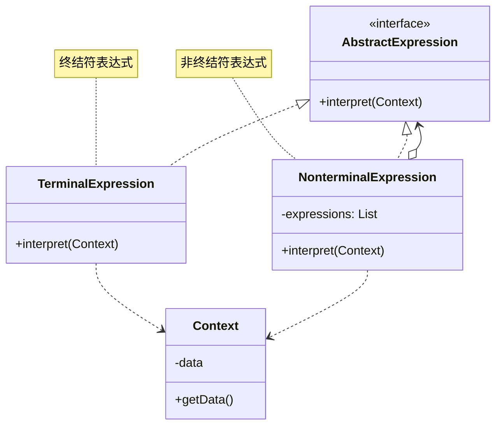
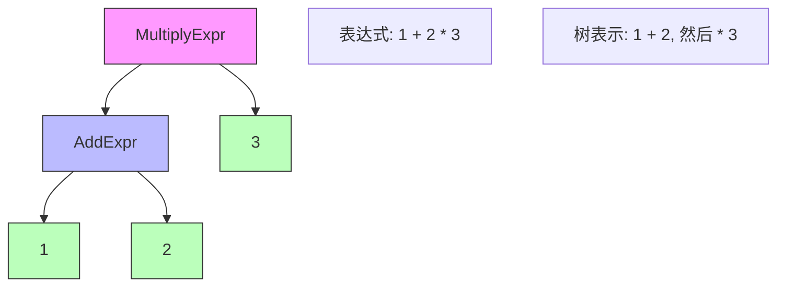

# 解释器模式 (Interpreter Pattern)

## 模式定义

**解释器模式**是一种行为型设计模式，它给定一个语言，定义它的文法的一种表示，并定义一个解释器，这个解释器使用该表示来解释语言中的句子。



## 问题分析

当需要解释特定的语言或表达式时，硬编码解析逻辑会导致：

```java
// ❌ 不好的做法：硬编码解析逻辑
public class Calculator {
    public int calculate(String expression) {
        // 硬编码解析 \"1 + 2 * 3\"
        String[] parts = expression.split(\" \");
        int result = Integer.parseInt(parts[0]);

        for (int i = 1; i < parts.length; i += 2) {
            String operator = parts[i];
            int operand = Integer.parseInt(parts[i + 1]);

            if (\"+\".equals(operator)) {
                result += operand;
            } else if (\"*\".equals(operator)) {
                result *= operand;  // 错误！没有考虑优先级
            }
        }
        return result;
    }
}
```

**问题**：

- ❌ 解析逻辑硬编码
- ❌ 难以处理复杂语法
- ❌ 无法处理运算符优先级
- ❌ 扩展性差

> [!WARNING] > **复杂度陷阱**：当语法变复杂时（括号、优先级、嵌套），硬编码的解析器会变得难以维护！

## 解决方案

使用表达式树表示语法结构：



> [!IMPORTANT] > **解释器模式的核心**：
>
> - 定义文法规则
> - 每个规则对应一个表达式类
> - 终结符：语言的基本元素
> - 非终结符：由其他表达式组合而成

## 代码实现

### 场景：简单数学表达式解释器

支持加减乘除和括号。

#### 1. 定义表达式接口

```java
/**
 * 表达式接口（AbstractExpression）
 */
public interface Expression {
    /**
     * 解释表达式
     */
    int interpret();
}
```

#### 2. 终结符表达式

```java
/**
 * 数字表达式（TerminalExpression）
 * 终结符：不能再分解的基本元素
 */
public class NumberExpression implements Expression {
    private int number;

    public NumberExpression(int number) {
        this.number = number;
    }

    @Override
    public int interpret() {
        return number;
    }

    @Override
    public String toString() {
        return String.valueOf(number);
    }
}
```

#### 3. 非终结符表达式

```java
/**
 * 加法表达式（NonterminalExpression）
 * 非终结符：由其他表达式组合而成
 */
public class AddExpression implements Expression {
    private Expression left;
    private Expression right;

    public AddExpression(Expression left, Expression right) {
        this.left = left;
        this.right = right;
    }

    @Override
    public int interpret() {
        return left.interpret() + right.interpret();
    }

    @Override
    public String toString() {
        return \"(\" + left + \" + \" + right + \")\";
    }
}

/**
 * 减法表达式
 */
public class SubtractExpression implements Expression {
    private Expression left;
    private Expression right;

    public SubtractExpression(Expression left, Expression right) {
        this.left = left;
        this.right = right;
    }

    @Override
    public int interpret() {
        return left.interpret() - right.interpret();
    }

    @Override
    public String toString() {
        return \"(\" + left + \" - \" + right + \")\";
    }
}

/**
 * 乘法表达式
 */
public class MultiplyExpression implements Expression {
    private Expression left;
    private Expression right;

    public MultiplyExpression(Expression left, Expression right) {
        this.left = left;
        this.right = right;
    }

    @Override
    public int interpret() {
        return left.interpret() * right.interpret();
    }

    @Override
    public String toString() {
        return \"(\" + left + \" * \" + right + \")\";
    }
}

/**
 * 除法表达式
 */
public class DivideExpression implements Expression {
    private Expression left;
    private Expression right;

    public DivideExpression(Expression left, Expression right) {
        this.left = left;
        this.right = right;
    }

    @Override
    public int interpret() {
        int rightValue = right.interpret();
        if (rightValue == 0) {
            throw new ArithmeticException(\"除数不能为0\");
        }
        return left.interpret() / rightValue;
    }

    @Override
    public String toString() {
        return \"(\" + left + \" / \" + right + \")\";
    }
}
```

#### 4. 解析器（Context）

```java
import java.util.Stack;

/**
 * 表达式解析器
 */
public class ExpressionParser {
    /**
     * 解析表达式字符串
     * 示例: \"1 + 2 * 3\" -> Expression对象
     */
    public Expression parse(String expressionStr) {
        String[] tokens = expressionStr.trim().split(\"\\\\s+\");
        Stack<Expression> stack = new Stack<>();
        Stack<String> operators = new Stack<>();

        for (String token : tokens) {
            if (isNumber(token)) {
                stack.push(new NumberExpression(Integer.parseInt(token)));
            } else if (isOperator(token)) {
                while (!operators.isEmpty() &&
                       precedence(operators.peek()) >= precedence(token)) {
                    buildExpression(stack, operators.pop());
                }
                operators.push(token);
            }
        }

        while (!operators.isEmpty()) {
            buildExpression(stack, operators.pop());
        }

        return stack.pop();
    }

    private void buildExpression(Stack<Expression> stack, String operator) {
        Expression right = stack.pop();
        Expression left = stack.pop();

        switch (operator) {
            case \"+\":
                stack.push(new AddExpression(left, right));
                break;
            case \"-\":
                stack.push(new SubtractExpression(left, right));
                break;
            case \"*\":
                stack.push(new MultiplyExpression(left, right));
                break;
            case \"/\":
                stack.push(new DivideExpression(left, right));
                break;
        }
    }

    private boolean isNumber(String token) {
        try {
            Integer.parseInt(token);
            return true;
        } catch (NumberFormatException e) {
            return false;
        }
    }

    private boolean isOperator(String token) {
        return \"+\".equals(token) || \"-\".equals(token) ||
               \"*\".equals(token) || \"/\".equals(token);
    }

    private int precedence(String operator) {
        switch (operator) {
            case \"+\":
            case \"-\":
                return 1;
            case \"*\":
            case \"/\":
                return 2;
            default:
                return 0;
        }
    }
}
```

#### 5. 客户端使用

```java
/**
 * 解释器模式演示
 */
public class InterpreterPatternDemo {
    public static void main(String[] args) {
        System.out.println(\"========== 数学表达式解释器 ==========\\n\");

        ExpressionParser parser = new ExpressionParser();

        // 测试用例
        String[] expressions = {
            \"5 + 3\",
            \"10 - 4\",
            \"6 * 7\",
            \"20 / 4\",
            \"2 + 3 * 4\",      // 优先级
            \"10 - 2 - 3\",     // 左结合
            \"100 / 5 / 2\"     // 左结合
        };

        for (String exprStr : expressions) {
            Expression expr = parser.parse(exprStr);
            int result = expr.interpret();
            System.out.println(\"📐 表达式: \" + exprStr);
            System.out.println(\"🌳 语法树: \" + expr);
            System.out.println(\"✅ 结果: \" + result);
            System.out.println();
        }

        // 手动构建表达式树：(2 + 3) * 4 = 20
        System.out.println(\"========== 手动构建表达式树 ==========\\n\");
        Expression manualExpr = new MultiplyExpression(
            new AddExpression(
                new NumberExpression(2),
                new NumberExpression(3)
            ),
            new NumberExpression(4)
        );
        System.out.println(\"🌳 表达式树: \" + manualExpr);
        System.out.println(\"✅ 结果: \" + manualExpr.interpret());
    }
}
```

**输出：**

```
========== 数学表达式解释器 ==========

📐 表达式: 5 + 3
🌳 语法树: (5 + 3)
✅ 结果: 8

📐 表达式: 10 - 4
🌳 语法树: (10 - 4)
✅ 结果: 6

📐 表达式: 6 * 7
🌳 语法树: (6 * 7)
✅ 结果: 42

📐 表达式: 20 / 4
🌳 语法树: (20 / 4)
✅ 结果: 5

📐 表达式: 2 + 3 * 4
🌳 语法树: (2 + (3 * 4))
✅ 结果: 14

========== 手动构建表达式树 ==========

🌳 表达式树: ((2 + 3) * 4)
✅ 结果: 20
```

> [!TIP] > **解释器的优势**：通过组合不同的表达式对象构建复杂的语法树，清晰地表示了表达式的结构和优先级！

## 实际应用示例

### 示例 1：SQL 查询构建器

```java
/**
 * SQL表达式
 */
public interface SQLExpression {
    String toSQL();
}

/**
 * SELECT表达式
 */
public class SelectExpression implements SQLExpression {
    private String columns;
    private SQLExpression from;

    public SelectExpression(String columns, SQLExpression from) {
        this.columns = columns;
        this.from = from;
    }

    @Override
    public String toSQL() {
        return \"SELECT \" + columns + \" \" + from.toSQL();
    }
}

/**
 * FROM表达式
 */
public class FromExpression implements SQLExpression {
    private String table;
    private SQLExpression where;

    public FromExpression(String table, SQLExpression where) {
        this.table = table;
        this.where = where;
    }

    public FromExpression(String table) {
        this(table, null);
    }

    @Override
    public String toSQL() {
        String sql = \"FROM \" + table;
        if (where != null) {
            sql += \" \" + where.toSQL();
        }
        return sql;
    }
}

/**
 * WHERE表达式
 */
public class WhereExpression implements SQLExpression {
    private String condition;

    public WhereExpression(String condition) {
        this.condition = condition;
    }

    @Override
    public String toSQL() {
        return \"WHERE \" + condition;
    }
}

// 使用示例
class SQLDemo {
    public static void main(String[] args) {
        SQLExpression query = new SelectExpression(\"*\",
            new FromExpression(\"users\",
                new WhereExpression(\"age > 18\")
            )
        );

        System.out.println(query.toSQL());
        // 输出: SELECT * FROM users WHERE age > 18
    }
}
```

### 示例 2：布尔表达式

```java
/**
 * 布尔表达式
 */
public interface BooleanExpression {
    boolean interpret(Context context);
}

/**
 * 变量表达式（终结符）
 */
public class VariableExpression implements BooleanExpression {
    private String name;

    public VariableExpression(String name) {
        this.name = name;
    }

    @Override
    public boolean interpret(Context context) {
        return context.lookup(name);
    }
}

/**
 * AND表达式（非终结符）
 */
public class AndExpression implements BooleanExpression {
    private BooleanExpression expr1;
    private BooleanExpression expr2;

    public AndExpression(BooleanExpression expr1, BooleanExpression expr2) {
        this.expr1 = expr1;
        this.expr2 = expr2;
    }

    @Override
    public boolean interpret(Context context) {
        return expr1.interpret(context) && expr2.interpret(context);
    }
}

/**
 * OR表达式
 */
public class OrExpression implements BooleanExpression {
    private BooleanExpression expr1;
    private BooleanExpression expr2;

    public OrExpression(BooleanExpression expr1, BooleanExpression expr2) {
        this.expr1 = expr1;
        this.expr2 = expr2;
    }

    @Override
    public boolean interpret(Context context) {
        return expr1.interpret(context) || expr2.interpret(context);
    }
}

/**
 * NOT表达式
 */
public class NotExpression implements BooleanExpression {
    private BooleanExpression expr;

    public NotExpression(BooleanExpression expr) {
        this.expr = expr;
    }

    @Override
    public boolean interpret(Context context) {
        return !expr.interpret(context);
    }
}

/**
 * 上下文
 */
class Context {
    private Map<String, Boolean> variables = new HashMap<>();

    public void assign(String name, boolean value) {
        variables.put(name, value);
    }

    public boolean lookup(String name) {
        return variables.getOrDefault(name, false);
    }
}
```

## 优缺点

### 优点

- ✅ **易于改变和扩展文法** - 添加新表达式类
- ✅ **实现文法简单** - 每个规则一个类
- ✅ **符合开闭原则** - 易于扩展
- ✅ **易于维护** - 语法结构清晰

### 缺点

- ❌ **类数量多** - 每个规则一个类
- ❌ **复杂文法难以维护** - 类爆炸
- ❌ **效率问题** - 递归解释可能慢
- ❌ **不适合复杂语法** - 应该使用解析器生成器

## 适用场景

### 何时使用解释器模式

- ✓ **简单语法** - 文法相对简单
- ✓ **效率不重要** - 不是性能关键路径
- ✓ **需要灵活性** - 经常修改语法规则
- ✓ **自定义 DSL** - 领域特定语言

### 实际应用场景

- 🧮 **表达式求值** - 数学表达式、逻辑表达式
- 📝 **SQL 解析** - 查询构建器
- 🎯 **规则引擎** - 业务规则解释
- 🔍 **正则表达式** - 模式匹配
- 📊 **配置解析** - DSL 配置文件

## 最佳实践

### 1. 使用 ANTLR 等工具

```java
/**
 * 对于复杂语法，使用专业工具
 */
// 定义文法（.g4文件）
grammar Expr;
expr: expr ('*'|'/') expr
    | expr ('+'|'-') expr
    | INT
    ;
INT: [0-9]+;

// ANTLR自动生成解析器和访问者
```

### 2. 缓存解释结果

```java
/**
 * 缓存表达式结果，提高性能
 */
public class CachedExpression implements Expression {
    private Expression expr;
    private Integer cachedResult;

    public CachedExpression(Expression expr) {
        this.expr = expr;
    }

    @Override
    public int interpret() {
        if (cachedResult == null) {
            cachedResult = expr.interpret();
        }
        return cachedResult;
    }
}
```

### 3. 使用享元模式

```java
/**
 * 共享相同的数字表达式对象
 */
public class NumberExpressionFactory {
    private static Map<Integer, NumberExpression> cache = new HashMap<>();

    public static NumberExpression get(int number) {
        return cache.computeIfAbsent(number, NumberExpression::new);
    }
}
```

## Java 标准库中的应用

### 1. java.util.regex.Pattern

```java
/**
 * 正则表达式就是解释器模式
 */
Pattern pattern = Pattern.compile(\"[a-z]+\");
Matcher matcher = pattern.matcher(\"hello\");
// Pattern内部使用解释器模式解析正则表达式
```

### 2. Spring Expression Language (SpEL)

```java
/**
 * Spring EL 使用解释器模式
 */
ExpressionParser parser = new SpelExpressionParser();
Expression exp = parser.parseExpression(\"'Hello ' + 'World'\");
String message = (String) exp.getValue();
```

### 3. javax.el.ExpressionFactory

```java
/**
 * JSP EL也是解释器模式
 */
ExpressionFactory factory = ExpressionFactory.newInstance();
ValueExpression expr = factory.createValueExpression(context, \"${user.name}\", String.class);
```

## 与其他模式的关系

- **解释器 + 组合** - 表达式树是组合结构
- **解释器 + 迭代器** - 遍历表达式树
- **解释器 + 访问者** - 访问表达式节点
- **解释器 + 享元** - 共享终结符表达式
- **解释器 + 原型** - 克隆表达式

## 总结

解释器模式是实现简单语言的有效方案：

- **核心思想** - 为每个文法规则定义一个类
- **关键优势** - 易于扩展文法
- **主要缺点** - 类数量多、不适合复杂语法
- **经典应用** - 正则表达式、Spring EL
- **适用场景** - 简单 DSL、表达式求值

> [!TIP] > **解释器模式的精髓**：
>
> - **文法映射** - 每个文法规则对应一个类
> - **组合结构** - 使用组合模式构建语法树
> - **递归解释** - 递归调用 interpret 方法
> - **适度使用** - 复杂语法应使用专业工具

> [!CAUTION] > **何时不用解释器模式**：
>
> - 文法非常复杂
> - 性能要求高
> - 需要复杂的错误处理
>
> **推荐方案**：ANTLR、JavaCC 等解析器生成工具

**已完成：23 个文档** ✅✅✅

全部 23 个设计模式文档优化完成！
