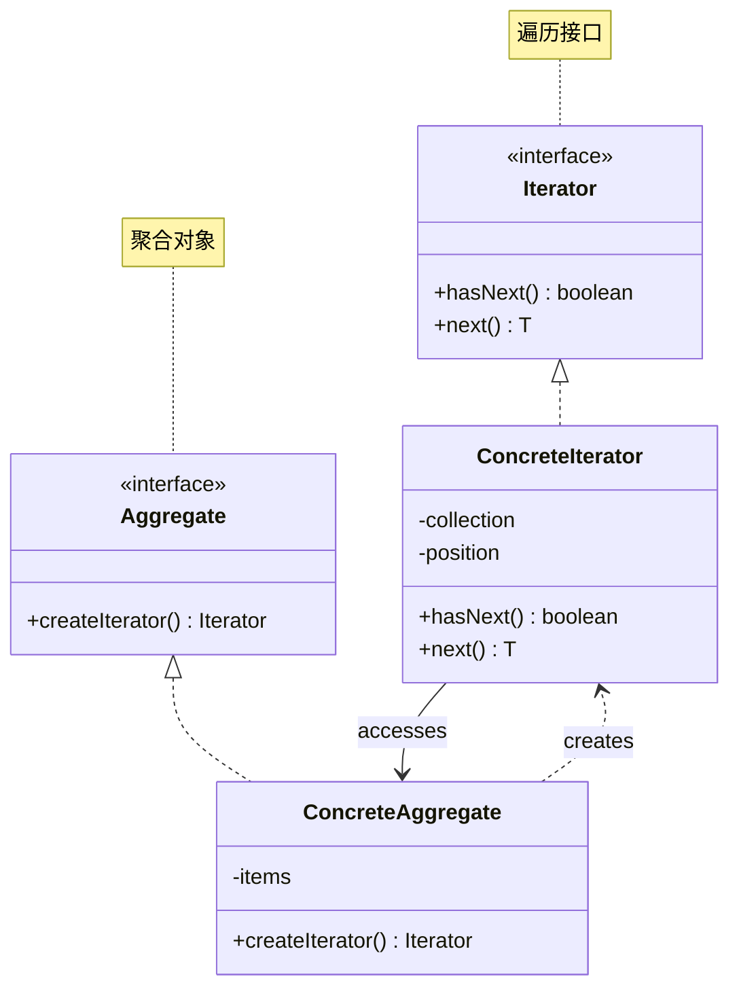
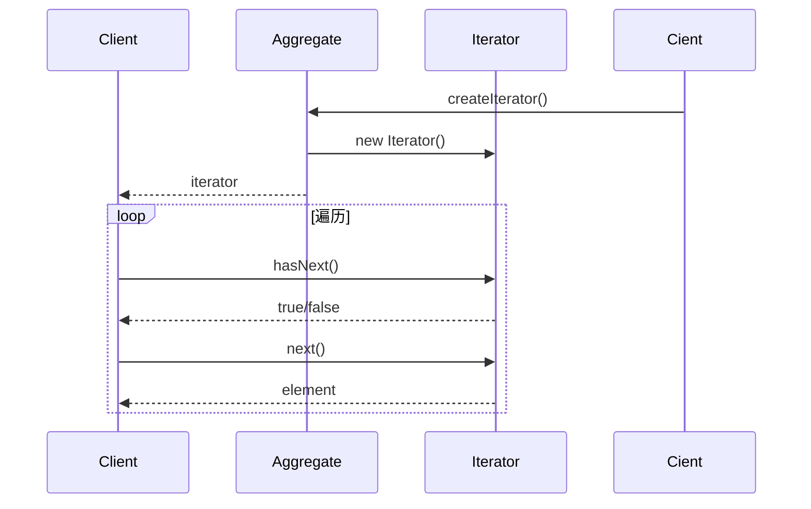

# 迭代器模式 (Iterator Pattern)

## 模式定义

**迭代器模式**是一种行为型设计模式，它提供一种方法顺序访问一个聚合对象中的各个元素，而又不暴露该对象的内部表示。



## 问题分析

直接暴露集合内部结构会导致：

```java
// ❌ 不好的做法：暴露内部实现
public class BookCollection {
    private List<Book> books = new ArrayList<>();

    // 暴露内部结构
    public List<Book> getBooks() {
        return books;  // 客户端依赖 ArrayList
    }
}

// 客户端代码
List<Book> books = collection.getBooks();
for (int i = 0; i < books.size(); i++) {
    Book book = books.get(i);  // 依赖 List 接口
}
```

**问题**：

- ❌ 客户端与集合实现紧耦合
- ❌ 难以切换集合实现方式
- ❌ 无法支持多种遍历方式
- ❌ 违反封装原则

## 解决方案

提供统一的迭代器接口：



> [!IMPORTANT] > **迭代器模式的核心**：
>
> - 提供统一的遍历接口
> - 封装集合的内部结构
> - 支持多种遍历算法
> - 迭代器负责跟踪位置

## 代码实现

由于 Java 标准库已经提供了 Iterator 接口，实际应用中我们直接使用即可。本示例演示自定义实现以理解原理。

### 场景：图书管理系统

不同类型的图书集合（数组、列表、树）需要统一的遍历方式。

#### 1. 定义迭代器接口

```java
/**
 * 迭代器接口
 */
public interface Iterator<T> {
    /**
     * 是否还有下一个元素
     */
    boolean hasNext();

    /**
     * 获取下一个元素
     */
    T next();
}
```

#### 2. 具体迭代器

```java
import java.util.List;
import java.util.NoSuchElementException;

/**
 * 列表迭代器
 */
public class ListIterator<T> implements Iterator<T> {
    private List<T> list;
    private int position;

    public ListIterator(List<T> list) {
        this.list = list;
        this.position = 0;
    }

    @Override
    public boolean hasNext() {
        return position < list.size();
    }

    @Override
    public T next() {
        if (!hasNext()) {
            throw new NoSuchElementException(\"没有更多元素\");
        }
        return list.get(position++);
    }
}

/**
 * 数组迭代器
 */
public class ArrayIterator<T> implements Iterator<T> {
    private T[] array;
    private int position;

    public ArrayIterator(T[] array) {
        this.array = array;
        this.position = 0;
    }

    @Override
    public boolean hasNext() {
        return position < array.length;
    }

    @Override
    public T next() {
        if (!hasNext()) {
            throw new NoSuchElementException(\"没有更多元素\");
        }
        return array[position++];
    }
}
```

#### 3. 聚合接口

```java
/**
 * 聚合接口
 */
public interface Aggregate<T> {
    /**
     * 创建迭代器
     */
    Iterator<T> createIterator();
}
```

#### 4. 具体聚合

```java
import java.util.ArrayList;
import java.util.List;

/**
 * 图书类
 */
class Book {
    private String title;
    private String author;

    public Book(String title, String author) {
        this.title = title;
        this.author = author;
    }

    @Override
    public String toString() {
        return \"《\" + title + \"》 - \" + author;
    }
}

/**
 * 图书集合（使用List）
 */
public class BookCollection implements Aggregate<Book> {
    private List<Book> books = new ArrayList<>();

    public void addBook(Book book) {
        books.add(book);
        System.out.println(\"📚 添加图书: \" + book);
    }

    @Override
    public Iterator<Book> createIterator() {
        return new ListIterator<>(books);
    }
}

/**
 * 图书集合（使用数组）
 */
public class BookArray implements Aggregate<Book> {
    private Book[] books;
    private int count = 0;

    public BookArray(int maxSize) {
        books = new Book[maxSize];
    }

    public void addBook(Book book) {
        if (count < books.length) {
            books[count++] = book;
            System.out.println(\"📚 添加图书: \" + book);
        }
    }

    @Override
    public Iterator<Book> createIterator() {
        return new ArrayIterator<>(java.util.Arrays.copyOf(books, count));
    }
}
```

#### 5. 客户端使用

```java
/**
 * 迭代器模式演示
 */
public class IteratorPatternDemo {
    public static void main(String[] args) {
        System.out.println(\"========== 图书集合（List） ==========\\n\");

        // 使用List实现的集合
        BookCollection listCollection = new BookCollection();
        listCollection.addBook(new Book(\"设计模式\", \"GoF\"));
        listCollection.addBook(new Book(\"重构\", \"Martin Fowler\"));
        listCollection.addBook(new Book(\"代码大全\", \"Steve McConnell\"));

        System.out.println(\"\\n遍历图书:\");
        Iterator<Book> iterator1 = listCollection.createIterator();
        while (iterator1.hasNext()) {
            System.out.println(\"  📖 \" + iterator1.next());
        }

        System.out.println(\"\\n========== 图书集合（Array） ==========\\n\");

        // 使用数组实现的集合
        BookArray arrayCollection = new BookArray(5);
        arrayCollection.addBook(new Book(\"Effective Java\", \"Joshua Bloch\"));
        arrayCollection.addBook(new Book(\"Clean Code\", \"Robert Martin\"));

        System.out.println(\"\\n遍历图书:\");
        Iterator<Book> iterator2 = arrayCollection.createIterator();
        while (iterator2.hasNext()) {
            System.out.println(\"  📖 \" + iterator2.next());
        }

        // 关键：客户端代码完全相同，不关心底层是List还是Array！
    }
}
```

> [!TIP] > **迭代器的优势**：客户端使用相同的代码遍历不同的集合实现，完全解耦！

## Java 标准库的迭代器

Java 集合框架大量使用迭代器模式：

```java
import java.util.*;

/**
 * Java标准迭代器使用示例
 */
public class JavaIteratorDemo {
    public static void main(String[] args) {
        List<String> list = Arrays.asList(\"A\", \"B\", \"C\");

        // 方式1：Iterator
        java.util.Iterator<String> iterator = list.iterator();
        while (iterator.hasNext()) {
            System.out.println(iterator.next());
        }

        // 方式2：增强for循环（语法糖，底层用Iterator）
        for (String item : list) {
            System.out.println(item);
        }

        // 方式3：forEach方法（Java 8+）
        list.forEach(System.out::println);

        // 方式4：Stream API
        list.stream().forEach(System.out::println);

        // ListIterator：双向迭代
        ListIterator<String> listIterator = list.listIterator();
        while (listIterator.hasNext()) {
            System.out.println(listIterator.next());
        }
        while (listIterator.hasPrevious()) {
            System.out.println(listIterator.previous());  // 反向
        }
    }
}
```

## 实际应用示例

### 示例 1：二叉树遍历

```java
/**
 * 二叉树节点
 */
class TreeNode {
    int value;
    TreeNode left;
    TreeNode right;

    public TreeNode(int value) {
        this.value = value;
    }
}

/**
 * 前序遍历迭代器
 */
public class PreOrderIterator implements Iterator<Integer> {
    private Stack<TreeNode> stack = new Stack<>();

    public PreOrderIterator(TreeNode root) {
        if (root != null) {
            stack.push(root);
        }
    }

    @Override
    public boolean hasNext() {
        return !stack.isEmpty();
    }

    @Override
    public Integer next() {
        TreeNode node = stack.pop();

        // 先压右子树，再压左子树（栈后进先出）
        if (node.right != null) {
            stack.push(node.right);
        }
        if (node.left != null) {
            stack.push(node.left);
        }

        return node.value;
    }
}

/**
 * 中序遍历迭代器
 */
public class InOrderIterator implements Iterator<Integer> {
    private Stack<TreeNode> stack = new Stack<>();
    private TreeNode current;

    public InOrderIterator(TreeNode root) {
        this.current = root;
    }

    @Override
    public boolean hasNext() {
        return current != null || !stack.isEmpty();
    }

    @Override
    public Integer next() {
        // 一直往左走
        while (current != null) {
            stack.push(current);
            current = current.left;
        }

        // 访问节点
        TreeNode node = stack.pop();
        current = node.right;

        return node.value;
    }
}

// 使用示例
class TreeDemo {
    public static void main(String[] args) {
        //     1
        //    / \\
        //   2   3
        //  / \\
        // 4   5
        TreeNode root = new TreeNode(1);
        root.left = new TreeNode(2);
        root.right = new TreeNode(3);
        root.left.left = new TreeNode(4);
        root.left.right = new TreeNode(5);

        System.out.println(\"前序遍历: \");
        Iterator<Integer> preOrder = new PreOrderIterator(root);
        while (preOrder.hasNext()) {
            System.out.print(preOrder.next() + \" \");  // 1 2 4 5 3
        }

        System.out.println(\"\\n中序遍历: \");
        Iterator<Integer> inOrder = new InOrderIterator(root);
        while (inOrder.hasNext()) {
            System.out.print(inOrder.next() + \" \");   // 4 2 5 1 3
        }
    }
}
```

### 示例 2：分页迭代器

```java
/**
 * 分页数据
 */
public class PagedData<T> {
    private List<T> allData;
    private int pageSize;

    public PagedData(List<T> allData, int pageSize) {
        this.allData = allData;
        this.pageSize = pageSize;
    }

    public int getTotalPages() {
        return (allData.size() + pageSize - 1) / pageSize;
    }

    public List<T> getPage(int pageNumber) {
        int start = pageNumber * pageSize;
        int end = Math.min(start + pageSize, allData.size());
        return allData.subList(start, end);
    }
}

/**
 * 分页迭代器
 */
public class PageIterator<T> implements Iterator<List<T>> {
    private PagedData<T> pagedData;
    private int currentPage = 0;

    public PageIterator(PagedData<T> pagedData) {
        this.pagedData = pagedData;
    }

    @Override
    public boolean hasNext() {
        return currentPage < pagedData.getTotalPages();
    }

    @Override
    public List<T> next() {
        if (!hasNext()) {
            throw new NoSuchElementException();
        }
        return pagedData.getPage(currentPage++);
    }
}

// 使用示例
class PageDemo {
    public static void main(String[] args) {
        List<Integer> data = new ArrayList<>();
        for (int i = 1; i <= 25; i++) {
            data.add(i);
        }

        PagedData<Integer> pagedData = new PagedData<>(data, 10);
        Iterator<List<Integer>> pageIterator = new PageIterator<>(pagedData);

        int pageNum = 1;
        while (pageIterator.hasNext()) {
            List<Integer> page = pageIterator.next();
            System.out.println(\"第 \" + pageNum++ + \" 页: \" + page);
        }
    }
}
```

### 示例 3：组合迭代器

```java
/**
 * 组合迭代器：遍历组合结构
 */
public interface MenuComponent {
    Iterator<MenuComponent> createIterator();
    void print();
}

/**
 * 菜单项（叶子）
 */
public class MenuItem implements MenuComponent {
    String name;

    public MenuItem(String name) {
        this.name = name;
    }

    @Override
    public Iterator<MenuComponent> createIterator() {
        return new NullIterator();  // 叶子节点返回空迭代器
    }

    @Override
    public void print() {
        System.out.println(\"  - \" + name);
    }
}

/**
 * 菜单（容器）
 */
public class Menu implements MenuComponent {
    String name;
    List<MenuComponent> items = new ArrayList<>();

    public Menu(String name) {
        this.name = name;
    }

    public void add(MenuComponent component) {
        items.add(component);
    }

    @Override
    public Iterator<MenuComponent> createIterator() {
        return new CompositeIterator(items.iterator());
    }

    @Override
    public void print() {
        System.out.println(\"\\n\" + name);
    }
}

/**
 * 空迭代器
 */
public class NullIterator implements Iterator<MenuComponent> {
    @Override
    public boolean hasNext() {
        return false;
    }

    @Override
    public MenuComponent next() {
        throw new NoSuchElementException();
    }
}

/**
 * 组合迭代器：递归遍历
 */
public class CompositeIterator implements Iterator<MenuComponent> {
    Stack<Iterator<MenuComponent>> stack = new Stack<>();

    public CompositeIterator(java.util.Iterator<MenuComponent> iterator) {
        stack.push(new IteratorAdapter(iterator));
    }

    @Override
    public boolean hasNext() {
        if (stack.isEmpty()) {
            return false;
        }

        Iterator<MenuComponent> iterator = stack.peek();
        if (!iterator.hasNext()) {
            stack.pop();
            return hasNext();  // 递归检查
        }

        return true;
    }

    @Override
    public MenuComponent next() {
        if (!hasNext()) {
            throw new NoSuchElementException();
        }

        Iterator<MenuComponent> iterator = stack.peek();
        MenuComponent component = iterator.next();

        // 如果是容器，将其迭代器压栈
        stack.push(component.createIterator());

        return component;
    }

    // 适配器：java.util.Iterator -> 自定义Iterator
    private class IteratorAdapter implements Iterator<MenuComponent> {
        java.util.Iterator<MenuComponent> iterator;

        IteratorAdapter(java.util.Iterator<MenuComponent> iterator) {
            this.iterator = iterator;
        }

        public boolean hasNext() {
            return iterator.hasNext();
        }

        public MenuComponent next() {
            return iterator.next();
        }
    }
}
```

## 优缺点

### 优点

- ✅ **封装内部结构** - 不暴露集合实现
- ✅ **统一接口** - 多种集合统一遍历方式
- ✅ **支持多种遍历** - 前序、中序、后序等
- ✅ **符合单一职责** - 遍历逻辑独立
- ✅ **符合开闭原则** - 易于扩展新的遍历方式

### 缺点

- ❌ **增加类数量** - 每种遍历方式都需要迭代器类
- ❌ **某些场景性能较差** - 相比直接访问

## 适用场景

### 何时使用迭代器模式

- ✓ **访问聚合对象** - 无需暴露内部结构
- ✓ **支持多种遍历** - 同一集合不同遍历方式
- ✓ **统一接口** - 多种集合类型统一访问
- ✓ **解耦** - 遍历算法与集合独立

### 实际应用场景

- 📚 **集合框架** - ArrayList、HashSet 等
- 🌳 **树遍历** - 前序、中序、后序
- 📄 **文件系统** - 目录遍历
- 📊 **数据分页** - 分页查询
- 🎯 **组合结构** - 递归遍历

## 内部迭代器 vs 外部迭代器

| 特性       | 外部迭代器         | 内部迭代器      |
| ---------- | ------------------ | --------------- |
| **控制权** | 客户端             | 迭代器          |
| **灵活性** | ⭐⭐⭐⭐⭐ 高      | ⭐⭐ 低         |
| **简洁性** | ⭐⭐ 需 while 循环 | ⭐⭐⭐⭐⭐ 简洁 |
| **例子**   | Iterator           | forEach         |

```java
// 外部迭代器：客户端控制
Iterator<String> it = list.iterator();
while (it.hasNext()) {
    String item = it.next();
    if (condition) break;  // 可以控制
}

// 内部迭代器：迭代器控制
list.forEach(item -> {
    // 无法break
});
```

## 最佳实践

### 1. 实现 Iterable 接口

```java
// ✅ 实现Iterable，支持增强for循环
public class MyCollection<T> implements Iterable<T> {
    private List<T> items = new ArrayList<>();

    @Override
    public java.util.Iterator<T> iterator() {
        return items.iterator();
    }
}

// 使用
MyCollection<String> collection = new MyCollection<>();
for (String item : collection) {  // 增强for循环
    System.out.println(item);
}
```

### 2. 支持 remove 操作

```java
/**
 * 支持删除的迭代器
 */
public class AdvancedIterator<T> implements Iterator<T> {
    private List<T> list;
    private int position = 0;
    private boolean canRemove = false;

    @Override
    public T next() {
        T item = list.get(position++);
        canRemove = true;
        return item;
    }

    public void remove() {
        if (!canRemove) {
            throw new IllegalStateException(\"必须先调用next()\");
        }
        list.remove(--position);
        canRemove = false;
    }
}
```

### 3. fail-fast 机制

```java
/**
 * 快速失败机制：检测并发修改
 */
public class SafeIterator<T> implements Iterator<T> {
    private List<T> list;
    private int expectedModCount;  // 期望的修改次数
    private int position = 0;

    public SafeIterator(List<T> list, int modCount) {
        this.list = list;
        this.expectedModCount = modCount;
    }

    @Override
    public T next() {
        checkForComodification();
        return list.get(position++);
    }

    private void checkForComodification() {
        if (list.modCount != expectedModCount) {
            throw new ConcurrentModificationException();
        }
    }
}
```

## 与其他模式的关系

- **迭代器 + 组合** - 遍历组合结构
- **迭代器 + 工厂** - 工厂创建迭代器
- **迭代器 + 备忘录** - 保存遍历状态

## 总结

迭代器模式是集合遍历的标准方案：

- **核心思想** - 提供统一的遍历接口
- **关键优势** - 封装、解耦、灵活
- **主要缺点** - 类数量增加
- **经典应用** - Java 集合框架
- **适用场景** - 所有需要遍历的集合

> [!TIP] > **迭代器模式的精髓**：
>
> - **封装遍历逻辑**
> - **统一访问接口**
> - **支持多种遍历方式**
> - **遍历与集合解耦**

**已完成：16 个文档** ✅
