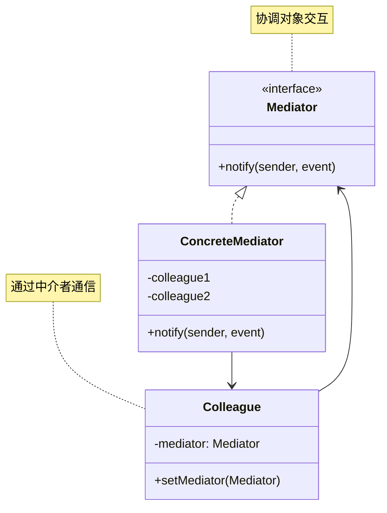
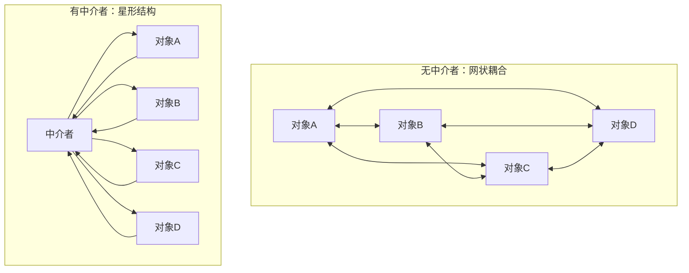

# 中介者模式 (Mediator Pattern)

## 模式定义

**中介者模式**是一种行为型设计模式，它定义了一个中介对象来封装一系列对象之间的交互。中介者使各对象不需要显式地相互引用，从而使其耦合松散，而且可以独立地改变它们之间的交互。



## 问题分析

当多个对象之间存在复杂的网状通信关系时，直接通信会导致：

```java
// ❌ 不好的做法：对象间直接耦合
public class ChatRoom {
    private List<User> users = new ArrayList<>();

    public void addUser(User user) {
        users.add(user);
    }

    // 每个用户都要持有其他所有用户的引用
    public void sendMessage(User sender, User receiver, String message) {
        receiver.receive(sender.getName() + \": \" + message);
    }
}

public class User {
    private List<User> contacts = new ArrayList<>();  // 需要知道所有联系人

    public void sendTo(User receiver, String message) {
        receiver.receive(this.name + \": \" + message);  // 直接耦合
    }
}
```

**问题**：

- ❌ 对象间网状耦合，关系复杂
- ❌ 修改一个对象可能影响多个对象
- ❌ 对象无法独立复用
- ❌ 违反迪米特法则

> [!WARNING] > **网状耦合陷阱**：10 个对象两两通信需要维护 45 条关系（n\*(n-1)/2），复杂度是 O(n²)！

## 解决方案

引入中介者统一管理对象间的交互：



> [!IMPORTANT] > **中介者模式的核心**：
>
> - 对象间不直接通信
> - 通过中介者转发消息
> - 降低对象间耦合
> - 集中控制交互逻辑

## 代码实现

### 场景：聊天室系统

用户通过聊天室中介者发送消息。

#### 1. 定义中介者接口

```java
/**
 * 聊天室中介者接口（Mediator）
 */
public interface ChatMediator {
    /**
     * 注册用户
     */
    void registerUser(User user);

    /**
     * 发送消息
     */
    void sendMessage(String message, User sender);

    /**
     * 私聊
     */
    void sendPrivateMessage(String message, User sender, User receiver);
}
```

#### 2. 具体中介者

```java
import java.time.LocalDateTime;
import java.time.format.DateTimeFormatter;
import java.util.ArrayList;
import java.util.List;

/**
 * 聊天室（ConcreteMediator）
 */
public class ChatRoom implements ChatMediator {
    private String roomName;
    private List<User> users;
    private static final DateTimeFormatter TIME_FORMAT =
        DateTimeFormatter.ofPattern(\"HH:mm:ss\");

    public ChatRoom(String roomName) {
        this.roomName = roomName;
        this.users = new ArrayList<>();
    }

    @Override
    public void registerUser(User user) {
        users.add(user);
        user.setMediator(this);
        System.out.println(\"👤 \" + user.getName() + \" 加入了聊天室【\" + roomName + \"】\");
        System.out.println(\"📊 当前在线: \" + users.size() + \" 人\");
    }

    @Override
    public void sendMessage(String message, User sender) {
        String time = LocalDateTime.now().format(TIME_FORMAT);
        System.out.println(\"\\n[\" + time + \"] 📢 \" + sender.getName() + \" 说: \" + message);

        // 广播给所有用户（除了发送者）
        for (User user : users) {
            if (user != sender) {
                user.receive(\"[群消息] \" + sender.getName() + \": \" + message);
            }
        }
    }

    @Override
    public void sendPrivateMessage(String message, User sender, User receiver) {
        String time = LocalDateTime.now().format(TIME_FORMAT);
        System.out.println(\"\\n[\" + time + \"] 💬 \" + sender.getName() +
                         \" 私聊 \" + receiver.getName() + \": \" + message);
        receiver.receive(\"[私聊] \" + sender.getName() + \": \" + message);
    }

    public String getRoomName() {
        return roomName;
    }
}
```

#### 3. 同事类（Colleague）

```java
/**
 * 用户抽象类（Colleague）
 */
public abstract class User {
    protected String name;
    protected ChatMediator mediator;

    public User(String name) {
        this.name = name;
    }

    public void setMediator(ChatMediator mediator) {
        this.mediator = mediator;
    }

    public String getName() {
        return name;
    }

    /**
     * 发送群消息
     */
    public void send(String message) {
        mediator.sendMessage(message, this);
    }

    /**
     * 发送私聊消息
     */
    public void sendTo(User receiver, String message) {
        mediator.sendPrivateMessage(message, this, receiver);
    }

    /**
     * 接收消息
     */
    public abstract void receive(String message);
}
```

#### 4. 具体同事类

```java
/**
 * 普通用户（ConcreteColleague）
 */
public class NormalUser extends User {
    public NormalUser(String name) {
        super(name);
    }

    @Override
    public void receive(String message) {
        System.out.println(\"   \" + name + \" 收到: \" + message);
    }
}

/**
 * VIP用户（ConcreteColleague）
 */
public class VIPUser extends User {
    public VIPUser(String name) {
        super(name);
    }

    @Override
    public void receive(String message) {
        System.out.println(\"   👑 VIP-\" + name + \" 收到: \" + message);
    }
}
```

#### 5. 客户端使用

```java
/**
 * 中介者模式演示
 */
public class MediatorPatternDemo {
    public static void main(String[] args) {
        System.out.println(\"========== 聊天室系统演示 ==========\\n\");

        // 创建聊天室中介者
        ChatMediator chatRoom = new ChatRoom(\"Java学习群\");

        // 创建用户
        User alice = new NormalUser(\"Alice\");
        User bob = new NormalUser(\"Bob\");
        User charlie = new VIPUser(\"Charlie\");
        User david = new NormalUser(\"David\");

        // 用户加入聊天室
        chatRoom.registerUser(alice);
        chatRoom.registerUser(bob);
        chatRoom.registerUser(charlie);
        chatRoom.registerUser(david);

        // 群聊
        System.out.println(\"\\n========== 群聊消息 ==========\\n\");
        alice.send(\"大家好！\");
        bob.send(\"你好，Alice！\");
        charlie.send(\"欢迎大家！这里有很多学习资源\");

        // 私聊
        System.out.println(\"\\n========== 私聊消息 ==========\\n\");
        alice.sendTo(bob, \"Bob，周末一起学习吗？\");
        bob.sendTo(alice, \"好的，没问题！\");

        // 更多群聊
        System.out.println(\"\\n========== 继续群聊 ==========\\n\");
        david.send(\"有人知道设计模式怎么学吗？\");
        charlie.send(\"可以先看《Head First 设计模式》\");
    }
}
```

**输出：**

```
========== 聊天室系统演示 ==========

👤 Alice 加入了聊天室【Java学习群】
📊 当前在线: 1 人
👤 Bob 加入了聊天室【Java学习群】
📊 当前在线: 2 人
👤 Charlie 加入了聊天室【Java学习群】
📊 当前在线: 3 人
👤 David 加入了聊天室【Java学习群】
📊 当前在线: 4 人

========== 群聊消息 ==========

[14:32:15] 📢 Alice 说: 大家好！
   Bob 收到: [群消息] Alice: 大家好！
   👑 VIP-Charlie 收到: [群消息] Alice: 大家好！
   David 收到: [群消息] Alice: 大家好！

[14:32:15] 📢 Bob 说: 你好，Alice！
   Alice 收到: [群消息] Bob: 你好，Alice！
   👑 VIP-Charlie 收到: [群消息] Bob: 你好，Alice！
   David 收到: [群消息] Bob: 你好，Alice！
```

> [!TIP] > **中介者的优势**：用户只需要知道中介者，无需知道其他用户，大大降低了耦合度！

## 实际应用示例

### 示例 1：航空管制系统

```java
/**
 * 机场控制塔（中介者）
 */
public interface ControlTower {
    void registerAircraft(Aircraft aircraft);
    void requestLanding(Aircraft aircraft);
    void requestTakeoff(Aircraft aircraft);
}

/**
 * 具体控制塔
 */
public class Airport implements ControlTower {
    private String airportName;
    private List<Aircraft> aircrafts = new ArrayList<>();
    private Queue<Aircraft> landingQueue = new LinkedList<>();
    private Queue<Aircraft> takeoffQueue = new LinkedList<>();
    private boolean runwayAvailable = true;

    public Airport(String name) {
        this.airportName = name;
    }

    @Override
    public void registerAircraft(Aircraft aircraft) {
        aircrafts.add(aircraft);
        aircraft.setControlTower(this);
        System.out.println(\"✈️  \" + aircraft.getCallSign() + \" 已注册到 \" + airportName);
    }

    @Override
    public void requestLanding(Aircraft aircraft) {
        System.out.println(\"\\n📡 \" + aircraft.getCallSign() + \" 请求降落\");
        if (runwayAvailable) {
            runwayAvailable = false;
            aircraft.land();
            runwayAvailable = true;
        } else {
            System.out.println(\"⏳ 跑道繁忙，加入等待队列\");
            landingQueue.add(aircraft);
        }
    }

    @Override
    public void requestTakeoff(Aircraft aircraft) {
        System.out.println(\"\\n📡 \" + aircraft.getCallSign() + \" 请求起飞\");
        if (runwayAvailable) {
            runwayAvailable = false;
            aircraft.takeoff();
            runwayAvailable = true;
        } else {
            System.out.println(\"⏳ 跑道繁忙，加入等待队列\");
            takeoffQueue.add(aircraft);
        }
    }
}

/**
 * 飞机（同事类）
 */
public abstract class Aircraft {
    protected String callSign;
    protected ControlTower controlTower;

    public Aircraft(String callSign) {
        this.callSign = callSign;
    }

    public void setControlTower(ControlTower tower) {
        this.controlTower = tower;
    }

    public String getCallSign() {
        return callSign;
    }

    public void requestLanding() {
        controlTower.requestLanding(this);
    }

    public void requestTakeoff() {
        controlTower.requestTakeoff(this);
    }

    public abstract void land();
    public abstract void takeoff();
}

/**
 * 客机
 */
public class PassengerPlane extends Aircraft {
    public PassengerPlane(String callSign) {
        super(callSign);
    }

    @Override
    public void land() {
        System.out.println(\"✅ 客机 \" + callSign + \" 安全降落\");
    }

    @Override
    public void takeoff() {
        System.out.println(\"🛫 客机 \" + callSign + \" 起飞\");
    }
}

/**
 * 货机
 */
public class CargoPlane extends Aircraft {
    public CargoPlane(String callSign) {
        super(callSign);
    }

    @Override
    public void land() {
        System.out.println(\"✅ 货机 \" + callSign + \" 安全降落\");
    }

    @Override
    public void takeoff() {
        System.out.println(\"🛫 货机 \" + callSign + \" 起飞\");
    }
}
```

### 示例 2：GUI 对话框

```java
/**
 * 对话框中介者
 */
public class DialogMediator {
    private Button loginButton;
    private Button registerButton;
    private TextField usernameField;
    private TextField passwordField;
    private Checkbox rememberMe;

    public void registerComponents(Button login, Button register,
                                   TextField username, TextField password,
                                   Checkbox remember) {
        this.loginButton = login;
        this.registerButton = register;
        this.usernameField = username;
        this.passwordField = password;
        this.rememberMe = remember;

        // 设置中介者
        login.setMediator(this);
        register.setMediator(this);
        username.setMediator(this);
        password.setMediator(this);
        remember.setMediator(this);
    }

    public void notify(Component sender, String event) {
        if (sender == loginButton && event.equals(\"click\")) {
            System.out.println(\"🔐 执行登录\");
            boolean remember = rememberMe.isChecked();
            String user = usernameField.getText();
            String pass = passwordField.getText();
            // 登录逻辑...
        } else if (sender ==registerButton && event.equals(\"click\")) {
            System.out.println(\"📝 执行注册\");
            // 注册逻辑...
        } else if (sender == usernameField && event.equals(\"textChanged\")) {
            // 启用/禁用登录按钮
            boolean hasText = !usernameField.getText().isEmpty() &&
                             !passwordField.getText().isEmpty();
            loginButton.setEnabled(hasText);
        }
    }
}

/**
 * UI组件基类
 */
abstract class Component {
    protected DialogMediator mediator;

    public void setMediator(DialogMediator mediator) {
        this.mediator = mediator;
    }
}

class Button extends Component {
    private boolean enabled = true;
    public void click() { mediator.notify(this, \"click\"); }
    public void setEnabled(boolean enabled) { this.enabled = enabled; }
}

class TextField extends Component {
    private String text = \"\";
    public void setText(String text) {
        this.text = text;
        mediator.notify(this, \"textChanged\");
    }
    public String getText() { return text; }
}

class Checkbox extends Component {
    private boolean checked = false;
    public boolean isChecked() { return checked; }
}
```

## 优缺点

### 优点

- ✅ **降低耦合** - 对象间松耦合
- ✅ **集中控制** - 交互逻辑集中管理
- ✅ **符合迪米特法则** - 减少依赖
- ✅ **符合开闭原则** - 易于扩展
- ✅ **简化对象** - 对象只需知道中介者

### 缺点

- ❌ **中介者复杂** - 中介者可能变得非常复杂
- ❌ **中介者耦合** - 中介者知道所有对象
- ❌ **单点故障** - 中介者是关键点

## 适用场景

### 何时使用中介者模式

- ✓ **对象间通信复杂** - 网状耦合关系
- ✓ **需要集中控制** - 统一管理交互逻辑
- ✓ **对象难以复用** - 因为相互依赖
- ✓ **定制行为困难** - 分散在多个类中

### 实际应用场景

- 💬 **聊天系统** - 聊天室、群组
- 🛫 **航空管制** - 控制塔协调飞机
- 🖥️ **GUI 系统** - 对话框、窗口
- 🎮 **游戏** - 游戏场景协调
- 📡 **分布式系统** - 消息中间件

##最佳实践

### 1. 避免中介者过于复杂

```java
/**
 * 分解复杂中介者
 */
public class ChatroomMediator {
    private MessageMediator messageMediator;
    private UserMediator userMediator;
    private RoomMediator roomMediator;

    // 委托给子中介者
}
```

### 2. 使用事件驱动

```java
/**
 * 基于事件的中介者
 */
public class EventMediator {
    private Map<String, List<EventListener>> listeners = new HashMap<>();

    public void subscribe(String eventType, EventListener listener) {
        listeners.computeIfAbsent(eventType, k -> new ArrayList<>()).add(listener);
    }

    public void publish(String eventType, Event event) {
        List<EventListener> list = listeners.get(eventType);
        if (list != null) {
            list.forEach(listener -> listener.onEvent(event));
        }
    }
}
```

### 3. 使用消息队列

```java
/**
 * 消息队列中介者
 */
public class MessageQueueMediator {
    private BlockingQueue<Message> queue = new LinkedBlockingQueue<>();

    public void send(Message message) {
        queue.offer(message);
    }

    // 消费者线程从队列获取消息
}
```

## Java 标准库中的应用

### 1. java.util.Timer

```java
/**
 * Timer作为任务调度的中介者
 */
Timer timer = new Timer();
timer.schedule(new TimerTask() {
    public void run() {
        // task
    }
}, 1000);
```

### 2. ExecutorService

```java
/**
 * ExecutorService 作为线程池中介者
 */
ExecutorService executor = Executors.newFixedThreadPool(10);
executor.submit(() -> {
    // task
});
```

### 3. MVC 中的 Controller

```java
/**
 * Controller 是 View 和 Model 的中介者
 */
@Controller
public class UserController {
    @Autowired
    private UserService userService;  // Model

    @GetMapping(\"/users\")
    public String getUsers(Model model) {
        model.addAttribute(\"users\", userService.getAll());
        return \"users\";  // View
    }
}
```

## 与其他模式的关系

- **中介者 + 观察者** - 中介者可以用观察者模式实现
- **中介者 + 外观** - 都简化接口，但目的不同
- **中介者 + 单例** - 中介者通常是单例

## 总结

中介者模式是解耦对象间复杂交互的有效方案：

- **核心思想** - 用中介者封装对象间交互
- **关键优势** - 降低耦合、集中控制
- **主要缺点** - 中介者可能过于复杂
- **经典应用** - 聊天室、航空管制、MVC Controller
- **适用场景** - 对象间网状耦合、需集中控制交互

> [!TIP] > **中介者模式的精髓**：
>
> - **统一交互** - 所有通信经过中介者
> - **降低耦合** - 对象间不直接引用
> - **集中控制** - 交互逻辑集中管理
> - **避免复杂** - 可以分解为多个子中介者

**已完成：20 个文档** ✅

继续优化剩余 3 个...
