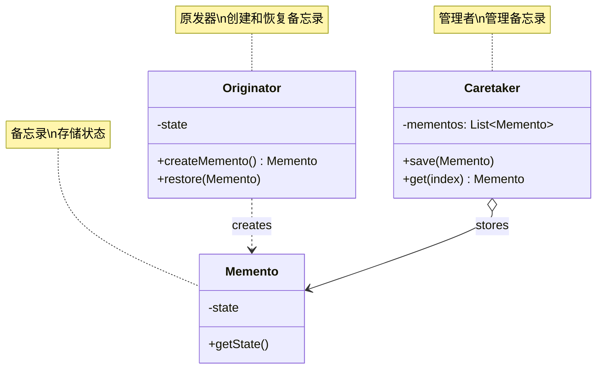
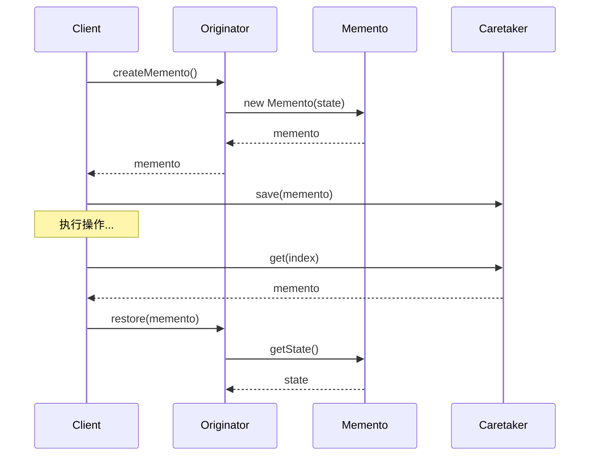

# 备忘录模式 (Memento Pattern)

## 模式定义

**备忘录模式**是一种行为型设计模式，它在不破坏封装性的前提下，捕获一个对象的内部状态，并在该对象之外保存这个状态，以便以后可以将该对象恢复到原先保存的状态。



## 问题分析

当需要保存和恢复对象状态时，直接暴露内部状态会破坏封装：

```java
// ❌ 不好的做法：暴露内部状态
public class TextEditor {
    private String content;
    private String font;
    private int fontSize;

    // 暴露所有内部状态
    public String getContent() { return content; }
    public String getFont() { return font; }
    public int getFontSize() { return fontSize; }

    // 客户端需要知道所有细节
    public void setContent(String content) { this.content = content; }
    public void setFont(String font) { this.font = font; }
    public void setFontSize(int fontSize) { this.fontSize = fontSize; }
}

// 客户端代码：需要手动保存所有状态
String savedContent = editor.getContent();
String savedFont = editor.getFont();
int savedFontSize = editor.getFontSize();
// 恢复时也要手动恢复每个字段...
```

**问题**：

- ❌ 破坏对象封装性
- ❌ 客户端需要了解内部细节
- ❌ 状态保存和恢复代码分散
- ❌ 难以维护

> [!WARNING] > **封装性陷阱**：如果对象有私有字段，就无法在外部保存状态！即使用 getter/setter，也暴露了太多细节。

## 解决方案

使用 Memento 对象封装状态：



> [!IMPORTANT] > **备忘录模式的核心**：
>
> - Memento 只保存状态，不包含业务逻辑
> - Originator 创建和恢复 Memento
> - Caretaker 只负责保存 Memento
> - 不破坏 Originator 的封装性

## 代码实现

### 场景：文本编辑器撤销/重做

#### 1. 备忘录类（Memento）

```java
import java.time.LocalDateTime;
import java.time.format.DateTimeFormatter;

/**
 * 编辑器备忘录（Memento）
 * 保存编辑器状态的快照
 */
public class EditorMemento {
    private final String content;
    private final int cursorPosition;
    private final LocalDateTime timestamp;

    public EditorMemento(String content, int cursorPosition) {
        this.content = content;
        this.cursorPosition = cursorPosition;
        this.timestamp = LocalDateTime.now();
    }

    public String getContent() {
        return content;
    }

    public int getCursorPosition() {
        return cursorPosition;
    }

    public String getTimestamp() {
        return timestamp.format(DateTimeFormatter.ofPattern(\"HH:mm:ss\"));
    }

    @Override
    public String toString() {
        return \"📝 [\" + getTimestamp() + \"] \\\"\" +
               (content.length() > 20 ? content.substring(0, 20) + \"...\" : content) + \"\\\"\";
    }
}
```

#### 2. 原发器类（Originator）

```java
/**
 * 文本编辑器（Originator）
 * 创建和恢复备忘录
 */
public class TextEditor {
    private String content = \"\";
    private int cursorPosition = 0;

    /**
     * 写入文本
     */
    public void write(String text) {
        String before = content;
        content += text;
        cursorPosition = content.length();
        System.out.println(\"✍️  写入: \\\"\" + text + \"\\\"\");
        System.out.println(\"📄 当前内容: \\\"\" + content + \"\\\"\");
    }

    /**
     * 删除文本
     */
    public void delete(int length) {
        if (length > 0 && length <= content.length()) {
            String deleted = content.substring(content.length() - length);
            content = content.substring(0, content.length() - length);
            cursorPosition = content.length();
            System.out.println(\"🗑️  删除: \\\"\" + deleted + \"\\\"\");
            System.out.println(\"📄 当前内容: \\\"\" + content + \"\\\"\");
        }
    }

    /**
     * 创建备忘录（保存状态）
     */
    public EditorMemento save() {
        System.out.println(\"💾 保存状态...\");
        return new EditorMemento(content, cursorPosition);
    }

    /**
     * 从备忘录恢复状态
     */
    public void restore(EditorMemento memento) {
        this.content = memento.getContent();
        this.cursorPosition = memento.getCursorPosition();
        System.out.println(\"↩️  恢复到: \" + memento);
        System.out.println(\"📄 当前内容: \\\"\" + content + \"\\\"\");
    }

    /**
     * 显示当前内容
     */
    public void display() {
        System.out.println(\"📄 当前内容: \\\"\" + content + \"\\\"\");
        System.out.println(\"📍 光标位置: \" + cursorPosition);
    }
}
```

#### 3. 管理者类（Caretaker）

```java
import java.util.Stack;

/**
 * 历史记录管理器（Caretaker）
 * 管理备忘录的保存和恢复
 */
public class EditorHistory {
    private Stack<EditorMemento> undoStack = new Stack<>();  // 撤销栈
    private Stack<EditorMemento> redoStack = new Stack<>();  // 重做栈
    private static final int MAX_HISTORY = 50;  // 限制历史记录数量

    /**
     * 保存状态
     */
    public void save(EditorMemento memento) {
        if (undoStack.size() >= MAX_HISTORY) {
            undoStack.remove(0);  // 移除最老的记录
        }
        undoStack.push(memento);
        redoStack.clear();  // 新操作清空重做栈
        System.out.println(\"📚 历史记录: \" + undoStack.size() + \" 个\");
    }

    /**
     * 撤销
     */
    public EditorMemento undo() {
        if (undoStack.isEmpty()) {
            System.out.println(\"❌ 没有可撤销的操作\");
            return null;
        }
        EditorMemento memento = undoStack.pop();
        redoStack.push(memento);
        return undoStack.isEmpty() ? null : undoStack.peek();
    }

    /**
     * 重做
     */
    public EditorMemento redo() {
        if (redoStack.isEmpty()) {
            System.out.println(\"❌ 没有可重做的操作\");
            return null;
        }
        EditorMemento memento = redoStack.pop();
        undoStack.push(memento);
        return memento;
    }

    /**
     * 显示历史记录
     */
    public void showHistory() {
        System.out.println(\"\\n📚 ========== 历史记录 ==========\");
        System.out.println(\"撤销栈 (\" + undoStack.size() + \"):\");
        for (int i = undoStack.size() - 1; i >= 0; i--) {
            System.out.println(\"  \" + (i + 1) + \". \" + undoStack.get(i));
        }
        System.out.println(\"重做栈 (\" + redoStack.size() + \"):\");
        for (int i = redoStack.size() - 1; i >= 0; i--) {
            System.out.println(\"  \" + (i + 1) + \". \" + redoStack.get(i));
        }
        System.out.println(\"================================\\n\");
    }
}
```

#### 4. 客户端使用

```java
/**
 * 备忘录模式演示
 */
public class MementoPatternDemo {
    public static void main(String[] args) {
        System.out.println(\"========== 文本编辑器演示 ==========\\n\");

        TextEditor editor = new TextEditor();
        EditorHistory history = new EditorHistory();

        // 操作1：写入
        editor.write(\"Hello\");
        history.save(editor.save());

        // 操作2：写入
        System.out.println();
        editor.write(\" World\");
        history.save(editor.save());

        // 操作3：写入
        System.out.println();
        editor.write(\"!\");
        history.save(editor.save());

        // 显示历史记录
        history.showHistory();

        // 撤销操作
        System.out.println(\"========== 撤销操作 ==========\\n\");
        EditorMemento memento = history.undo();
        if (memento != null) {
            editor.restore(memento);
        }

        System.out.println();
        memento = history.undo();
        if (memento != null) {
            editor.restore(memento);
        }

        // 重做操作
        System.out.println(\"\\n========== 重做操作 ==========\\n\");
        memento = history.redo();
        if (memento != null) {
            editor.restore(memento);
        }

        // 新操作会清空重做栈
        System.out.println(\"\\n========== 新操作 ==========\\n\");
        editor.write(\" Java\");
        history.save(editor.save());

        // 尝试重做（应该失败）
        System.out.println();
        history.redo();
    }
}
```

**输出：**

```
========== 文本编辑器演示 ==========

✍️  写入: \"Hello\"
📄 当前内容: \"Hello\"
💾 保存状态...
📚 历史记录: 1 个

✍️  写入: \" World\"
📄 当前内容: \"Hello World\"
💾 保存状态...
📚 历史记录: 2 个

✍️  写入: \"!\"
📄 当前内容: \"Hello World!\"
💾 保存状态...
📚 历史记录: 3 个

📚 ========== 历史记录 ==========
撤销栈 (3):
  3. 📝 [14:45:23] \"Hello World!\"
  2. 📝 [14:45:23] \"Hello World\"
  1. 📝 [14:45:23] \"Hello\"
重做栈 (0):
================================

========== 撤销操作 ==========

↩️  恢复到: 📝 [14:45:23] \"Hello World\"
📄 当前内容: \"Hello World\"

↩️  恢复到: 📝 [14:45:23] \"Hello\"
📄 当前内容: \"Hello\"

========== 重做操作 ==========

↩️  恢复到: 📝 [14:45:23] \"Hello World\"
📄 当前内容: \"Hello World\"

========== 新操作 ==========

✍️  写入: \" Java\"
📄 当前内容: \"Hello World Java\"
💾 保存状态...
📚 历史记录: 3 个

❌ 没有可重做的操作
```

> [!TIP] > **备忘录模式的优势**：TextEditor 的内部状态完全封装，客户端不需要知道任何细节，只需保存和恢复 Memento 即可！

## 实际应用示例

### 示例 1：游戏存档

```java
/**
 * 游戏状态备忘录
 */
public class GameMemento {
    private final int level;
    private final int score;
    private final int health;
    private final Map<String, Integer> inventory;
    private final LocalDateTime saveTime;

    public GameMemento(int level, int score, int health, Map<String, Integer> inventory) {
        this.level = level;
        this.score = score;
        this.health = health;
        this.inventory = new HashMap<>(inventory);  // 深拷贝
        this.saveTime = LocalDateTime.now();
    }

    public int getLevel() { return level; }
    public int getScore() { return score; }
    public int getHealth() { return health; }
    public Map<String, Integer> getInventory() { return new HashMap<>(inventory); }
    public LocalDateTime getSaveTime() { return saveTime; }
}

/**
 * 游戏
 */
public class Game {
    private int level = 1;
    private int score = 0;
    private int health = 100;
    private Map<String, Integer> inventory = new HashMap<>();

    public void play() {
        level++;
        score += 100;
        System.out.println(\"🎮 通关第 \" + level + \" 关，得分: \" + score);
    }

    public void damage(int amount) {
        health -= amount;
        System.out.println(\"💔 受到伤害，生命值: \" + health);
    }

    public void addItem(String item, int count) {
        inventory.put(item, inventory.getOrDefault(item, 0) + count);
        System.out.println(\"📦 获得物品: \" + item + \" x\" + count);
    }

    /**
     * 创建存档
     */
    public GameMemento save() {
        System.out.println(\"💾 游戏已保存\");
        return new GameMemento(level, score, health, inventory);
    }

    /**
     * 加载存档
     */
    public void load(GameMemento memento) {
        this.level = memento.getLevel();
        this.score = memento.getScore();
        this.health = memento.getHealth();
        this.inventory = memento.getInventory();
        System.out.println(\"📂 加载存档: 等级 \" + level + \", 分数 \" + score + \", 生命 \" + health);
    }
}

/**
 * 存档管理器
 */
public class SaveManager {
    private List<GameMemento> saves = new ArrayList<>();

    public void save(GameMemento memento) {
        saves.add(memento);
        System.out.println(\"✅ 存档 #\" + saves.size() + \" 已保存\");
    }

    public GameMemento load(int index) {
        if (index >= 0 && index < saves.size()) {
            return saves.get(index);
        }
        return null;
    }
}
```

### 示例 2：数据库事务

```java
/**
 * 事务备忘录
 */
public class TransactionMemento {
    private final Map<String, Object> snapshot;

    public TransactionMemento(Map<String, Object> data) {
        this.snapshot = new HashMap<>(data);
    }

    public Map<String, Object> getSnapshot() {
        return new HashMap<>(snapshot);
    }
}

/**
 * 数据库表
 */
public class DatabaseTable {
    private Map<String, Object> data = new HashMap<>();

    public void insert(String key, Object value) {
        data.put(key, value);
        System.out.println(\"✅ 插入: \" + key + \" = \" + value);
    }

    public void update(String key, Object value) {
        data.put(key, value);
        System.out.println(\"✏️  更新: \" + key + \" = \" + value);
    }

    public void delete(String key) {
        data.remove(key);
        System.out.println(\"🗑️  删除: \" + key);
    }

    /**
     * 开始事务（创建快照）
     */
    public TransactionMemento beginTransaction() {
        System.out.println(\"🔄 开始事务\");
        return new TransactionMemento(data);
    }

    /**
     * 回滚事务
     */
    public void rollback(TransactionMemento memento) {
        this.data = memento.getSnapshot();
        System.out.println(\"↩️  事务回滚\");
    }

    /**
     * 提交事务
     */
    public void commit() {
        System.out.println(\"✅ 事务提交\");
    }
}
```

## Java 标准库中的应用

### 1. Serializable

```java
/**
 * 使用序列化保存对象状态
 */
public class SerializableMemento implements Serializable {
    // 序列化就是一种备忘录
    private void writeObject(ObjectOutputStream out) throws IOException {
        out.defaultWriteObject();
    }

    private void readObject(ObjectInputStream in)
        throws IOException, ClassNotFoundException {
        in.defaultReadObject();
    }
}
```

### 2. Cloneable

```java
/**
 * 使用克隆创建备忘录
 */
public class CloneableOriginator implements Cloneable {
    private String state;

    @Override
    public CloneableOriginator clone() {
        try {
            return (CloneableOriginator) super.clone();
        } catch (CloneNotSupportedException e) {
            throw new AssertionError();
        }
    }
}
```

## 优缺点

### 优点

- ✅ **保护封装** - 不破坏对象封装性
- ✅ **简化原发器** - 状态管理委托给 Caretaker
- ✅ **支持撤销** - 轻松实现 undo/redo
- ✅ **符合单一职责** - 状态保存独立

### 缺点

- ❌ **内存开销** - 保存多个备忘录占用内存
- ❌ **性能问题** - 创建备忘录可能耗时
- ❌ **管理复杂** - 需要管理备忘录生命周期

## 适用场景

### 何时使用备忘录模式

- ✓ **需要保存/恢复状态** - 对象状态需要回滚
- ✓ **不能破坏封装** - 外部不应访问内部状态
- ✓ **实现撤销/重做** - 编辑器、游戏等
- ✓ **实现检查点** - 长时间操作的中间保存

### 实际应用场景

- 📝 **编辑器** - 文本编辑器、图形编辑器
- 🎮 **游戏** - 游戏存档、关卡回退
- 💾 **数据库** - 事务回滚
- 🔄 **工作流** - 流程回退
- 📸 **快照** - 系统快照、版本控制

## 最佳实践

### 1. 限制历史记录数量

```java
/**
 * 限制备忘录数量，防止内存溢出
 */
public class LimitedHistory {
    private Deque<Memento> history = new LinkedList<>();
    private static final int MAX_SIZE = 100;

    public void save(Memento memento) {
        if (history.size() >= MAX_SIZE) {
            history.removeFirst();  // 移除最老的
        }
        history.addLast(memento);
    }
}
```

### 2. 使用原型模式

```java
/**
 * 结合原型模式创建备忘录
 */
public class PrototypeOriginator implements Cloneable {
    public Memento save() {
        return new Memento(this.clone());
    }
}
```

### 3. 增量备忘录

```java
/**
 * 只保存变化部分，节省内存
 */
public class IncrementalMemento {
    private Map<String, Object> changes = new HashMap<>();  // 只保存变化

    public void recordChange(String field, Object value) {
        changes.put(field, value);
    }
}
```

### 4. 压缩备忘录

```java
/**
 * 压缩备忘录，减少内存占用
 */
public class CompressedMemento {
    private byte[] compressedState;

    public CompressedMemento(Object state) {
        // 序列化并压缩
        this.compressedState = compress(serialize(state));
    }

    private byte[] compress(byte[] data) {
        // 使用GZIP等压缩
        return data;
    }
}
```

## 与其他模式的关系

- **备忘录 + 命令** - 命令保存状态用于撤销
- **备忘录 + 迭代器** - 遍历备忘录历史
- **备忘录 + 原型** - 克隆创建备忘录

## 总结

备忘录模式是实现状态保存和恢复的有效方案：

- **核心思想** - 用 Memento 封装状态快照
- **关键优势** - 保护封装、支持撤销
- **主要缺点** - 内存和性能开销
- **经典应用** - 编辑器撤销、游戏存档
- **适用场景** - 需要保存和恢复对象状态

> [!TIP] > **备忘录模式的精髓**：
>
> - **封装状态** - Memento 保存状态快照
> - **保护封装** - 不暴露 Originator 内部结构
> - **分离职责** - Caretaker 管理备忘录
> - **优化内存** - 限制数量、增量保存、压缩

**已完成：21 个文档** ✅

继续完成最后 2 个...
