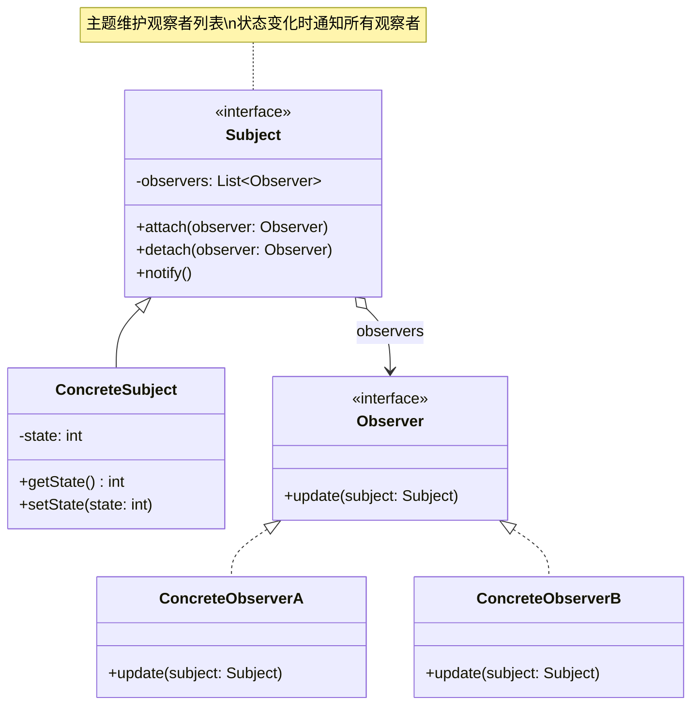
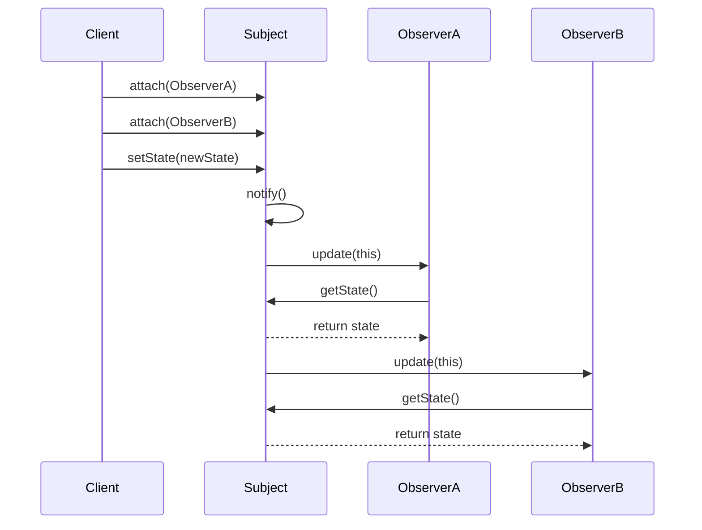
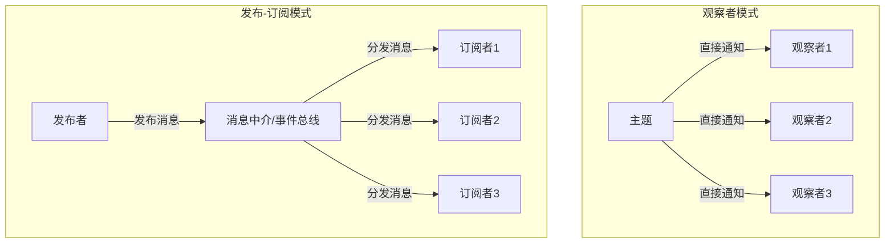

# 观察者模式 (Observer Pattern)

## 模式定义

**观察者模式**（也称发布-订阅模式）是一种行为型设计模式，它定义了一种一对多的依赖关系，当一个对象的状态发生改变时，所有依赖于它的对象都会得到通知并自动更新。



## 问题分析

在许多应用中，需要在某个对象的状态改变时，通知多个其他对象：

- ❌ 对象间紧耦合
- ❌ 一个改变需要手动通知多个对象
- ❌ 难以动态添加或删除监听者
- ❌ 违反开闭原则

**常见场景：**

- 📱 事件驱动编程
- 🎨 MVC 架构中 Model 的变化通知 View
- 📨 消息订阅系统
- 🔔 实时通知系统
- 📊 数据绑定

> [!NOTE]
> 观察者模式实现了对象间的低耦合，主题和观察者可以独立变化和复用。

## 解决方案



## 代码实现

### 1. 定义观察者接口

```java
/**
 * 观察者接口
 * 所有观察者必须实现此接口来接收通知
 */
public interface Observer {
    /**
     * 更新方法，当主题状态改变时被调用
     * @param subject 发生变化的主题对象
     */
    void update(Subject subject);
}
```

### 2. 定义主题类

```java
import java.util.ArrayList;
import java.util.List;

/**
 * 主题类（被观察者）
 * 维护观察者列表，并在状态改变时通知它们
 */
public class Subject {
    // 观察者列表
    private List<Observer> observers = new ArrayList<>();
    // 主题的状态
    private int state;

    /**
     * 注册观察者
     */
    public void attach(Observer observer) {
        if (!observers.contains(observer)) {
            observers.add(observer);
            System.out.println("观察者已注册");
        }
    }

    /**
     * 移除观察者
     */
    public void detach(Observer observer) {
        if (observers.remove(observer)) {
            System.out.println("观察者已移除");
        }
    }

    /**
     * 通知所有观察者
     * 遍历观察者列表，调用每个观察者的 update 方法
     */
    private void notifyObservers() {
        System.out.println("通知 " + observers.size() + " 个观察者");
        for (Observer observer : observers) {
            observer.update(this);
        }
    }

    /**
     * 设置状态
     * 状态改变时自动通知所有观察者
     */
    public void setState(int state) {
        if (this.state != state) {
            System.out.println("状态改变: " + this.state + " -> " + state);
            this.state = state;
            notifyObservers();
        }
    }

    /**
     * 获取状态
     */
    public int getState() {
        return state;
    }
}
```

> [!IMPORTANT] > **推模型 vs 拉模型**：
>
> - **推模型**：主题向观察者推送详细信息 `update(int state)`
> - **拉模型**：主题只通知变化，观察者自己拉取信息 `update(Subject subject)`
>
> 上面的实现采用拉模型，更灵活，观察者可以按需获取信息。

### 3. 具体观察者实现

```java
/**
 * 具体观察者 A
 * 当状态小于 10 时做出响应
 */
public class ConcreteObserverA implements Observer {
    private String name = "ObserverA";

    @Override
    public void update(Subject subject) {
        int state = subject.getState();
        if (state < 10) {
            System.out.println(name + " 收到通知: 状态=" + state + " (小于10，需要处理)");
            // 执行相应的业务逻辑
        }
    }
}

/**
 * 具体观察者 B
 * 当状态大于等于 10 时做出响应
 */
public class ConcreteObserverB implements Observer {
    private String name = "ObserverB";

    @Override
    public void update(Subject subject) {
        int state = subject.getState();
        if (state >= 10) {
            System.out.println(name + " 收到通知: 状态=" + state + " (大于等于10，需要处理)");
            // 执行相应的业务逻辑
        }
    }
}

/**
 * 具体观察者 C
 * 记录所有状态变化
 */
public class ConcreteObserverC implements Observer {
    private String name = "ObserverC";

    @Override
    public void update(Subject subject) {
        int state = subject.getState();
        System.out.println(name + " 记录日志: 状态变化为 " + state);
    }
}
```

### 4. 客户端使用

```java
/**
 * 客户端演示
 */
public class Demo {
    public static void main(String[] args) {
        // 创建主题
        Subject subject = new Subject();

        // 创建观察者
        Observer observerA = new ConcreteObserverA();
        Observer observerB = new ConcreteObserverB();
        Observer observerC = new ConcreteObserverC();

        // 注册观察者
        subject.attach(observerA);
        subject.attach(observerB);
        subject.attach(observerC);

        System.out.println("\n=== 设置状态为 5 ===");
        subject.setState(5);   // 触发 observerA 和 observerC

        System.out.println("\n=== 设置状态为 15 ===");
        subject.setState(15);  // 触发 observerB 和 observerC

        System.out.println("\n=== 移除观察者 A ===");
        subject.detach(observerA);

        System.out.println("\n=== 设置状态为 8 ===");
        subject.setState(8);   // 只触发 observerC（observerA 已移除）
    }
}
```

**输出：**

```
观察者已注册
观察者已注册
观察者已注册

=== 设置状态为 5 ===
状态改变: 0 -> 5
通知 3 个观察者
ObserverA 收到通知: 状态=5 (小于10，需要处理)
ObserverC 记录日志: 状态变化为 5

=== 设置状态为 15 ===
状态改变: 5 -> 15
通知 3 个观察者
ObserverB 收到通知: 状态=15 (大于等于10，需要处理)
ObserverC 记录日志: 状态变化为 15

=== 移除观察者 A ===
观察者已移除

=== 设置状态为 8 ===
状态改变: 15 -> 8
通知 2 个观察者
ObserverC 记录日志: 状态变化为 8
```

## 实际应用示例

### 示例 1：事件发布订阅系统

```java
/**
 * 事件监听器接口
 */
public interface EventListener {
    void onEvent(String eventType, Object data);
}

/**
 * 事件管理器（主题）
 * 支持针对不同事件类型订阅
 */
public class EventManager {
    // 每种事件类型维护一个监听器列表
    private Map<String, List<EventListener>> listeners = new HashMap<>();

    /**
     * 订阅事件
     */
    public void subscribe(String eventType, EventListener listener) {
        listeners.computeIfAbsent(eventType, k -> new ArrayList<>()).add(listener);
        System.out.println("订阅事件: " + eventType);
    }

    /**
     * 取消订阅
     */
    public void unsubscribe(String eventType, EventListener listener) {
        List<EventListener> eventListeners = listeners.get(eventType);
        if (eventListeners != null) {
            eventListeners.remove(listener);
        }
    }

    /**
     * 发布事件
     * 通知所有订阅了该事件类型的监听器
     */
    public void notify(String eventType, Object data) {
        List<EventListener> eventListeners = listeners.get(eventType);
        if (eventListeners != null) {
            System.out.println("发布事件: " + eventType);
            for (EventListener listener : eventListeners) {
                listener.onEvent(eventType, data);
            }
        }
    }
}

/**
 * 邮件通知监听器
 */
public class EmailNotificationListener implements EventListener {
    private String email;

    public EmailNotificationListener(String email) {
        this.email = email;
    }

    @Override
    public void onEvent(String eventType, Object data) {
        System.out.println("发送邮件到 " + email + ": " + eventType + " - " + data);
    }
}

/**
 * 短信通知监听器
 */
public class SMSNotificationListener implements EventListener {
    private String phoneNumber;

    public SMSNotificationListener(String phoneNumber) {
        this.phoneNumber = phoneNumber;
    }

    @Override
    public void onEvent(String eventType, Object data) {
        System.out.println("发送短信到 " + phoneNumber + ": " + eventType + " - " + data);
    }
}

/**
 * 日志记录监听器
 */
public class LoggingListener implements EventListener {
    @Override
    public void onEvent(String eventType, Object data) {
        System.out.println("[LOG] 事件: " + eventType + ", 数据: " + data);
    }
}

// 使用示例
class EventSystemDemo {
    public static void main(String[] args) {
        EventManager eventManager = new EventManager();

        // 订阅用户注册事件
        eventManager.subscribe("USER_REGISTERED",
            new EmailNotificationListener("admin@example.com"));
        eventManager.subscribe("USER_REGISTERED",
            new SMSNotificationListener("138****8888"));

        // 订阅订单创建事件
        eventManager.subscribe("ORDER_CREATED",
            new EmailNotificationListener("sales@example.com"));
        eventManager.subscribe("ORDER_CREATED",
            new LoggingListener());

        // 发布事件
        eventManager.notify("USER_REGISTERED", "用户: 张三");
        System.out.println();
        eventManager.notify("ORDER_CREATED", "订单号: 12345");
    }
}
```

### 示例 2：股票价格监控系统

```java
/**
 * 股票观察者接口
 */
public interface StockObserver {
    void priceChanged(String stockCode, double oldPrice, double newPrice);
}

/**
 * 股票市场（主题）
 */
public class StockMarket {
    // 股票代码 -> 价格
    private Map<String, Double> prices = new HashMap<>();
    // 股票代码 -> 观察者列表
    private Map<String, List<StockObserver>> observers = new HashMap<>();

    /**
     * 订阅股票
     */
    public void subscribe(String stockCode, StockObserver observer) {
        observers.computeIfAbsent(stockCode, k -> new ArrayList<>()).add(observer);
        System.out.println("订阅股票: " + stockCode);
    }

    /**
     * 取消订阅
     */
    public void unsubscribe(String stockCode, StockObserver observer) {
        List<StockObserver> stockObservers = observers.get(stockCode);
        if (stockObservers != null) {
            stockObservers.remove(observer);
        }
    }

    /**
     * 更新股票价格
     */
    public void updatePrice(String stockCode, double newPrice) {
        Double oldPrice = prices.getOrDefault(stockCode, 0.0);
        prices.put(stockCode, newPrice);

        // 通知订阅了该股票的所有观察者
        List<StockObserver> stockObservers = observers.get(stockCode);
        if (stockObservers != null) {
            for (StockObserver observer : stockObservers) {
                observer.priceChanged(stockCode, oldPrice, newPrice);
            }
        }
    }

    /**
     * 获取当前价格
     */
    public double getPrice(String stockCode) {
        return prices.getOrDefault(stockCode, 0.0);
    }
}

/**
 * 投资者（观察者）
 */
public class Investor implements StockObserver {
    private String name;
    private double buyThreshold;   // 买入阈值
    private double sellThreshold;  // 卖出阈值

    public Investor(String name, double buyThreshold, double sellThreshold) {
        this.name = name;
        this.buyThreshold = buyThreshold;
        this.sellThreshold = sellThreshold;
    }

    @Override
    public void priceChanged(String stockCode, double oldPrice, double newPrice) {
        System.out.println(name + " 收到通知: " + stockCode +
            " 价格变化 " + oldPrice + " -> " + newPrice);

        if (newPrice < buyThreshold) {
            System.out.println("  -> " + name + " 决定买入!");
        } else if (newPrice > sellThreshold) {
            System.out.println("  -> " + name + " 决定卖出!");
        }
    }
}

/**
 * 价格预警系统（观察者）
 */
public class PriceAlert implements StockObserver {
    private double alertThreshold;

    public PriceAlert(double alertThreshold) {
        this.alertThreshold = alertThreshold;
    }

    @Override
    public void priceChanged(String stockCode, double oldPrice, double newPrice) {
        double changePercent = Math.abs((newPrice - oldPrice) / oldPrice * 100);
        if (changePercent > alertThreshold) {
            System.out.println("⚠️ 价格预警: " + stockCode +
                " 波动 " + String.format("%.2f%%", changePercent));
        }
    }
}

// 使用示例
class StockMarketDemo {
    public static void main(String[] args) {
        StockMarket market = new StockMarket();

        // 创建观察者
        Investor investor1 = new Investor("张三", 90, 110);
        Investor investor2 = new Investor("李四", 85, 115);
        PriceAlert alert = new PriceAlert(5.0); // 5% 波动预警

        // 订阅股票
        market.subscribe("AAPL", investor1);
        market.subscribe("AAPL", investor2);
        market.subscribe("AAPL", alert);

        // 更新价格
        System.out.println("\n=== 价格更新 ===");
        market.updatePrice("AAPL", 100.0);
        market.updatePrice("AAPL", 88.0);
        market.updatePrice("AAPL", 112.0);
    }
}
```

### 示例 3：GUI 按钮点击事件

```java
/**
 * 按钮点击监听器
 */
public interface ClickListener {
    void onClick(Button button);
}

/**
 * 按钮类（主题）
 */
public class Button {
    private String label;
    private List<ClickListener> listeners = new ArrayList<>();

    public Button(String label) {
        this.label = label;
    }

    /**
     * 添加点击监听器
     */
    public void addClickListener(ClickListener listener) {
        listeners.add(listener);
    }

    /**
     * 移除点击监听器
     */
    public void removeClickListener(ClickListener listener) {
        listeners.remove(listener);
    }

    /**
     * 模拟按钮被点击
     */
    public void click() {
        System.out.println("按钮 [" + label + "] 被点击");
        // 通知所有监听器
        for (ClickListener listener : listeners) {
            listener.onClick(this);
        }
    }

    public String getLabel() {
        return label;
    }
}

// 使用示例 - Lambda 表达式简化观察者
class GUIDemo {
    public static void main(String[] args) {
        Button saveButton = new Button("保存");
        Button cancelButton = new Button("取消");

        // 使用 Lambda 表达式创建观察者
        saveButton.addClickListener(btn -> {
            System.out.println("  -> 执行保存操作");
        });

        saveButton.addClickListener(btn -> {
            System.out.println("  -> 记录保存日志");
        });

        cancelButton.addClickListener(btn -> {
            System.out.println("  -> 取消操作");
        });

        // 模拟点击
        saveButton.click();
        System.out.println();
        cancelButton.click();
    }
}
```

> [!TIP] > **Java 8+ 的简化**：使用 Lambda 表达式和函数式接口可以大大简化观察者模式的实现，无需创建大量的观察者类。

## Java 标准库中的应用

### 1. Java Swing 事件监听

```java
import javax.swing.*;
import java.awt.event.ActionEvent;
import java.awt.event.ActionListener;

/**
 * Swing 中的观察者模式
 */
public class SwingObserverExample {
    public static void main(String[] args) {
        JFrame frame = new JFrame("观察者模式示例");
        JButton button = new JButton("点击我");

        // 添加多个监听器（观察者）
        button.addActionListener(new ActionListener() {
            @Override
            public void actionPerformed(ActionEvent e) {
                System.out.println("监听器1: 按钮被点击");
            }
        });

        button.addActionListener(e -> {
            System.out.println("监听器2: 记录点击日志");
        });

        frame.add(button);
        frame.setSize(300, 200);
        frame.setDefaultCloseOperation(JFrame.EXIT_ON_CLOSE);
        frame.setVisible(true);
    }
}
```

### 2. JavaBeans PropertyChangeListener

```java
import java.beans.PropertyChangeListener;
import java.beans.PropertyChangeSupport;

/**
 * JavaBeans 属性变化监听
 */
public class Person {
    private String name;
    private int age;
    private PropertyChangeSupport support = new PropertyChangeSupport(this);

    public void addPropertyChangeListener(PropertyChangeListener listener) {
        support.addPropertyChangeListener(listener);
    }

    public void removePropertyChangeListener(PropertyChangeListener listener) {
        support.removePropertyChangeListener(listener);
    }

    public void setName(String name) {
        String oldName = this.name;
        this.name = name;
        support.firePropertyChange("name", oldName, name);
    }

    public void setAge(int age) {
        int oldAge = this.age;
        this.age = age;
        support.firePropertyChange("age", oldAge, age);
    }
}

// 使用
class PropertyChangeDemo {
    public static void main(String[] args) {
        Person person = new Person();

        person.addPropertyChangeListener(evt -> {
            System.out.println("属性 " + evt.getPropertyName() +
                " 从 " + evt.getOldValue() + " 变为 " + evt.getNewValue());
        });

        person.setName("张三");
        person.setAge(25);
    }
}
```

### 3. java.util.Observer (已过时 ⚠️)

```java
import java.util.Observable;
import java.util.Observer;

/**
 * Java 内置的 Observer 和 Observable（已过时，不推荐使用）
 */
@Deprecated
public class WeatherData extends Observable {
    private float temperature;

    public void setTemperature(float temperature) {
        this.temperature = temperature;
        setChanged();  // 标记状态已改变
        notifyObservers(temperature);  // 通知观察者
    }
}
```

> [!WARNING] > **java.util.Observer 和 Observable 已在 Java 9 中标记为过时**，不推荐使用。原因：
>
> - Observable 是类而非接口，限制了灵活性
> - 不是线程安全的
> - setChanged() 方法 protected，使用不便
>
> **推荐替代方案**：
>
> - 使用 PropertyChangeListener
> - 使用现代响应式编程库（RxJava、Project Reactor）
> - 自己实现观察者接口

## Spring 框架中的应用

```java
import org.springframework.context.ApplicationEvent;
import org.springframework.context.ApplicationListener;
import org.springframework.context.event.EventListener;
import org.springframework.stereotype.Component;

/**
 * Spring 事件机制
 */
// 自定义事件
public class OrderCreatedEvent extends ApplicationEvent {
    private String orderId;

    public OrderCreatedEvent(Object source, String orderId) {
        super(source);
        this.orderId = orderId;
    }

    public String getOrderId() {
        return orderId;
    }
}

// 事件监听器方式1：实现接口
@Component
public class OrderCreatedListener implements ApplicationListener<OrderCreatedEvent> {
    @Override
    public void onApplicationEvent(OrderCreatedEvent event) {
        System.out.println("订单创建监听器: " + event.getOrderId());
    }
}

// 事件监听器方式2：使用注解（推荐）
@Component
public class EmailService {

    @EventListener
    public void handleOrderCreated(OrderCreatedEvent event) {
        System.out.println("发送邮件通知: 订单" + event.getOrderId() + "已创建");
    }
}

// 发布事件
@Service
public class OrderService {
    @Autowired
    private ApplicationEventPublisher eventPublisher;

    public void createOrder(String orderId) {
        // 创建订单逻辑
        System.out.println("创建订单: " + orderId);

        // 发布事件
        eventPublisher.publishEvent(new OrderCreatedEvent(this, orderId));
    }
}
```

> [!TIP] > **Spring 事件的优势**：
>
> - 解耦业务逻辑
> - 支持异步处理（@Async）
> - 支持事件继承和泛型
> - 自动管理监听器生命周期

## 观察者模式 vs 发布-订阅模式



| 特性         | 观察者模式             | 发布-订阅模式      |
| ------------ | ---------------------- | ------------------ |
| **耦合度**   | 中等（主题知道观察者） | 低（通过中介解耦） |
| **通信方式** | 直接通知               | 通过消息中介       |
| **灵活性**   | 较低                   | 较高               |
| **复杂度**   | 简单                   | 复杂               |
| **适用场景** | 简单的事件通知         | 复杂的消息系统     |
| **典型应用** | GUI 事件、JavaBeans    | 消息队列、事件总线 |

## 优缺点

### 优点

- ✅ **低耦合** - 主题和观察者松耦合，可独立变化
- ✅ **动态订阅** - 可在运行时动态添加/删除观察者
- ✅ **一对多通信** - 一个主题可通知多个观察者
- ✅ **符合开闭原则** - 新增观察者无需修改主题代码
- ✅ **广播通信** - 主题不需要知道观察者的具体细节

### 缺点

- ❌ **性能问题** - 观察者过多时通知耗时
- ❌ **无法保证顺序** - 通知顺序不确定
- ❌ **内存泄漏风险** - 忘记取消订阅可能导致内存泄漏
- ❌ **调试困难** - 间接调用使得程序流程不直观
- ❌ **可能造成循环依赖** - 观察者和主题相互依赖

> [!CAUTION] > **内存泄漏风险**：观察者注册后如果不取消订阅，即使不再使用也不会被垃圾回收。在 Android 开发中尤其要注意，Activity 销毁时必须取消所有订阅。

## 适用场景

### 何时使用观察者模式

- ✓ **事件驱动系统** - GUI 事件、消息通知
- ✓ **MVC 架构** - Model 变化通知 View 更新
- ✓ **模型与视图分离** - 数据模型和展示层解耦
- ✓ **消息发布订阅** - 事件总线、消息队列
- ✓ **实时通知** - 股票行情、聊天应用
- ✓ **数据绑定** - Vue、React 的响应式数据

### 实际应用场景

- 📱 **GUI 框架** - Swing、JavaFX 的事件监听
- 🌐 **Web 框架** - Spring 事件机制
- 📊 **数据绑定** - Angular/Vue/React 响应式
- 📨 **消息系统** - Event Bus、Message Queue
- 📈 **实时数据** - 股票行情、体育比分
- 🎮 **游戏开发** - 游戏事件系统

## 最佳实践

### 1. 防止内存泄漏

```java
/**
 * 使用弱引用防止内存泄漏
 */
public class SafeSubject {
    private List<WeakReference<Observer>> observers = new ArrayList<>();

    public void attach(Observer observer) {
        observers.add(new WeakReference<>(observer));
    }

    private void notifyObservers() {
        // 清理已失效的弱引用
        observers.removeIf(ref -> ref.get() == null);

        for (WeakReference<Observer> ref : new ArrayList<>(observers)) {
            Observer observer = ref.get();
            if (observer != null) {
                observer.update(this);
            }
        }
    }
}
```

### 2. 异步通知

```java
import java.util.concurrent.ExecutorService;
import java.util.concurrent.Executors;

/**
 * 异步通知观察者
 * 避免阻塞主线程
 */
public class AsyncSubject {
    private List<Observer> observers = new ArrayList<>();
    private ExecutorService executor = Executors.newCachedThreadPool();

    private void notifyObservers() {
        for (Observer observer : new ArrayList<>(observers)) {
            // 在线程池中异步执行
            executor.submit(() -> {
                try {
                    observer.update(this);
                } catch (Exception e) {
                    System.err.println("观察者更新失败: " + e.getMessage());
                }
            });
        }
    }
}
```

### 3. 异常处理

```java
/**
 * 异常隔离：单个观察者异常不影响其他观察者
 */
private void notifyObservers() {
    for (Observer observer : new ArrayList<>(observers)) {
        try {
            observer.update(this);
        } catch (Exception e) {
            // 记录日志，但不中断其他观察者的通知
            System.err.println("观察者更新异常: " + e.getMessage());
            e.printStackTrace();
        }
    }
}
```

### 4. 指定通知顺序

```java
/**
 * 使用优先级队列控制通知顺序
 */
public class PrioritySubject {
    private PriorityQueue<PriorityObserver> observers =
        new PriorityQueue<>(Comparator.comparingInt(PriorityObserver::getPriority));

    private void notifyObservers() {
        List<PriorityObserver> list = new ArrayList<>(observers);
        for (PriorityObserver observer : list) {
            observer.update(this);
        }
    }
}

interface PriorityObserver extends Observer {
    int getPriority(); // 优先级，数字越小优先级越高
}
```

### 5. 使用线程安全的集合

```java
/**
 * 线程安全的主题实现
 */
public class ThreadSafeSubject {
    private final List<Observer> observers =
        Collections.synchronizedList(new ArrayList<>());

    public synchronized void attach(Observer observer) {
        observers.add(observer);
    }

    public synchronized void detach(Observer observer) {
        observers.remove(observer);
    }

    private void notifyObservers() {
        synchronized (observers) {
            // 复制列表避免并发修改异常
            for (Observer observer : new ArrayList<>(observers)) {
                observer.update(this);
            }
        }
    }
}
```

## 与其他模式的关系

- **观察者 + 单例** - 主题通常是单例（如事件总线）
- **观察者 + 中介者** - 中介者可以作为观察者模式的主题
- **观察者 + 责任链** - 可以按链式顺序通知观察者
- **观察者 + 命令** - 将通知封装成命令对象

## 总结

观察者模式是一个非常实用的行为型模式：

- **核心思想** - 定义一对多依赖，自动通知状态变化
- **关键角色** - 主题（Subject）和观察者（Observer）
- **主要优势** - 低耦合、动态订阅、一对多通信
- **注意事项** - 内存泄漏、性能问题、异常处理
- **实际应用** - GUI 事件、Spring 事件、消息系统

> [!TIP]
> 在现代开发中，可以考虑使用响应式编程库（RxJava、Project Reactor）来实现更强大的观察者模式，它们提供了丰富的操作符和更好的错误处理机制。
