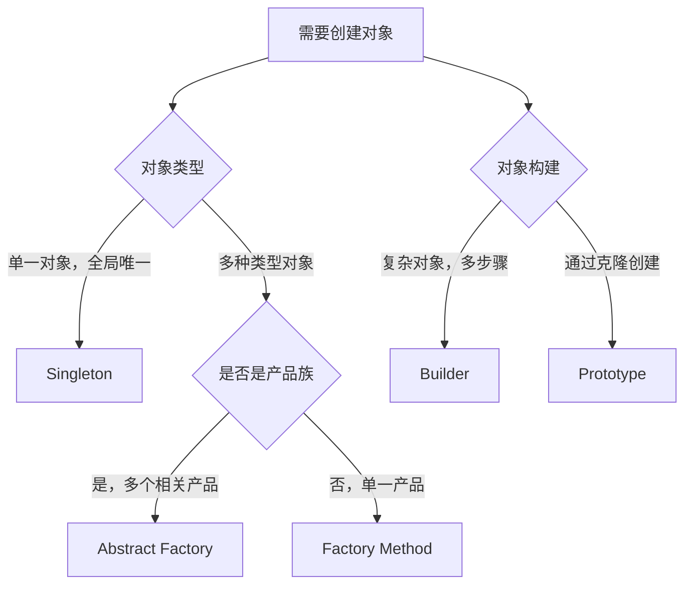
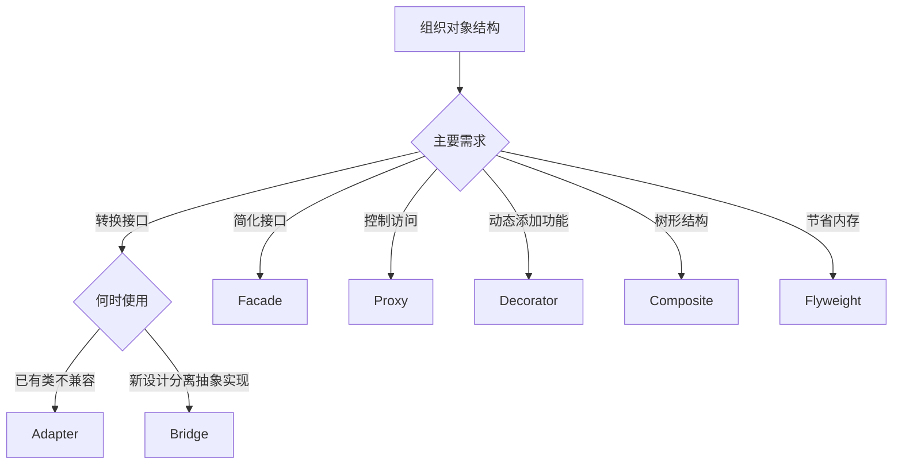
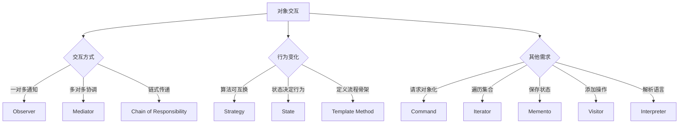

# 设计模式对比速查

本文档帮助你快速区分相似的设计模式，理解它们的核心差异，并做出正确的选择。

## 常见混淆模式对比

### Strategy vs State

这是最容易混淆的一对模式，因为它们的结构非常相似。

| 对比维度 | Strategy（策略模式） | State（状态模式） |
|---------|---------------------|------------------|
| **核心目的** | 定义可互换的算法族 | 对象根据状态改变行为 |
| **谁选择行为** | 客户端选择策略 | 对象自身根据状态自动切换 |
| **行为切换** | 外部切换，客户端控制 | 内部切换，状态自动转换 |
| **状态感知** | 策略之间独立，互不感知 | 状态之间相互了解，有转换逻辑 |
| **类的数量** | 多个策略类 | 多个状态类 |
| **使用场景** | 排序算法、支付方式选择 | 订单流程、TCP连接、游戏状态 |
| **调用示例** | `context.setStrategy(new StrategyA())` | 状态内部自动切换 `state.next()` |

**选择建议：**

- 如果行为由**客户端决定**，使用 Strategy
- 如果行为由**对象状态决定**且需要**自动转换**，使用 State

```java
// Strategy: 客户端选择算法
PaymentContext context = new PaymentContext();
context.setPaymentStrategy(new CreditCardPayment()); // 客户端选择
context.pay(100);

// State: 对象自己管理状态转换
Order order = new Order();
order.submit();    // 自动从 Draft -> Submitted
order.approve();   // 自动从 Submitted -> Approved
```

---

### Decorator vs Proxy

都是为对象提供一个包装，但目的不同。

| 对比维度 | Decorator（装饰器） | Proxy（代理） |
|---------|-------------------|--------------|
| **核心目的** | 动态添加新功能/职责 | 控制对象访问 |
| **关注点** | 功能增强 | 访问控制 |
| **可叠加性** | 可以多层装饰 | 通常单层代理 |
| **对象创建** | 装饰已存在的对象 | 代理通常控制对象的创建 |
| **是否改变接口** | 保持接口一致 | 可能简化接口 |
| **典型应用** | Java I/O流、UI组件增强 | 延迟加载、访问权限、远程代理 |

**选择建议：**

- 需要**动态添加功能**，使用 Decorator
- 需要**控制访问**（权限、延迟加载、远程访问），使用 Proxy

```java
// Decorator: 功能叠加
Coffee coffee = new SimpleCoffee();
coffee = new MilkDecorator(coffee);      // 加奶
coffee = new SugarDecorator(coffee);     // 加糖
coffee = new WhipDecorator(coffee);      // 加奶油

// Proxy: 访问控制
Image image = new ProxyImage("large_photo.jpg");  // 不立即加载
image.display();  // 第一次调用时才加载真实图片
```

---

### Factory Method vs Abstract Factory

都是创建对象，但规模不同。

| 对比维度 | Factory Method（工厂方法） | Abstract Factory（抽象工厂） |
|---------|--------------------------|----------------------------|
| **创建对象** | 单一产品 | 产品族（多个相关产品） |
| **复杂度** | 简单 | 复杂 |
| **工厂方法数量** | 一个工厂方法 | 多个工厂方法 |
| **产品关系** | 产品之间无关联 | 产品之间相互配套 |
| **扩展方式** | 新增工厂子类 | 新增工厂实现和产品族 |
| **典型场景** | 不同数据库连接 | 跨平台UI组件（Button+Checkbox一套） |

**选择建议：**

- 创建**单一类型**的产品，使用 Factory Method
- 创建**一系列相关**的产品，使用 Abstract Factory

```java
// Factory Method: 创建单一产品
DatabaseFactory factory = new MySQLFactory();
Connection conn = factory.createConnection();

// Abstract Factory: 创建产品族
UIFactory factory = new WindowsUIFactory();
Button button = factory.createButton();        // Windows按钮
Checkbox checkbox = factory.createCheckbox();  // Windows复选框 (配套)
```

---

### Adapter vs Bridge

都涉及接口转换，但意图不同。

| 对比维度 | Adapter（适配器） | Bridge（桥接） |
|---------|-----------------|---------------|
| **使用时机** | **事后补救**，接口不兼容 | **事前设计**，预防强耦合 |
| **目的** | 使已有类协同工作 | 分离抽象和实现 |
| **结构** | 包装已有接口 | 抽象和实现独立变化 |
| **典型场景** | 集成第三方库 | 跨平台实现（形状+渲染） |
| **类的数量** | 适配器类 | 抽象层+实现层 |

**选择建议：**

- **已有类**接口不兼容，使用 Adapter
- **新设计**中希望抽象和实现独立变化，使用 Bridge

```java
// Adapter: 适配已有类
LegacyRectangle legacy = new LegacyRectangle();
Shape shape = new RectangleAdapter(legacy);  // 适配到新接口

// Bridge: 分离抽象和实现
Shape circle = new Circle(new OpenGLRenderer());  // 圆形 + OpenGL渲染
Shape square = new Square(new DirectXRenderer()); // 方形 + DirectX渲染
```

---

### Composite vs Decorator

都使用递归结构，但用途不同。

| 对比维度 | Composite（组合） | Decorator（装饰器） |
|---------|-----------------|-------------------|
| **核心目的** | 统一处理单个对象和组合对象 | 动态添加职责 |
| **结构特点** | 树形结构（部分-整体） | 链式结构（包装） |
| **对象关系** | 包含关系（容器+叶子） | 装饰关系（增强） |
| **典型应用** | 文件系统、UI组件树 | I/O流、功能增强 |

**选择建议：**

- 需要**树形结构**统一操作，使用 Composite
- 需要**动态添加功能**，使用 Decorator

---

### Command vs Strategy

都封装行为，但侧重点不同。

| 对比维度 | Command（命令） | Strategy（策略） |
|---------|---------------|-----------------|
| **核心目的** | 将请求封装为对象 | 定义算法族 |
| **关注点** | 请求的排队、记录、撤销 | 算法的可互换性 |
| **附加功能** | 支持撤销/重做、宏命令 | 无额外功能 |
| **典型场景** | 事务系统、菜单操作 | 算法选择 |

**选择建议：**

- 需要**撤销/重做、请求队列**，使用 Command
- 仅需**算法可互换**，使用 Strategy

---

## 创建型模式选择决策树



## 结构型模式选择决策树



## 行为型模式选择决策树



## 按应用场景分类

### UI 开发

| 需求 | 推荐模式 | 说明 |
|------|---------|------|
| 组件树 | Composite | 容器和叶子节点统一处理 |
| 跨平台UI | Abstract Factory | Windows/Mac/Linux一套组件 |
| 动态添加效果 | Decorator | 边框、滚动条等装饰 |
| 皮肤主题 | Strategy | 不同渲染主题 |
| undo/redo | Command + Memento | 操作记录和状态保存 |

### 数据访问层

| 需求 | 推荐模式 | 说明 |
|------|---------|------|
| 多数据源 | Factory Method | MySQL/Oracle/PostgreSQL |
| 连接池 | Singleton + Factory | 全局唯一连接池 |
| ORM映射 | Proxy | 延迟加载 |
| 缓存 | Proxy + Decorator | 访问控制+缓存增强 |
| 事务 | Memento | 状态回滚 |

### 游戏开发

| 需求 | 推荐模式 | 说明 |
|------|---------|------|
| 游戏状态 | State | 主菜单/游戏中/暂停/结束 |
| 角色系统 | Composite | 角色部件组合 |
| 技能系统 | Strategy | 不同技能算法 |
| AI行为 | State + Strategy | 状态驱动的行为选择 |
| 资源管理 | Flyweight | 共享纹理、模型 |
| 存档系统 | Memento | 游戏进度保存 |

### 企业应用

| 需求 | 推荐模式 | 说明 |
|------|---------|------|
| 工作流 | Chain of Responsibility | 审批流程链 |
| 业务规则 | Strategy | 可配置的业务逻辑 |
| 报表生成 | Template Method | 定义报表框架 |
| 消息系统 | Observer | 事件通知 |
| 权限控制 | Proxy | 访问拦截 |

## 模式组合使用

实际项目中，多个模式经常一起使用：

### 组合1: Factory + Singleton

```java
// 单例的工厂
public class ConnectionFactory {
    private static ConnectionFactory instance;
    
    private ConnectionFactory() {}
    
    public static synchronized ConnectionFactory getInstance() {
        if (instance == null) {
            instance = new ConnectionFactory();
        }
        return instance;
    }
    
    public Connection createConnection(String type) {
        // Factory Method
        if ("MySQL".equals(type)) {
            return new MySQLConnection();
        } else if ("Oracle".equals(type)) {
            return new OracleConnection();
        }
        return null;
    }
}
```

### 组合2: Strategy + Factory

```java
// 工厂创建策略
public class PaymentFactory {
    public static PaymentStrategy createStrategy(String type) {
        switch (type) {
            case "CREDIT_CARD":
                return new CreditCardPayment();
            case "PAYPAL":
                return new PayPalPayment();
            case "BITCOIN":
                return new BitcoinPayment();
            default:
                throw new IllegalArgumentException("Unknown payment type");
        }
    }
}
```

### 组合3: Command + Memento

```java
// 支持撤销的命令模式
public class TextEditor {
    private StringBuilder content = new StringBuilder();
    private Stack<Memento> history = new Stack<>();
    
    public void executeCommand(Command command) {
        // 保存状态
        history.push(createMemento());
        // 执行命令
        command.execute();
    }
    
    public void undo() {
        if (!history.isEmpty()) {
            Memento memento = history.pop();
            restore(memento);
        }
    }
}
```

### 组合4: Composite + Visitor

```java
// 遍历组合结构
public interface FileSystemElement {
    void accept(Visitor visitor);
}

public class Directory implements FileSystemElement {
    private List<FileSystemElement> children;
    
    @Override
    public void accept(Visitor visitor) {
        visitor.visitDirectory(this);
        for (FileSystemElement child : children) {
            child.accept(visitor);  // 递归遍历
        }
    }
}
```

## 反模式警告

### ❌ 过度使用单例

**问题：** 把所有工具类都做成单例

**解决：** 只在真正需要全局唯一实例时使用

### ❌ 工厂模式滥用

**问题：** 简单的 `new` 也要用工厂

**解决：** 只在需要隐藏创建逻辑或未来可能扩展时使用

### ❌ 装饰器层次过深

**问题：** 包装了10层装饰器，调试困难

**解决：** 限制装饰层数，考虑使用配置模式

### ❌ 混淆 Strategy 和 State

**问题：** 用 Strategy 实现状态转换逻辑

**解决：** 明确区分：客户端选择用 Strategy，自动转换用 State

## 快速选择指南

### 我需要

| 需求描述 | 推荐模式 |
|---------|---------|
| 创建唯一的全局对象 | Singleton |
| 创建不同类型的对象 | Factory Method |
| 创建一套相关对象 | Abstract Factory |
| 构建复杂对象 | Builder |
| 复制对象 | Prototype |
| 让不兼容的类协作 | Adapter |
| 抽象和实现分离 | Bridge |
| 统一处理树形结构 | Composite |
| 动态增加对象功能 | Decorator |
| 简化复杂系统 | Facade |
| 共享对象节省内存 | Flyweight |
| 控制对象访问 | Proxy |
| 请求传递链 | Chain of Responsibility |
| 请求对象化（支持撤销） | Command |
| 遍历集合 | Iterator |
| 对象间通信协调 | Mediator |
| 保存和恢复对象状态 | Memento |
| 一对多依赖通知 | Observer |
| 对象状态改变行为 | State |
| 算法可互换 | Strategy |
| 定义算法步骤框架 | Template Method |
| 为对象添加操作 | Visitor |
| 解析语言/表达式 | Interpreter |

## 总结

设计模式的选择需要综合考虑：

1. **问题本质** - 是创建、结构还是行为问题？
2. **未来扩展** - 是否需要频繁添加新类型？
3. **复杂度权衡** - 不要过度设计
4. **团队熟悉度** - 选择团队能理解的模式
5. **性能影响** - 考虑模式带来的开销

> [!TIP]
> 记住：**YAGNI（You Aren't Gonna Need It）**原则。不要为了使用设计模式而使用，先写简单的代码，在需要时再重构引入模式。

## 相关文档

- [快速参考](/docs/java-design-patterns/quick-reference) - 23种模式速查表
- [最佳实践](/docs/java-design-patterns/best-practices) - SOLID原则和反模式
- [设计模式概述](/docs/java-design-patterns/overview) - 理解设计模式基础
