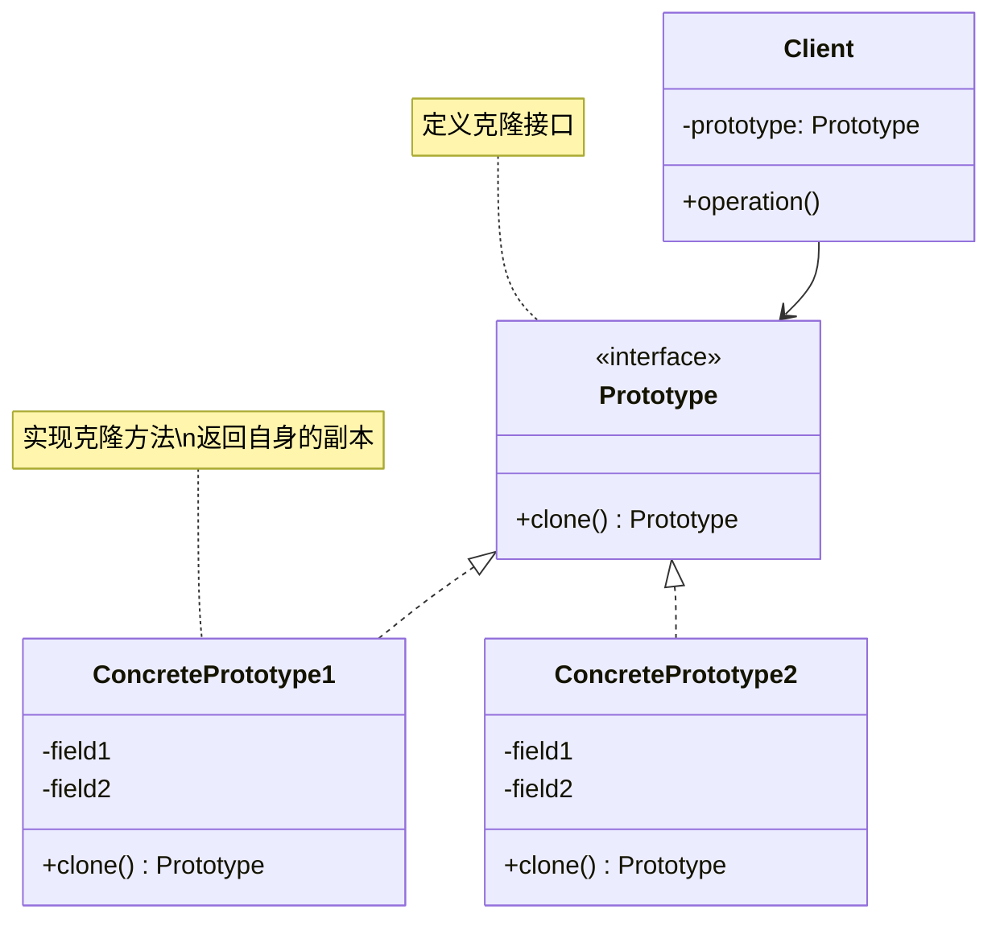
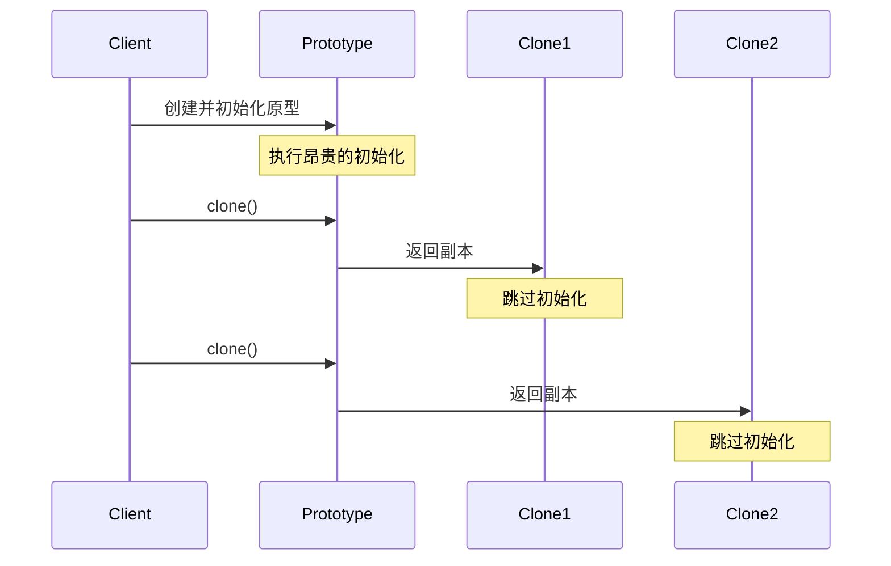
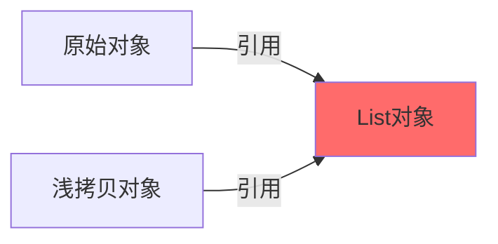
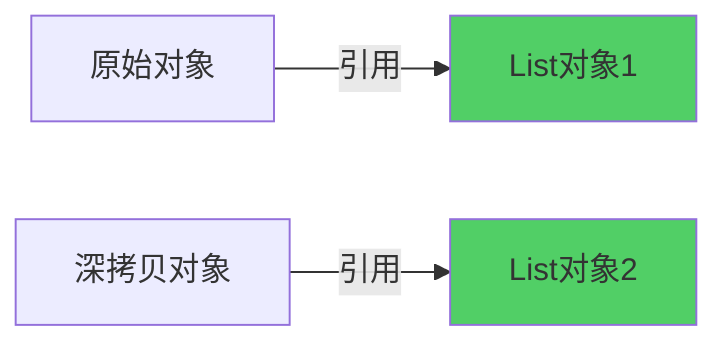

# 原型模式 (Prototype Pattern)

## 模式定义

**原型模式**是一种创建型设计模式，它通过复制一个已经存在的对象（原型）来创建新对象，而不是通过 new 关键字从头创建，无需知道对象的具体类型。



## 问题分析

在某些情况下，直接创建新对象比较困难或代价很高：

- ❌ 对象初始化成本高（复杂计算、数据库查询、网络请求）
- ❌ 对象需要大量参数，使用构造函数繁琐
- ❌ 对象创建依赖复杂的初始化逻辑
- ❌ 需要创建大量相似对象

**传统方式的问题：**

```java
// 每次都要重新初始化，很耗时
Enemy enemy1 = new Enemy("僵尸", 100, 10);
enemy1.loadAnimation();        // 加载动画资源
enemy1.loadTexture();          // 加载纹理资源
enemy1.initializeAI();         // 初始化AI

Enemy enemy2 = new Enemy("僵尸", 100, 10);
enemy2.loadAnimation();        // 重复加载！
enemy2.loadTexture();          // 重复加载！
enemy2.initializeAI();         // 重复初始化！
```

> [!NOTE] > **性能问题**：如果需要创建 1000 个相同的敌人，每个都重新加载资源，会严重影响性能。使用原型模式，可以克隆第一个对象，避免重复的资源加载。

## 解决方案

通过克隆已有对象来创建新对象，避免重复的初始化过程：



## 代码实现

### 1. 定义原型接口

```java
/**
 * 原型接口
 * 定义克隆方法
 */
public interface Prototype {
    /**
     * 克隆方法
     * @return 对象的副本
     */
    Prototype clone();
}
```

### 2. 具体原型类

```java
import java.util.ArrayList;
import java.util.List;

/**
 * 文档类 - 具体原型
 * 实现克隆功能
 */
public class Document implements Prototype, Cloneable {
    private String title;
    private String content;
    private String author;
    private List<String> tags;

    /**
     * 构造函数
     */
    public Document(String title, String content, String author) {
        this.title = title;
        this.content = content;
        this.author = author;
        this.tags = new ArrayList<>();

        // 模拟耗时的初始化
        System.out.println("创建文档：" + title + "（耗时操作）");
    }

    public void addTag(String tag) {
        this.tags.add(tag);
    }

    public String getTitle() { return title; }
    public void setTitle(String title) { this.title = title; }

    /**
     * 克隆方法 - 深拷贝
     * 覆盖 Object 的 clone() 方法
     */
    @Override
    public Document clone() {
        try {
            // 调用 Object.clone() 进行浅拷贝
            Document cloned = (Document) super.clone();

            // 对引用类型字段进行深拷贝
            cloned.tags = new ArrayList<>(this.tags);

            System.out.println("克隆文档：" + title + "（快速操作）");
            return cloned;
        } catch (CloneNotSupportedException e) {
            throw new RuntimeException("克隆失败", e);
        }
    }

    @Override
    public String toString() {
        return "Document{" +
                "title='" + title + '\'' +
                ", content='" + content + '\'' +
                ", author='" + author + '\'' +
                ", tags=" + tags +
                '}';
    }
}
```

> [!IMPORTANT] > **实现 Cloneable 接口**：
>
> - Java 要求实现 `Cloneable` 接口才能调用 `Object.clone()`
> - 如果不实现，会抛出 `CloneNotSupportedException`
> - `Cloneable` 是一个标记接口，没有任何方法

### 3. 原型注册表（可选）

```java
import java.util.HashMap;
import java.util.Map;

/**
 * 原型工厂/注册表
 * 管理和创建原型对象
 */
public class PrototypeRegistry {
    private Map<String, Prototype> prototypes = new HashMap<>();

    /**
     * 注册原型
     */
    public void registerPrototype(String key, Prototype prototype) {
        prototypes.put(key, prototype);
        System.out.println("注册原型: " + key);
    }

    /**
     * 获取原型的克隆
     */
    public Prototype getPrototype(String key) {
        Prototype prototype = prototypes.get(key);
        if (prototype != null) {
            return prototype.clone();
        }
        return null;
    }

    /**
     * 移除原型
     */
    public void unregisterPrototype(String key) {
        prototypes.remove(key);
    }
}
```

### 4. 客户端使用

```java
/**
 * 客户端演示
 */
public class Demo {
    public static void main(String[] args) {
        // 创建原型注册表
        PrototypeRegistry registry = new PrototypeRegistry();

        // 创建原型对象（耗时操作）
        Document reportTemplate = new Document("月度报告", "这是模板内容", "张三");
        reportTemplate.addTag("报告");
        reportTemplate.addTag("月度");

        // 注册原型
        registry.registerPrototype("monthly-report", reportTemplate);

        System.out.println("\n========== 使用原型创建对象 ==========");

        // 克隆原型（快速操作）
        Document report1 = (Document) registry.getPrototype("monthly-report");
        report1.setTitle("1月报告");
        report1.addTag("1月");

        Document report2 = (Document) registry.getPrototype("monthly-report");
        report2.setTitle("2月报告");
        report2.addTag("2月");

        Document report3 = (Document) registry.getPrototype("monthly-report");
        report3.setTitle("3月报告");
        report3.addTag("3月");

        System.out.println("\n========== 输出结果 ==========");
        System.out.println("原型: " + reportTemplate);
        System.out.println("副本1: " + report1);
        System.out.println("副本2: " + report2);
        System.out.println("副本3: " + report3);

        // 证明是不同的对象
        System.out.println("\n原型和副本1是否相同: " + (reportTemplate == report1));
        System.out.println("副本1和副本2是否相同: " + (report1 == report2));
    }
}
```

**输出：**

```
创建文档：月度报告（耗时操作）
注册原型: monthly-report

========== 使用原型创建对象 ==========
克隆文档：月度报告（快速操作）
克隆文档：月度报告（快速操作）
克隆文档：月度报告（快速操作）

========== 输出结果 ==========
原型: Document{title='月度报告', content='这是模板内容', author='张三', tags=[报告, 月度]}
副本1: Document{title='1月报告', content='这是模板内容', author='张三', tags=[报告, 月度, 1月]}
副本2: Document{title='2月报告', content='这是模板内容', author='张三', tags=[报告, 月度, 2月]}
副本3: Document{title='3月报告', content='这是模板内容', author='张三', tags=[报告, 月度, 3月]}

原型和副本1是否相同: false
副本1和副本2是否相同: false
```

## 浅拷贝 vs 深拷贝

这是原型模式最重要的概念！必须理解它们的区别。

### 浅拷贝（Shallow Copy）



**浅拷贝只复制对象本身，不复制引用的对象：**

```java
/**
 * 浅拷贝示例 - 有问题！
 */
public class ShallowCopyExample implements Cloneable {
    private String name;
    private List<String> items;

    public ShallowCopyExample(String name) {
        this.name = name;
        this.items = new ArrayList<>();
    }

    public void addItem(String item) {
        items.add(item);
    }

    /**
     * 浅拷贝 - Object.clone() 默认行为
     */
    @Override
    public ShallowCopyExample clone() {
        try {
            // super.clone() 只复制基本类型和引用
            // items 引用指向同一个 List 对象！
            return (ShallowCopyExample) super.clone();
        } catch (CloneNotSupportedException e) {
            throw new RuntimeException(e);
        }
    }

    @Override
    public String toString() {
        return "ShallowCopy{name='" + name + "', items=" + items + "}";
    }
}

// 演示浅拷贝的问题
class ShallowCopyDemo {
    public static void main(String[] args) {
        ShallowCopyExample original = new ShallowCopyExample("原始");
        original.addItem("A");
        original.addItem("B");

        ShallowCopyExample cloned = original.clone();

        // 修改克隆对象的 items
        cloned.addItem("C");

        // 问题：原始对象也被修改了！
        System.out.println("原始: " + original);  // 包含 A, B, C
        System.out.println("克隆: " + cloned);    // 包含 A, B, C
    }
}
```

**输出（有问题！）：**

```
原始: ShallowCopy{name='原始', items=[A, B, C]}
克隆: ShallowCopy{name='原始', items=[A, B, C]}
```

> [!CAUTION] > **浅拷贝的陷阱**：原始对象和克隆对象共享同一个 `items` 列表！修改一个会影响另一个。这通常不是我们想要的。

### 深拷贝（Deep Copy）



**深拷贝复制对象及其引用的所有对象：**

```java
/**
 * 深拷贝示例 - 正确！
 */
public class DeepCopyExample implements Cloneable {
    private String name;
    private List<String> items;

    public DeepCopyExample(String name) {
        this.name = name;
        this.items = new ArrayList<>();
    }

    public void addItem(String item) {
        items.add(item);
    }

    /**
     * 深拷贝 - 手动复制引用对象
     */
    @Override
    public DeepCopyExample clone() {
        try {
            // 1. 先进行浅拷贝
            DeepCopyExample cloned = (DeepCopyExample) super.clone();

            // 2. 手动深拷贝引用类型字段
            cloned.items = new ArrayList<>(this.items);

            return cloned;
        } catch (CloneNotSupportedException e) {
            throw new RuntimeException(e);
        }
    }

    @Override
    public String toString() {
        return "DeepCopy{name='" + name + "', items=" + items + "}";
    }
}

// 演示深拷贝
class DeepCopyDemo {
    public static void main(String[] args) {
        DeepCopyExample original = new DeepCopyExample("原始");
        original.addItem("A");
        original.addItem("B");

        DeepCopyExample cloned = original.clone();

        // 修改克隆对象的 items
        cloned.addItem("C");

        // 正确：原始对象不受影响
        System.out.println("原始: " + original);  // 只包含 A, B
        System.out.println("克隆: " + cloned);    // 包含 A, B, C
    }
}
```

**输出（正确！）：**

```
原始: DeepCopy{name='原始', items=[A, B]}
克隆: DeepCopy{name='原始', items=[A, B, C]}
```

### 浅拷贝 vs 深拷贝对比

| 特性         | 浅拷贝                  | 深拷贝                  |
| ------------ | ----------------------- | ----------------------- |
| **基本类型** | ✅ 复制值               | ✅ 复制值               |
| **引用类型** | ❌ 复制引用（共享对象） | ✅ 复制对象（独立对象） |
| **实现难度** | ⭐ 简单                 | ⭐⭐⭐ 复杂             |
| **性能**     | ⭐⭐⭐ 快               | ⭐⭐ 较慢               |
| **安全性**   | ❌ 可能相互影响         | ✅ 完全独立             |
| **适用场景** | 不可变对象              | 可变对象                |

> [!TIP] > **何时使用哪种拷贝**：
>
> - **浅拷贝**：引用的对象是不可变的（String、Integer 等）
> - **深拷贝**：引用的对象是可变的（List、Map、自定义对象等）

## 实际应用示例

### 示例 1：游戏中的敌人克隆

```java
/**
 * Position 类
 */
public class Position implements Cloneable {
    public int x;
    public int y;

    public Position(int x, int y) {
        this.x = x;
        this.y = y;
    }

    @Override
    public Position clone() {
        try {
            return (Position) super.clone();
        } catch (CloneNotSupportedException e) {
            throw new RuntimeException(e);
        }
    }

    @Override
    public String toString() {
        return "(" + x + ", " + y + ")";
    }
}

/**
 * Enemy 类 - 游戏敌人
 */
public class Enemy implements Cloneable {
    private String name;
    private int health;
    private int attack;
    private Position position;
    private List<String> skills;

    public Enemy(String name, int health, int attack) {
        this.name = name;
        this.health = health;
        this.attack = attack;
        this.position = new Position(0, 0);
        this.skills = new ArrayList<>();

        // 模拟耗时的资源加载
        loadResources();
    }

    /**
     * 模拟加载资源（耗时操作）
     */
    private void loadResources() {
        System.out.println("加载 " + name + " 的资源（耗时操作）");
        System.out.println("  - 加载动画");
        System.out.println("  - 加载纹理");
        System.out.println("  - 初始化AI");
    }

    public void addSkill(String skill) {
        skills.add(skill);
    }

    public void setPosition(int x, int y) {
        this.position.x = x;
        this.position.y = y;
    }

    /**
     * 克隆敌人 - 深拷贝
     * 避免重新加载资源
     */
    @Override
    public Enemy clone() {
        try {
            System.out.println("克隆 " + name + "（快速操作）");
            Enemy cloned = (Enemy) super.clone();

            // 深拷贝可变对象
            cloned.position = this.position.clone();
            cloned.skills = new ArrayList<>(this.skills);

            return cloned;
        } catch (CloneNotSupportedException e) {
            throw new RuntimeException(e);
        }
    }

    @Override
    public String toString() {
        return String.format("%s[HP:%d, ATK:%d, Pos:%s, Skills:%s]",
            name, health, attack, position, skills);
    }
}

// 使用示例
class GameDemo {
    public static void main(String[] args) {
        System.out.println("========== 创建原型敌人 ==========");
        // 创建原型（耗时）
        Enemy zombiePrototype = new Enemy("僵尸", 100, 10);
        zombiePrototype.addSkill("撕咬");
        zombiePrototype.addSkill("感染");

        System.out.println("\n========== 快速创建多个敌人 ==========");
        // 克隆多个敌人（快速）
        List<Enemy> enemies = new ArrayList<>();
        for (int i = 0; i < 5; i++) {
            Enemy enemy = zombiePrototype.clone();
            enemy.setPosition(i * 100, i * 50);
            enemies.add(enemy);
        }

        System.out.println("\n========== 敌人列表 ==========");
        for (int i = 0; i < enemies.size(); i++) {
            System.out.println("敌人" + (i + 1) + ": " + enemies.get(i));
        }
    }
}
```

### 示例 2：数据库记录克隆

```java
import java.time.LocalDateTime;
import java.util.HashMap;
import java.util.Map;

/**
 * 数据库记录原型
 */
public class DatabaseRecord implements Cloneable {
    private Long id;
    private String tableName;
    private Map<String, Object> fields;
    private LocalDateTime createdAt;
    private LocalDateTime updatedAt;

    public DatabaseRecord(String tableName) {
        this.tableName = tableName;
        this.fields = new HashMap<>();
        this.createdAt = LocalDateTime.now();
    }

    public void setField(String key, Object value) {
        fields.put(key, value);
    }

    public Object getField(String key) {
        return fields.get(key);
    }

    public void setId(Long id) {
        this.id = id;
    }

    /**
     * 克隆记录（用于批量插入）
     */
    @Override
    public DatabaseRecord clone() {
        try {
            DatabaseRecord cloned = (DatabaseRecord) super.clone();

            // 深拷贝字段映射
            cloned.fields = new HashMap<>(this.fields);
            cloned.id = null;  // 新记录没有 ID
            cloned.createdAt = LocalDateTime.now();  // 新的创建时间

            return cloned;
        } catch (CloneNotSupportedException e) {
            throw new RuntimeException(e);
        }
    }

    @Override
    public String toString() {
        return "Record{id=" + id + ", table='" + tableName + "', fields=" + fields + "}";
    }
}

// 使用：批量插入用户
class BatchInsertDemo {
    public static void main(String[] args) {
        // 创建用户模板
        DatabaseRecord userTemplate = new DatabaseRecord("users");
        userTemplate.setField("role", "member");
        userTemplate.setField("status", "active");
        userTemplate.setField("country", "China");

        // 批量创建用户记录
        String[] names = {"张三", "李四", "王五", "赵六"};
        for (int i = 0; i < names.length; i++) {
            DatabaseRecord user = userTemplate.clone();
            user.setId((long) (i + 1));
            user.setField("name", names[i]);
            user.setField("email", names[i] + "@example.com");

            System.out.println("插入: " + user);
        }
    }
}
```

### 示例 3：配置对象克隆

```java
import java.util.HashMap;
import java.util.Map;
import java.util.Properties;

/**
 * 应用配置类
 */
public class AppConfig implements Cloneable {
    private String environment;  // dev, test, prod
    private Map<String, String> database;
    private Map<String, String> cache;
    private Map<String, String> logging;

    public AppConfig(String environment) {
        this.environment = environment;
        this.database = new HashMap<>();
        this.cache = new HashMap<>();
        this.logging = new HashMap<>();
    }

    public void setDatabaseConfig(String key, String value) {
        database.put(key, value);
    }

    public void setCacheConfig(String key, String value) {
        cache.put(key, value);
    }

    public void setLoggingConfig(String key, String value) {
        logging.put(key, value);
    }

    /**
     * 克隆配置（用于创建不同环境的配置）
     */
    @Override
    public AppConfig clone() {
        try {
            AppConfig cloned = (AppConfig) super.clone();

            // 深拷贝所有配置映射
            cloned.database = new HashMap<>(this.database);
            cloned.cache = new HashMap<>(this.cache);
            cloned.logging = new HashMap<>(this.logging);

            return cloned;
        } catch (CloneNotSupportedException e) {
            throw new RuntimeException(e);
        }
    }

    @Override
    public String toString() {
        return "AppConfig{" +
                "environment='" + environment + '\'' +
                ", database=" + database +
                ", cache=" + cache +
                ", logging=" + logging +
                '}';
    }
}

// 使用：基于基础配置创建不同环境的配置
class ConfigDemo {
    public static void main(String[] args) {
        // 创建基础配置
        AppConfig baseConfig = new AppConfig("base");
        baseConfig.setDatabaseConfig("driver", "mysql");
        baseConfig.setDatabaseConfig("maxConnections", "20");
        baseConfig.setCacheConfig("type", "redis");
        baseConfig.setLoggingConfig("level", "INFO");

        // 克隆并自定义开发环境配置
        AppConfig devConfig = baseConfig.clone();
        devConfig.setDatabaseConfig("host", "localhost");
        devConfig.setDatabaseConfig("database", "dev_db");
        devConfig.setLoggingConfig("level", "DEBUG");

        // 克隆并自定义生产环境配置
        AppConfig prodConfig = baseConfig.clone();
        prodConfig.setDatabaseConfig("host", "prod.database.com");
        prodConfig.setDatabaseConfig("database", "prod_db");
        prodConfig.setDatabaseConfig("maxConnections", "100");
        prodConfig.setLoggingConfig("level", "WARN");

        System.out.println("开发环境:\n" + devConfig);
        System.out.println("\n生产环境:\n" + prodConfig);
    }
}
```

## 深拷贝的实现方式

### 方式 1：手动深拷贝（推荐）

```java
@Override
public MyClass clone() {
    try {
        MyClass cloned = (MyClass) super.clone();
        // 手动深拷贝所有引用字段
        cloned.list = new ArrayList<>(this.list);
        cloned.map = new HashMap<>(this.map);
        cloned.customObject = this.customObject.clone();
        return cloned;
    } catch (CloneNotSupportedException e) {
        throw new RuntimeException(e);
    }
}
```

### 方式 2：序列化深拷贝

```java
import java.io.*;

/**
 * 使用序列化实现深拷贝
 * 优点：自动处理所有字段，包括嵌套对象
 * 缺点：性能较差，要求所有对象可序列化
 */
public class SerializablePrototype implements Serializable {
    private static final long serialVersionUID = 1L;

    private String name;
    private List<String> items;

    /**
     * 通过序列化实现深拷贝
     */
    public SerializablePrototype deepClone() {
        try {
            // 序列化到字节数组
            ByteArrayOutputStream baos = new ByteArrayOutputStream();
            ObjectOutputStream oos = new ObjectOutputStream(baos);
            oos.writeObject(this);
            oos.close();

            // 从字节数组反序列化
            ByteArrayInputStream bais = new ByteArrayInputStream(baos.toByteArray());
            ObjectInputStream ois = new ObjectInputStream(bais);
            SerializablePrototype cloned = (SerializablePrototype) ois.readObject();
            ois.close();

            return cloned;
        } catch (IOException | ClassNotFoundException e) {
            throw new RuntimeException("深拷贝失败", e);
        }
    }
}
```

> [!WARNING] > **序列化深拷贝的缺点**：
>
> - 性能开销大（I/O 操作）
> - 要求所有字段可序列化
> - 不能处理 transient 字段
> - 不适合频繁调用

### 方式 3：使用第三方库

```java
// Apache Commons Lang
import org.apache.commons.lang3.SerialationUtils;

MyClass cloned = SerializationUtils.clone(original);

// Spring Framework
import org.springframework.beans.BeanUtils;

MyClass cloned = new MyClass();
BeanUtils.copyProperties(original, cloned);
```

## Java 中的克隆

### 数组克隆

```java
// 一维数组 - 浅拷贝
int[] original = {1, 2, 3, 4, 5};
int[] cloned = original.clone();

// 修改克隆数组不影响原数组
cloned[0] = 100;
System.out.println(Arrays.toString(original)); // [1, 2, 3, 4, 5]
System.out.println(Arrays.toString(cloned));   // [100, 2, 3, 4, 5]
```

### 集合克隆

```java
// List 克隆
List<String> original = new ArrayList<>(Arrays.asList("A", "B", "C"));
List<String> cloned = new ArrayList<>(original);

// Map 克隆
Map<String, String> originalMap = new HashMap<>();
Map<String, String> clonedMap = new HashMap<>(originalMap);

// Set 克隆
Set<String> originalSet = new HashSet<>();
Set<String> clonedSet = new HashSet<>(originalSet);
```

## Java 标准库中的应用

### 1. ArrayList.clone()

```java
ArrayList<String> list = new ArrayList<>();
list.add("A");
list.add("B");

// ArrayList 实现了 clone() 方法
ArrayList<String> cloned = (ArrayList<String>) list.clone();
```

> [!NOTE]
> ArrayList 的 clone() 是浅拷贝。如果列表中存储的是对象引用，克隆后的列表和原列表共享这些对象。

### 2. HashMap.clone()

```java
HashMap<String, String> map = new HashMap<>();
map.put("key", "value");

HashMap<String, String> cloned = (HashMap<String, String>) map.clone();
```

### 3. Date.clone()

```java
Date date = new Date();
Date cloned = (Date) date.clone();
```

## 优缺点

### 优点

- ✅ **提高性能** - 避免重复的初始化操作
- ✅ **简化对象创建** - 无需关心对象创建的细节
- ✅ **动态添加或删除产品** - 运行时注册和删除原型
- ✅ **减少子类** - 不需要为每种配置创建子类
- ✅**保护状态** - 可以基于现有对象创建新对象

### 缺点

- ❌ **需要实现克隆** - 每个类都要正确实现 clone() 方法
- ❌ **深拷贝复杂** - 循环引用、递归结构难以处理
- ❌ **违反开闭原则** - 修改现有类添加克隆功能
- ❌ **Cloneable 设计缺陷** - Java 的 Cloneable 接口设计不佳

> [!CAUTION] > **循环引用问题**：如果对象 A 引用对象 B，对象 B 又引用对象 A，深拷贝会陷入无限循环！需要特殊处理。

## 适用场景

### 何时使用原型模式

- ✓ **对象创建成本高** - 需要大量计算、I/O 或网络操作
- ✓ **需要大量相似对象** - 游戏中的敌人、UI 组件等
- ✓ **对象初始化复杂** - 需要大量参数或复杂逻辑
- ✓ **需要隐藏创建细节** - 客户端不需要知道对象如何创建
- ✓ **运行时指定创建对象** - 动态配置要创建的对象类型

### 实际应用场景

- 🎮 **游戏开发** - 复制游戏对象（敌人、道具、地图元素）
- 📄 **文档管理** - 基于模板创建文档
- ⚙️ **配置管理** - 创建不同环境的配置
- 💾 **数据库操作** - 批量插入记录
- 🎨 **图形编辑** - 复制图形对象

## 最佳实践

### 1. 区分浅拷贝和深拷贝

```java
// 明确注释说明是深拷贝还是浅拷贝
/**
 * 深拷贝：复制所有引用对象
 */
@Override
public MyClass clone() {
    // 实现深拷贝
}
```

### 2. 提供拷贝构造函数

```java
/**
 * 拷贝构造函数作为 clone() 的替代方案
 */
public class Person {
    private String name;
    private List<String> hobbies;

    // 拷贝构造函数
    public Person(Person other) {
        this.name = other.name;
        this.hobbies = new ArrayList<>(other.hobbies);
    }
}

// 使用
Person original = new Person("张三");
Person copy = new Person(original);
```

> [!TIP] > **拷贝构造函数 vs clone()**：
>
> - 拷贝构造函数更清晰、类型安全
> - 不需要实现 Cloneable 接口
> - 不需要处理 CloneNotSupportedException
> - 《Effective Java》推荐使用拷贝构造函数

### 3. 使用原型注册表

```java
/**
 * 集中管理原型对象
 */
public class PrototypeManager {
    private static final Map<String, Prototype> registry = new HashMap<>();

    static {
        // 预注册常用原型
        registry.put("user", new UserPrototype());
        registry.put("order", new OrderPrototype());
    }

    public static Prototype getPrototype(String type) {
        return registry.get(type).clone();
    }
}
```

### 4. 处理克隆异常

```java
@Override
public MyClass clone() {
    try {
        return (MyClass) super.clone();
    } catch (CloneNotSupportedException e) {
        // 转换为运行时异常
        throw new AssertionError("克隆失败", e);
    }
}
```

### 5. 深拷贝不可变对象

```java
@Override
public MyClass clone() {
    MyClass cloned = (MyClass) super.clone();

    // String 是不可变的，不需要深拷贝
    // cloned.name = this.name;  // 不必要

    // List 是可变的，需要深拷贝
    cloned.items = new ArrayList<>(this.items);

    return cloned;
}
```

## 与其他模式的关系

- **原型 + 工厂** - 工厂可以使用原型来创建对象
- **原型 + 单例** - 单例可以作为原型的特例
- **原型 + 建造者** - 可以先用建造者创建原型，再克隆
- **原型 + 抽象工厂** - 抽象工厂可以存储和返回原型

## 总结

原型模式是一种高效的对象创建模式：

- **核心思想** - 通过克隆现有对象创建新对象
- **关键概念** - 浅拷贝 vs 深拷贝
- **主要优势** - 提高性能，简化创建过程
- **注意事项** - 正确实现深拷贝，处理循环引用
- **实际应用** - 游戏开发、文档模板、配置管理

> [!TIP] > **现代 Java 开发建议**：
>
> - 优先考虑拷贝构造函数而非 clone()
> - 使用不可变对象避免拷贝问题
> - 对于复杂对象，考虑使用建造者模式
> - 使用第三方库（Apache Commons、Spring）简化拷贝

**创建型模式完成！下一步：** 结构型模式 - `adapter-pattern.md`（适配器模式）
