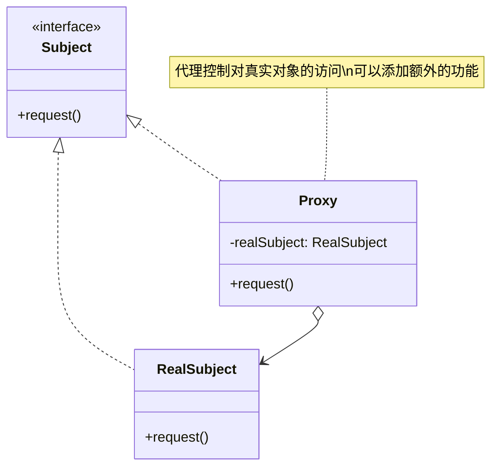
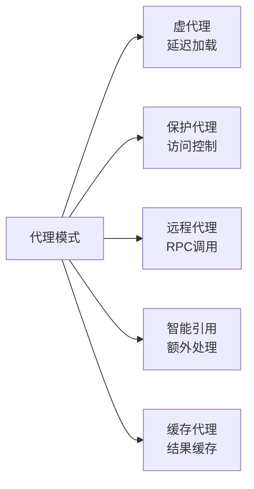
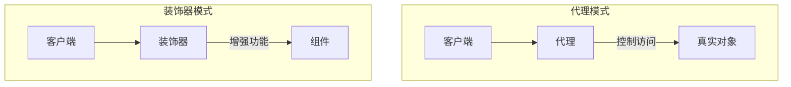

# 代理模式 (Proxy Pattern)

## 模式定义

**代理模式**是一种结构型设计模式，它为另一个对象提供一个替身或占位符，以便控制对这个对象的访问。



## 问题分析

有时候我们需要控制或增强对对象的访问，直接访问会导致：

- ❌ 无法延迟初始化（懒加载）
- ❌ 无法进行访问控制
- ❌ 无法添加日志、缓存等功能
- ❌ 无法实现远程访问
- ❌ 无法进行性能监控

> [!NOTE]
> 代理模式在不修改原对象的前提下，通过代理对象控制对原对象的访问，并可以在访问前后添加额外的处理逻辑。

## 代理模式的类型



## 代码实现

### 1. 定义主题接口

```java
/**
 * 抽象主题接口
 * 定义代理和真实对象的共同接口
 */
public interface Image {
    /**
     * 显示图片
     */
    void display();

    /**
     * 获取图片信息
     */
    String getImageInfo();
}
```

### 2. 真实主题

```java
/**
 * 真实主题 - 实际的图片对象
 * 加载和显示图片是一个耗时的操作
 */
public class RealImage implements Image {
    private String fileName;
    private byte[] imageData;

    public RealImage(String fileName) {
        this.fileName = fileName;
        // 从磁盘加载图片是一个耗时操作
        loadFromDisk();
    }

    /**
     * 模拟从磁盘加载图片（耗时操作）
     */
    private void loadFromDisk() {
        System.out.println("正在从磁盘加载图片: " + fileName);
        try {
            // 模拟加载时间
            Thread.sleep(1000);
            this.imageData = new byte[1024]; // 模拟图片数据
            System.out.println("图片加载完成: " + fileName);
        } catch (InterruptedException e) {
            e.printStackTrace();
        }
    }

    @Override
    public void display() {
        System.out.println("显示图片: " + fileName);
    }

    @Override
    public String getImageInfo() {
        return "图片: " + fileName + ", 大小: " + imageData.length + " 字节";
    }
}
```

### 3. 代理类（虚代理 - 延迟加载）

```java
/**
 * 虚代理 - 延迟加载真实图片
 * 只有在真正需要显示图片时才加载
 */
public class ImageProxy implements Image {
    private String fileName;
    private RealImage realImage;  // 真实图片对象

    public ImageProxy(String fileName) {
        this.fileName = fileName;
        System.out.println("创建图片代理: " + fileName);
    }

    @Override
    public void display() {
        // 延迟加载：只有在第一次显示时才创建真实对象
        if (realImage == null) {
            System.out.println("首次访问，需要加载图片");
            realImage = new RealImage(fileName);
        }
        // 委托给真实对象执行
        realImage.display();
    }

    @Override
    public String getImageInfo() {
        // 不需要加载完整图片就可以返回基本信息
        if (realImage == null) {
            return "图片: " + fileName + " (未加载)";
        }
        return realImage.getImageInfo();
    }
}
```

> [!TIP] > **虚代理的优势**：图片代理对象创建很快，真实图片只有在需要显示时才加载。这避免了程序启动时加载大量图片导致的性能问题。

### 4. 客户端使用

```java
/**
 * 客户端演示
 */
public class Demo {
    public static void main(String[] args) {
        System.out.println("=== 创建图片代理 ===");
        // 创建代理对象非常快速
        Image image1 = new ImageProxy("photo1.jpg");
        Image image2 = new ImageProxy("photo2.jpg");
        Image image3 = new ImageProxy("photo3.jpg");

        System.out.println("\n=== 代理创建完成，实际图片未加载 ===");

        // 获取基本信息，不需要加载图片
        System.out.println(image1.getImageInfo());

        System.out.println("\n=== 第一次显示 image1 ===");
        // 第一次调用时才加载图片（耗时）
        image1.display();

        System.out.println("\n=== 第二次显示 image1 ===");
        // 第二次调用直接使用已加载的图片（快速）
        image1.display();

        System.out.println("\n=== 显示 image2 ===");
        // image2 第一次显示，需要加载
        image2.display();

        // image3 从未显示，所以从未加载到内存
    }
}
```

**输出**：

```
=== 创建图片代理 ===
创建图片代理: photo1.jpg
创建图片代理: photo2.jpg
创建图片代理: photo3.jpg

=== 代理创建完成，实际图片未加载 ===
图片: photo1.jpg (未加载)

=== 第一次显示 image1 ===
首次访问，需要加载图片
正在从磁盘加载图片: photo1.jpg
图片加载完成: photo1.jpg
显示图片: photo1.jpg

=== 第二次显示 image1 ===
显示图片: photo1.jpg

=== 显示 image2 ===
首次访问，需要加载图片
正在从磁盘加载图片: photo2.jpg
图片加载完成: photo2.jpg
显示图片: photo2.jpg
```

## 代理模式的类型详解

### 1. 虚代理（Virtual Proxy）- 延迟加载

```java
/**
 * 虚代理示例：大文档延迟加载
 */
public class DocumentProxy implements Document {
    private String filePath;
    private HeavyDocument realDocument;

    public DocumentProxy(String filePath) {
        this.filePath = filePath;
    }

    @Override
    public void display() {
        if (realDocument == null) {
            realDocument = new HeavyDocument(filePath);
        }
        realDocument.display();
    }
}
```

> [!IMPORTANT] > **使用场景**：创建成本高昂的对象（大文件、数据库连接、网络资源等），只在真正需要时才创建。

### 2. 保护代理（Protection Proxy）- 访问控制

```java
/**
 * 保护代理 - 根据权限控制访问
 */
public interface FileOperations {
    void write(String content);
    String read();
    void delete();
}

/**
 * 真实的文件操作
 */
public class RealFile implements FileOperations {
    private String fileName;
    private String content = "";

    public RealFile(String fileName) {
        this.fileName = fileName;
    }

    @Override
    public void write(String content) {
        this.content = content;
        System.out.println("写入文件: " + fileName);
    }

    @Override
    public String read() {
        System.out.println("读取文件: " + fileName);
        return content;
    }

    @Override
    public void delete() {
        System.out.println("删除文件: " + fileName);
    }
}

/**
 * 保护代理 - 基于角色的访问控制
 */
public class ProtectedFileProxy implements FileOperations {
    private RealFile realFile;
    private String userRole;

    public ProtectedFileProxy(String fileName, String userRole) {
        this.realFile = new RealFile(fileName);
        this.userRole = userRole;
    }

    @Override
    public void write(String content) {
        if ("ADMIN".equals(userRole) || "EDITOR".equals(userRole)) {
            realFile.write(content);
        } else {
            System.out.println("权限不足：需要 ADMIN 或 EDITOR 权限才能写入");
        }
    }

    @Override
    public String read() {
        // 所有用户都可以读取
        return realFile.read();
    }

    @Override
    public void delete() {
        if ("ADMIN".equals(userRole)) {
            realFile.delete();
        } else {
            System.out.println("权限不足：需要 ADMIN 权限才能删除");
        }
    }
}

// 使用示例
class ProtectionProxyDemo {
    public static void main(String[] args) {
        // 普通用户
        FileOperations userFile = new ProtectedFileProxy("data.txt", "USER");
        userFile.read();                    // 允许
        userFile.write("some content");      // 拒绝
        userFile.delete();                   // 拒绝

        // 管理员
        FileOperations adminFile = new ProtectedFileProxy("data.txt", "ADMIN");
        adminFile.write("admin content");    // 允许
        adminFile.delete();                  // 允许
    }
}
```

### 3. 远程代理（Remote Proxy）- RPC 调用

```java
/**
 * 远程服务接口
 */
public interface RemoteService {
    String executeQuery(String query);
}

/**
 * 远程服务实现（在远程服务器上）
 */
public class RemoteServiceImpl implements RemoteService {
    @Override
    public String executeQuery(String query) {
        return "远程服务器响应: " + query;
    }
}

/**
 * 远程代理（在客户端）
 * 隐藏网络通信的复杂性
 */
public class RemoteServiceProxy implements RemoteService {
    private String serverAddress;

    public RemoteServiceProxy(String serverAddress) {
        this.serverAddress = serverAddress;
    }

    @Override
    public String executeQuery(String query) {
        // 建立连接
        System.out.println("连接到远程服务器: " + serverAddress);

        // 序列化请求
        System.out.println("发送请求: " + query);

        // 模拟网络通信
        try {
            Thread.sleep(100);
        } catch (InterruptedException e) {
            e.printStackTrace();
        }

        // 接收并反序列化响应
        String response = "远程服务器响应: " + query;
        System.out.println("收到响应");

        return response;
    }
}
```

> [!NOTE]
> 远程代理在分布式系统中非常常见，如 Java RMI、Web Services、gRPC 等都是远程代理的应用。

### 4. 缓存代理（Cache Proxy）

```java
/**
 * 数据服务接口
 */
public interface DataService {
    String getData(String key);
}

/**
 * 真实的数据服务（访问数据库）
 */
public class DatabaseService implements DataService {
    @Override
    public String getData(String key) {
        // 模拟数据库查询（耗时操作）
        System.out.println("从数据库查询数据: " + key);
        try {
            Thread.sleep(500);
        } catch (InterruptedException e) {
            e.printStackTrace();
        }
        return "数据_" + key;
    }
}

/**
 * 缓存代理 - 提高性能
 */
public class CacheProxy implements DataService {
    private DatabaseService databaseService;
    private Map<String, String> cache = new HashMap<>();
    private Map<String, Long> cacheTime = new HashMap<>();
    private static final long CACHE_DURATION = 5000; // 缓存5秒

    public CacheProxy(DatabaseService databaseService) {
        this.databaseService = databaseService;
    }

    @Override
    public String getData(String key) {
        // 检查缓存是否存在且未过期
        if (cache.containsKey(key)) {
            long cachedTime = cacheTime.get(key);
            if (System.currentTimeMillis() - cachedTime < CACHE_DURATION) {
                System.out.println("从缓存获取: " + key);
                return cache.get(key);
            } else {
                System.out.println("缓存已过期: " + key);
            }
        }

        // 缓存不存在或已过期，从数据库获取
        String data = databaseService.getData(key);
        cache.put(key, data);
        cacheTime.put(key, System.currentTimeMillis());

        return data;
    }
}

// 使用示例
class CacheProxyDemo {
    public static void main(String[] args) {
        DataService service = new CacheProxy(new DatabaseService());

        // 第一次访问，从数据库查询
        System.out.println("结果: " + service.getData"user_123"));

        // 第二次访问，从缓存获取（快速）
        System.out.println("结果: " + service.getData("user_123"));

        // 访问不同的数据
        System.out.println("结果: " + service.getData("user_456"));
    }
}
```

### 5. 日志代理（Logging Proxy）

```java
/**
 * 业务服务接口
 */
public interface UserService {
    void createUser(String name);
    void deleteUser(int id);
    String getUser(int id);
}

/**
 * 真实的业务服务
 */
public class UserServiceImpl implements UserService {
    @Override
    public void createUser(String name) {
        System.out.println("创建用户: " + name);
    }

    @Override
    public void deleteUser(int id) {
        System.out.println("删除用户 ID: " + id);
    }

    @Override
    public String getUser(int id) {
        return "User[id=" + id + "]";
    }
}

/**
 * 日志代理 - 记录方法调用
 */
public class LoggingProxy implements UserService {
    private UserService realService;

    public LoggingProxy(UserService realService) {
        this.realService = realService;
    }

    @Override
    public void createUser(String name) {
        logBefore("createUser", name);
        long startTime = System.currentTimeMillis();

        realService.createUser(name);

        long duration = System.currentTimeMillis() - startTime;
        logAfter("createUser", duration);
    }

    @Override
    public void deleteUser(int id) {
        logBefore("deleteUser", id);
        long startTime = System.currentTimeMillis();

        realService.deleteUser(id);

        long duration = System.currentTimeMillis() - startTime;
        logAfter("deleteUser", duration);
    }

    @Override
    public String getUser(int id) {
        logBefore("getUser", id);
        long startTime = System.currentTimeMillis();

        String result = realService.getUser(id);

        long duration = System.currentTimeMillis() - startTime;
        logAfter("getUser", duration);

        return result;
    }

    private void logBefore(String methodName, Object... args) {
        System.out.println("[LOG] 调用方法: " + methodName + ", 参数: " + Arrays.toString(args));
    }

    private void logAfter(String methodName, long duration) {
        System.out.println("[LOG] 方法执行完成: " + methodName + ", 耗时: " + duration + "ms");
    }
}
```

## 静态代理 vs 动态代理

### 静态代理

```java
/**
 * 静态代理 - 手动编写代理类
 * 缺点：每个真实类都需要编写对应的代理类
 */
public class StaticProxy implements UserService {
    private UserService realService;

    public StaticProxy(UserService realService) {
        this.realService = realService;
    }

    // 需要手动为每个方法编写代理逻辑
    @Override
    public void createUser(String name) {
        System.out.println("前置处理");
        realService.createUser(name);
        System.out.println("后置处理");
    }

    // ... 其他方法
}
```

### 动态代理（JDK）

```java
import java.lang.reflect.InvocationHandler;
import java.lang.reflect.Method;
import java.lang.reflect.Proxy;

/**
 * JDK 动态代理 - 通过反射动态生成代理类
 * 优点：一个 InvocationHandler 可以代理多个接口
 * 限制：只能代理接口
 */
public class JdkDynamicProxy implements InvocationHandler {
    private Object target;

    public JdkDynamicProxy(Object target) {
        this.target = target;
    }

    /**
     * 创建代理对象
     */
    public Object getProxy() {
        return Proxy.newProxyInstance(
            target.getClass().getClassLoader(),
            target.getClass().getInterfaces(),
            this
        );
    }

    /**
     * 代理方法调用
     */
    @Override
    public Object invoke(Object proxy, Method method, Object[] args)
            throws Throwable {
        // 前置处理
        System.out.println("[JDK代理] 调用方法: " + method.getName());
        long startTime = System.currentTimeMillis();

        // 调用真实方法
        Object result = method.invoke(target, args);

        // 后置处理
        long duration = System.currentTimeMillis() - startTime;
        System.out.println("[JDK代理] 方法执行完成，耗时: " + duration + "ms");

        return result;
    }
}

// 使用示例
class JdkProxyDemo {
    public static void main(String[] args) {
        // 创建真实对象
        UserService realService = new UserServiceImpl();

        // 创建代理对象
        JdkDynamicProxy proxyHandler = new JdkDynamicProxy(realService);
        UserService proxy = (UserService) proxyHandler.getProxy();

        // 通过代理调用方法
        proxy.createUser("张三");
        proxy.getUser(123);
    }
}
```

> [!IMPORTANT] > **JDK 动态代理的限制**：只能代理实现了接口的类。如果一个类没有实现任何接口，就无法使用 JDK 动态代理。

### 动态代理（CGLIB）

```java
import net.sf.cglib.proxy.Enhancer;
import net.sf.cglib.proxy.MethodInterceptor;
import net.sf.cglib.proxy.MethodProxy;

/**
 * CGLIB 动态代理 - 通过子类化实现代理
 * 优点：可以代理没有接口的类
 * 原理：生成目标类的子类
 */
public class CglibDynamicProxy implements MethodInterceptor {

    /**
     * 创建代理对象
     */
    public Object getProxy(Class<?> clazz) {
        Enhancer enhancer = new Enhancer();
        enhancer.setSuperclass(clazz);
        enhancer.setCallback(this);
        return enhancer.create();
    }

    /**
     * 拦截方法调用
     */
    @Override
    public Object intercept(Object obj, Method method, Object[] args,
                           MethodProxy proxy) throws Throwable {
        // 前置处理
        System.out.println("[CGLIB代理] 调用方法: " + method.getName());
        long startTime = System.currentTimeMillis();

        // 调用父类方法（真实方法）
        Object result = proxy.invokeSuper(obj, args);

        // 后置处理
        long duration = System.currentTimeMillis() - startTime;
        System.out.println("[CGLIB代理] 方法执行完成，耗时: " + duration + "ms");

        return result;
    }
}
```

### 代理方式对比

| 特性         | 静态代理       | JDK 动态代理   | CGLIB 动态代理        |
| ------------ | -------------- | -------------- | --------------------- |
| **实现方式** | 手动编写代理类 | 反射生成代理类 | 字节码生成子类        |
| **代理对象** | 接口或类       | 只能是接口     | 类（无需接口）        |
| **性能**     | ⭐⭐⭐ 最快    | ⭐⭐ 较快      | ⭐ 稍慢（首次）       |
| **灵活性**   | ❌ 低          | ✅ 高          | ✅ 高                 |
| **类数量**   | ❌ 多          | ✅ 少          | ✅ 少                 |
| **使用场景** | 简单代理       | AOP、Mybatis   | Spring AOP、Hibernate |

## Spring AOP 中的代理

```java
/**
 * Spring AOP 自动选择代理方式
 */
@Aspect
@Component
public class LoggingAspect {

    /**
     * 前置通知
     */
    @Before("execution(* com.example.service.*.*(..))")
    public void logBefore(JoinPoint joinPoint) {
        System.out.println("方法执行前: " + joinPoint.getSignature().getName());
    }

    /**
     * 环绕通知
     */
    @Around("execution(* com.example.service.*.*(..))")
    public Object logAround(ProceedingJoinPoint joinPoint) throws Throwable {
        long start = System.currentTimeMillis();

        Object result = joinPoint.proceed();

        long duration = System.currentTimeMillis() - start;
        System.out.println("方法耗时: " + duration + "ms");

        return result;
    }
}
```

> [!TIP] > **Spring AOP 代理选择策略**：
>
> - 如果目标对象实现了接口 → 使用 JDK 动态代理
> - 如果目标对象没有实现接口 → 使用 CGLIB 代理
> - 可以强制使用 CGLIB：`@EnableAspectJAutoProxy(proxyTargetClass = true)`

## 代理模式 vs 其他模式

### 代理 vs 装饰器



| 特性         | 代理模式         | 装饰器模式   |
| ------------ | ---------------- | ------------ |
| **目的**     | 控制访问         | 增加功能     |
| **关注点**   | 访问控制、懒加载 | 功能扩展     |
| **组合层次** | 通常一层         | 可多层嵌套   |
| **创建时机** | 代理创建真实对象 | 组件独立创建 |

### 代理 vs 适配器

| 特性         | 代理模式       | 适配器模式 |
| ------------ | -------------- | ---------- |
| **目的**     | 控制访问       | 转换接口   |
| **接口**     | 相同接口       | 不同接口   |
| **使用场景** | 访问控制、缓存 | 接口不兼容 |

## 优缺点

### 优点

- ✅ **控制访问** - 在不修改目标对象的情况下控制访问
- ✅ **延迟加载** - 虚代理实现懒加载，提高性能
- ✅ **访问控制** - 保护代理实现权限检查
- ✅ **功能增强** - 可以添加日志、缓存等功能
- ✅ **符合开闭原则** - 易于扩展新的代理类型
- ✅ **职责分离** - 代理和真实对象职责明确

### 缺点

- ❌ **增加复杂度** - 增加了系统的类数量
- ❌ **性能影响** - 额外的代理层可能降低性能
- ❌ **响应时间增加** - 请求需要经过代理转发

> [!WARNING]
> 不要过度使用代理模式。每增加一层代理都会增加系统复杂度和调用开销。只在真正需要控制访问或添加横切关注点时使用。

## 适用场景

### 何时使用代理模式

- ✓ **延迟初始化**（虚代理）- 创建成本高的对象
- ✓ **访问控制**（保护代理）- 基于权限控制访问
- ✓ **日志记录** - 记录方法调用和参数
- ✓ **缓存管理** - 缓存频繁访问的数据
- ✓ **性能监控** - 统计方法执行时间
- ✓ **远程代理** - 隐藏远程调用的复杂性
- ✓ **智能引用** - 在访问对象时执行额外操作

### 实际应用场景

- 🔐 **权限控制** - 基于角色的访问控制（RBAC）
- 📝 **日志系统** - AOP 日志记录
- 💾 **缓存系统** - Redis 缓存代理
- 🌐 **RPC 框架** - Dubbo、gRPC 远程调用
- 🎨 **ORM 框架** - Hibernate 懒加载
- 📊 **性能监控** - 方法调用时间统计
- 🔒 **事务管理** - Spring 声明式事务

## Java 标准库中的应用

```java
// 1. Collections.synchronizedList - 线程安全代理
List<String> list = Collections.synchronizedList(new ArrayList<>());

// 2. Collections.unmodifiableList - 只读代理
List<String> readOnly = Collections.unmodifiableList(list);

// 3. JDBC Connection - 连接池代理
Connection conn = dataSource.getConnection(); // 实际返回的是代理对象

// 4. JDK 动态代理
Object proxy = Proxy.newProxyInstance(...);
```

## 最佳实践

### 1. 合理选择代理类型

```java
// 简单场景 → 静态代理
// 需要灵活性 → 动态代理
// 第三方类无接口 → CGLIB代理
```

### 2. 注意线程安全

```java
/**
 * 懒加载代理要考虑线程安全
 */
public class ThreadSafeProxy implements Service {
    private volatile RealService realService;

    @Override
    public void doSomething() {
        if (realService == null) {
            synchronized (this) {
                if (realService == null) {
                    realService = new RealService();
                }
            }
        }
        realService.doSomething();
    }
}
```

### 3. 异常处理

```java
/**
 * 代理中的异常处理
 */
@Override
public Object invoke(Object proxy, Method method, Object[] args)
        throws Throwable {
    try {
        return method.invoke(target, args);
    } catch (InvocationTargetException e) {
        // 记录异常
        logger.error("方法调用异常", e.getTargetException());
        throw e.getTargetException();
    }
}
```

### 4. 性能优化

```java
/**
 * 缓存代理要设置合理的过期时间
 */
public class OptimizedCacheProxy {
    private final int MAX_CACHE_SIZE = 1000;
    private final long CACHE_EXPIRE_MS = 60000;

    // 使用 LRU 缓存
    private final Cache<String, Object> cache =
        CacheBuilder.newBuilder()
            .maximumSize(MAX_CACHE_SIZE)
            .expireAfterWrite(CACHE_EXPIRE_MS, TimeUnit.MILLISECONDS)
            .build();
}
```

## 与其他模式的关系

- **代理 + 单例** - 单例工厂负责创建代理对象
- **代理 + 工厂** - 使用工厂创建不同类型的代理
- **代理 + 组合** - 组合模式的节点可以是代理对象
- **代理 + 迭代器** - 迭代器内部可以使用代理延迟加载

## 总结

代理模式是一个非常实用且强大的设计模式：

- **核心思想** - 通过代理对象控制对真实对象的访问
- **主要类型** - 虚代理、保护代理、远程代理、缓存代理
- **实现方式** - 静态代理、JDK 动态代理、CGLIB 代理
- **关键优势** - 不修改原对象即可增强功能
- **实际应用** - Spring AOP、ORM 懒加载、RPC 框架

> [!TIP]
> 在现代 Java 开发中，通常使用 Spring AOP 来实现代理功能，而不是手写代理类。但理解代理模式的原理对于深入理解 Spring AOP 至关重要。
