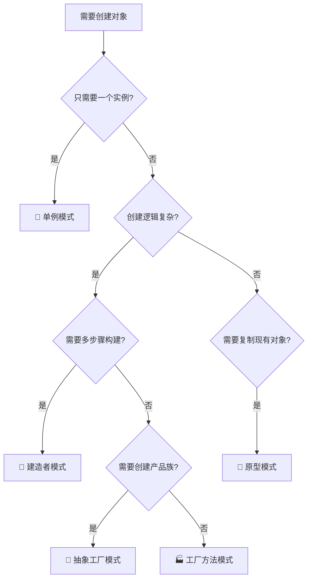
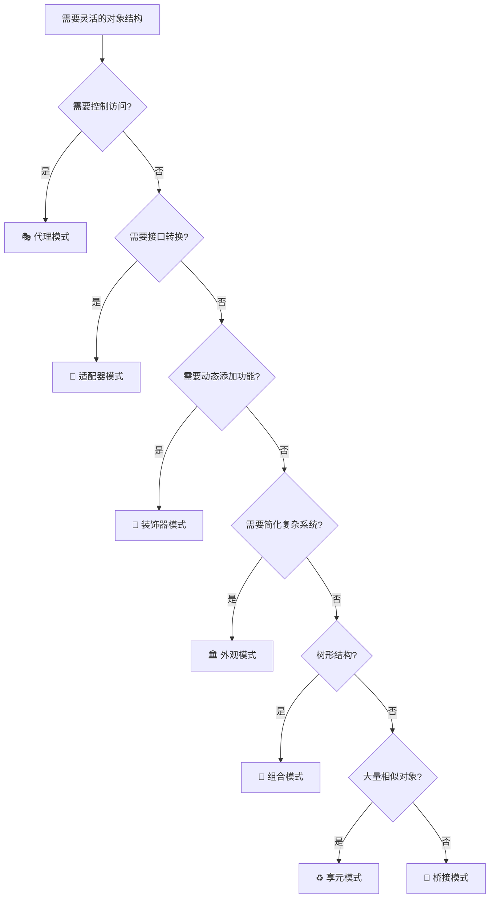
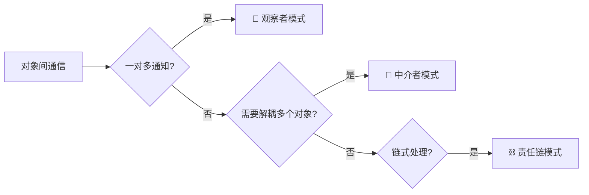
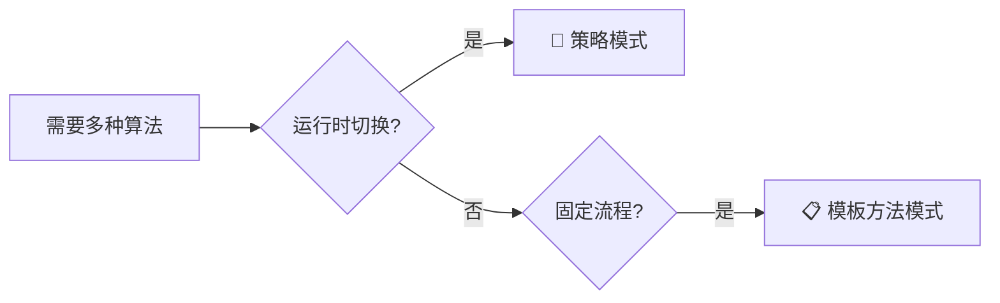
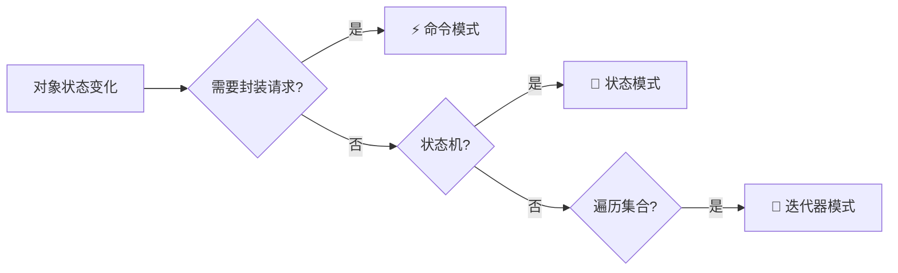

# 使用场景对比

本文档帮助您快速理解不同设计模式的典型使用场景，以及如何根据具体问题选择合适的模式。

## 📊 按问题分类

### 🎯 对象创建问题



#### 场景对比表

| 场景                              | 推荐模式     | 理由                   |
| --------------------------------- | ------------ | ---------------------- |
| 数据库连接池                      | 单例模式     | 全局唯一，控制资源     |
| 日志记录器                        | 单例模式     | 全局统一管理           |
| 创建不同类型的支付方式            | 工厂方法模式 | 延迟到子类决定具体类型 |
| 创建跨平台 UI 组件（Windows/Mac） | 抽象工厂模式 | 创建相关对象家族       |
| 构建复杂的 HTTP 请求              | 建造者模式   | 多个可选参数           |
| 克隆游戏对象                      | 原型模式     | 避免复杂初始化         |

---

### 🏗️ 对象组合与结构问题



#### 场景对比表

| 场景                        | 推荐模式   | 理由             |
| --------------------------- | ---------- | ---------------- |
| 远程服务调用（RPC）         | 代理模式   | 本地代理远程对象 |
| 权限控制、缓存              | 代理模式   | 增强原对象功能   |
| 使用第三方库但接口不兼容    | 适配器模式 | 转换接口         |
| IO 流包装（BufferedReader） | 装饰器模式 | 动态添加功能     |
| 简化复杂子系统接口          | 外观模式   | 提供统一入口     |
| 文件系统（文件夹/文件）     | 组合模式   | 树形层次结构     |
| 字符串常量池                | 享元模式   | 共享相同对象     |
| 图形绘制引擎（形状+颜色）   | 桥接模式   | 解耦抽象和实现   |

---

### ⚡ 对象行为与交互问题

#### 📢 通信与协调



| 场景                     | 模式       | 典型应用           |
| ------------------------ | ---------- | ------------------ |
| 事件监听（GUI 按钮点击） | 观察者模式 | MVC、EventBus      |
| 聊天室多人通信           | 中介者模式 | 聊天室服务器       |
| 审批流程                 | 责任链模式 | 请假审批、日志处理 |

#### 🎯 算法与策略



| 场景             | 模式         | 典型应用           |
| ---------------- | ------------ | ------------------ |
| 不同的排序算法   | 策略模式     | 策略类封装算法     |
| 不同的支付方式   | 策略模式     | 支付宝、微信、银联 |
| 数据处理流程固定 | 模板方法模式 | 框架钩子方法       |

#### 📝 状态与行为



| 场景             | 模式       | 典型应用                 |
| ---------------- | ---------- | ------------------------ |
| 撤销/重做功能    | 命令模式   | 编辑器、事务             |
| 订单状态流转     | 状态模式   | 待支付 → 已支付 → 已发货 |
| 遍历复杂数据结构 | 迭代器模式 | Java Iterator            |

#### 🔧 其他行为

| 场景              | 模式       | 典型应用             |
| ----------------- | ---------- | -------------------- |
| 保存/恢复对象状态 | 备忘录模式 | 游戏存档、编辑器撤销 |
| 为对象添加新操作  | 访问者模式 | AST 遍历、元素操作   |
| 解析简单语法      | 解释器模式 | 表达式求值、SQL 解析 |

---

## 🎯 按业务场景选择

### 电商系统

| 功能     | 推荐模式   | 说明                              |
| -------- | ---------- | --------------------------------- |
| 购物车   | 组合模式   | 商品和组合商品                    |
| 订单状态 | 状态模式   | 待支付 → 已支付 → 已发货 → 已完成 |
| 支付方式 | 策略模式   | 支付宝、微信、银联                |
| 订单处理 | 命令模式   | 封装订单操作，支持撤销            |
| 优惠活动 | 装饰器模式 | 动态添加折扣、满减等              |
| 库存管理 | 单例模式   | 全局库存管理器                    |

### 游戏开发

| 功能       | 推荐模式   | 说明                |
| ---------- | ---------- | ------------------- |
| 游戏存档   | 备忘录模式 | 保存/加载游戏状态   |
| 角色状态   | 状态模式   | 正常/受伤/死亡/防御 |
| 技能系统   | 策略模式   | 不同技能算法        |
| 克隆敌人   | 原型模式   | 快速创建相似对象    |
| 地图元素   | 享元模式   | 共享相同地砖        |
| 游戏对象池 | 单例模式   | 管理对象复用        |

### Web 应用

| 功能        | 推荐模式     | 说明               |
| ----------- | ------------ | ------------------ |
| HTTP 拦截器 | 责任链模式   | 认证 → 授权 → 日志 |
| 缓存代理    | 代理模式     | 缓存 HTTP 响应     |
| 日志系统    | 单例模式     | 全局日志记录器     |
| 请求处理    | 模板方法模式 | 固定处理流程       |
| 数据库连接  | 单例模式     | 连接池管理         |

---

## 🔍 模式组合使用

### 经典组合

#### 1. **工厂方法 + 单例**

```java
// 单例工厂：确保工厂本身是单例
public class DatabaseConnectionFactory {
    private static DatabaseConnectionFactory instance;

    public static DatabaseConnectionFactory getInstance() {
        if (instance == null) {
            instance = new DatabaseConnectionFactory();
        }
        return instance;
    }

    public Connection createConnection(String type) {
        // 工厂方法创建不同类型连接
    }
}
```

#### 2. **策略 + 工厂**

```java
// 工厂创建不同的策略
public class PaymentStrategyFactory {
    public static PaymentStrategy create(String type) {
        switch(type) {
            case "alipay": return new AlipayStrategy();
            case "wechat": return new WechatStrategy();
            default: throw new IllegalArgumentException();
        }
    }
}
```

#### 3. **装饰器 + 组合**

```java
// 装饰器增强组合对象
Component component = new ConcreteComponent();
component = new Decorator1(component);  // 装饰
component = new Decorator2(component);  // 再装饰
```

#### 4. **观察者 + 中介者**

```java
// 中介者管理观察者
public class ChatMediator {
    private List<Observer> users = new ArrayList<>();

    public void notify(String message) {
        // 通知所有观察者
        users.forEach(user -> user.update(message));
    }
}
```

---

## 💡 选择建议

### ✅ DO（推荐做法）

1. **根据问题本质选择**

   - 创建问题 → 创建型模式
   - 结构问题 → 结构型模式
   - 行为问题 → 行为型模式

2. **优先选择简单模式**

   - 简单问题不要过度设计
   - 从最简单的模式开始

3. **考虑维护性**
   - 选择团队熟悉的模式
   - 考虑代码可读性

### ❌ DON'T（避免做法）

1. **不要为了用模式而用模式**

   - 过度设计会增加复杂度
   - KISS 原则：Keep It Simple, Stupid

2. **不要盲目套用**

   - 理解模式本质
   - 根据实际情况调整

3. **不要混淆相似模式**
   - 策略 vs 状态
   - 装饰器 vs 代理
   - 组合 vs 装饰器

---

## 🎓 学习路径建议

### 初学者（必学 5 个）

1. 📌 **单例模式** - 最简单常用
2. 🏭 **工厂方法模式** - 创建对象基础
3. 🎲 **策略模式** - 理解 OO 封装
4. 🎭 **代理模式** - 用途广泛
5. 👀 **观察者模式** - 事件驱动核心

### 进阶（深入 10 个）

6. 🔨 建造者模式
7. 🎁 装饰器模式
8. 🏛️ 外观模式
9. 📋 模板方法模式
10. ⚡ 命令模式
11. 🔀 状态模式
12. ⛓️ 责任链模式
13. 🔄 迭代器模式
14. 🌳 组合模式
15. 🔌 适配器模式

### 高级（按需学习）

16. 🏢 抽象工厂模式
17. 🐑 原型模式
18. ♻️ 享元模式
19. 🌉 桥接模式
20. 🤝 中介者模式
21. 💾 备忘录模式
22. 🚶 访问者模式
23. 🔤 解释器模式

---

> [!TIP] > **学习建议**：
>
> - 从实际项目中遇到的问题出发
> - 先理解模式解决的问题，再学习实现
> - 多看实际框架中的应用（Spring、JDK 等）
> - 实践是最好的学习方式

> [!IMPORTANT] > **记住**：设计模式是工具，不是目的。好的代码首先是简单、清晰、可维护的，其次才考虑使用什么模式。
