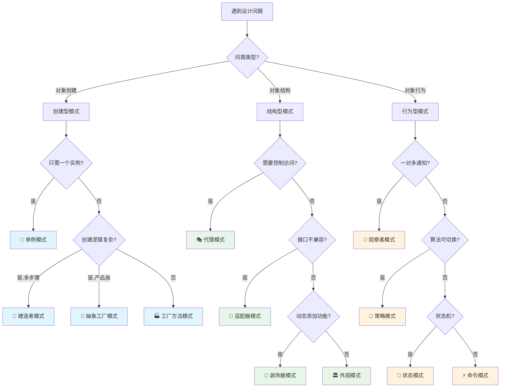
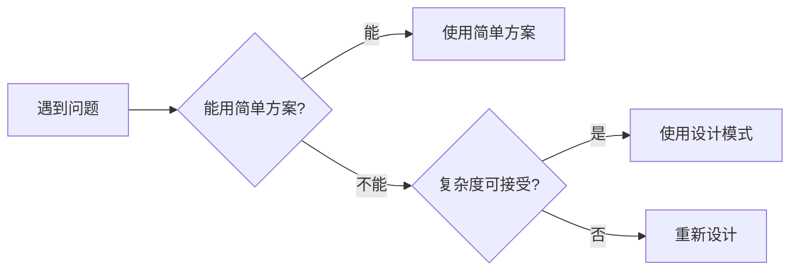
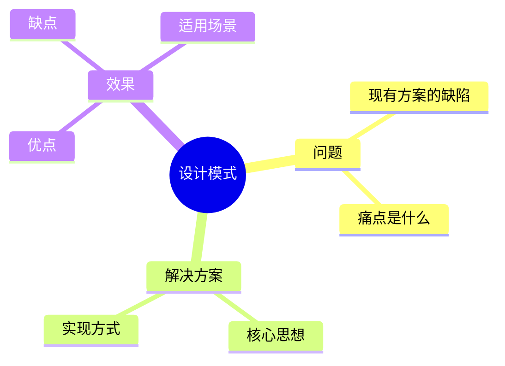

# 模式选择指南

本指南帮助您在面对具体问题时，快速找到最合适的设计模式。

## 🎯 快速决策树



---

## 📋 问题诊断清单

### 创建型模式诊断

#### 单例模式

- [ ] 整个系统只需要一个实例？
- [ ] 需要控制实例数量？
- [ ] 需要全局访问点？

**✅ 使用场景**：配置管理器、日志记录器、数据库连接池

**❌ 不适用**：需要多个实例、需要继承

---

#### 工厂方法模式

- [ ] 不知道具体需要创建哪个类？
- [ ] 将创建逻辑延迟到子类？
- [ ] 需要统一的创建接口？

**✅ 使用场景**：日志记录器工厂、数据库连接工厂

**❌ 不适用**：只有一种产品、创建逻辑简单

---

#### 抽象工厂模式

- [ ] 需要创建一系列相关对象？
- [ ] 产品有多个等级结构？
- [ ] 需要保证产品兼容性？

**✅ 使用场景**：跨平台 UI 组件、数据库访问层

**❌ 不适用**：产品种类少、不需要产品族

---

#### 建造者模式

- [ ] 对象创建步骤复杂？
- [ ] 有很多可选参数？
- [ ] 需要构建不同的表示？

**✅ 使用场景**：SQL 查询构建、HTTP 请求构建

**❌ 不适用**：对象简单、参数少

---

#### 原型模式

- [ ] 创建对象开销大？
- [ ] 需要克隆现有对象？
- [ ] 运行时才知道具体类型？

**✅ 使用场景**：游戏对象克隆、深拷贝

**❌ 不适用**：对象没有复杂状态

---

### 结构型模式诊断

#### 代理模式

- [ ] 需要控制对象访问？
- [ ] 需要延迟加载？
- [ ] 需要添加访问控制或缓存？

**✅ 使用场景**：远程代理(RPC)、虚拟代理、保护代理

**❌ 不适用**：不需要额外控制

---

#### 适配器模式

- [ ] 接口不兼容？
- [ ] 需要使用已有类但接口不符？
- [ ] 需要统一多个接口？

**✅ 使用场景**：集成第三方库、接口升级

**❌ 不适用**：可以直接修改源代码

---

#### 装饰器模式

- [ ] 需要动态添加功能？
- [ ] 不想修改原有代码？
- [ ] 需要多种组合？

**✅ 使用场景**：Java IO 流、UI 组件增强

**❌ 不适用**：功能固定、不需要动态组合

---

#### 外观模式

- [ ] 子系统复杂？
- [ ] 需要简化接口？
- [ ] 只需要部分功能？

**✅ 使用场景**：简化复杂库、统一多个 API

**❌ 不适用**：系统本身就简单

---

#### 组合模式

- [ ] 表示树形结构？
- [ ] 整体和部分统一处理？
- [ ] 递归结构？

**✅ 使用场景**：文件系统、菜单树、组织架构

**❌ 不适用**：不是树形结构

---

#### 享元模式

- [ ] 大量相似对象？
- [ ] 内存开销大？
- [ ] 对象状态可分为内外部？

**✅ 使用场景**：字符串池、图形编辑器

**❌ 不适用**：对象数量少、状态差异大

---

#### 桥接模式

- [ ] 抽象和实现独立变化？
- [ ] 多维度变化？
- [ ] 避免类爆炸？

**✅ 使用场景**：跨平台图形库、数据库驱动

**❌ 不适用**：只有一个变化维度

---

### 行为型模式诊断

#### 观察者模式

- [ ] 一对多依赖？
- [ ] 对象状态变化需要通知？
- [ ] 事件驱动？

**✅ 使用场景**：GUI 事件、MVC、消息订阅

**❌ 不适用**：一对一通信

---

#### 策略模式

- [ ] 需要在运行时切换算法？
- [ ] 避免大量 if-else？
- [ ] 算法独立变化？

**✅ 使用场景**：支付方式、排序算法、压缩算法

**❌ 不适用**：算法固定不变

---

#### 模板方法模式

- [ ] 算法骨架固定？
- [ ] 部分步骤可变？
- [ ] 代码复用？

**✅ 使用场景**：框架钩子、测试用例、数据处理流程

**❌ 不适用**：整个流程都可变

---

#### 命令模式

- [ ] 需要将请求封装为对象？
- [ ] 需要撤销/重做？
- [ ] 需要请求排队？

**✅ 使用场景**：编辑器操作、事务管理、宏命令

**❌ 不适用**：简单调用即可

---

#### 迭代器模式

- [ ] 需要遍历集合？
- [ ] 隐藏集合内部结构？
- [ ] 支持多种遍历方式？

**✅ 使用场景**：Java Collection、自定义集合

**❌ 不适用**：简单数组遍历

---

#### 状态模式

- [ ] 对象有多个状态？
- [ ] 行为随状态改变？
- [ ] 有明确的状态转换规则？

**✅ 使用场景**：订单状态、TCP 连接、游戏角色

**❌ 不适用**：状态少、转换简单

---

#### 责任链模式

- [ ] 多个对象都可能处理请求？
- [ ] 处理者动态确定？
- [ ] 按顺序尝试多个处理者？

**✅ 使用场景**：审批流程、过滤器链、异常处理

**❌ 不适用**：处理者固定

---

#### 中介者模式

- [ ] 对象间通信复杂（网状）？
- [ ] 需要解耦多个对象？
- [ ] 对象难以独立复用？

**✅ 使用场景**：聊天室、UI 对话框、航空管制

**❌ 不适用**：对象间关系简单

---

#### 备忘录模式

- [ ] 需要保存/恢复对象状态？
- [ ] 不破坏封装？
- [ ] 支持撤销操作？

**✅ 使用场景**：编辑器撤销、游戏存档、事务回滚

**❌ 不适用**：不需要保存状态

---

#### 访问者模式

- [ ] 元素类稳定？
- [ ] 需要频繁添加新操作？
- [ ] 操作与元素分离？

**✅ 使用场景**：AST 处理、报表生成、文件系统操作

**❌ 不适用**：元素类经常变化

---

#### 解释器模式

- [ ] 有简单的文法规则？
- [ ] 需要解释执行？
- [ ] 效率不是关键？

**✅ 使用场景**：正则表达式、SQL 解析、表达式求值

**❌ 不适用**：文法复杂、性能要求高

---

## 🎯 根据症状选择

### 症状：代码中有大量 if-else

```java
// ❌ 问题代码
if (type.equals("A")) {
    // ...
} else if (type.equals("B")) {
    // ...
} else if (type.equals("C")) {
    // ...
}
```

**可能的解决方案**：

1. **🎲 策略模式** - 如果是选择不同算法
2. **🏭 工厂方法** - 如果是创建不同对象
3. **🔀 状态模式** - 如果是状态转换
4. **⛓️ 责任链模式** - 如果是按顺序处理

---

### 症状：类的数量爆炸

```
产品A-红色, 产品A-蓝色, 产品B-红色, 产品B-蓝色...
```

**解决方案**：

- **🌉 桥接模式** - 分离两个变化维度
- **♻️ 享元模式** - 共享相同部分

---

### 症状：对象创建逻辑复杂

```java
// new对象需要很多参数
new Object(p1, p2, p3, p4, p5, p6, p7, p8...);
```

**解决方案**：

- **🔨 建造者模式** - 链式调用，清晰易读
- **🏭 工厂方法** - 封装创建逻辑

---

### 症状：需要修改已有类的功能

**解决方案**：

- **🎁 装饰器模式** - 动态添加功能
- **🎭 代理模式** - 增强已有功能

---

### 症状：对象间耦合严重

```java
// A依赖B, B依赖C, C依赖A, 互相依赖
```

**解决方案**：

- **🤝 中介者模式** - 引入中介者解耦
- **👀 观察者模式** - 事件驱动解耦

---

## 📊 对比相似模式

### 策略 vs 状态

| 特性              | 策略模式   | 状态模式     |
| ----------------- | ---------- | ------------ |
| **目的**          | 替换算法   | 改变行为     |
| **切换方式**      | 客户端选择 | 自动转换     |
| **策略/状态关系** | 独立       | 有关联       |
| **Context 感知**  | 不感知     | 感知状态变化 |

```java
// 策略模式：客户端选择
PaymentStrategy strategy = new AlipayStrategy();
processor.setStrategy(strategy);

// 状态模式：自动转换
order.pay();  // 自动从Pending转到Paid状态
```

---

### 装饰器 vs 代理

| 特性         | 装饰器模式 | 代理模式   |
| ------------ | ---------- | ---------- |
| **目的**     | 增强功能   | 控制访问   |
| **层层包装** | 支持       | 通常不需要 |
| **透明性**   | 对客户透明 | 可能不透明 |

```java
// 装饰器：层层增强
Component c = new ConcreteComponent();
c = new Decorator1(c);
c = new Decorator2(c);

// 代理：控制访问
RealObject proxy = new Proxy(realObject);
```

---

### 工厂方法 vs 抽象工厂

| 特性         | 工厂方法   | 抽象工厂     |
| ------------ | ---------- | ------------ |
| **产品数量** | 一个产品   | 一系列产品   |
| **复杂度**   | 简单       | 复杂         |
| **扩展性**   | 添加产品易 | 添加产品族难 |

```java
// 工厂方法：单个产品
Logger logger = LoggerFactory.create("file");

// 抽象工厂：产品族
UIFactory factory = new WindowsUIFactory();
Button button = factory.createButton();
TextBox textbox = factory.createTextBox();
```

---

## 💡 决策建议

### 1️⃣ 从简单开始



### 2️⃣ 考虑权衡

| 考虑因素     | 问题                 |
| ------------ | -------------------- |
| **可读性**   | 其他开发者能理解吗？ |
| **可维护性** | 未来修改容易吗？     |
| **性能**     | 有性能损失吗？       |
| **复杂度**   | 增加多少复杂度？     |

### 3️⃣ 实际验证

1. **小范围试用** - 在非关键路径先尝试
2. **Code Review** - 团队讨论方案
3. **性能测试** - 验证是否满足需求
4. **持续优化** - 根据反馈调整

---

## 🎓 学习建议

### 理解模式本质

> 不要死记硬背，要理解模式解决什么问题



### 从实践中学习

1. **阅读优秀源码**

   - JDK 源码（Iterator、Observer 等）
   - Spring 框架（工厂、代理、模板等）
   - 开源项目

2. **重构现有代码**

   - 识别代码异味
   - 应用设计模式
   - 对比改进效果

3. **参与 Code Review**
   - 讨论设计决策
   - 学习他人经验
   - 分享自己理解

---

## ⚠️ 常见陷阱

### ❌ 过度设计

```java
// 不要这样：为了单例而单例
public class SimpleConfig {
    private static SimpleConfig instance;  // 其实根本不需要单例！
    // ...
}
```

### ❌ 模式滥用

```java
// 不要这样：堆砌多个模式
Factory factory = FactoryFactory.createFactory();
Strategy strategy = factory.createStrategy();
Proxy proxy = ProxyBuilder.build(strategy);
// 太复杂了！
```

### ❌ 强行套用

```java
// 不要这样：情况不符合还要用
// 明明只有2个状态，却用状态模式
// 明明接口兼容，却用适配器
```

---

## ✅ 总结

### 选择模式的黄金法则

1. **理解问题本质** - 先分析问题，再选模式
2. **保持简单** - 能简单解决就不用模式
3. **团队共识** - 确保团队都能理解
4. **持续优化** - 设计不是一次性的

### 最后的建议

> [!IMPORTANT] > **记住**：设计模式是工具箱，不是教条。选择合适的工具解决实际问题，而不是为了使用工具而创造问题。

> [!TIP] > **实践路径**：
>
> 1. 先掌握 5-10 个常用模式
> 2. 在实际项目中应用
> 3. 通过 Code Review 学习
> 4. 阅读优秀源码
> 5. 分享和讨论

---

**相关文档**：

- [使用场景对比](/docs/java-design-patterns/scenarios) - 查看详细的场景对比
- [快速参考](/docs/java-design-patterns/quick-reference) - 快速查阅模式速查表
- [最佳实践](/docs/java-design-patterns/best-practices) - 学习模式应用的最佳实践
