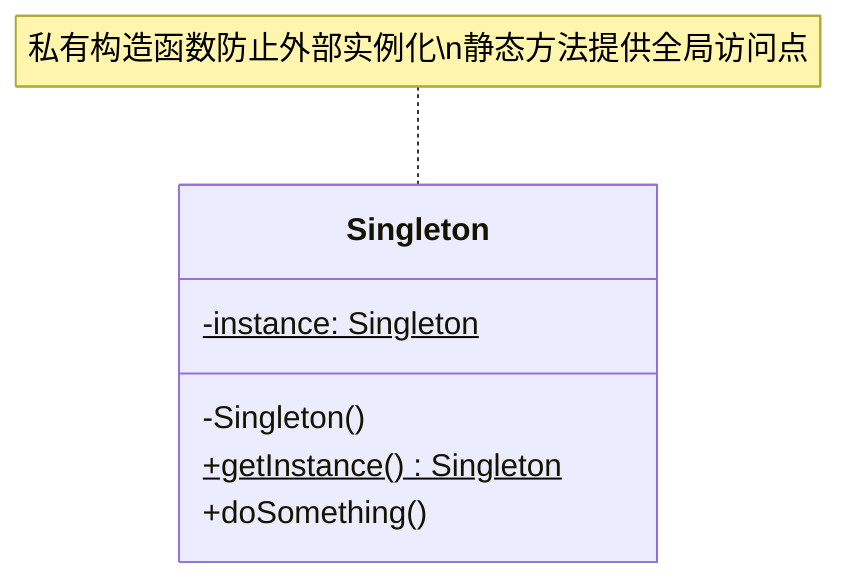
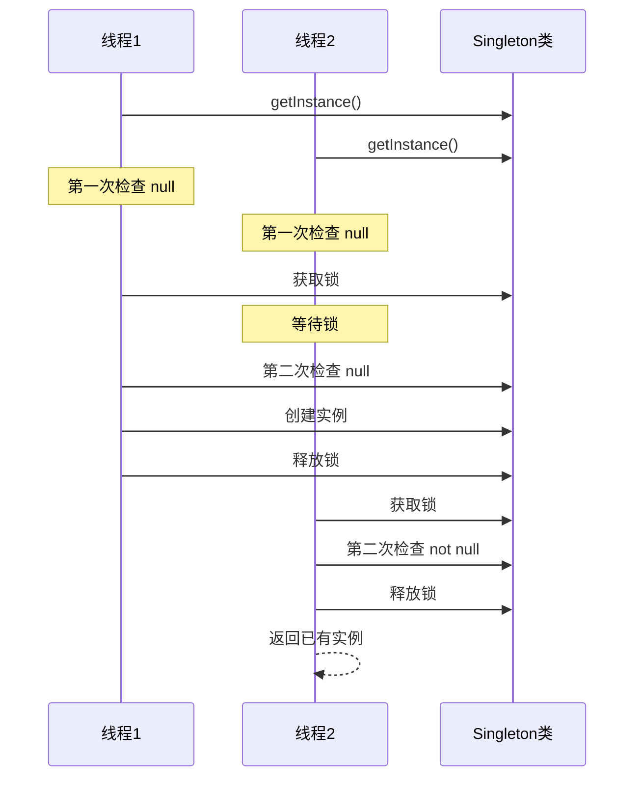

# 单例模式 (Singleton Pattern)

## 模式定义

**单例模式**是一种创建型设计模式，它保证一个类只有一个实例，并提供一个全局访问点来获取这个实例。



## 问题分析

在某些情况下，我们希望某个类在整个应用程序生命周期内只存在一个实例：

- 数据库连接池
- 日志记录器
- 配置管理器
- 线程池
- 缓存管理器

> [!WARNING]
> 过度使用单例模式可能导致代码耦合度过高，降低可测试性。只在真正需要全局唯一实例时使用。

## 实现方式对比

| 实现方式             | 线程安全 | 懒加载 | 性能   | 复杂度 | 推荐度     |
| -------------------- | -------- | ------ | ------ | ------ | ---------- |
| 懒加载单例（不安全） | ❌       | ✅     | ⭐⭐⭐ | ⭐     | ❌         |
| 饿汉式单例           | ✅       | ❌     | ⭐⭐⭐ | ⭐     | ⭐⭐       |
| 同步方法单例         | ✅       | ✅     | ⭐     | ⭐     | ⭐         |
| 双重检查锁定         | ✅       | ✅     | ⭐⭐⭐ | ⭐⭐⭐ | ⭐⭐⭐     |
| 静态内部类           | ✅       | ✅     | ⭐⭐⭐ | ⭐⭐   | ⭐⭐⭐⭐⭐ |
| 枚举单例             | ✅       | ❌     | ⭐⭐⭐ | ⭐     | ⭐⭐⭐⭐   |

## 实现方式详解

### 1. 懒加载单例（线程不安全）❌

```java
/**
 * 懒加载单例 - 仅适用于单线程环境
 * 优点：延迟加载，节省资源
 * 缺点：多线程环境下可能创建多个实例
 */
public class LazySingleton {
    // 静态实例变量，初始为 null
    private static LazySingleton instance;

    // 私有构造函数，防止外部通过 new 关键字创建实例
    private LazySingleton() {
    }

    // 获取实例的静态方法
    public static LazySingleton getInstance() {
        // 问题：多线程同时执行到这里时，可能创建多个实例
        if (instance == null) {
            instance = new LazySingleton();
        }
        return instance;
    }
}
```

> [!CAUTION]
> 此实现在多线程环境下不安全！如果两个线程同时调用 `getInstance()`，可能会创建两个实例。**不要在生产环境中使用！**

### 2. 饿汉式单例（线程安全）✅

```java
/**
 * 饿汉式单例 - 类加载时即创建实例
 * 优点：实现简单，天然线程安全
 * 缺点：无论是否使用都会创建实例，可能浪费内存
 */
public class EagerSingleton {
    // 类加载时就创建实例（饿汉式）
    // static final 保证线程安全且不可修改
    private static final EagerSingleton instance = new EagerSingleton();

    // 私有构造函数
    private EagerSingleton() {
    }

    // 直接返回已创建的实例
    public static EagerSingleton getInstance() {
        return instance;
    }
}
```

> [!TIP]
> 适用于确定会使用该实例且实例占用资源较小的场景。由于 JVM 类加载机制保证线程安全，无需额外同步。

### 3. 懒加载单例（同步方法）✅

```java
/**
 * 同步方法单例 - 通过 synchronized 保证线程安全
 * 优点：线程安全，延迟加载
 * 缺点：每次调用都需要同步，性能较差
 */
public class SynchronizedSingleton {
    private static SynchronizedSingleton instance;

    private SynchronizedSingleton() {
    }

    // synchronized 关键字保证同一时刻只有一个线程可以执行此方法
    // 缺点：即使实例已创建，每次调用仍需要同步，影响性能
    public static synchronized SynchronizedSingleton getInstance() {
        if (instance == null) {
            instance = new SynchronizedSingleton();
        }
        return instance;
    }
}
```

> [!NOTE]
> synchronized 方法在高并发场景下性能较差，因为每次调用都需要获取锁，即使实例已经创建。

### 4. 双重检查锁定（推荐）⭐⭐⭐

```java
/**
 * 双重检查锁定（Double-Checked Locking）
 * 优点：线程安全、延迟加载、高性能
 * 适用场景：需要延迟加载且对性能有要求的场景
 */
public class DoubleCheckedSingleton {
    // volatile 关键字防止指令重排序
    // 确保 instance 在多线程环境下的可见性和有序性
    private static volatile DoubleCheckedSingleton instance;

    private DoubleCheckedSingleton() {
    }

    public static DoubleCheckedSingleton getInstance() {
        // 第一次检查：避免不必要的同步
        if (instance == null) {
            // 同步块：只在首次创建时需要同步
            synchronized (DoubleCheckedSingleton.class) {
                // 第二次检查：防止多个线程同时通过第一次检查
                if (instance == null) {
                    instance = new DoubleCheckedSingleton();
                }
            }
        }
        return instance;
    }
}
```

> [!IMPORTANT] > **volatile 关键字不可省略！**它防止指令重排序，确保对象完全初始化后才能被其他线程访问。没有 volatile，可能导致其他线程获取到未完全初始化的实例。



### 5. 静态内部类单例（最推荐）⭐⭐⭐⭐⭐

```java
/**
 * 静态内部类单例 - 最优雅的实现方式
 * 优点：线程安全、延迟加载、性能高、代码简洁
 * 原理：利用 JVM 类加载机制保证线程安全
 */
public class StaticInnerClassSingleton {

    // 私有构造函数
    private StaticInnerClassSingleton() {
    }

    /**
     * 静态内部类，只有在首次调用 getInstance() 时才会被加载
     * JVM 保证类加载过程的线程安全性
     */
    private static class SingletonHolder {
        // 创建单例实例
        private static final StaticInnerClassSingleton INSTANCE = new StaticInnerClassSingleton();
    }

    /**
     * 获取单例实例
     * 首次调用时触发 SingletonHolder 类加载，创建实例
     */
    public static StaticInnerClassSingleton getInstance() {
        return SingletonHolder.INSTANCE;
    }
}
```

> [!TIP] > **这是最推荐的实现方式！** 它结合了懒加载和线程安全的优点，且代码简洁易懂。JVM 的类加载机制天然保证线程安全，无需手动同步。

**工作原理：**

- 外部类加载时，`SingletonHolder` 不会被加载
- 首次调用 `getInstance()` 时，才会加载 `SingletonHolder` 类
- JVM 保证类加载过程的线程安全，只会执行一次
- 后续调用直接返回已创建的实例

### 6. 枚举单例（最安全）⭐⭐⭐⭐

```java
/**
 * 枚举单例 - Josh Bloch 推荐的方式
 * 优点：
 * 1. 代码最简洁
 * 2. 天然线程安全
 * 3. 防止反射攻击
 * 4. 防止序列化破坏
 * 缺点：不支持延迟加载
 */
public enum EnumSingleton {
    INSTANCE;

    // 可以添加业务方法
    public void doSomething() {
        System.out.println("执行业务逻辑");
    }

    // 可以添加字段
    private String value;

    public String getValue() {
        return value;
    }

    public void setValue(String value) {
        this.value = value;
    }
}

// 使用方式
class Client {
    public static void main(String[] args) {
        // 直接通过枚举常量访问
        EnumSingleton.INSTANCE.doSomething();
        EnumSingleton.INSTANCE.setValue("配置值");
        System.out.println(EnumSingleton.INSTANCE.getValue());
    }
}
```

> [!IMPORTANT] > **枚举单例是防止反射和序列化破坏的最佳方案！** 《Effective Java》作者 Josh Bloch 强烈推荐使用枚举实现单例。

## 实际应用示例

### 日志记录器

```java
/**
 * 全局日志记录器
 * 使用静态内部类实现单例
 */
public class Logger {

    private Logger() {
        // 初始化日志配置
    }

    private static class LoggerHolder {
        private static final Logger INSTANCE = new Logger();
    }

    public static Logger getInstance() {
        return LoggerHolder.INSTANCE;
    }

    /**
     * 记录日志
     */
    public void log(String message) {
        System.out.println("[" + System.currentTimeMillis() + "] " + message);
    }

    public void error(String message) {
        System.err.println("[ERROR] " + message);
    }
}

// 使用示例
class Application {
    public static void main(String[] args) {
        Logger logger = Logger.getInstance();
        logger.log("应用启动");
        logger.error("发生错误");
    }
}
```

### 配置管理器

```java
import java.util.HashMap;
import java.util.Map;

/**
 * 全局配置管理器
 * 使用静态内部类实现延迟加载的单例
 */
public class ConfigManager {
    private Map<String, String> config = new HashMap<>();

    private ConfigManager() {
        // 加载配置文件
        loadConfig();
    }

    private static class ConfigHolder {
        private static final ConfigManager INSTANCE = new ConfigManager();
    }

    public static ConfigManager getInstance() {
        return ConfigHolder.INSTANCE;
    }

    /**
     * 从配置文件或环境变量加载配置
     */
    private void loadConfig() {
        config.put("db.url", "jdbc:mysql://localhost:3306/mydb");
        config.put("db.user", "root");
        config.put("db.password", "password");
        config.put("app.name", "MyApplication");
    }

    /**
     * 获取配置项
     */
    public String get(String key) {
        return config.get(key);
    }

    /**
     * 获取配置项，如果不存在返回默认值
     */
    public String get(String key, String defaultValue) {
        return config.getOrDefault(key, defaultValue);
    }
}

// 使用示例
class DatabaseConnection {
    public void connect() {
        ConfigManager config = ConfigManager.getInstance();
        String url = config.get("db.url");
        String user = config.get("db.user");
        System.out.println("连接到数据库: " + url + " 用户: " + user);
    }
}
```

### 数据库连接池（枚举实现）

```java
import java.sql.Connection;
import java.util.concurrent.ArrayBlockingQueue;
import java.util.concurrent.BlockingQueue;

/**
 * 数据库连接池单例
 * 使用枚举实现，防止反射破坏
 */
public enum ConnectionPool {
    INSTANCE;

    private final BlockingQueue<Connection> pool;
    private static final int POOL_SIZE = 10;

    // 枚举构造函数在类加载时执行，且只执行一次
    ConnectionPool() {
        pool = new ArrayBlockingQueue<>(POOL_SIZE);
        // 初始化连接池
        initializePool();
    }

    private void initializePool() {
        // 创建初始连接（简化示例）
        System.out.println("初始化连接池，大小: " + POOL_SIZE);
    }

    /**
     * 获取数据库连接
     */
    public Connection getConnection() throws InterruptedException {
        return pool.take();
    }

    /**
     * 归还数据库连接
     */
    public void releaseConnection(Connection conn) throws InterruptedException {
        pool.put(conn);
    }
}

// 使用示例
class DatabaseService {
    public void executeQuery() {
        try {
            Connection conn = ConnectionPool.INSTANCE.getConnection();
            // 执行数据库操作
            ConnectionPool.INSTANCE.releaseConnection(conn);
        } catch (InterruptedException e) {
            e.printStackTrace();
        }
    }
}
```

## 单例模式的破坏与防御

### 1. 反射破坏

```java
/**
 * 反射可以破坏单例模式
 */
class ReflectionAttack {
    public static void main(String[] args) throws Exception {
        // 正常获取实例
        StaticInnerClassSingleton instance1 = StaticInnerClassSingleton.getInstance();

        // 使用反射获取构造函数
        Constructor<StaticInnerClassSingleton> constructor =
            StaticInnerClassSingleton.class.getDeclaredConstructor();
        constructor.setAccessible(true);

        // 创建新实例
        StaticInnerClassSingleton instance2 = constructor.newInstance();

        // 两个实例不相同！
        System.out.println(instance1 == instance2); // false
    }
}
```

**防御方法：在构造函数中检查**

```java
public class DefensiveSingleton {
    private static volatile boolean initialized = false;

    private DefensiveSingleton() {
        synchronized (DefensiveSingleton.class) {
            if (initialized) {
                throw new RuntimeException("单例对象已存在，禁止反射创建!");
            }
            initialized = true;
        }
    }

    // ... 其他代码
}
```

> [!TIP] > **枚举单例天然防御反射攻击！** 枚举类型的 JVM 实现禁止通过反射创建实例。

### 2. 序列化破坏

```java
import java.io.*;

/**
 * 序列化可能破坏单例
 */
class SerializationTest {
    public static void main(String[] args) throws Exception {
        Singleton instance1 = Singleton.getInstance();

        // 序列化
        ObjectOutputStream oos = new ObjectOutputStream(new FileOutputStream("singleton.ser"));
        oos.writeObject(instance1);
        oos.close();

        // 反序列化
        ObjectInputStream ois = new ObjectInputStream(new FileInputStream("singleton.ser"));
        Singleton instance2 = (Singleton) ois.readObject();
        ois.close();

        // 两个实例不相同！
        System.out.println(instance1 == instance2); // false
    }
}
```

**防御方法：添加 readResolve 方法**

```java
import java.io.Serializable;

public class SerializableSingleton implements Serializable {
    private static final long serialVersionUID = 1L;

    private SerializableSingleton() {
    }

    private static class SingletonHolder {
        private static final SerializableSingleton INSTANCE = new SerializableSingleton();
    }

    public static SerializableSingleton getInstance() {
        return SingletonHolder.INSTANCE;
    }

    /**
     * 反序列化时调用此方法，返回已有实例
     * 防止序列化破坏单例
     */
    private Object readResolve() {
        return SingletonHolder.INSTANCE;
    }
}
```

> [!IMPORTANT]
> 如果单例类需要序列化，必须实现 `readResolve()` 方法返回已有实例，否则反序列化会创建新实例。

## 优缺点

### 优点

- ✅ 内存中仅有一个实例，节省资源
- ✅ 提供全局访问点，易于获取和管理
- ✅ 支持延迟加载（懒加载实现）
- ✅ 避免对资源的多重占用

### 缺点

- ❌ 隐藏了类之间的依赖关系，不易察觉
- ❌ 违反单一职责原则（既管理实例又实现业务）
- ❌ 不利于单元测试（难以 mock）
- ❌ 可能造成全局状态混乱
- ❌ 在分布式系统中难以保证单例

## 适用场景

- ✓ **数据库连接池** - 管理数据库连接资源
- ✓ **日志记录器** - 全局统一的日志输出
- ✓ **配置管理器** - 全局配置信息访问
- ✓ **线程池** - 管理线程资源
- ✓ **缓存** - 全局缓存管理
- ✓ **应用程序上下文** - Spring ApplicationContext

## Java 标准库中的应用

```java
// Runtime - 饿汉式单例
Runtime runtime = Runtime.getRuntime();

// Desktop - 懒加载单例
Desktop desktop = Desktop.getDesktop();

// Calendar - 工厂方法返回单例
Calendar calendar = Calendar.getInstance();
```

## Spring 框架中的单例

```java
/**
 * Spring Bean 默认是单例模式
 */
@Component
public class UserService {
    // Spring 容器保证此 bean 为单例
}

// 配置类方式
@Configuration
public class AppConfig {
    @Bean
    @Scope("singleton") // 默认就是 singleton，可省略
    public DataSource dataSource() {
        return new HikariDataSource();
    }
}
```

> [!NOTE]
> Spring 的单例是基于容器的单例，不同于 GOF 单例模式。每个 Spring 容器中只有一个 bean 实例，但不同容器可以有多个实例。

## 最佳实践建议

1. **优先选择静态内部类实现** - 代码简洁且高效
2. **需要防御攻击时使用枚举** - 最安全的实现方式
3. **避免过度使用** - 不要把所有全局对象都做成单例
4. **考虑依赖注入** - 使用 Spring 等框架管理单例更灵活
5. **注意线程安全** - 单例对象的方法应该是线程安全的
6. **考虑分布式场景** - 分布式系统中可能需要分布式锁

## 相关模式

- **工厂模式** - 单例工厂负责创建对象
- **抽象工厂模式** - 工厂本身可以是单例
- **原型模式** - 与单例相反，原型用于创建多个实例

## 总结

单例模式是最简单但也最常用的设计模式之一。选择合适的实现方式很重要：

- **简单场景** → 饿汉式或枚举
- **需要延迟加载** → 静态内部类
- **需要防御反射/序列化** → 枚举
- **企业应用** → 使用 Spring 等 IoC 容器管理
