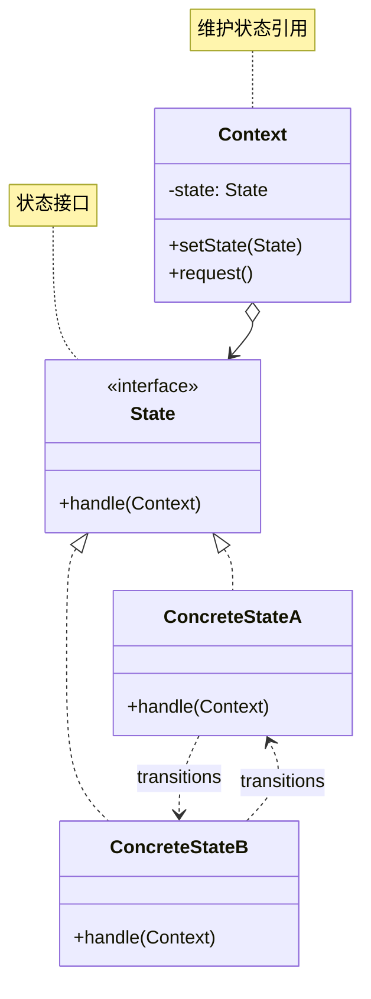
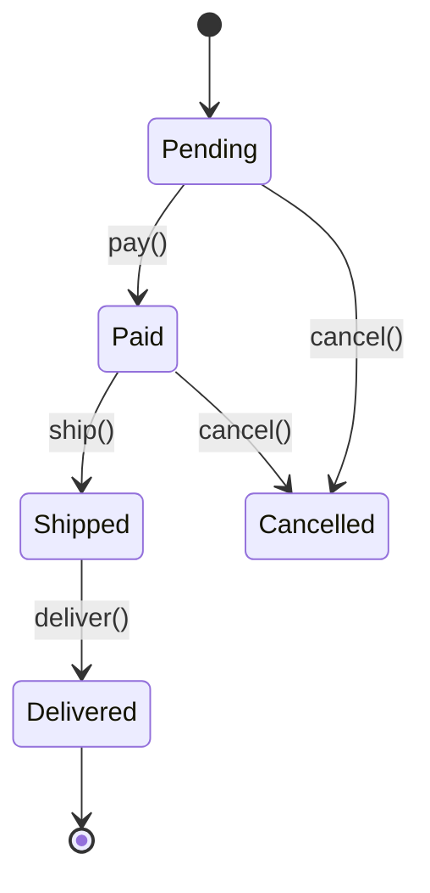
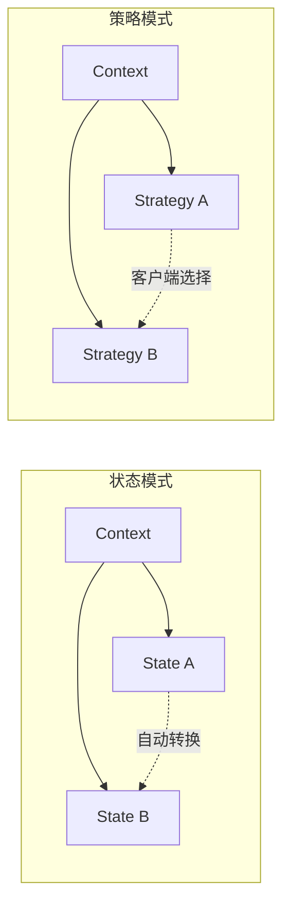

# 状态模式 (State Pattern)

## 模式定义

**状态模式**是一种行为型设计模式，它允许对象在其内部状态改变时改变其行为。对象看起来好像修改了它的类。



## 问题分析

当对象行为取决于其状态，并且需要在运行时根据状态改变行为时，使用大量 if-else 会导致：

```java
// ❌ 不好的做法：大量条件判断
public class Order {
    private String state;  // "PENDING", "PAID", "SHIPPED", "DELIVERED"

    public void pay() {
        if ("PENDING".equals(state)) {
            System.out.println("支付成功");
            state = "PAID";
        } else if ("PAID".equals(state)) {
            System.out.println("订单已支付");
        } else if ("SHIPPED".equals(state)) {
            System.out.println("订单已发货，无法支付");
        } else if ("DELIVERED".equals(state)) {
            System.out.println("订单已完成，无法支付");
        }
    }

    public void ship() {
        if ("PENDING".equals(state)) {
            System.out.println("未支付，无法发货");
        } else if ("PAID".equals(state)) {
            System.out.println("发货成功");
            state = "SHIPPED";
        } else if ("SHIPPED".equals(state)) {
            System.out.println("订单已发货");
        } else if ("DELIVERED".equals(state)) {
            System.out.println("订单已完成");
        }
    }

    // 更多状态操作...每个方法都要重复这些判断！
}
```

**问题**：

- ❌ 条件判断语句过多且重复
- ❌ 添加新状态需要修改所有方法
- ❌ 状态转换逻辑分散
- ❌ 违反开闭原则

> [!WARNING] > **状态爆炸**：如果有 5 个状态和 10 个操作，就需要写 50 个 if-else 分支！代码将变得难以维护。

## 解决方案

将每个状态封装为独立的类：



> [!IMPORTANT] > **状态模式的核心**：
>
> - 每个状态是一个独立的类
> - 状态类负责状态转换逻辑
> - Context 维护当前状态引用
> - 状态转换更加清晰和易于维护

## 代码实现

### 场景：订单状态管理

订单有多个状态：待支付、已支付、已发货、已送达、已取消。

#### 1. 定义状态接口

```java
/**
 * 订单状态接口（State）
 */
public interface OrderState {
    /**
     * 支付订单
     */
    void pay(Order order);

    /**
     * 发货
     */
    void ship(Order order);

    /**
     * 确认收货
     */
    void deliver(Order order);

    /**
     * 取消订单
     */
    void cancel(Order order);

    /**
     * 获取状态名称
     */
    String getStateName();
}
```

#### 2. 具体状态类

```java
/**
 * 待支付状态（ConcreteState）
 */
public class PendingState implements OrderState {
    @Override
    public void pay(Order order) {
        System.out.println("💳 支付成功！订单进入已支付状态");
        order.setState(new PaidState());
    }

    @Override
    public void ship(Order order) {
        System.out.println("❌ 订单尚未支付，无法发货");
    }

    @Override
    public void deliver(Order order) {
        System.out.println("❌ 订单尚未支付，无法确认收货");
    }

    @Override
    public void cancel(Order order) {
        System.out.println("🚫 订单已取消");
        order.setState(new CancelledState());
    }

    @Override
    public String getStateName() {
        return "待支付";
    }
}

/**
 * 已支付状态
 */
public class PaidState implements OrderState {
    @Override
    public void pay(Order order) {
        System.out.println("ℹ️  订单已支付，无需重复支付");
    }

    @Override
    public void ship(Order order) {
        System.out.println("📦 订单已发货！");
        order.setState(new ShippedState());
    }

    @Override
    public void deliver(Order order) {
        System.out.println("❌ 订单尚未发货，无法确认收货");
    }

    @Override
    public void cancel(Order order) {
        System.out.println("🚫 订单已取消，将退款");
        order.setState(new CancelledState());
    }

    @Override
    public String getStateName() {
        return "已支付";
    }
}

/**
 * 已发货状态
 */
public class ShippedState implements OrderState {
    @Override
    public void pay(Order order) {
        System.out.println("ℹ️  订单已支付");
    }

    @Override
    public void ship(Order order) {
        System.out.println("ℹ️  订单已在配送中");
    }

    @Override
    public void deliver(Order order) {
        System.out.println("✅ 订单已送达！");
        order.setState(new DeliveredState());
    }

    @Override
    public void cancel(Order order) {
        System.out.println("❌ 订单已发货，无法取消");
    }

    @Override
    public String getStateName() {
        return "已发货";
    }
}

/**
 * 已送达状态
 */
public class DeliveredState implements OrderState {
    @Override
    public void pay(Order order) {
        System.out.println("ℹ️  订单已完成");
    }

    @Override
    public void ship(Order order) {
        System.out.println("ℹ️  订单已送达");
    }

    @Override
    public void deliver(Order order) {
        System.out.println("ℹ️  订单已确认收货");
    }

    @Override
    public void cancel(Order order) {
        System.out.println("❌ 订单已完成，无法取消");
    }

    @Override
    public String getStateName() {
        return "已送达";
    }
}

/**
 * 已取消状态
 */
public class CancelledState implements OrderState {
    @Override
    public void pay(Order order) {
        System.out.println("❌ 订单已取消，无法支付");
    }

    @Override
    public void ship(Order order) {
        System.out.println("❌ 订单已取消，无法发货");
    }

    @Override
    public void deliver(Order order) {
        System.out.println("❌ 订单已取消，无法送达");
    }

    @Override
    public void cancel(Order order) {
        System.out.println("ℹ️  订单已取消");
    }

    @Override
    public String getStateName() {
        return "已取消";
    }
}
```

#### 3. 上下文类（Context）

```java
/**
 * 订单类（Context）
 * 维护当前状态的引用
 */
public class Order {
    private String orderId;
    private OrderState state;

    public Order(String orderId) {
        this.orderId = orderId;
        this.state = new PendingState();  // 初始状态：待支付
        System.out.println("📝 创建订单: " + orderId);
        printState();
    }

    /**
     * 设置状态
     */
    public void setState(OrderState state) {
        this.state = state;
        printState();
    }

    /**
     * 支付
     */
    public void pay() {
        System.out.println("\n--- 执行操作：支付 ---");
        state.pay(this);
    }

    /**
     * 发货
     */
    public void ship() {
        System.out.println("\n--- 执行操作：发货 ---");
        state.ship(this);
    }

    /**
     * 确认收货
     */
    public void deliver() {
        System.out.println("\n--- 执行操作：确认收货 ---");
        state.deliver(this);
    }

    /**
     * 取消
     */
    public void cancel() {
        System.out.println("\n--- 执行操作：取消订单 ---");
        state.cancel(this);
    }

    /**
     * 打印当前状态
     */
    private void printState() {
        System.out.println("📊 当前状态: " + state.getStateName());
    }

    public String getOrderId() {
        return orderId;
    }
}
```

#### 4. 客户端使用

```java
/**
 * 状态模式演示
 */
public class StatePatternDemo {
    public static void main(String[] args) {
        System.out.println("========== 订单状态流转演示 ==========\n");

        // 场景1：正常流程
        System.out.println("【场景1：正常订单流程】");
        Order order1 = new Order("ORDER001");
        order1.pay();       // 待支付 → 已支付
        order1.ship();      // 已支付 → 已发货
        order1.deliver();   // 已发货 → 已送达

        // 场景2：尝试非法操作
        System.out.println("\n\n【场景2：尝试非法操作】");
        Order order2 = new Order("ORDER002");
        order2.ship();      // 未支付，无法发货
        order2.deliver();   // 未支付，无法送达

        // 场景3：取消订单
        System.out.println("\n\n【场景3：取消订单】");
        Order order3 = new Order("ORDER003");
        order3.pay();       // 待支付 → 已支付
        order3.cancel();    // 已支付 → 已取消
        order3.ship();      // 已取消，无法发货

        // 场景4：已发货后无法取消
        System.out.println("\n\n【场景4：已发货后无法取消】");
        Order order4 = new Order("ORDER004");
        order4.pay();       // 待支付 → 已支付
        order4.ship();      // 已支付 → 已发货
        order4.cancel();    // 已发货，无法取消
    }
}
```

**输出：**

```
========== 订单状态流转演示 ==========

【场景1：正常订单流程】
📝 创建订单: ORDER001
📊 当前状态: 待支付

--- 执行操作：支付 ---
💳 支付成功！订单进入已支付状态
📊 当前状态: 已支付

--- 执行操作：发货 ---
📦 订单已发货！
📊 当前状态: 已发货

--- 执行操作：确认收货 ---
✅ 订单已送达！
📊 当前状态: 已送达


【场景2：尝试非法操作】
📝 创建订单: ORDER002
📊 当前状态: 待支付

--- 执行操作：发货 ---
❌ 订单尚未支付，无法发货

--- 执行操作：确认收货 ---
❌ 订单尚未支付，无法确认收货
```

> [!TIP] > **状态模式的优势**：每个状态的行为逻辑都封装在其对应的状态类中，添加新状态只需新建一个状态类，无需修改现有代码！

## 实际应用示例

### 示例 1：TCP 连接状态

```java
/**
 * TCP连接状态接口
 */
public interface TCPState {
    void open(TCPConnection connection);
    void close(TCPConnection connection);
    void acknowledge(TCPConnection connection);
    String getStateName();
}

/**
 * 关闭状态
 */
public class ClosedState implements TCPState {
    @Override
    public void open(TCPConnection connection) {
        System.out.println("🔌 建立连接...");
        connection.setState(new EstablishedState());
    }

    @Override
    public void close(TCPConnection connection) {
        System.out.println("ℹ️  连接已关闭");
    }

    @Override
    public void acknowledge(TCPConnection connection) {
        System.out.println("❌ 连接未建立，无法确认");
    }

    @Override
    public String getStateName() {
        return "CLOSED";
    }
}

/**
 * 已建立状态
 */
public class EstablishedState implements TCPState {
    @Override
    public void open(TCPConnection connection) {
        System.out.println("ℹ️  连接已建立");
    }

    @Override
    public void close(TCPConnection connection) {
        System.out.println("🔒 关闭连接...");
        connection.setState(new ClosedState());
    }

    @Override
    public void acknowledge(TCPConnection connection) {
        System.out.println("✅ 数据传输确认");
    }

    @Override
    public String getStateName() {
        return "ESTABLISHED";
    }
}

/**
 * TCP连接
 */
public class TCPConnection {
    private TCPState state = new ClosedState();

    public void setState(TCPState state) {
        this.state = state;
        System.out.println("📊 连接状态: " + state.getStateName());
    }

    public void open() {
        state.open(this);
    }

    public void close() {
        state.close(this);
    }

    public void acknowledge() {
        state.acknowledge(this);
    }
}
```

### 示例 2：游戏角色状态

```java
/**
 * 游戏角色状态接口
 */
public interface PlayerState {
    void move(Player player);
    void attack(Player player);
    void defend(Player player);
    void rest(Player player);
    String getStateName();
}

/**
 * 正常状态
 */
public class NormalState implements PlayerState {
    @Override
    public void move(Player player) {
        System.out.println("🏃 正常移动");
    }

    @Override
    public void attack(Player player) {
        System.out.println("⚔️  攻击敌人，造成100点伤害");
        player.reduceStamina(20);
        if (player.getStamina() <= 0) {
            player.setState(new TiredState());
        }
    }

    @Override
    public void defend(Player player) {
        System.out.println("🛡️  进入防御姿态");
        player.setState(new DefendingState());
    }

    @Override
    public void rest(Player player) {
        System.out.println("😴 休息中，恢复体力...");
        player.setState(new RestingState());
    }

    @Override
    public String getStateName() {
        return "正常";
    }
}

/**
 * 防御状态
 */
public class DefendingState implements PlayerState {
    @Override
    public void move(Player player) {
        System.out.println("🐌 防御姿态下移动缓慢");
    }

    @Override
    public void attack(Player player) {
        System.out.println("⚔️  退出防御，发起反击！");
        player.setState(new NormalState());
    }

    @Override
    public void defend(Player player) {
        System.out.println("🛡️  继续防御，伤害减少70%");
    }

    @Override
    public void rest(Player player) {
        System.out.println("😴 退出防御，开始休息");
        player.setState(new RestingState());
    }

    @Override
    public String getStateName() {
        return "防御中";
    }
}

/**
 * 疲劳状态
 */
public class TiredState implements PlayerState {
    @Override
    public void move(Player player) {
        System.out.println("🐌 体力不足，移动缓慢");
    }

    @Override
    public void attack(Player player) {
        System.out.println("⚔️  体力不足，攻击力下降50%");
    }

    @Override
    public void defend(Player player) {
        System.out.println("❌ 体力不足，无法防御");
    }

    @Override
    public void rest(Player player) {
        System.out.println("😴 休息恢复体力");
        player.setState(new RestingState());
    }

    @Override
    public String getStateName() {
        return "疲劳";
    }
}

/**
 * 休息状态
 */
public class RestingState implements PlayerState {
    private int restCount = 0;

    @Override
    public void move(Player player) {
        System.out.println("🏃 打断休息，恢复正常");
       player.setState(new NormalState());
    }

    @Override
    public void attack(Player player) {
        System.out.println("⚔️  打断休息，发起攻击");
        player.setState(new NormalState());
    }

    @Override
    public void defend(Player player) {
        System.out.println("🛡️  打断休息，进入防御");
        player.setState(new DefendingState());
    }

    @Override
    public void rest(Player player) {
        restCount++;
        System.out.println("😴 休息中... (" + restCount + "/3)");
        player.recoverStamina(30);
        if (restCount >= 3) {
            System.out.println("✅ 体力恢复完毕");
            player.setState(new NormalState());
        }
    }

    @Override
    public String getStateName() {
        return "休息中";
    }
}

/**
 * 游戏角色
 */
public class Player {
    private String name;
    private int stamina = 100;
    private PlayerState state = new NormalState();

    public Player(String name) {
        this.name = name;
    }

    public void setState(PlayerState state) {
        this.state = state;
        System.out.println("📊 " + name + " 状态: " + state.getStateName());
    }

    public void move() {
        state.move(this);
    }

    public void attack() {
        state.attack(this);
    }

    public void defend() {
        state.defend(this);
    }

    public void rest() {
        state.rest(this);
    }

    public void reduceStamina(int amount) {
        stamina -= amount;
        System.out.println("💪 体力: " + stamina);
    }

    public void recoverStamina(int amount) {
        stamina = Math.min(100, stamina + amount);
        System.out.println("💪 体力: " + stamina);
    }

    public int getStamina() {
        return stamina;
    }
}
```

## Java 标准库中的应用

### 1. Thread 状态

```java
/**
 * Thread的状态就是状态模式
 */
Thread.State state = thread.getState();
// NEW, RUNNABLE, BLOCKED, WAITING, TIMED_WAITING, TERMINATED
```

### 2. NIO 的 SocketChannel

```java
/**
 * NIO的SocketChannel有不同状态
 */
SocketChannel channel = SocketChannel.open();
// 状态：未连接、正在连接、已连接
```

## 状态模式 vs 策略模式



| 特性              | 状态模式           | 策略模式           |
| ----------------- | ------------------ | ------------------ |
| **目的**          | 改变对象行为       | 替换算法           |
| **转换方式**      | 状态自动转换       | 客户端选择         |
| **状态/策略关系** | 状态间有关联       | 策略间独立         |
| **Context 感知**  | 感知状态变化       | 不感知策略         |
| **典型应用**      | 订单流程、游戏状态 | 排序算法、支付方式 |

> [!NOTE] > **核心区别**：状态模式中状态会自动转换，而策略模式中策略由客户端选择。

## 优缺点

### 优点

- ✅ **消除条件判断** - 避免大量 if-else
- ✅ **符合开闭原则** - 新增状态无需修改现有代码
- ✅ **状态转换清晰** - 转换逻辑集中在状态类中
- ✅ **符合单一职责** - 每个状态类只负责一个状态
- ✅ **易于维护和扩展** - 状态逻辑独立

### 缺点

- ❌ **类数量增多** - 每个状态一个类
- ❌ **代码复杂度增加** - 需要理解状态转换图
- ❌ **状态转换分散** - 转换逻辑在各个状态类中

## 适用场景

### 何时使用状态模式

- ✓ **对象有多个状态** - 行为随状态改变
- ✓ **状态间有转换规则** - 明确的状态转换图
- ✓ **条件判断复杂** - 大量 if-else 判断状态
- ✓ **状态相关代码集中** - 避免散落各处

### 实际应用场景

- 📦 **订单系统** - 待支付、已支付、已发货等
- 🎮 **游戏开发** - 角色状态、敌人 AI
- 📄 **文档审批** - 草稿、审核中、已发布
- 🌐 **网络连接** - TCP 状态、HTTP 请求状态
- 🚦 **工作流引擎** - 流程各个阶段

## 最佳实践

### 1. 使用枚举定义状态

```java
/**
 * 可以用枚举管理状态实例
 */
public enum OrderStateEnum {
    PENDING(new PendingState()),
    PAID(new PaidState()),
    SHIPPED(new ShippedState()),
    DELIVERED(new DeliveredState());

    private final OrderState state;

    OrderStateEnum(OrderState state) {
        this.state = state;
    }

    public OrderState getState() {
        return state;
    }
}
```

### 2. 状态转换表

```java
/**
 * 定义状态转换表
 */
public class StateTransitionTable {
    private static final Map<String, Map<String, OrderState>> transitions = new HashMap<>();

    static {
        Map<String, OrderState> pendingTrans = new HashMap<>();
        pendingTrans.put("pay", new PaidState());
        pendingTrans.put("cancel", new CancelledState());
        transitions.put("PENDING", pendingTrans);

        // 其他状态转换...
    }

    public static OrderState getNextState(String currentState, String action) {
        return transitions.get(currentState).get(action);
    }
}
```

### 3. 状态持久化

```java
/**
 * 状态持久化到数据库
 */
public class Order {
    @Transient
    private OrderState state;

    @Column(name = "state_name")
    private String stateName;

    @PostLoad
    private void initState() {
        // 从数据库加载后恢复状态对象
        this.state = StateFactory.createState(stateName);
    }

    @PrePersist
    @PreUpdate
    private void saveState() {
        // 保存前记录状态名称
        this.stateName = state.getStateName();
    }
}
```

### 4. 使用 Spring State Machine

```java
/**
 * 使用Spring State Machine简化状态管理
 */
@Configuration
@EnableStateMachine
public class OrderStateMachineConfig
    extends StateMachineConfigurerAdapter<OrderStates, OrderEvents> {

    @Override
    public void configure(StateMachineStateConfigurer<OrderStates, OrderEvents> states)
            throws Exception {
        states
            .withStates()
            .initial(OrderStates.PENDING)
            .states(EnumSet.allOf(OrderStates.class));
    }

    @Override
    public void configure(StateMachineTransitionConfigurer<OrderStates, OrderEvents> transitions)
            throws Exception {
        transitions
            .withExternal()
                .source(OrderStates.PENDING).target(OrderStates.PAID)
                .event(OrderEvents.PAY)
            .and()
            .withExternal()
                .source(OrderStates.PAID).target(OrderStates.SHIPPED)
                .event(OrderEvents.SHIP);
    }
}
```

## 与其他模式的关系

- **状态 + 单例** - 状态对象通常是单例
- **状态 + 策略** - 结构相似，目的不同
- **状态 + 享元** - 共享状态对象

## 总结

状态模式是管理对象状态的有效方案：

- **核心思想** - 将状态封装成独立的类
- **关键优势** - 消除条件判断，易于扩展
- **主要缺点** - 类数量增多
- **经典应用** - 订单流程、TCP 连接、游戏状态
- **适用场景** - 对象有多个状态且频繁切换

> [!TIP] > **状态模式的精髓**：
>
> - **封装状态** - 每个状态是一个类
> - **状态转换** - 由状态对象负责
> - **消除条件** - 用多态替代 if-else
> - **易于扩展** - 新增状态无需修改现有代码

**已完成：18 个文档** ✅

继续优化下一个...
