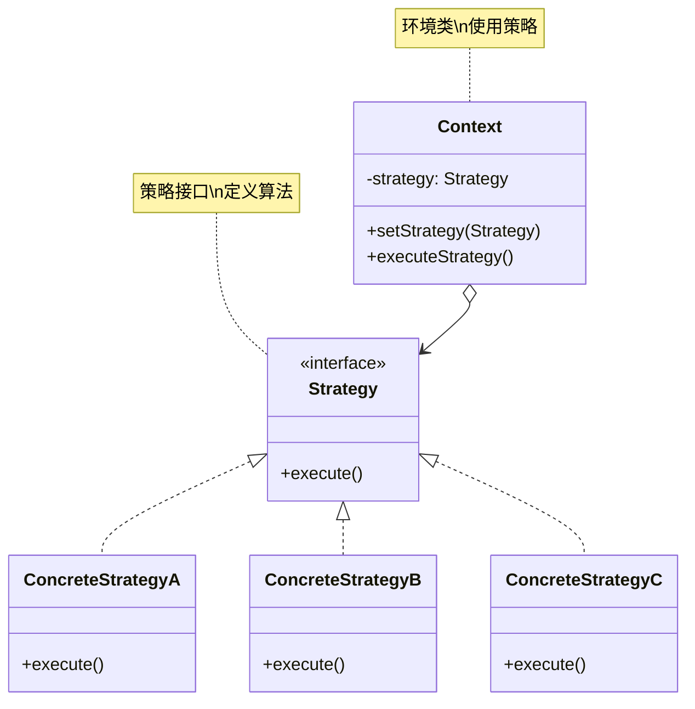
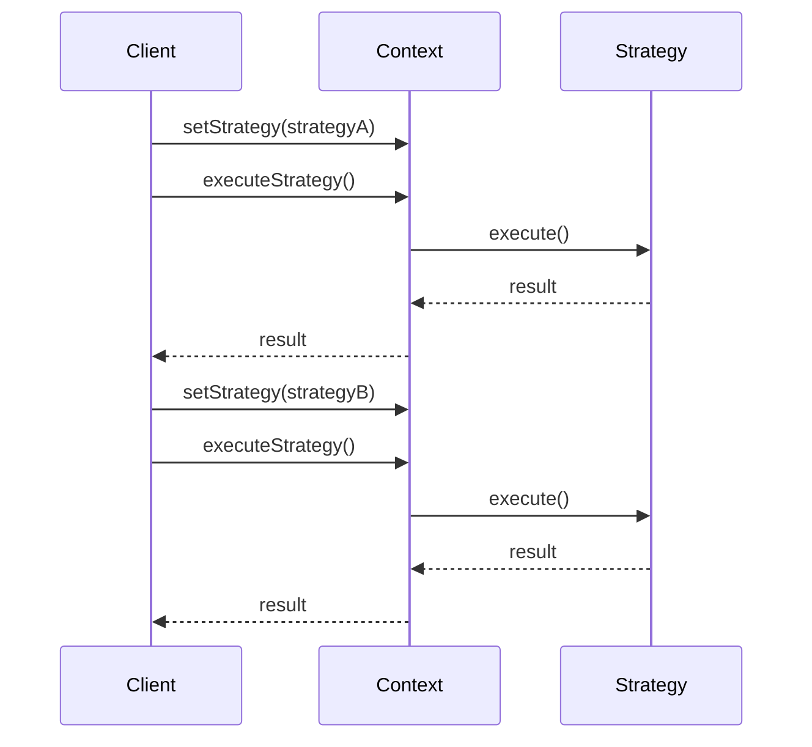

# 策略模式 (Strategy Pattern)

## 模式定义

**策略模式**是一种行为型设计模式，它定义了一族算法，将每个算法封装起来，使它们可以相互替换。策略模式让算法的变化独立于使用算法的客户端。



## 问题分析

当有多种算法实现同一功能时，直接使用条件判断会导致代码难以维护：

```java
// ❌ 不好的做法：大量 if-else
public class PaymentProcessor {
    public void processPayment(String method, double amount) {
        if ("CREDIT_CARD".equals(method)) {
            System.out.println("信用卡支付: ¥" + amount);
            // 信用卡支付逻辑...
        } else if ("PAYPAL".equals(method)) {
            System.out.println("PayPal支付: $" + amount);
            // PayPal支付逻辑...
        } else if ("WECHAT".equals(method)) {
            System.out.println("微信支付: ¥" + amount);
            // 微信支付逻辑...
        } else if ("ALIPAY".equals(method)) {
            System.out.println("支付宝支付: ¥" + amount);
            // 支付宝支付逻辑...
        }
        // 新增支付方式需要修改这个类！
    }
}
```

**问题**：

- ❌ 条件判断复杂，代码臃肿
- ❌ 添加新算法需要修改原代码
- ❌ 违反开闭原则
- ❌ 违反单一职责原则
- ❌ 难以测试和复用

> [!WARNING] > **if-else 地狱**：假如有 10 种支付方式，就需要 10 个 if-else 分支。每次新增支付方式都要修改这个类，风险很高！

## 解决方案

将每个算法封装成独立的策略类，客户端选择使用哪个策略：



> [!IMPORTANT] > **策略模式的核心**：
>
> - 定义策略接口
> - 每个算法实现该接口
> - 环境类持有策略引用
> - 客户端选择并注入策略

## 代码实现

### 场景：电商支付系统

支持多种支付方式，用户可以选择任意一种。

#### 1. 定义策略接口

```java
/**
 * 支付策略接口（Strategy）
 */
public interface PaymentStrategy {
    /**
     * 执行支付
     * @param amount 支付金额
     * @return 是否成功
     */
    boolean pay(double amount);

    /**
     * 获取支付方式名称
     */
    String getName();
}
```

#### 2. 具体策略实现

```java
/**
 * 信用卡支付策略（ConcreteStrategy）
 */
public class CreditCardPayment implements PaymentStrategy {
    private String cardNumber;
    private String cvv;
    private String expiryDate;

    public CreditCardPayment(String cardNumber, String cvv, String expiryDate) {
        this.cardNumber = cardNumber;
        this.cvv = cvv;
        this.expiryDate = expiryDate;
    }

    @Override
    public boolean pay(double amount) {
        System.out.println("💳 使用信用卡支付");
        System.out.println("   卡号: " + maskCardNumber(cardNumber));
        System.out.println("   金额: ¥" + amount);
        // 实际支付逻辑...
        return true;
    }

    @Override
    public String getName() {
        return "信用卡";
    }

    private String maskCardNumber(String cardNumber) {
        return "**** **** **** " + cardNumber.substring(cardNumber.length() - 4);
    }
}

/**
 * 支付宝支付策略
 */
public class AlipayPayment implements PaymentStrategy {
    private String account;

    public AlipayPayment(String account) {
        this.account = account;
    }

    @Override
    public boolean pay(double amount) {
        System.out.println("💰 使用支付宝支付");
        System.out.println("   账户: " + account);
        System.out.println("   金额: ¥" + amount);
        // 实际支付逻辑...
        return true;
    }

    @Override
    public String getName() {
        return "支付宝";
    }
}

/**
 * 微信支付策略
 */
public class WeChatPayment implements PaymentStrategy {
    private String userId;

    public WeChatPayment(String userId) {
        this.userId = userId;
    }

    @Override
    public boolean pay(double amount) {
        System.out.println("💚 使用微信支付");
        System.out.println("   用户: " + userId);
        System.out.println("   金额: ¥" + amount);
        // 实际支付逻辑...
        return true;
    }

    @Override
    public String getName() {
        return "微信支付";
    }
}

/**
 * PayPal 支付策略
 */
public class PayPalPayment implements PaymentStrategy {
    private String email;

    public PayPalPayment(String email) {
        this.email = email;
    }

    @Override
    public boolean pay(double amount) {
        System.out.println("🌐 使用 PayPal 支付");
        System.out.println("   账户: " + email);
        System.out.println("   金额: $" + amount);
        // 实际支付逻辑...
        return true;
    }

    @Override
    public String getName() {
        return "PayPal";
    }
}
```

#### 3. 环境类（Context）

```java
/**
 * 购物车（Context）
 * 持有支付策略的引用
 */
public class ShoppingCart {
    private List<Item> items = new ArrayList<>();
    private PaymentStrategy paymentStrategy;

    /**
     * 添加商品
     */
    public void addItem(Item item) {
        items.add(item);
    }

    /**
     * 设置支付策略
     */
    public void setPaymentStrategy(PaymentStrategy strategy) {
        this.paymentStrategy = strategy;
    }

    /**
     * 计算总价
     */
    public double calculateTotal() {
        double total = 0;
        for (Item item : items) {
            total += item.getPrice();
        }
        return total;
    }

    /**
     * 结账
     */
    public void checkout() {
        if (paymentStrategy == null) {
            throw new IllegalStateException("请先选择支付方式！");
        }

        double total = calculateTotal();

        System.out.println("========== 订单结算 ==========");
        System.out.println("商品清单:");
        for (Item item : items) {
            System.out.println("  - " + item.getName() + ": ¥" + item.getPrice());
        }
        System.out.println("总计: ¥" + total);
        System.out.println("\n支付方式: " + paymentStrategy.getName());

        boolean success = paymentStrategy.pay(total);

        if (success) {
            System.out.println("✅ 支付成功！");
            items.clear();
        } else {
            System.out.println("❌ 支付失败！");
        }
        System.out.println("============================\n");
    }
}

/**
 * 商品类
 */
class Item {
    private String name;
    private double price;

    public Item(String name, double price) {
        this.name = name;
        this.price = price;
    }

    public String getName() {
        return name;
    }

    public double getPrice() {
        return price;
    }
}
```

#### 4. 客户端使用

```java
/**
 * 策略模式演示
 */
public class StrategyPatternDemo {
    public static void main(String[] args) {
        // 创建购物车
        ShoppingCart cart = new ShoppingCart();
        cart.addItem(new Item("Java编程思想", 108.00));
        cart.addItem(new Item("设计模式", 89.00));
        cart.addItem(new Item("重构", 79.00));

        // 场景1：使用支付宝支付
        cart.setPaymentStrategy(new AlipayPayment("user@alipay.com"));
        cart.checkout();

        // 场景2：再次购物，使用微信支付
        cart.addItem(new Item("Effective Java", 99.00));
        cart.addItem(new Item("Clean Code", 88.00));
        cart.setPaymentStrategy(new WeChatPayment("wxuser123"));
        cart.checkout();

        // 场景3：使用信用卡支付
        cart.addItem(new Item("Spring实战", 108.00));
        cart.setPaymentStrategy(new CreditCardPayment("1234567890123456", "123", "12/25"));
        cart.checkout();

        // 场景4：使用 PayPal 支付
        cart.addItem(new Item("Head First 设计模式", 118.00));
        cart.setPaymentStrategy(new PayPalPayment("user@paypal.com"));
        cart.checkout();
    }
}
```

**输出：**

```
========== 订单结算 ==========
商品清单:
  - Java编程思想: ¥108.0
  - 设计模式: ¥89.0
  - 重构: ¥79.0
总计: ¥276.0

支付方式: 支付宝
💰 使用支付宝支付
   账户: user@alipay.com
   金额: ¥276.0
✅ 支付成功！
============================

========== 订单结算 ==========
商品清单:
  - Effective Java: ¥99.0
  - Clean Code: ¥88.0
总计: ¥187.0

支付方式: 微信支付
💚 使用微信支付
   用户: wxuser123
   金额: ¥187.0
✅ 支付成功！
============================
```

> [!TIP] > **策略模式的优势**：
>
> - 新增支付方式：只需新建一个策略类
> - 切换支付方式：客户端调用 setPaymentStrategy()
> - 无需修改现有代码
> - 每个策略独立，易于测试

## 实际应用示例

### 示例 1：排序策略

```java
/**
 * 排序策略接口
 */
public interface SortStrategy {
    void sort(int[] array);
    String getName();
}

/**
 * 冒泡排序
 */
public class BubbleSort implements SortStrategy {
    @Override
    public void sort(int[] array) {
        System.out.println("使用冒泡排序");
        int n = array.length;
        for (int i = 0; i < n - 1; i++) {
            for (int j = 0; j < n - i - 1; j++) {
                if (array[j] > array[j + 1]) {
                    int temp = array[j];
                    array[j] = array[j + 1];
                    array[j + 1] = temp;
                }
            }
        }
    }

    @Override
    public String getName() {
        return "冒泡排序 O(n²)";
    }
}

/**
 * 快速排序
 */
public class QuickSort implements SortStrategy {
    @Override
    public void sort(int[] array) {
        System.out.println("使用快速排序");
        quickSort(array, 0, array.length - 1);
    }

    private void quickSort(int[] arr, int low, int high) {
        if (low < high) {
            int pi = partition(arr, low, high);
            quickSort(arr, low, pi - 1);
            quickSort(arr, pi + 1, high);
        }
    }

    private int partition(int[] arr, int low, int high) {
        int pivot = arr[high];
        int i = low - 1;
        for (int j = low; j < high; j++) {
            if (arr[j] < pivot) {
                i++;
                int temp = arr[i];
                arr[i] = arr[j];
                arr[j] = temp;
            }
        }
        int temp = arr[i + 1];
        arr[i + 1] = arr[high];
        arr[high] = temp;
        return i + 1;
    }

    @Override
    public String getName() {
        return "快速排序 O(n log n)";
    }
}

/**
 * 排序器（Context）
 */
public class ArraySorter {
    private SortStrategy strategy;

    public void setStrategy(SortStrategy strategy) {
        this.strategy = strategy;
    }

    public void sort(int[] array) {
        if (strategy == null) {
            throw new IllegalStateException("请先设置排序策略");
        }

        System.out.println("数组大小: " + array.length);
        System.out.println("策略: " + strategy.getName());

        long start = System.currentTimeMillis();
        strategy.sort(array);
        long end = System.currentTimeMillis();

        System.out.println("耗时: " + (end - start) + "ms\n");
    }
}

// 使用示例
class SortDemo {
    public static void main(String[] args) {
        int[] smallArray = {5, 2, 8, 1, 9};
        int[] largeArray = new int[10000];

        ArraySorter sorter = new ArraySorter();

        // 小数组用冒泡排序
        sorter.setStrategy(new BubbleSort());
        sorter.sort(smallArray.clone());

        // 大数组用快速排序
        sorter.setStrategy(new QuickSort());
        sorter.sort(largeArray.clone());
    }
}
```

### 示例 2：文件压缩策略

```java
/**
 * 压缩策略接口
 */
public interface CompressionStrategy {
    void compress(String sourceFile, String targetFile);
    String getExtension();
}

/**
 * ZIP 压缩
 */
public class ZipCompression implements CompressionStrategy {
    @Override
    public void compress(String sourceFile, String targetFile) {
        System.out.println("🗜️  使用 ZIP 格式压缩");
        System.out.println("   源文件: " + sourceFile);
        System.out.println("   目标文件: " + targetFile + ".zip");
        // ZIP 压缩逻辑...
    }

    @Override
    public String getExtension() {
        return ".zip";
    }
}

/**
 * RAR 压缩
 */
public class RarCompression implements CompressionStrategy {
    @Override
    public void compress(String sourceFile, String targetFile) {
        System.out.println("🗜️  使用 RAR 格式压缩");
        System.out.println("   源文件: " + sourceFile);
        System.out.println("   目标文件: " + targetFile + ".rar");
        // RAR 压缩逻辑...
    }

    @Override
    public String getExtension() {
        return ".rar";
    }
}

/**
 * 7Z 压缩
 */
public class SevenZipCompression implements CompressionStrategy {
    @Override
    public void compress(String sourceFile, String targetFile) {
        System.out.println("🗜️  使用 7Z 格式压缩");
        System.out.println("   源文件: " + sourceFile);
        System.out.println("   目标文件: " + targetFile + ".7z");
        // 7Z 压缩逻辑...
    }

    @Override
    public String getExtension() {
        return ".7z";
    }
}

/**
 * 文件压缩器
 */
public class FileCompressor {
    private CompressionStrategy strategy;

    public void setStrategy(CompressionStrategy strategy) {
        this.strategy = strategy;
    }

    public void compressFile(String sourceFile) {
        if (strategy == null) {
            throw new IllegalStateException("请先设置压缩策略");
        }

        String targetFile = sourceFile.replace(".", "_compressed.");
        strategy.compress(sourceFile, targetFile);
    }
}
```

### 示例 3：折扣计算策略

```java
/**
 * 折扣策略接口
 */
public interface DiscountStrategy {
    double applyDiscount(double originalPrice);
    String getDescription();
}

/**
 * 无折扣
 */
public class NoDiscount implements DiscountStrategy {
    @Override
    public double applyDiscount(double originalPrice) {
        return originalPrice;
    }

    @Override
    public String getDescription() {
        return "无折扣";
    }
}

/**
 * 学生折扣
 */
public class StudentDiscount implements DiscountStrategy {
    @Override
    public double applyDiscount(double originalPrice) {
        return originalPrice * 0.85;  // 85折
    }

    @Override
    public String getDescription() {
        return "学生折扣 (85折)";
    }
}

/**
 * VIP 折扣
 */
public class VIPDiscount implements DiscountStrategy {
    private int level;  // VIP等级

    public VIPDiscount(int level) {
        this.level = level;
    }

    @Override
    public double applyDiscount(double originalPrice) {
        double discount = 1.0 - (level * 0.05);  // 每级5%折扣
        return originalPrice * Math.max(discount, 0.5);  // 最低5折
    }

    @Override
    public String getDescription() {
        return "VIP" + level + " 折扣 (" + (100 - level * 5) + "折)";
    }
}

/**
 * 节日折扣
 */
public class HolidayDiscount implements DiscountStrategy {
    @Override
    public double applyDiscount(double originalPrice) {
        return originalPrice * 0.7;  // 7折
    }

    @Override
    public String getDescription() {
        return "节日特惠 (7折)";
    }
}

/**
 * 价格计算器
 */
public class PriceCalculator {
    private DiscountStrategy discountStrategy;

    public PriceCalculator(DiscountStrategy discountStrategy) {
        this.discountStrategy = discountStrategy;
    }

    public void setDiscountStrategy(DiscountStrategy strategy) {
        this.discountStrategy = strategy;
    }

    public double calculateFinalPrice(double originalPrice) {
        double finalPrice = discountStrategy.applyDiscount(originalPrice);

        System.out.println("原价: ¥" + originalPrice);
        System.out.println("折扣: " + discountStrategy.getDescription());
        System.out.println("实付: ¥" + String.format("%.2f", finalPrice));
        System.out.println("优惠: ¥" + String.format("%.2f", originalPrice - finalPrice));
        System.out.println();

        return finalPrice;
    }
}

// 使用示例
class DiscountDemo {
    public static void main(String[] args) {
        double price = 299.00;

        // 普通用户
        PriceCalculator calculator = new PriceCalculator(new NoDiscount());
        calculator.calculateFinalPrice(price);

        // 学生用户
        calculator.setDiscountStrategy(new StudentDiscount());
        calculator.calculateFinalPrice(price);

        // VIP3用户
        calculator.setDiscountStrategy(new VIPDiscount(3));
        calculator.calculateFinalPrice(price);

        // 节日促销
        calculator.setDiscountStrategy(new HolidayDiscount());
        calculator.calculateFinalPrice(price);
    }
}
```

## Java 标准库中的应用

### 1. Comparator 接口

```java
/**
 * Comparator 是策略模式的经典应用
 */
List<String> list = Arrays.asList("apple", "banana", "cherry");

// 策略1：按长度排序
list.sort(Comparator.comparingInt(String::length));

// 策略2：按字母顺序排序
list.sort(Comparator.naturalOrder());

// 策略3：自定义排序策略
list.sort((a, b) -> b.compareTo(a));  // 逆序
```

### 2. LayoutManager（Swing）

```java
/**
 * Swing 的布局管理器使用策略模式
 */
JPanel panel = new JPanel();

// 策略1：流式布局
panel.setLayout(new FlowLayout());

// 策略2：边界布局
panel.setLayout(new BorderLayout());

// 策略3：网格布局
panel.setLayout(new GridLayout(2, 3));
```

### 3. ThreadPoolExecutor 拒绝策略

```java
/**
 * 线程池的拒绝策略
 */
ThreadPoolExecutor executor = new ThreadPoolExecutor(
    corePoolSize,
    maximumPoolSize,
    keepAliveTime,
    TimeUnit.SECONDS,
    workQueue,
    new ThreadPoolExecutor.AbortPolicy()  // 拒绝策略
);

// 可选策略：
// - AbortPolicy: 抛出异常
// - CallerRunsPolicy: 调用者执行
// - DiscardPolicy: 丢弃任务
// - DiscardOldestPolicy: 丢弃最老任务
```

## 策略模式 vs 其他模式

### 策略 vs 状态

| 特性           | 策略模式       | 状态模式        |
| -------------- | -------------- | --------------- |
| **目的**       | 选择算法       | 改变行为        |
| **切换时机**   | 客户端主动切换 | 状态自动切换    |
| **策略数量**   | 通常较多       | 通常较少        |
| **策略独立性** | ✅ 完全独立    | ❌ 状态间有关联 |

### 策略 vs 工厂

| 特性       | 策略模式   | 工厂模式      |
| ---------- | ---------- | ------------- |
| **关注点** | 算法选择   | 对象创建      |
| **运行时** | ✅ 可切换  | ❌ 创建后固定 |
| **客户端** | 需知道策略 | 不知道具体类  |

## 优缺点

### 优点

- ✅ **消除条件语句** - 避免大量 if-else
- ✅ **符合开闭原则** - 易于扩展新策略
- ✅ **算法独立** - 每个策略可独立测试和复用
- ✅ **符合单一职责** - 每个策略只负责一个算法
- ✅ **运行时切换** - 可动态选择算法

### 缺点

- ❌ **类数量增加** - 每个策略一个类
- ❌ **客户端需了解策略** - 必须知道各策略的区别
- ❌ **策略对象开销** - 多个策略对象占用内存

> [!TIP] > **优化建议**：
>
> - 策略较少时可以使用枚举 + Lambda
> - 无状态策略可以使用单例
> - 结合工厂模式简化策略选择

## 适用场景

### 何时使用策略模式

- ✓ **多个算法** - 有多种方式实现同一功能
- ✓ **避免条件判断** - 替代大量 if-else
- ✓ **算法经常变化** - 需要频繁添加新算法
- ✓ **运行时选择** - 需要动态切换算法

### 实际应用场景

- 💳 **支付系统** - 多种支付方式
- 🔀 **排序算法** - 冒泡、快排、归并等
- 🗜️ **文件压缩** - ZIP、RAR、7Z 等
- 💰 **折扣计算** - 学生折扣、VIP 折扣等
- 🚚 **物流配送** - 顺丰、中通、韵达等

## 最佳实践

### 1. 结合工厂模式

```java
/**
 * 策略工厂
 */
public class PaymentStrategyFactory {
    public static PaymentStrategy createStrategy(String type) {
        switch (type.toUpperCase()) {
            case "ALIPAY":
                return new AlipayPayment("default@alipay.com");
            case "WECHAT":
                return new WeChatPayment("default_user");
            case "CREDIT_CARD":
                return new CreditCardPayment("0000000000000000", "000", "12/25");
            default:
                throw new IllegalArgumentException("Unknown payment type");
        }
    }
}

// 使用
PaymentStrategy strategy = PaymentStrategyFactory.createStrategy("ALIPAY");
cart.setPaymentStrategy(strategy);
```

### 2. 使用枚举 + Lambda

```java
/**
 * 简单策略可以使用枚举
 */
public enum DiscountType {
    NONE(price -> price),
    STUDENT(price -> price * 0.85),
    VIP(price -> price * 0.7),
    HOLIDAY(price -> price * 0.6);

    private final Function<Double, Double> calculator;

    DiscountType(Function<Double, Double> calculator) {
        this.calculator = calculator;
    }

    public double apply(double price) {
        return calculator.apply(price);
    }
}

// 使用
double finalPrice = DiscountType.VIP.apply(100.0);
```

### 3. 策略无状态时使用单例

```java
/**
 * 无状态策略可以是单例
 */
public class QuickSort implements SortStrategy {
    private static final QuickSort INSTANCE = new QuickSort();

    private QuickSort() {}

    public static QuickSort getInstance() {
        return INSTANCE;
    }

    @Override
    public void sort(int[] array) {
        // 排序逻辑...
    }
}
```

### 4. 提供默认策略

```java
/**
 * Context 提供默认策略
 */
public class ShoppingCart {
    // 默认使用支付宝
    private PaymentStrategy strategy = new AlipayPayment("default");

    public void setPaymentStrategy(PaymentStrategy strategy) {
        this.strategy = strategy;
    }
}
```

## 与其他模式的关系

- **策略 + 工厂** - 工厂创建策略对象
- **策略 + 单例** - 无状态策略可以是单例
- **策略 + 模板方法** - 可以组合使用
- **策略 + 装饰器** - 都使用组合

## 总结

策略模式是消除条件语句的利器：

- **核心思想** - 封装算法，使其可互换
- **关键优势** - 消除 if-else，易于扩展
- **主要缺点** - 类数量增加
- **经典应用** - Comparator、LayoutManager
- **适用场景** - 多种算法实现同一功能

> [!TIP] > **策略模式的精髓**：
>
> - **定义家族算法**
> - **封装每个算法**
> - **使它们可互换**
> - **让算法独立于客户端**

**已完成：13 个文档**

继续优化下一个...
