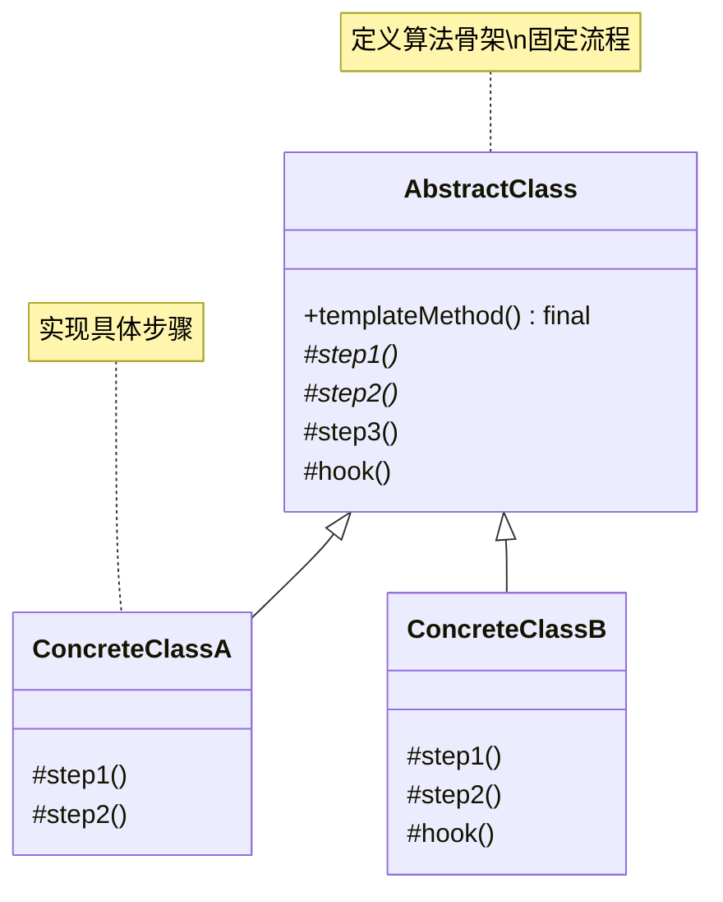
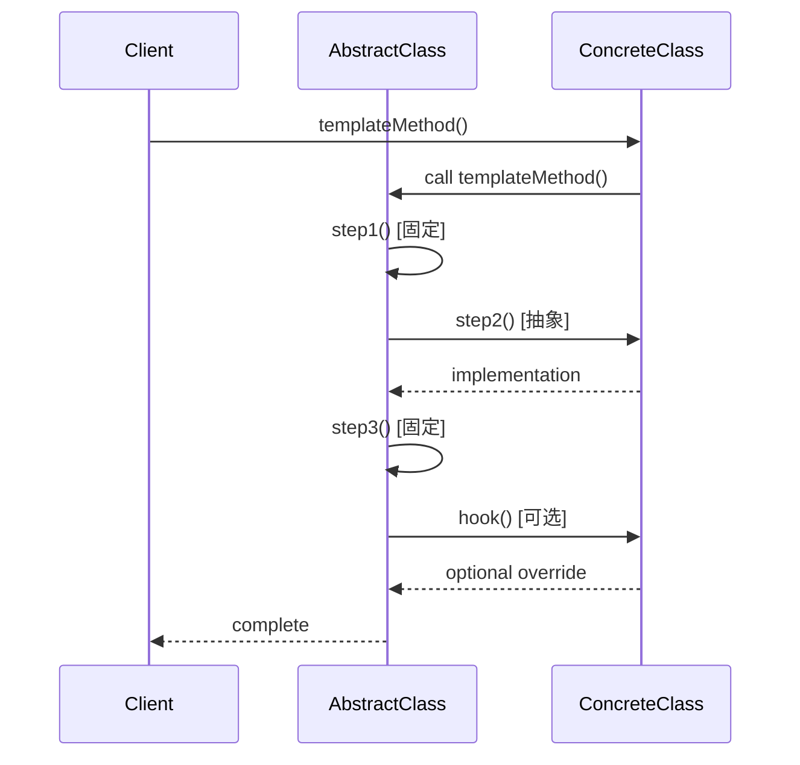

# 模板方法模式 (Template Method Pattern)

## 模式定义

**模板方法模式**是一种行为型设计模式，它在父类中定义了一个算法的骨架，允许子类在不改变算法结构的情况下，重新定义算法的某些特定步骤。



## 问题分析

当多个类有相似的算法流程，但某些步骤的实现细节不同时，如果每个类都完整实现算法会导致代码重复：

```java
// ❌ 不好的做法：代码重复
public class MakeCoffee {
    public void make() {
        System.out.println("1. 烧水");
        System.out.println("2泡咖啡");
        System.out.println("3. 倒入杯子");
        System.out.println("4. 加奶");
    }
}

public class MakeTea {
    public void make() {
        System.out.println("1. 烧水");        // 重复
        System.out.println("2. 泡茶");
        System.out.println("3. 倒入杯子");    // 重复
        System.out.println("4. 加柠檬");
    }
}
```

**问题**：
-❌ 大量代码重复（烧水、倒入杯子相同）

- ❌ 每个类都实现完整流程
- ❌ 修改公共步骤需要改所有类
- ❌ 难以维护和扩展

> [!WARNING] > **代码重复陷阱**：如果有 10 种饮料，公共步骤的代码就会重复 10 次！

## 解决方案

在父类中定义算法骨架，将可变步骤留给子类实现：



> [!IMPORTANT] > **模板方法模式的核心**：
>
> - 父类定义算法骨架（模板方法）
> - 模板方法调用一系列步骤
> - 子类实现可变的步骤
> - 公共步骤在父类实现，避免重复

## 代码实现

### 场景：饮料制作流程

咖啡和茶的制作流程相似，但某些步骤不同。

#### 1. 定义抽象类（模板）

````java
/**
 * 饮料制作模板（AbstractClass）
 */
public abstract class Beverage {
    /**
     * 模板方法：定义算法骨架
     * final 防止子类修改算法结构
     */
    public final void prepareBeverage() {
        System.out.println("========== 开始制作 " + getName() + " ==========\");\n
        // 步骤1：烧水（公共步骤，父类实现）
        boilWater();

        // 步骤2：冲泡（可变步骤，子类实现）
        brew();

        // 步骤3：倒入杯子（公共步骤，父类实现）
        pourInCup();

        // 步骤4：添加调料（可变步骤，子类实现）
        // 钩子方法控制是否执行
        if (customerWantsCondiments()) {
            addCondiments();
        }

        System.out.println(\"========== \" + getName() + \" 制作完成！==========\\n\");\n    }\n    \n    /**\n     * 公共步骤1：烧水\n     * 所有饮料都需要烧水，在父类实现\n     */\n    private void boilWater() {\n        System.out.println(\"[1/4] 🔥 烧水至100°C\");\n    }\n    \n    /**\n     * 公共步骤3：倒入杯子\n     * 所有饮料都要倒入杯子，在父类实现\n     */\n    private void pourInCup() {\n        System.out.println(\"[3/4] ☕ 倒入杯子\");\n    }\n    \n    /**\n     * 抽象方法：冲泡\n     * 不同饮料冲泡方式不同，由子类实现\n     */\n    protected abstract void brew();\n    \n    /**\n     * 抽象方法：添加调料\n     * 不同饮料调料不同，由子类实现\n     */\n    protected abstract void addCondiments();\n    \n    /**\n     * 抽象方法：获取饮料名称\n     */\n    protected abstract String getName();\n    \n    /**\n     * 钩子方法（Hook）：是否需要调料\n     * 默认需要，子类可以覆盖\n     */\n    protected boolean customerWantsCondiments() {\n        return true;\n    }\n}\n```\n\n> [!TIP]\n> **方法类型**：\n> - **模板方法**（final）：定义骨架，不可覆盖\n> - **具体方法**（private）：公共步骤，子类不可见\n> - **抽象方法**（abstract）：必须由子类实现\n> - **钩子方法**（protected）：可选覆盖\n\n#### 2. 具体实现类\n\n```java\n/**\n * 咖啡制作（ConcreteClass）\n */\npublic class Coffee extends Beverage {\n    @Override\n    protected void brew() {\n        System.out.println(\"[2/4] ☕ 用滤网冲泡咖啡粉\");\n    }\n    \n    @Override\n    protected void addCondiments() {\n        System.out.println(\"[4/4] 🥛 添加牛奶和糖\");\n    }\n    \n    @Override\n    protected String getName() {\n        return \"咖啡\";\n    }\n}\n\n/**\n * 茶制作（ConcreteClass）\n */\npublic class Tea extends Beverage {\n    @Override\n    protected void brew() {\n        System.out.println(\"[2/4] 🍵 用茶叶浸泡5分钟\");\n    }\n    \n    @Override\n    protected void addCondiments() {\n        System.out.println(\"[4/4] 🍋 添加柠檬片\");\n    }\n    \n    @Override\n    protected String getName() {\n        return \"茶\";\n    }\n}\n\n/**\n * 纯黑咖啡（使用钩子方法）\n */\npublic class BlackCoffee extends Beverage {\n    @Override\n    protected void brew() {\n        System.out.println(\"[2/4] ☕ 使用意式咖啡机萃取咖啡\");\n    }\n    \n    @Override\n    protected void addCondiments() {\n        // 不会被调用，因为钩子方法返回 false\n        System.out.println(\"[4/4] 不添加任何调料\");\n    }\n    \n    @Override\n    protected String getName() {\n        return \"纯黑咖啡\";\n    }\n    \n    /**\n     * 覆盖钩子方法：不需要调料\n     */\n    @Override\n    protected boolean customerWantsCondiments() {\n        return false;  // 纯黑咖啡不要调料\n    }\n}\n```\n\n#### 3. 客户端使用\n\n```java\n/**\n * 模板方法模式演示\n */\npublic class TemplateMethodDemo {\n    public static void main(String[] args) {\n        // 制作咖啡\n        Beverage coffee = new Coffee();\n        coffee.prepareBeverage();\n        \n        // 制作茶\n        Beverage tea = new Tea();\n        tea.prepareBeverage();\n        \n        // 制作纯黑咖啡（不加调料）\n        Beverage blackCoffee = new BlackCoffee();\n        blackCoffee.prepareBeverage();\n    }\n}\n```\n\n**输出：**\n```\n========== 开始制作咖啡 ==========\n[1/4] 🔥 烧水至100°C\n[2/4] ☕ 用滤网冲泡咖啡粉\n[3/4] ☕ 倒入杯子\n[4/4] 🥛 添加牛奶和糖\n========== 咖啡制作完成！==========\n\n========== 开始制作茶 ==========\n[1/4] 🔥 烧水至100°C\n[2/4] 🍵 用茶叶浸泡5分钟\n[3/4] ☕ 倒入杯子\n[4/4] 🍋 添加柠檬片\n========== 茶制作完成！==========\n\n========== 开始制作纯黑咖啡 ==========\n[1/4] 🔥 烧水至100°C\n[2/4] ☕ 使用意式咖啡机萃取咖啡\n[3/4] ☕ 倒入杯子\n========== 纯黑咖啡制作完成！==========\n```\n\n> [!NOTE]\n> **代码复用效果**：\n> - 烧水和倒入杯子的代码只写一次\n> - 新增饮料类型无需重复公共代码\n> - 算法流程统一，易于维护\n\n## 实际应用示例\n\n### 示例1：数据导出流程\n\n```java\n/**\n * 数据导出模板\n */\npublic abstract class DataExporter {\n    /**\n     * 模板方法：导出流程\n     */\n    public final void export(List<Data> dataList, String filename) {\n        System.out.println(\"========== 开始导出 \" + getFormat() + \" ==========\\n\");\n        \n        // 1. 读取数据\n        validateData(dataList);\n        \n        // 2. 转换格式\n        String formattedData = formatData(dataList);\n        \n        // 3. 写入文件\n        writeToFile(formattedData, filename);\n        \n        // 4. 可选：压缩\n        if (shouldCompress()) {\n            compressFile(filename);\n        }\n        \n        System.out.println(\"\\n========== 导出完成！==========\\n\");\n    }\n    \n    /**\n     * 公共步骤：验证数据\n     */\n    private void validateData(List<Data> dataList) {\n        System.out.println(\"[1/4] ✅ 验证数据...\");\n        if (dataList == null || dataList.isEmpty()) {\n            throw new IllegalArgumentException(\"数据为空！\");\n        }\n    }\n    \n    /**\n     * 抽象方法：格式化数据\n     */\n    protected abstract String formatData(List<Data> dataList);\n    \n    /**\n     * 抽象方法：写入文件\n     */\n    protected abstract void writeToFile(String data, String filename);\n    \n    /**\n     * 抽象方法：获取格式名称\n     */\n    protected abstract String getFormat();\n    \n    /**\n     * 钩子方法：是否压缩\n     */\n    protected boolean shouldCompress() {\n        return false;\n    }\n    \n    /**\n     * 钩子方法：压缩文件\n     */\n    protected void compressFile(String filename) {\n        System.out.println(\"[4/4] 🗜️  压缩文件: \" + filename + \".zip\");\n    }\n}\n\n/**\n * CSV 导出器\n */\npublic class CSVExporter extends DataExporter {\n    @Override\n    protected String formatData(List<Data> dataList) {\n        System.out.println(\"[2/4] 📄 转换为 CSV 格式...\");\n        // CSV 格式转换逻辑\n        return \"csv_data\";\n    }\n    \n    @Override\n    protected void writeToFile(String data, String filename) {\n        System.out.println(\"[3/4] 💾 写入 CSV 文件: \" + filename + \".csv\");\n    }\n    \n    @Override\n    protected String getFormat() {\n        return \"CSV\";\n    }\n}\n\n/**\n * JSON 导出器（带压缩）\n */\npublic class JSONExporter extends DataExporter {\n    @Override\n    protected String formatData(List<Data> dataList) {\n        System.out.println(\"[2/4] 📄 转换为 JSON 格式...\");\n        return \"json_data\";\n    }\n    \n    @Override\n    protected void writeToFile(String data, String filename) {\n        System.out.println(\"[3/4] 💾 写入 JSON 文件: \" + filename + \".json\");\n    }\n    \n    @Override\n    protected String getFormat() {\n        return \"JSON\";\n    }\n    \n    @Override\n    protected boolean shouldCompress() {\n        return true;  // JSON 文件需要压缩\n    }\n}\n\n// 数据类\nclass Data {\n    private String content;\n}\n```\n\n### 示例2：HTTP Servlet（真实案例）\n\n```java\n/**\n * HttpServlet 使用模板方法模式\n */\npublic abstract class MyHttpServlet {\n    /**\n     * 模板方法：处理请求\n     */\n    public final void service(HttpRequest request, HttpResponse response) {\n        String method = request.getMethod();\n        \n        if (\"GET\".equals(method)) {\n            doGet(request, response);\n        } else if (\"POST\".equals(method)) {\n            doPost(request, response);\n        } else if (\"PUT\".equals(method)) {\n            doPut(request, response);\n        } else if (\"DELETE\".equals(method)) {\n            doDelete(request, response);\n        }\n    }\n    \n    /**\n     * 抽象方法：子类实现具体的请求处理\n     */\n    protected abstract void doGet(HttpRequest req, HttpResponse resp);\n    protected abstract void doPost(HttpRequest req, HttpResponse resp);\n    \n    /**\n     * 钩子方法：默认实现\n     */\n    protected void doPut(HttpRequest req, HttpResponse resp) {\n        resp.sendError(405, \"Method Not Allowed\");\n    }\n    \n    protected void doDelete(HttpRequest req, HttpResponse resp) {\n        resp.sendError(405, \"Method Not Allowed\");\n    }\n}\n\n/**\n * 用户Servlet\n */\npublic class UserServlet extends MyHttpServlet {\n    @Override\n    protected void doGet(HttpRequest req, HttpResponse resp) {\n        System.out.println(\"处理 GET 请求：查询用户\");\n    }\n    \n    @Override\n    protected void doPost(HttpRequest req, HttpResponse resp) {\n        System.out.println(\"处理 POST 请求：创建用户\");\n    }\n    \n    @Override\n    protected void doPut(HttpRequest req, HttpResponse resp) {\n        System.out.println(\"处理 PUT 请求：更新用户\");\n    }\n}\n\n// 简化的请求/响应类\nclass HttpRequest {\n    public String getMethod() { return \"GET\"; }\n}\n\nclass HttpResponse {\n    public void sendError(int code, String message) {}\n}\n```\n\n### 示例3：游戏角色AI\n\n```java\n/**\n * 游戏角色 AI 模板\n */\npublic abstract class GameCharacterAI {\n    /**\n     * 模板方法：执行一轮行动\n     */\n    public final void performAction() {\n        System.out.println(\"\\n=== \" + getCharacterName() + \" 的回合 ===\");\n        \n        // 1. 评估环境\n        evaluateEnvironment();\n        \n        // 2. 选择目标\n        selectTarget();\n        \n        // 3. 移动\n        move();\n        \n        // 4. 攻击\n        attack();\n        \n        // 5. 使用特殊技能（可选）\n        if (canUseSpecialAbility()) {\n            useSpecialAbility();\n        }\n        \n        System.out.println(\"=== 回合结束 ===\\n\");\n    }\n    \n    /**\n     * 公共步骤：评估环境\n     */\n    private void evaluateEnvironment() {\n        System.out.println(\"[1/5] 👀 扫描周围环境...\");\n    }\n    \n    /**\n     * 抽象方法：选择目标\n     */\n    protected abstract void selectTarget();\n    \n    /**\n     * 抽象方法：移动\n     */\n    protected abstract void move();\n    \n    /**\n     * 抽象方法：攻击\n     */\n    protected abstract void attack();\n    \n    /**\n     * 抽象方法：获取角色名称\n     */\n    protected abstract String getCharacterName();\n    \n    /**\n     * 钩子方法：是否能使用特殊技能\n     */\n    protected boolean canUseSpecialAbility() {\n        return false;\n    }\n    \n    /**\n     * 钩子方法：使用特殊技能\n     */\n    protected void useSpecialAbility() {\n        System.out.println(\"[5/5] ⚡ 使用特殊技能！\");\n    }\n}\n\n/**\n * 战士 AI\n */\npublic class WarriorAI extends GameCharacterAI {\n    private boolean specialAbilityReady = true;\n    \n    @Override\n    protected void selectTarget() {\n        System.out.println(\"[2/5] 🎯 选择最近的敌人\");\n    }\n    \n    @Override\n    protected void move() {\n        System.out.println(\"[3/5] 🏃 快速冲向敌人\");\n    }\n    \n    @Override\n    protected void attack() {\n        System.out.println(\"[4/5] ⚔️  挥剑攻击！\");\n    }\n    \n    @Override\n    protected String getCharacterName() {\n        return \"战士\";\n    }\n    \n    @Override\n    protected boolean canUseSpecialAbility() {\n        return specialAbilityReady;\n    }\n    \n    @Override\n    protected void useSpecialAbility() {\n        System.out.println(\"[5/5] ⚡ 旋风斩！\");\n        specialAbilityReady = false;\n    }\n}\n\n/**\n * 法师 AI\n */\npublic class MageAI extends GameCharacterAI {\n    @Override\n    protected void selectTarget() {\n        System.out.println(\"[2/5] 🎯 选择血量最低的敌人\");\n    }\n    \n    @Override\n    protected void move() {\n        System.out.println(\"[3/5] 🚶 保持安全距离\");\n    }\n    \n    @Override\n    protected void attack() {\n        System.out.println(\"[4/5] 🔥 发射火球！\");\n    }\n    \n    @Override\n    protected String getCharacterName() {\n        return \"法师\";\n    }\n}\n```\n\n## Java 标准库中的应用\n\n### 1. HttpServlet\n\n```java\n/**\n * Servlet 是模板方法模式的经典应用\n */\npublic class MyServlet extends HttpServlet {\n    @Override\n    protected void doGet(HttpServletRequest req, HttpServletResponse resp) {\n        // 实现 GET 请求处理\n    }\n    \n    @Override\n    protected void doPost(HttpServletRequest req, HttpServletResponse resp) {\n        // 实现 POST 请求处理\n    }\n}\n\n// service() 是模板方法\n```\n\n### 2. AbstractList\n\n```java\n/**\n * AbstractList 提供了模板方法\n */\npublic abstract class AbstractList<E> {\n    // 模板方法\n    public boolean add(E e) {\n        add(size(), e);\n        return true;\n    }\n    \n    // 抽象方法：子类实现\n    public abstract E get(int index);\n    public abstract int size();\n}\n```\n\n### 3. InputStream\n\n```java\n/**\n * InputStream 的 read() 方法\n */\npublic abstract class InputStream {\n    // 模板方法\n    public int read(byte[] b) throws IOException {\n        return read(b, 0, b.length);\n    }\n    \n    // 抽象方法\n    public abstract int read() throws IOException;\n}\n```\n\n## 模板方法 vs 策略模式\n\n| 特性 | 模板方法 | 策略模式 |\n|------|---------|----------|\n| **实现方式** | 继承 | 组合 |\n| **算法选择** | 子类固定 | 客户端动态选择 |\n| **代码复用** | ⭐⭐⭐⭐⭐ 优秀 | ⭐⭐⭐ 一般 |\n| **灵活性** | ⭐⭐⭐ 中等 | ⭐⭐⭐⭐⭐ 高 |\n| **耦合度** | ⭐⭐ 高（继承） | ⭐⭐⭐⭐ 低 |\n| **运行时切换** | ❌ 不能 | ✅ 可以 |\n\n> [!TIP]\n> **选择建议**：\n> - 算法结构固定、步骤可变 → 模板方法\n> - 整个算法可替换 → 策略模式\n\n## 钩子方法（Hook）\n\n钩子方法让模板方法更灵活：\n\n```java\npublic abstract class DataProcessor {\n    public final void process() {\n        loadData();\n        \n        // 钩子方法1：条件控制\n        if (needsValidation()) {\n            validateData();\n        }\n        \n        transformData();\n        \n        // 钩子方法2：扩展点\n        beforeSave();\n        \n        saveData();\n        \n        // 钩子方法3：扩展点\n        afterSave();\n    }\n    \n    // 钩子方法：默认需要验证\n    protected boolean needsValidation() {\n        return true;\n    }\n    \n    // 钩子方法：保存前回调（空实现）\n    protected void beforeSave() {\n        // 子类可选择覆盖\n    }\n    \n    // 钩子方法：保存后回调（空实现）\n    protected void afterSave() {\n        // 子类可选择覆盖\n    }\n    \n    protected abstract void loadData();\n    protected abstract void validateData();\n    protected abstract void transformData();\n    protected abstract void saveData();\n}\n```\n\n**钩子方法的类型**：\n1. **条件钩子**：返回 boolean，控制流程\n2. **回调钩子**：空实现，子类可选覆盖\n3. **默认实现钩子**：提供默认行为\n\n## 优缺点\n\n### 优点\n\n- ✅ **提高代码复用** - 公共步骤只写一次\n- ✅ **控制反转** - 父类调用子类方法（Hollywood原则）\n- ✅ **符合开闭原则** - 新增子类无需修改框架\n- ✅ **易于维护** - 算法集中在父类\n\n### 缺点\n\n- ❌ **增加抽象类数量** - 每种算法变体都需要子类\n- ❌ **继承带来耦合** - 子类依赖父类\n- ❌ **算法骨架不易改变** - 修改影响所有子类\n\n## 适用场景\n\n### 何时使用模板方法模式\n\n- ✓ **多个类相似算法** - 流程相同，细节不同\n- ✓ **代码复用** - 避免重复实现公共步骤\n- ✓ **控制子类扩展** - 只允许特定步骤可变\n- ✓ **框架设计** - 定义骨架，留扩展点\n\n### 实际应用场景\n\n- 🌐 **Servlet** - doGet/doPost\n- 📊 **数据导出** - CSV/JSON/XML导出\n- 🎮 **游戏AI** - 角色行为流程\n- 📄 **文档处理** - 解析/转换/生成\n- 🔄 **单元测试** - setUp/test/tearDown\n\n## 最佳实践\n\n### 1. 模板方法使用 final\n\n```java\n// ✅ 好的做法\npublic abstract class Template {\n    public final void templateMethod() {\n        // 防止子类修改算法结构\n    }\n}\n\n// ❌ 不好的做法\npublic abstract class Template {\n    public void templateMethod() {\n        // 子类可能覆盖，破坏算法结构\n    }\n}\n```\n\n### 2. 合理使用访问修饰符\n\n```java\npublic abstract class Template {\n    // public final: 模板方法\n    public final void templateMethod() { }\n    \n    // private: 内部步骤\n    private void privateStep() { }\n    \n    // protected abstract: 子类必须实现\n    protected abstract void abstractStep();\n    \n    // protected: 钩子方法\n    protected void hook() { }\n}\n```\n\n### 3. 提供有意义的钩子方法\n\n```java\n// ✅ 好的钩子方法\nprotected boolean shouldValidate() { return true; }\nprotected void beforeProcess() { }\nprotected void afterProcess() { }\n\n// ❌ 不好的钩子方法\nprotected void step4() { }  // 名称不清晰\n```\n\n### 4. 文档说明算法流程\n\n```java\n/**\n * 模板方法：定义数据处理流程\n * \n * 流程：\n * 1. 读取数据（子类实现）\n * 2. 验证数据（可选，通过 needsValidation() 控制）\n * 3. 转换数据（子类实现）\n * 4. 保存数据（子类实现）\n */\npublic final void process() {\n    // ...\n}\n```\n\n## 与其他模式的关系\n\n- **模板方法 + 工厂** - 工厂方法就是模板方法的特例\n- **模板方法 + 策略** - 可以组合使用\n- **模板方法 + 装饰器** - 装饰器包装，模板方法继承\n\n## 总结\n\n模板方法模式是代码复用的强大工具：\n\n- **核心思想** - 定义骨架，延迟某些步骤到子类\n- **关键优势** - 代码复用，控制反转\n- **主要缺点** - 继承带来耦合\n- **经典应用** - HttpServlet、AbstractList\n- **适用场景** - 多个类有相同流程但细节不同\n\n> [!TIP]\n> **模板方法模式的精髓**：\n> - **定义算法骨架**\n> - **固定公共步骤**\n> - **延迟可变步骤**\n> - **Hollywood 原则**：Don't call us, we'll call you\n\n**已完成：14个文档**\n\n继续下一个...\n
````
