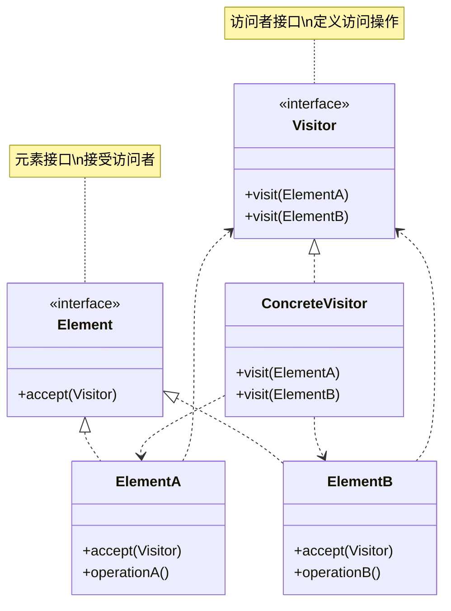
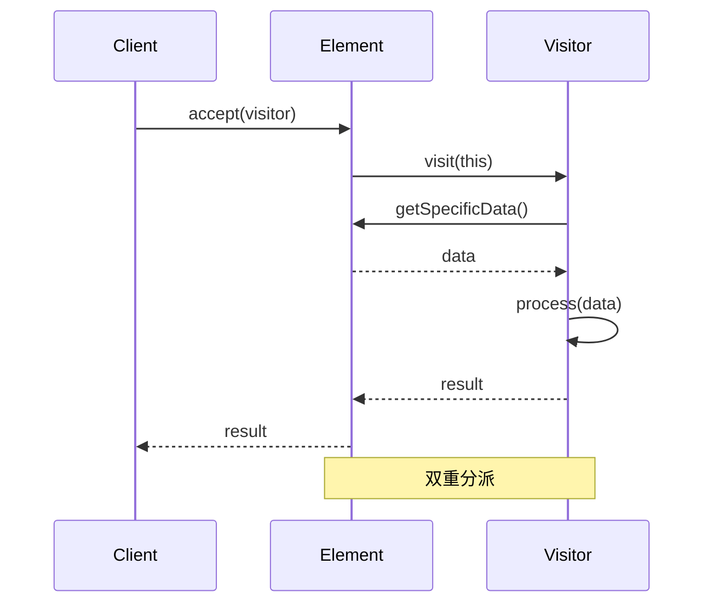
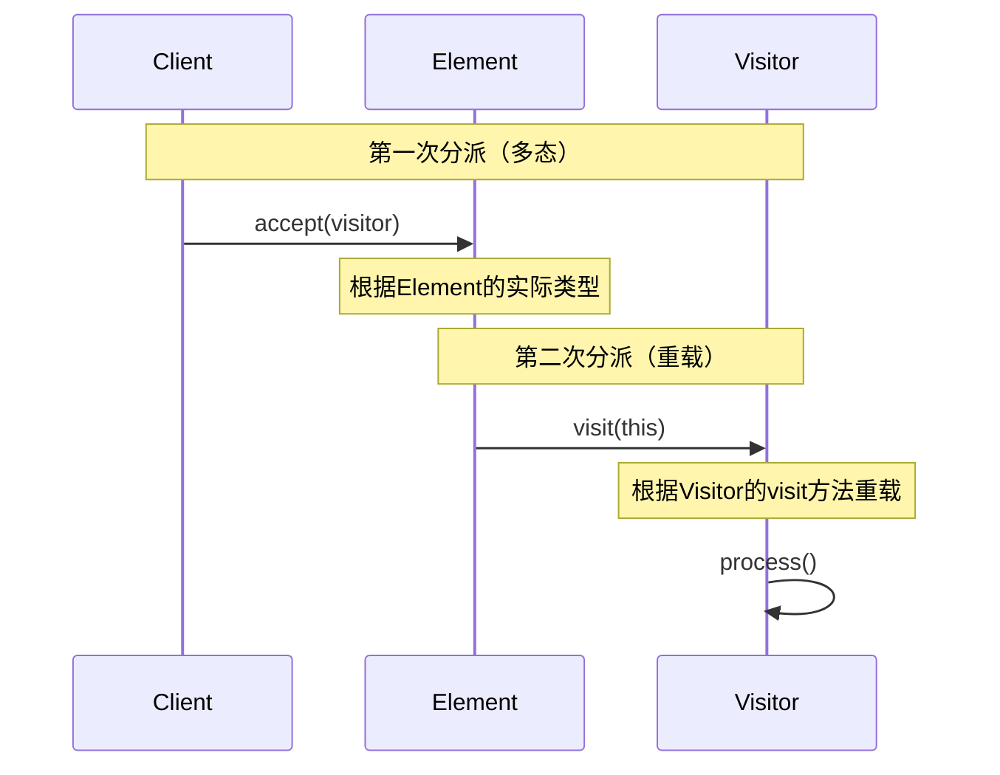

# 访问者模式 (Visitor Pattern)

## 模式定义

**访问者模式**是一种行为型设计模式，它表示一个作用于某对象结构中各元素的操作。它使你可以在不改变各元素类的前提下定义作用于这些元素的新操作。



## 问题分析

当需要对稳定的数据结构执行多种不同操作时，直接在元素类中添加方法会导致：

```java
// ❌ 不好的做法：在元素类中添加所有操作
public interface Shape {
    void draw();
    double calculateArea();
    void export();        // 新需求
    void serialize();     // 新需求
    void validate();      // 新需求
    // 每增加一个操作都要修改接口和所有实现类！
}

public class Circle implements Shape {
    public void draw() { /* */ }
    public double calculateArea() { /* */ }
    public void export() { /* */ }       // 被迫实现
    public void serialize() { /* */ }    // 被迫实现
    public void validate() { /* */ }     // 被迫实现
}
```

**问题**：

- ❌ 添加新操作需要修改所有元素类
- ❌ 元素类职责过多
- ❌ 操作逻辑分散在各个元素类中
- ❌ 违反开闭原则

> [!WARNING] > **类爆炸**：如果有 10 种元素和 20 种操作，每增加一个操作都要修改 10 个类！

## 解决方案

将操作封装在访问者中，元素只需要接受访问：



> [!IMPORTANT] > **访问者模式的核心**：
>
> - 元素类稳定，操作经常变化
> - 元素实现 accept 方法
> - 访问者实现不同的 visit 方法
> - 使用双重分派确定具体访问方法

## 代码实现

### 场景：电商商品报表

对商品集合进行不同维度的统计（价格、分类、库存等）。

#### 1. 定义访问者接口

```java
/**
 * 商品访问者接口（Visitor）
 */
public interface ProductVisitor {
    void visit(Book book);
    void visit(Electronic electronic);
    void visit(Clothing clothing);
}
```

#### 2. 定义元素接口

```java
/**
 * 商品接口（Element）
 */
public interface Product {
    void accept(ProductVisitor visitor);
}
```

#### 3. 具体元素类

```java
/**
 * 图书（ConcreteElement）
 */
public class Book implements Product {
    private String name;
    private double price;
    private String author;
    private int pages;

    public Book(String name, double price, String author, int pages) {
        this.name = name;
        this.price = price;
        this.author = author;
        this.pages = pages;
    }

    @Override
    public void accept(ProductVisitor visitor) {
        visitor.visit(this);  // 双重分派：调用visitor的visit(Book)
    }

    public String getName() { return name; }
    public double getPrice() { return price; }
    public String getAuthor() { return author; }
    public int getPages() { return pages; }
}

/**
 * 电子产品
 */
public class Electronic implements Product {
    private String name;
    private double price;
    private String brand;
    private int warranty;  // 保修期（月）

    public Electronic(String name, double price, String brand, int warranty) {
        this.name = name;
        this.price = price;
        this.brand = brand;
        this.warranty = warranty;
    }

    @Override
    public void accept(ProductVisitor visitor) {
        visitor.visit(this);
    }

    public String getName() { return name; }
    public double getPrice() { return price; }
    public String getBrand() { return brand; }
    public int getWarranty() { return warranty; }
}

/**
 * 服装
 */
public class Clothing implements Product {
    private String name;
    private double price;
    private String size;
    private String material;

    public Clothing(String name, double price, String size, String material) {
        this.name = name;
        this.price = price;
        this.size = size;
        this.material = material;
    }

    @Override
    public void accept(ProductVisitor visitor) {
        visitor.visit(this);
    }

    public String getName() { return name; }
    public double getPrice() { return price; }
    public String getSize() { return size; }
    public String getMaterial() { return material; }
}
```

#### 4. 具体访问者

```java
/**
 * 价格统计访问者（ConcreteVisitor）
 */
public class PriceCalculator implements ProductVisitor {
    private double totalPrice = 0;

    @Override
    public void visit(Book book) {
        totalPrice += book.getPrice();
        System.out.println(\"📚 图书: \" + book.getName() + \", 价格: ¥\" + book.getPrice());
    }

    @Override
    public void visit(Electronic electronic) {
        totalPrice += electronic.getPrice();
        System.out.println(\"💻 电子产品: \" + electronic.getName() + \", 价格: ¥\" + electronic.getPrice());
    }

    @Override
    public void visit(Clothing clothing) {
        totalPrice += clothing.getPrice();
        System.out.println(\"👔 服装: \" + clothing.getName() + \", 价格: ¥\" + clothing.getPrice());
    }

    public double getTotalPrice() {
        return totalPrice;
    }
}

/**
 * 详细信息访问者
 */
public class DetailPrinter implements ProductVisitor {
    @Override
    public void visit(Book book) {
        System.out.println(\"\\n📚 === 图书详情 ===\");
        System.out.println(\"  书名: \" + book.getName());
        System.out.println(\"  作者: \" + book.getAuthor());
        System.out.println(\"  页数: \" + book.getPages());
        System.out.println(\"  价格: ¥\" + book.getPrice());
    }

    @Override
    public void visit(Electronic electronic) {
        System.out.println(\"\\n💻 === 电子产品详情 ===\");
        System.out.println(\"  名称: \" + electronic.getName());
        System.out.println(\"  品牌: \" + electronic.getBrand());
        System.out.println(\"  保修: \" + electronic.getWarranty() + \" 个月\");
        System.out.println(\"  价格: ¥\" + electronic.getPrice());
    }

    @Override
    public void visit(Clothing clothing) {
        System.out.println(\"\\n👔 === 服装详情 ===\");
        System.out.println(\"  名称: \" + clothing.getName());
        System.out.println(\"  尺码: \" + clothing.getSize());
        System.out.println(\"  材质: \" + clothing.getMaterial());
        System.out.println(\"  价格: ¥\" + clothing.getPrice());
    }
}

/**
 * 分类统计访问者
 */
public class CategoryCounter implements ProductVisitor {
    private int bookCount = 0;
    private int electronicCount = 0;
    private int clothingCount = 0;

    @Override
    public void visit(Book book) {
        bookCount++;
    }

    @Override
    public void visit(Electronic electronic) {
        electronicCount++;
    }

    @Override
    public void visit(Clothing clothing) {
        clothingCount++;
    }

    public void printStatistics() {
        System.out.println(\"\\n📊 === 分类统计 ===\");
        System.out.println(\"  图书: \" + bookCount + \" 件\");
        System.out.println(\"  电子产品: \" + electronicCount + \" 件\");
        System.out.println(\"  服装: \" + clothingCount + \" 件\");
        System.out.println(\"  总计: \" + (bookCount + electronicCount + clothingCount) + \" 件\");
    }
}
```

#### 5. 客户端使用

```java
import java.util.ArrayList;
import java.util.List;

/**
 * 访问者模式演示
 */
public class VisitorPatternDemo {
    public static void main(String[] args) {
        System.out.println(\"========== 电商商品报表系统 ==========\\n\");

        // 创建商品集合
        List<Product> products = new ArrayList<>();
        products.add(new Book(\"设计模式\", 89.0, \"GoF\", 560));
        products.add(new Book(\"代码大全\", 128.0, \"Steve McConnell\", 914));
        products.add(new Electronic(\"MacBook Pro\", 12999.0, \"Apple\", 12));
        products.add(new Electronic(\"AirPods\", 1299.0, \"Apple\", 6));
        products.add(new Clothing(\"T恤\", 199.0, \"L\", \"棉\"));
        products.add(new Clothing(\"牛仔裤\", 299.0, \"32\", \"牛仔布\"));

        // 访问者1：计算总价
        System.out.println(\"========== 价格统计 ==========\\n\");
        PriceCalculator priceCalc = new PriceCalculator();
        for (Product product : products) {
            product.accept(priceCalc);
        }
        System.out.println(\"\\n💰 总价: ¥\" + priceCalc.getTotalPrice());

        // 访问者2：打印详细信息
        System.out.println(\"\\n========== 商品详情 ==========\");
        DetailPrinter detailPrinter = new DetailPrinter();
        for (Product product : products) {
            product.accept(detailPrinter);
        }

        // 访问者3：分类统计
        System.out.println(\"\\n========== 分类统计 ==========\");
        CategoryCounter counter = new CategoryCounter();
        for (Product product : products) {
            product.accept(counter);
        }
        counter.printStatistics();
    }
}
```

**输出：**

```
========== 电商商品报表系统 ==========

========== 价格统计 ==========

📚 图书: 设计模式, 价格: ¥89.0
📚 图书: 代码大全, 价格: ¥128.0
💻 电子产品: MacBook Pro, 价格: ¥12999.0
💻 电子产品: AirPods, 价格: ¥1299.0
👔 服装: T恤, 价格: ¥199.0
👔 服装: 牛仔裤, 价格: ¥299.0

💰 总价: ¥15013.0

========== 商品详情 ==========

📚 === 图书详情 ===
  书名: 设计模式
  作者: GoF
  页数: 560
  价格: ¥89.0

💻 === 电子产品详情 ===
  名称: MacBook Pro
  品牌: Apple
  保修: 12 个月
  价格: ¥12999.0

📊 === 分类统计 ===
  图书: 2 件
  电子产品: 2 件
  服装: 2 件
  总计: 6 件
```

> [!TIP] > **访问者的优势**：添加新的统计维度（如库存统计、折扣计算）只需新建一个 Visitor 类，无需修改商品类！

## 实际应用示例

### 示例 1：AST（抽象语法树）处理

```java
/**
 * 表达式访问者
 */
public interface ExpressionVisitor {
    int visit(NumberExpression expr);
    int visit(AddExpression expr);
    int visit(MultiplyExpression expr);
}

/**
 * 表达式接口
 */
public interface Expression {
    int accept(ExpressionVisitor visitor);
}

/**
 * 数字表达式
 */
public class NumberExpression implements Expression {
    private int value;

    public NumberExpression(int value) {
        this.value = value;
    }

    public int getValue() { return value; }

    @Override
    public int accept(ExpressionVisitor visitor) {
        return visitor.visit(this);
    }
}

/**
 * 加法表达式
 */
public class AddExpression implements Expression {
    private Expression left;
    private Expression right;

    public AddExpression(Expression left, Expression right) {
        this.left = left;
        this.right = right;
    }

    public Expression getLeft() { return left; }
    public Expression getRight() { return right; }

    @Override
    public int accept(ExpressionVisitor visitor) {
        return visitor.visit(this);
    }
}

/**
 * 乘法表达式
 */
public class MultiplyExpression implements Expression {
    private Expression left;
    private Expression right;

    public MultiplyExpression(Expression left, Expression right) {
        this.left = left;
        this.right = right;
    }

    public Expression getLeft() { return left; }
    public Expression getRight() { return right; }

    @Override
    public int accept(ExpressionVisitor visitor) {
        return visitor.visit(this);
    }
}

/**
 * 求值访问者
 */
public class EvaluationVisitor implements ExpressionVisitor {
    @Override
    public int visit(NumberExpression expr) {
        return expr.getValue();
    }

    @Override
    public int visit(AddExpression expr) {
        int left = expr.getLeft().accept(this);
        int right = expr.getRight().accept(this);
        return left + right;
    }

    @Override
    public int visit(MultiplyExpression expr) {
        int left = expr.getLeft().accept(this);
        int right = expr.getRight().accept(this);
        return left * right;
    }
}

/**
 * 打印访问者
 */
public class PrintVisitor implements ExpressionVisitor {
    @Override
    public int visit(NumberExpression expr) {
        System.out.print(expr.getValue());
        return 0;
    }

    @Override
    public int visit(AddExpression expr) {
        System.out.print(\"(\");
        expr.getLeft().accept(this);
        System.out.print(\" + \");
        expr.getRight().accept(this);
        System.out.print(\")\");
        return 0;
    }

    @Override
    public int visit(MultiplyExpression expr) {
        System.out.print(\"(\");
        expr.getLeft().accept(this);
        System.out.print(\" * \");
        expr.getRight().accept(this);
        System.out.print(\")\");
        return 0;
    }
}

// 使用示例：(2 + 3) * 5 = 25
class ASTDemo {
    public static void main(String[] args) {
        Expression expr = new MultiplyExpression(
            new AddExpression(
                new NumberExpression(2),
                new NumberExpression(3)
            ),
            new NumberExpression(5)
        );

        // 打印表达式
        PrintVisitor printer = new PrintVisitor();
        expr.accept(printer);

        // 计算结果
        EvaluationVisitor evaluator = new EvaluationVisitor();
        int result = expr.accept(evaluator);
        System.out.println(\" = \" + result);
    }
}
```

## 双重分派（Double Dispatch）

访问者模式的核心机制：



> [!NOTE] > **双重分派**：
>
> - 第一次分派：通过多态调用具体元素的 accept 方法
> - 第二次分派：通过方法重载调用对应的 visit 方法
> - 结果：根据元素和访问者的具体类型执行对应操作

## 优缺点

### 优点

- ✅ **符合开闭原则** - 易于添加新操作
- ✅ **符合单一职责** - 操作逻辑集中
- ✅ **操作集中** - 相关操作放在一个访问者中
- ✅ **跨类层次** - 可访问不同类的元素

### 缺点

- ❌ **难以添加新元素** - 需要修改所有访问者
- ❌ **元素必须暴露细节** - 访问者需要访问元素数据
- ❌ **违反迪米特法则** - 访问者知道元素细节
- ❌ **复杂度高** - 双重分派机制复杂

## 适用场景

### 何时使用访问者模式

- ✓ **元素类稳定** - 元素类型很少变化
- ✓ **操作经常变化** - 需要频繁添加新操作
- ✓ **操作无关** - 操作之间无关联
- ✓ **对象结构稳定** - 对象结构不常变化

### 实际应用场景

- 🌳 **编译器** - AST 遍历、代码生成
- 📄 **文档处理** - 不同格式导出
- 📊 **报表系统** - 多维度统计
- 🎨 **图形编辑器** - 不同操作（绘制、导出等）
- 🔍 **静态分析** - 代码检查、优化

## 最佳实践

### 1. 使用泛型简化

```java
/**
 * 泛型访问者
 */
public interface Visitor<R> {
    R visit(ElementA element);
    R visit(ElementB element);
}

// 有返回值的访问者
public class CalculatingVisitor implements Visitor<Integer> {
    public Integer visit(ElementA element) {
        return element.getValue() * 2;
    }
}
```

### 2. 默认实现

```java
/**
 * 提供默认实现，避免每个访问者都要实现所有方法
 */
public abstract class AbstractVisitor implements ProductVisitor {
    @Override
    public void visit(Book book) {
        // 默认什么都不做
    }

    @Override
    public void visit(Electronic electronic) {
        // 默认什么都不做
    }

    @Override
    public void visit(Clothing clothing) {
        // 默认什么都不做
    }
}
```

### 3. 组合访问者

```java
/**
 * 组合多个访问者
 */
public class CompositeVisitor implements ProductVisitor {
    private List<ProductVisitor> visitors = new ArrayList<>();

    public void addVisitor(ProductVisitor visitor) {
        visitors.add(visitor);
    }

    @Override
    public void visit(Book book) {
        visitors.forEach(v -> v.visit(book));
    }

    // 其他visit方法类似...
}
```

## Java 标准库中的应用

### 1. java.nio.file.FileVisitor

```java
/**
 * 文件访问者
 */
Files.walkFileTree(startPath, new SimpleFileVisitor<Path>() {
    @Override
    public FileVisitResult visitFile(Path file, BasicFileAttributes attrs) {
        System.out.println(file);
        return FileVisitResult.CONTINUE;
    }
});
```

### 2. javax.lang.model.element.ElementVisitor

```java
/**
 * Java编译器API中的访问者
 */
public interface ElementVisitor<R, P> {
    R visit(Element e, P p);
    R visitPackage(PackageElement e, P p);
    R visitType(TypeElement e, P p);
    // ...
}
```

## 与其他模式的关系

- **访问者 + 组合** - 访问组合结构
- **访问者 + 迭代器** - 遍历元素并访问
- **访问者 + 解释器** - 解释器可用访问者实现

## 总结

访问者模式是在稳定结构上添加操作的有效方案：

- **核心思想** - 将操作封装在访问者中
- **关键优势** - 易于添加新操作
- **主要缺点** - 难以添加新元素
- **经典应用** - AST 处理、文件遍历
- **适用场景** - 元素稳定、操作多变

> [!TIP] > **访问者模式的精髓**：
>
> - **双重分派** - 元素类型和访问者类型共同决定行为
> - **操作外置** - 将操作从元素类中分离
> - **易于扩展** - 添加新操作无需修改元素类
> - **适用条件** - 元素类稳定，操作频繁变化

**已完成：22 个文档** ✅

最后 1 个 interpreter...
