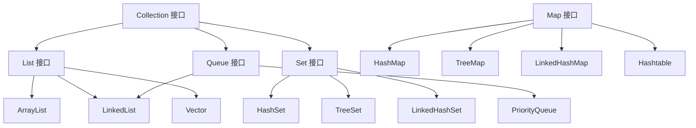

# Java 集合框架

Java 集合框架提供了一套性能优良、使用方便的接口和类，用于存储和操作对象组。

## 集合框架概述

### 集合框架结构



### Collection 与 Map 的区别

| 特性 | Collection | Map |
|------|------------|-----|
| 存储方式 | 单列集合，存储对象 | 双列集合，存储键值对 |
| 元素特点 | 存储元素 | 存储 key-value |
| 继承关系 | 继承自 Iterable | 独立的接口 |

## List 接口

List 是有序集合，允许重复元素。

### ArrayList

基于动态数组实现，查询快，增删慢。

```java
import java.util.ArrayList;
import java.util.List;

public class ArrayListExample {
    public static void main(String[] args) {
        // 创建 ArrayList
        List<String> list = new ArrayList<>();
        
        // 添加元素
        list.add("Apple");
        list.add("Banana");
        list.add("Cherry");
        list.add("Apple");  // 允许重复
        
        // 插入元素
        list.add(1, "Orange");  // 在索引 1 处插入
        
        // 获取元素
        String first = list.get(0);
        System.out.println("第一个元素: " + first);
        
        // 获取大小
        System.out.println("集合大小: " + list.size());
        
        // 修改元素
        list.set(0, "Apricot");
        
        // 删除元素
        list.remove(0);           // 按索引删除
        list.remove("Banana");    // 按对象删除
        
        // 判断是否包含元素
        boolean contains = list.contains("Cherry");
        System.out.println("包含 Cherry: " + contains);
        
        // 遍历方式 1：for 循环
        for (int i = 0; i < list.size(); i++) {
            System.out.println(list.get(i));
        }
        
        // 遍历方式 2：增强 for 循环
        for (String fruit : list) {
            System.out.println(fruit);
        }
        
        // 遍历方式 3：迭代器
        Iterator<String> iterator = list.iterator();
        while (iterator.hasNext()) {
            System.out.println(iterator.next());
        }
        
        // 遍历方式 4：forEach + Lambda
        list.forEach(fruit -> System.out.println(fruit));
        
        // 清空
        list.clear();
    }
}
```

### LinkedList

基于双向链表实现，增删快，查询慢。

```java
import java.util.LinkedList;

public class LinkedListExample {
    public static void main(String[] args) {
        LinkedList<String> list = new LinkedList<>();
        
        // 添加元素
        list.add("A");
        list.add("B");
        list.add("C");
        
        // 首尾操作
        list.addFirst("Start");  // 在开头添加
        list.addLast("End");     // 在末尾添加
        
        String first = list.getFirst();  // 获取第一个
        String last = list.getLast();    // 获取最后一个
        
        list.removeFirst();  // 删除第一个
        list.removeLast();   // 删除最后一个
        
        // 作为栈使用（LIFO）
        list.push("X");  // 入栈
        String pop = list.pop();  // 出栈
        
        // 作为队列使用（FIFO）
        list.offer("Y");  // 入队
        String poll = list.poll();  // 出队
        
        System.out.println(list);
    }
}
```

### ArrayList vs LinkedList

| 特性 | ArrayList | LinkedList |
|------|-----------|------------|
| 底层实现 | 动态数组 | 双向链表 |
| 随机访问 | O(1) 快 | O(n) 慢 |
| 插入删除（中间） | O(n) 慢 | O(1) 快（找到位置后） |
| 内存占用 | 较小 | 较大（需要存储前后指针） |
| 适用场景 | 查询多 | 增删多 |

## Set 接口

Set 不允许重复元素。

### HashSet

基于 HashMap 实现，无序，不允许重复。

```java
import java.util.HashSet;
import java.util.Set;

public class HashSetExample {
    public static void main(String[] args) {
        Set<String> set = new HashSet<>();
        
        // 添加元素
        set.add("Java");
        set.add("Python");
        set.add("JavaScript");
        set.add("Java");  // 重复元素不会被添加
        
        System.out.println("集合大小: " + set.size());  // 3
        
        // 判断是否包含
        boolean contains = set.contains("Python");
        System.out.println("包含 Python: " + contains);
        
        // 删除元素
        set.remove("JavaScript");
        
        // 遍历
        for (String lang : set) {
            System.out.println(lang);
        }
        
        // 集合运算
        Set<Integer> set1 = new HashSet<>();
        set1.add(1);
        set1.add(2);
        set1.add(3);
        
        Set<Integer> set2 = new HashSet<>();
        set2.add(3);
        set2.add(4);
        set2.add(5);
        
        // 并集
        Set<Integer> union = new HashSet<>(set1);
        union.addAll(set2);
        System.out.println("并集: " + union);  // [1, 2, 3, 4, 5]
        
        // 交集
        Set<Integer> intersection = new HashSet<>(set1);
        intersection.retainAll(set2);
        System.out.println("交集: " + intersection);  // [3]
        
        // 差集
        Set<Integer> difference = new HashSet<>(set1);
        difference.removeAll(set2);
        System.out.println("差集: " + difference);  // [1, 2]
    }
}
```

### TreeSet

基于红黑树实现，有序，不允许重复。

```java
import java.util.TreeSet;

public class TreeSetExample {
    public static void main(String[] args) {
        TreeSet<Integer> set = new TreeSet<>();
        
        // 添加元素（自动排序）
        set.add(5);
        set.add(2);
        set.add(8);
        set.add(1);
        set.add(4);
        
        System.out.println(set);  // [1, 2, 4, 5, 8] 自动排序
        
        // 获取最小和最大值
        System.out.println("最小值: " + set.first());
        System.out.println("最大值: " + set.last());
        
        // 范围查询
        System.out.println("小于 5 的元素: " + set.headSet(5));  // [1, 2, 4]
        System.out.println("大于等于 4 的元素: " + set.tailSet(4));  // [4, 5, 8]
        System.out.println("2-5 之间的元素: " + set.subSet(2, 5));  // [2, 4]
        
        // 自定义排序
        TreeSet<String> strings = new TreeSet<>((a, b) -> b.compareTo(a));
        strings.add("Apple");
        strings.add("Banana");
        strings.add("Cherry");
        System.out.println(strings);  // [Cherry, Banana, Apple] 逆序
    }
}
```

### LinkedHashSet

基于链表和哈希表，保持插入顺序。

```java
import java.util.LinkedHashSet;

public class LinkedHashSetExample {
    public static void main(String[] args) {
        LinkedHashSet<String> set = new LinkedHashSet<>();
        
        set.add("First");
        set.add("Second");
        set.add("Third");
        set.add("First");  // 重复，不会添加
        
        // 保持插入顺序
        for (String item : set) {
            System.out.println(item);
        }
        // 输出: First, Second, Third
    }
}
```

## Map 接口

Map 存储键值对，键唯一。

### HashMap

基于哈希表实现，无序，键唯一。

```java
import java.util.HashMap;
import java.util.Map;

public class HashMapExample {
    public static void main(String[] args) {
        Map<String, Integer> map = new HashMap<>();
        
        // 添加键值对
        map.put("Apple", 10);
        map.put("Banana", 20);
        map.put("Cherry", 15);
        map.put("Apple", 12);  // 键重复，会覆盖旧值
        
        // 获取值
        Integer value = map.get("Apple");
        System.out.println("Apple 的数量: " + value);  // 12
        
        // 获取默认值
        Integer orange = map.getOrDefault("Orange", 0);
        System.out.println("Orange 的数量: " + orange);  // 0
        
        // 判断是否包含
        boolean hasKey = map.containsKey("Banana");
        boolean hasValue = map.containsValue(20);
        
        // 删除
        map.remove("Cherry");
        
        // 大小
        System.out.println("Map 大小: " + map.size());
        
        // 遍历方式 1：遍历键
        for (String key : map.keySet()) {
            System.out.println(key + ": " + map.get(key));
        }
        
        // 遍历方式 2：遍历值
        for (Integer val : map.values()) {
            System.out.println(val);
        }
        
        // 遍历方式 3：遍历键值对
        for (Map.Entry<String, Integer> entry : map.entrySet()) {
            System.out.println(entry.getKey() + ": " + entry.getValue());
        }
        
        // 遍历方式 4：forEach + Lambda
        map.forEach((key, val) -> System.out.println(key + ": " + val));
        
        // Java 8+ 新方法
        map.putIfAbsent("Date", 5);  // 键不存在时才添加
        map.computeIfAbsent("Fig", k -> 8);  // 计算并添加
        map.merge("Apple", 5, Integer::sum);  // 合并值
    }
}
```

### TreeMap

基于红黑树实现，键有序。

```java
import java.util.TreeMap;

public class TreeMapExample {
    public static void main(String[] args) {
        TreeMap<String, Integer> map = new TreeMap<>();
        
        map.put("Charlie", 25);
        map.put("Alice", 30);
        map.put("Bob", 22);
        
        // 按键排序输出
        for (String name : map.keySet()) {
            System.out.println(name + ": " + map.get(name));
        }
        // 输出: Alice: 30, Bob: 22, Charlie: 25
        
        // 获取第一个和最后一个
        System.out.println("第一个键: " + map.firstKey());
        System.out.println("最后一个键: " + map.lastKey());
        
        // 范围查询
        System.out.println("小于 Charlie 的: " + map.headMap("Charlie"));
        System.out.println("大于等于 Bob 的: " + map.tailMap("Bob"));
    }
}
```

### LinkedHashMap

基于链表和哈希表，保持插入顺序或访问顺序。

```java
import java.util.LinkedHashMap;
import java.util.Map;

public class LinkedHashMapExample {
    public static void main(String[] args) {
        // 保持插入顺序
        Map<String, Integer> insertionOrder = new LinkedHashMap<>();
        insertionOrder.put("One", 1);
        insertionOrder.put("Two", 2);
        insertionOrder.put("Three", 3);
        
        System.out.println(insertionOrder);  // {One=1, Two=2, Three=3}
        
        // LRU 缓存实现（访问顺序）
        Map<String, Integer> accessOrder = new LinkedHashMap<>(16, 0.75f, true);
        accessOrder.put("A", 1);
        accessOrder.put("B", 2);
        accessOrder.put("C", 3);
        
        accessOrder.get("A");  // 访问 A，A 移到最后
        System.out.println(accessOrder);  // {B=2, C=3, A=1}
    }
}
```

## Queue 接口

Queue 表示队列，FIFO（先进先出）。

### PriorityQueue

优先级队列，基于堆实现。

```java
import java.util.PriorityQueue;

public class PriorityQueueExample {
    public static void main(String[] args) {
        // 最小堆（默认）
        PriorityQueue<Integer> minHeap = new PriorityQueue<>();
        minHeap.offer(5);
        minHeap.offer(2);
        minHeap.offer(8);
        minHeap.offer(1);
        
        while (!minHeap.isEmpty()) {
            System.out.println(minHeap.poll());  // 1, 2, 5, 8
        }
        
        // 最大堆
        PriorityQueue<Integer> maxHeap = new PriorityQueue<>((a, b) -> b - a);
        maxHeap.offer(5);
        maxHeap.offer(2);
        maxHeap.offer(8);
        maxHeap.offer(1);
        
        while (!maxHeap.isEmpty()) {
            System.out.println(maxHeap.poll());  // 8, 5, 2, 1
        }
        
        // 自定义对象
        PriorityQueue<Task> taskQueue = new PriorityQueue<>(
            (t1, t2) -> t1.priority - t2.priority
        );
        
        taskQueue.offer(new Task("任务1", 3));
        taskQueue.offer(new Task("任务2", 1));
        taskQueue.offer(new Task("任务3", 2));
        
        while (!taskQueue.isEmpty()) {
            System.out.println(taskQueue.poll().name);
        }
        // 输出: 任务2, 任务3, 任务1
    }
}

class Task {
    String name;
    int priority;
    
    public Task(String name, int priority) {
        this.name = name;
        this.priority = priority;
    }
}
```

## Collections 工具类

```java
import java.util.*;

public class CollectionsExample {
    public static void main(String[] args) {
        List<Integer> list = new ArrayList<>(Arrays.asList(3, 1, 4, 1, 5, 9, 2, 6));
        
        // 排序
        Collections.sort(list);
        System.out.println("排序后: " + list);
        
        // 逆序
        Collections.reverse(list);
        System.out.println("逆序后: " + list);
        
        // 打乱
        Collections.shuffle(list);
        System.out.println("打乱后: " + list);
        
        // 最大最小值
        System.out.println("最大值: " + Collections.max(list));
        System.out.println("最小值: " + Collections.min(list));
        
        // 二分查找（需要先排序）
        Collections.sort(list);
        int index = Collections.binarySearch(list, 5);
        System.out.println("5 的索引: " + index);
        
        // 填充
        Collections.fill(list, 0);
        System.out.println("填充后: " + list);
        
        // 创建不可修改集合
        List<Integer> unmodifiableList = Collections.unmodifiableList(list);
        // unmodifiableList.add(1);  // 抛出 UnsupportedOperationException
        
        // 创建同步集合
        List<Integer> synchronizedList = Collections.synchronizedList(list);
    }
}
```

## 选择合适的集合

### 选择 List

```java
// 查询多，增删少 → ArrayList
List<String> list1 = new ArrayList<>();

// 增删多，查询少 → LinkedList
List<String> list2 = new LinkedList<>();

// 需要线程安全 → Vector 或使用 Collections.synchronizedList()
List<String> list3 = new Vector<>();
```

### 选择 Set

```java
// 不需要排序，元素唯一 → HashSet
Set<String> set1 = new HashSet<>();

// 需要排序，元素唯一 → TreeSet
Set<String> set2 = new TreeSet<>();

// 保持插入顺序 → LinkedHashSet
Set<String> set3 = new LinkedHashSet<>();
```

### 选择 Map

```java
// 不需要排序 → HashMap
Map<String, Integer> map1 = new HashMap<>();

// 需要排序 → TreeMap
Map<String, Integer> map2 = new TreeMap<>();

// 保持插入顺序 → LinkedHashMap
Map<String, Integer> map3 = new LinkedHashMap<>();

// 需要线程安全 → ConcurrentHashMap
Map<String, Integer> map4 = new ConcurrentHashMap<>();
```

## 性能比较

| 集合类 | 添加 | 删除 | 查找 | 遍历 | 特点 |
|--------|------|------|------|------|------|
| ArrayList | O(1) | O(n) | O(1) | 快 | 随机访问快 |
| LinkedList | O(1) | O(1) | O(n) | 慢 | 头尾操作快 |
| HashSet | O(1) | O(1) | O(1) | 快 | 无序，不重复 |
| TreeSet | O(log n) | O(log n) | O(log n) | 慢 | 有序，不重复 |
| HashMap | O(1) | O(1) | O(1) | 快 | 键值对，无序 |
| TreeMap | O(log n) | O(log n) | O(log n) | 慢 | 键值对，有序 |

## 最佳实践

### 1. 使用接口类型声明

```java
// 好
List<String> list = new ArrayList<>();
Set<String> set = new HashSet<>();
Map<String, Integer> map = new HashMap<>();

// 不好
ArrayList<String> list = new ArrayList<>();
HashSet<String> set = new HashSet<>();
HashMap<String, Integer> map = new HashMap<>();
```

### 2. 指定初始容量

```java
// 如果知道大概数量，指定初始容量可以提高性能
List<String> list = new ArrayList<>(100);
Map<String, Integer> map = new HashMap<>(100);
```

### 3. 使用泛型

```java
// 好：类型安全
List<String> list = new ArrayList<>();
list.add("Hello");

// 不好：可能类型转换异常
List list = new ArrayList();
list.add("Hello");
String s = (String) list.get(0);  // 需要强制转换
```

### 4. 避免在循环中修改集合

```java
List<Integer> list = new ArrayList<>(Arrays.asList(1, 2, 3, 4, 5));

// 错误：ConcurrentModificationException
for (Integer num : list) {
    if (num == 3) {
        list.remove(num);
    }
}

// 正确：使用迭代器
Iterator<Integer> iterator = list.iterator();
while (iterator.hasNext()) {
    Integer num = iterator.next();
    if (num == 3) {
        iterator.remove();
    }
}

// 或使用 removeIf（Java 8+）
list.removeIf(num -> num == 3);
```

## 总结

本文介绍了 Java 集合框架的核心内容：

- ✅ List：ArrayList、LinkedList
- ✅ Set：HashSet、TreeSet、LinkedHashSet
- ✅ Map：HashMap、TreeMap、LinkedHashMap
- ✅ Queue：PriorityQueue
- ✅ Collections 工具类
- ✅ 集合选择和性能比较

掌握集合框架后，继续学习 [泛型](/docs/java/generics) 和 [异常处理](/docs/java/exception-handling)。
