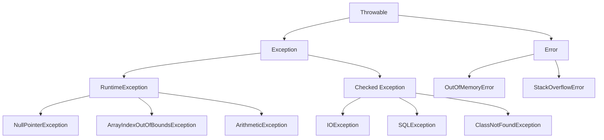

# 异常处理

异常处理是 Java 程序健壮性的重要保障。本文介绍异常的分类、处理机制和最佳实践。

## 异常概述

### 异常体系结构



### 异常分类

| 类型 | 说明 | 是否必须处理 | 示例 |
|------|------|--------------|------|
| Error | 系统错误，程序无法处理 | 否 | OutOfMemoryError |
| Checked Exception | 编译时异常 | 是 | IOException |
| Unchecked Exception | 运行时异常 | 否 | NullPointerException |

## try-catch-finally

### 基本语法

```java
public class TryCatchExample {
    public static void main(String[] args) {
        try {
            // 可能抛出异常的代码
            int result = divide(10, 0);
            System.out.println("结果: " + result);
        } catch (ArithmeticException e) {
            // 处理异常
            System.out.println("除数不能为0！");
            e.printStackTrace();
        } finally {
            // 无论是否发生异常都会执行
            System.out.println("finally 块执行");
        }
    }
    
    public static int divide(int a, int b) {
        return a / b;
    }
}
```

### 捕获多个异常

```java
public class MultipleCatchExample {
    public static void main(String[] args) {
        try {
            String str = null;
            System.out.println(str.length());  // NullPointerException
            
            int[] arr = new int[5];
            System.out.println(arr[10]);  // ArrayIndexOutOfBoundsException
            
        } catch (NullPointerException e) {
            System.out.println("空指针异常: " + e.getMessage());
        } catch (ArrayIndexOutOfBoundsException e) {
            System.out.println("数组越界异常: " + e.getMessage());
        } catch (Exception e) {
            // 捕获其他所有异常
            System.out.println("其他异常: " + e.getMessage());
        }
    }
}
```

### Java 7+ 多异常捕获

```java
public class MultiCatchExample {
    public static void main(String[] args) {
        try {
            // 可能抛出多种异常的代码
            riskyOperation();
        } catch (NullPointerException | ArithmeticException e) {
            // 同时捕获多个异常
            System.out.println("捕获到异常: " + e.getMessage());
        } catch (Exception e) {
            System.out.println("其他异常: " + e.getMessage());
        }
    }
    
    public static void riskyOperation() {
        // ...
    }
}
```

## 抛出异常

### throw 关键字

```java
public class ThrowExample {
    public static void checkAge(int age) {
        if (age < 0) {
            throw new IllegalArgumentException("年龄不能为负数");
        }
        if (age > 150) {
            throw new IllegalArgumentException("年龄不能超过150");
        }
        System.out.println("年龄有效: " + age);
    }
    
    public static void main(String[] args) {
        try {
            checkAge(-5);
        } catch (IllegalArgumentException e) {
            System.out.println("错误: " + e.getMessage());
        }
    }
}
```

### throws 关键字

```java
import java.io.*;

public class ThrowsExample {
    // 声明方法可能抛出的异常
    public static void readFile(String filename) throws IOException {
        FileReader reader = new FileReader(filename);
        BufferedReader br = new BufferedReader(reader);
        String line = br.readLine();
        System.out.println(line);
        br.close();
    }
    
    public static void main(String[] args) {
        try {
            readFile("test.txt");
        } catch (IOException e) {
            System.out.println("文件读取失败: " + e.getMessage());
        }
    }
}
```

## 自定义异常

### 创建自定义异常

```java
// 自定义 Checked 异常
public class InsufficientFundsException extends Exception {
    private double amount;
    
    public InsufficientFundsException(double amount) {
        super("余额不足，缺少: " + amount + " 元");
        this.amount = amount;
    }
    
    public double getAmount() {
        return amount;
    }
}

// 自定义 Unchecked 异常
public class InvalidAccountException extends RuntimeException {
    public InvalidAccountException(String message) {
        super(message);
    }
}
```

### 使用自定义异常

```java
public class BankAccount {
    private String accountId;
    private double balance;
    
    public BankAccount(String accountId, double balance) {
        this.accountId = accountId;
        this.balance = balance;
    }
    
    public void withdraw(double amount) throws InsufficientFundsException {
        if (amount > balance) {
            double shortage = amount - balance;
            throw new InsufficientFundsException(shortage);
        }
        balance -= amount;
        System.out.println("取款成功，余额: " + balance);
    }
    
    public void deposit(double amount) {
        if (amount <= 0) {
            throw new InvalidAccountException("存款金额必须大于0");
        }
        balance += amount;
        System.out.println("存款成功，余额: " + balance);
    }
    
    public static void main(String[] args) {
        BankAccount account = new BankAccount("ACC001", 1000);
        
        try {
            account.withdraw(1500);
        } catch (InsufficientFundsException e) {
            System.out.println("错误: " + e.getMessage());
            System.out.println("缺少金额: " + e.getAmount());
        }
        
        try {
            account.deposit(-100);
        } catch (InvalidAccountException e) {
            System.out.println("错误: " + e.getMessage());
        }
    }
}
```

## try-with-resources

自动资源管理（Java 7+）。

```java
import java.io.*;

public class TryWithResourcesExample {
    // 传统方式
    public static void readFileOld(String filename) {
        BufferedReader reader = null;
        try {
            reader = new BufferedReader(new FileReader(filename));
            String line;
            while ((line = reader.readLine()) != null) {
                System.out.println(line);
            }
        } catch (IOException e) {
            e.printStackTrace();
        } finally {
            try {
                if (reader != null) {
                    reader.close();
                }
            } catch (IOException e) {
                e.printStackTrace();
            }
        }
    }
    
    // try-with-resources 方式（推荐）
    public static void readFileNew(String filename) {
        try (BufferedReader reader = new BufferedReader(new FileReader(filename))) {
            String line;
            while ((line = reader.readLine()) != null) {
                System.out.println(line);
            }
        } catch (IOException e) {
            e.printStackTrace();
        }
        // reader 会自动关闭
    }
    
    // 多个资源
    public static void copyFile(String src, String dest) {
        try (BufferedReader reader = new BufferedReader(new FileReader(src));
             BufferedWriter writer = new BufferedWriter(new FileWriter(dest))) {
            
            String line;
            while ((line = reader.readLine()) != null) {
                writer.write(line);
                writer.newLine();
            }
        } catch (IOException e) {
            e.printStackTrace();
        }
    }
}
```

## 常见异常

### 运行时异常（Unchecked）

```java
public class CommonRuntimeExceptions {
    public static void main(String[] args) {
        // 1. NullPointerException - 空指针异常
        try {
            String str = null;
            System.out.println(str.length());
        } catch (NullPointerException e) {
            System.out.println("空指针异常");
        }
        
        // 2. ArrayIndexOutOfBoundsException - 数组越界
        try {
            int[] arr = {1, 2, 3};
            System.out.println(arr[5]);
        } catch (ArrayIndexOutOfBoundsException e) {
            System.out.println("数组越界");
        }
        
        // 3. ArithmeticException - 算术异常
        try {
            int result = 10 / 0;
        } catch (ArithmeticException e) {
            System.out.println("算术异常：" + e.getMessage());
        }
        
        // 4. ClassCastException - 类型转换异常
        try {
            Object obj = "Hello";
            Integer num = (Integer) obj;
        } catch (ClassCastException e) {
            System.out.println("类型转换异常");
        }
        
        // 5. NumberFormatException - 数字格式异常
        try {
            int num = Integer.parseInt("abc");
        } catch (NumberFormatException e) {
            System.out.println("数字格式异常");
        }
        
        // 6. IllegalArgumentException - 非法参数异常
        try {
            Thread.sleep(-1000);
        } catch (IllegalArgumentException e) {
            System.out.println("非法参数");
        } catch (InterruptedException e) {
            e.printStackTrace();
        }
    }
}
```

### 检查型异常（Checked）

```java
import java.io.*;
import java.sql.*;

public class CommonCheckedExceptions {
    // IOException - IO 异常
    public static void handleIOException() throws IOException {
        File file = new File("test.txt");
        FileReader reader = new FileReader(file);
    }
    
    // SQLException - SQL 异常
    public static void handleSQLException() throws SQLException {
        Connection conn = DriverManager.getConnection("jdbc:mysql://localhost:3306/db", "user", "pass");
    }
    
    // ClassNotFoundException - 类未找到异常
    public static void handleClassNotFoundException() throws ClassNotFoundException {
        Class.forName("com.mysql.jdbc.Driver");
    }
    
    // InterruptedException - 中断异常
    public static void handleInterruptedException() throws InterruptedException {
        Thread.sleep(1000);
    }
}
```

## 异常链

保留原始异常信息。

```java
public class ExceptionChainingExample {
    public static void method1() throws Exception {
        try {
            method2();
        } catch (Exception e) {
            // 包装异常，保留原始异常
            throw new Exception("method1 异常", e);
        }
    }
    
    public static void method2() throws Exception {
        try {
            method3();
        } catch (Exception e) {
            throw new Exception("method2 异常", e);
        }
    }
    
    public static void method3() throws Exception {
        throw new Exception("method3 原始异常");
    }
    
    public static void main(String[] args) {
        try {
            method1();
        } catch (Exception e) {
            System.out.println("异常消息: " + e.getMessage());
            System.out.println("\n完整堆栈:");
            e.printStackTrace();
            
            // 获取原始异常
            Throwable cause = e.getCause();
            System.out.println("\n原始异常: " + cause);
        }
    }
}
```

## 异常处理最佳实践

### 1. 不要忽略异常

```java
// 不好：空的 catch 块
try {
    riskyOperation();
} catch (Exception e) {
    // 什么都不做
}

// 好：至少记录日志
try {
    riskyOperation();
} catch (Exception e) {
    logger.error("操作失败", e);
    // 或者重新抛出
    throw new RuntimeException("操作失败", e);
}
```

### 2. 捕获具体异常

```java
// 不好：捕获 Exception
try {
    readFile();
} catch (Exception e) {
    // 太宽泛
}

// 好：捕获具体异常
try {
    readFile();
} catch (FileNotFoundException e) {
    System.out.println("文件不存在");
} catch (IOException e) {
    System.out.println("读取错误");
}
```

### 3. 不要使用异常控制流程

```java
// 不好：使用异常控制流程
try {
    int i = 0;
    while (true) {
        array[i++] = getValue();
    }
} catch (ArrayIndexOutOfBoundsException e) {
    // 用异常结束循环
}

// 好：使用正常逻辑
for (int i = 0; i < array.length; i++) {
    array[i] = getValue();
}
```

### 4. 及时释放资源

```java
// 不好：可能资源泄漏
FileInputStream fis = new FileInputStream("file.txt");
try {
    // 读取文件
} catch (IOException e) {
    e.printStackTrace();
}
fis.close();  // 如果 try 中抛出异常，不会执行

// 好：使用 try-with-resources
try (FileInputStream fis = new FileInputStream("file.txt")) {
    // 读取文件
} catch (IOException e) {
    e.printStackTrace();
}
```

### 5. 提供有用的异常信息

```java
// 不好：信息不明确
throw new Exception("错误");

// 好：提供详细信息
throw new IllegalArgumentException(
    String.format("用户ID无效: %s, 必须是正整数", userId)
);
```

### 6. 不要在 finally 中抛出异常

```java
// 不好：finally 中的异常会覆盖原异常
try {
    throw new RuntimeException("try 异常");
} finally {
    throw new RuntimeException("finally 异常");  // 会覆盖 try 中的异常
}

// 好：避免在 finally 中抛出异常
try {
    throw new RuntimeException("try 异常");
} finally {
    // 清理资源，不抛出异常
    cleanup();
}
```

### 7. 文档化异常

```java
/**
 * 从文件读取数据
 * 
 * @param filename 文件名
 * @return 文件内容
 * @throws FileNotFoundException 如果文件不存在
 * @throws IOException 如果读取失败
 */
public String readFile(String filename) 
        throws FileNotFoundException, IOException {
    // 实现
    return null;
}
```

## 异常处理模式

### 1. 转换异常

```java
public class DataAccessLayer {
    public User findUser(Long id) {
        try {
            // 数据库操作
            return queryUser(id);
        } catch (SQLException e) {
            // 将底层异常转换为业务异常
            throw new DataAccessException("查询用户失败: " + id, e);
        }
    }
}
```

### 2. 重试机制

```java
public class RetryExample {
    private static final int MAX_RETRIES = 3;
    
    public void executeWithRetry() {
        int retries = 0;
        while (retries < MAX_RETRIES) {
            try {
                // 执行操作
                riskyOperation();
                return;  // 成功则返回
            } catch (TransientException e) {
                retries++;
                if (retries >= MAX_RETRIES) {
                    throw new RuntimeException("重试失败", e);
                }
                // 等待后重试
                try {
                    Thread.sleep(1000 * retries);
                } catch (InterruptedException ie) {
                    Thread.currentThread().interrupt();
                }
            }
        }
    }
}
```

### 3. 异常聚合

```java
public class AggregateExceptionExample {
    public void processAll(List<Task> tasks) {
        List<Exception> exceptions = new ArrayList<>();
        
        for (Task task : tasks) {
            try {
                task.execute();
            } catch (Exception e) {
                exceptions.add(e);
                // 继续处理其他任务
            }
        }
        
        if (!exceptions.isEmpty()) {
            throw new AggregateException("部分任务失败", exceptions);
        }
    }
}

class AggregateException extends RuntimeException {
    private List<Exception> exceptions;
    
    public AggregateException(String message, List<Exception> exceptions) {
        super(message);
        this.exceptions = exceptions;
    }
    
    public List<Exception> getExceptions() {
        return exceptions;
    }
}
```

## 调试异常

### 1. 打印堆栈跟踪

```java
try {
    riskyOperation();
} catch (Exception e) {
    // 打印到标准错误输出
    e.printStackTrace();
    
    // 打印到字符串
    StringWriter sw = new StringWriter();
    PrintWriter pw = new PrintWriter(sw);
    e.printStackTrace(pw);
    String stackTrace = sw.toString();
    
    // 记录到日志
    logger.error("异常堆栈: \n" + stackTrace);
}
```

### 2. 获取异常信息

```java
try {
    riskyOperation();
} catch (Exception e) {
    System.out.println("异常类: " + e.getClass().getName());
    System.out.println("异常消息: " + e.getMessage());
    System.out.println("异常原因: " + e.getCause());
    
    // 获取堆栈元素
    StackTraceElement[] stackTrace = e.getStackTrace();
    for (StackTraceElement element : stackTrace) {
        System.out.println("  at " + element.toString());
    }
}
```

## 总结

本文介绍了 Java 异常处理的核心内容：

- ✅ 异常体系和分类
- ✅ try-catch-finally 语句
- ✅ throw 和 throws 关键字
- ✅ 自定义异常
- ✅ try-with-resources 自动资源管理
- ✅ 常见异常类型
- ✅ 异常处理最佳实践

掌握异常处理后，继续学习 [多线程](/docs/java/multithreading) 和 [IO 流](/docs/java/io-streams)。
