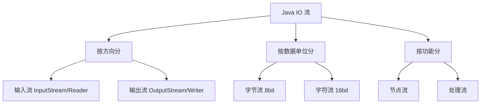

# IO 流

Java IO（Input/Output）用于处理输入和输出操作。本文介绍字节流、字符流、缓冲流和 NIO 等内容。

## IO 流概述

### 流的分类



### 流的体系结构

| 分类 | 字节输入流 | 字节输出流 | 字符输入流 | 字符输出流 |
|------|------------|------------|------------|------------|
| 抽象基类 | InputStream | OutputStream | Reader | Writer |
| 文件 | FileInputStream | FileOutputStream | FileReader | FileWriter |
| 数组 | ByteArrayInputStream | ByteArrayOutputStream | CharArrayReader | CharArrayWriter |
| 缓冲 | BufferedInputStream | BufferedOutputStream | BufferedReader | BufferedWriter |
| 转换 | - | - | InputStreamReader | OutputStreamWriter |
| 对象 | ObjectInputStream | ObjectOutputStream | - | - |
| 打印 | - | PrintStream | - | PrintWriter |
| 数据 | DataInputStream | DataOutputStream | - | - |

## 字节流

### FileInputStream 和 FileOutputStream

```java
import java.io.*;

public class FileStreamExample {
    // 读取文件
    public static void readFile(String filename) {
        FileInputStream fis = null;
        try {
            fis = new FileInputStream(filename);
            int data;
            while ((data = fis.read()) != -1) {
                System.out.print((char) data);
            }
        } catch (IOException e) {
            e.printStackTrace();
        } finally {
            if (fis != null) {
                try {
                    fis.close();
                } catch (IOException e) {
                    e.printStackTrace();
                }
            }
        }
    }
    
    // 写入文件
    public static void writeFile(String filename, String content) {
        try (FileOutputStream fos = new FileOutputStream(filename)) {
            fos.write(content.getBytes());
        } catch (IOException e) {
            e.printStackTrace();
        }
    }
    
    // 复制文件
    public static void copyFile(String src, String dest) {
        try (FileInputStream fis = new FileInputStream(src);
             FileOutputStream fos = new FileOutputStream(dest)) {
            
            byte[] buffer = new byte[1024];
            int length;
            while ((length = fis.read(buffer)) != -1) {
                fos.write(buffer, 0, length);
            }
        } catch (IOException e) {
            e.printStackTrace();
        }
    }
    
    public static void main(String[] args) {
        writeFile("test.txt", "Hello, Java IO!");
        readFile("test.txt");
        copyFile("test.txt", "copy.txt");
    }
}
```

### BufferedInputStream 和 BufferedOutputStream

使用缓冲区提高读写效率。

```java
import java.io.*;

public class BufferedStreamExample {
    public static void copyFileWithBuffer(String src, String dest) {
        try (BufferedInputStream bis = new BufferedInputStream(
                new FileInputStream(src));
             BufferedOutputStream bos = new BufferedOutputStream(
                new FileOutputStream(dest))) {
            
            byte[] buffer = new byte[8192];  // 8KB 缓冲区
            int length;
            while ((length = bis.read(buffer)) != -1) {
                bos.write(buffer, 0, length);
            }
        } catch (IOException e) {
            e.printStackTrace();
        }
    }
    
    public static void main(String[] args) {
        long start = System.currentTimeMillis();
        copyFileWithBuffer("large file.dat", "copy.dat");
        long end = System.currentTimeMillis();
        System.out.println("耗时: " + (end - start) + "ms");
    }
}
```

## 字符流

### FileReader 和 FileWriter

```java
import java.io.*;

public class FileReaderWriterExample {
    // 读取文本文件
    public static void readTextFile(String filename) {
        try (FileReader reader = new FileReader(filename)) {
            int data;
            while ((data = reader.read()) != -1) {
                System.out.print((char) data);
            }
        } catch (IOException e) {
            e.printStackTrace();
        }
    }
    
    // 写入文本文件
    public static void writeTextFile(String filename, String content) {
        try (FileWriter writer = new FileWriter(filename)) {
            writer.write(content);
        } catch (IOException e) {
            e.printStackTrace();
        }
    }
    
    // 追加内容
    public static void appendToFile(String filename, String content) {
        try (FileWriter writer = new FileWriter(filename, true)) {  // true 表示追加
            writer.write(content);
        } catch (IOException e) {
            e.printStackTrace();
        }
    }
    
    public static void main(String[] args) {
        writeTextFile("text.txt", "第一行内容\n");
        appendToFile("text.txt", "第二行内容\n");
        readTextFile("text.txt");
    }
}
```

### BufferedReader 和 BufferedWriter

```java
import java.io.*;

public class BufferedReaderWriterExample {
    // 按行读取
    public static void readLines(String filename) {
        try (BufferedReader reader = new BufferedReader(
                new FileReader(filename))) {
            String line;
            int lineNumber = 1;
            while ((line = reader.readLine()) != null) {
                System.out.println(lineNumber + ": " + line);
                lineNumber++;
            }
        } catch (IOException e) {
            e.printStackTrace();
        }
    }
    
    // 按行写入
    public static void writeLines(String filename, String[] lines) {
        try (BufferedWriter writer = new BufferedWriter(
                new FileWriter(filename))) {
            for (String line : lines) {
                writer.write(line);
                writer.newLine();  // 写入换行符
            }
        } catch (IOException e) {
            e.printStackTrace();
        }
    }
    
    public static void main(String[] args) {
        String[] lines = {"第一行", "第二行", "第三行"};
        writeLines("lines.txt", lines);
        readLines("lines.txt");
    }
}
```

## 转换流

### InputStreamReader 和 OutputStreamWriter

字节流和字符流之间的桥梁。

```java
import java.io.*;
import java.nio.charset.StandardCharsets;

public class ConversionStreamExample {
    public static void main(String[] args) {
        // 字节流转字符流（指定编码）
        try (InputStreamReader reader = new InputStreamReader(
                new FileInputStream("utf8.txt"), StandardCharsets.UTF_8);
             BufferedReader br = new BufferedReader(reader)) {
            
            String line;
            while ((line = br.readLine()) != null) {
                System.out.println(line);
            }
        } catch (IOException e) {
            e.printStackTrace();
        }
        
        // 字符流转字节流
        try (OutputStreamWriter writer = new OutputStreamWriter(
                new FileOutputStream("output.txt"), StandardCharsets.UTF_8);
             BufferedWriter bw = new BufferedWriter(writer)) {
            
            bw.write("中文内容");
            bw.newLine();
        } catch (IOException e) {
            e.printStackTrace();
        }
    }
}
```

## 对象流

### 序列化和反序列化

```java
import java.io.*;

// 实现 Serializable 接口
class Person implements Serializable {
    private static final long serialVersionUID = 1L;
    
    private String name;
    private int age;
    private transient String password;  // transient 字段不会被序列化
    
    public Person(String name, int age, String password) {
        this.name = name;
        this.age = age;
        this.password = password;
    }
    
    @Override
    public String toString() {
        return "Person{name='" + name + "', age=" + age + 
               ", password='" + password + "'}";
    }
}

public class ObjectStreamExample {
    // 序列化（对象 → 文件）
    public static void serializeObject(String filename, Object obj) {
        try (ObjectOutputStream oos = new ObjectOutputStream(
                new FileOutputStream(filename))) {
            oos.writeObject(obj);
            System.out.println("对象已序列化");
        } catch (IOException e) {
            e.printStackTrace();
        }
    }
    
    // 反序列化（文件 → 对象）
    public static Object deserializeObject(String filename) {
        try (ObjectInputStream ois = new ObjectInputStream(
                new FileInputStream(filename))) {
            Object obj = ois.readObject();
            System.out.println("对象已反序列化");
            return obj;
        } catch (IOException | ClassNotFoundException e) {
            e.printStackTrace();
            return null;
        }
    }
    
    public static void main(String[] args) {
        Person person = new Person("张三", 25, "secret123");
        System.out.println("原对象: " + person);
        
        // 序列化
        serializeObject("person.ser", person);
        
        // 反序列化
        Person loadedPerson = (Person) deserializeObject("person.ser");
        System.out.println("反序列化对象: " + loadedPerson);
        // 注意：password 为 null（transient 字段）
    }
}
```

## 数据流

### DataInputStream 和 DataOutputStream

```java
import java.io.*;

public class DataStreamExample {
    public static void main(String[] args) {
        String filename = "data.dat";
        
        // 写入基本数据类型
        try (DataOutputStream dos = new DataOutputStream(
                new FileOutputStream(filename))) {
            dos.writeInt(100);
            dos.writeDouble(3.14);
            dos.writeBoolean(true);
            dos.writeUTF("Hello");
        } catch (IOException e) {
            e.printStackTrace();
        }
        
        // 读取基本数据类型
        try (DataInputStream dis = new DataInputStream(
                new FileInputStream(filename))) {
            int i = dis.readInt();
            double d = dis.readDouble();
            boolean b = dis.readBoolean();
            String s = dis.readUTF();
            
            System.out.println("int: " + i);
            System.out.println("double: " + d);
            System.out.println("boolean: " + b);
            System.out.println("String: " + s);
        } catch (IOException e) {
            e.printStackTrace();
        }
    }
}
```

## 打印流

### PrintStream 和 PrintWriter

```java
import java.io.*;

public class PrintStreamExample {
    public static void main(String[] args) {
        // PrintStream
        try (PrintStream ps = new PrintStream("print.txt")) {
            ps.println("这是一行文本");
            ps.printf("格式化输出: %s, %d%n", "Java", 2024);
            ps.print("不换行");
        } catch (FileNotFoundException e) {
            e.printStackTrace();
        }
        
        // PrintWriter
        try (PrintWriter pw = new PrintWriter(
                new FileWriter("writer.txt"))) {
            pw.println("PrintWriter 输出");
            pw.printf("数字: %d, 浮点: %.2f%n", 100, 3.14159);
        } catch (IOException e) {
            e.printStackTrace();
        }
        
        // 重定向标准输出
        try {
            PrintStream ps = new PrintStream("console.txt");
            System.setOut(ps);
            System.out.println("这会输出到文件");
        } catch (FileNotFoundException e) {
            e.printStackTrace();
        }
    }
}
```

## File 类

### 文件和目录操作

```java
import java.io.File;
import java.io.IOException;

public class FileExample {
    public static void main(String[] args) {
        // 创建 File 对象
        File file = new File("test.txt");
        File dir = new File("mydir");
        
        // 判断是否存在
        System.out.println("文件存在: " + file.exists());
        
        // 创建文件
        try {
            if (file.createNewFile()) {
                System.out.println("文件创建成功");
            }
        } catch (IOException e) {
            e.printStackTrace();
        }
        
        // 创建目录
        if (dir.mkdir()) {
            System.out.println("目录创建成功");
        }
        
        // 创建多级目录
        File multiDir = new File("parent/child");
        if (multiDir.mkdirs()) {
            System.out.println("多级目录创建成功");
        }
        
        // 文件属性
        System.out.println("文件名: " + file.getName());
        System.out.println("绝对路径: " + file.getAbsolutePath());
        System.out.println("父目录: " + file.getParent());
        System.out.println("文件大小: " + file.length() + " 字节");
        System.out.println("是否是文件: " + file.isFile());
        System.out.println("是否是目录: " + file.isDirectory());
        System.out.println("是否可读: " + file.canRead());
        System.out.println("是否可写: " + file.canWrite());
        System.out.println("是否可执行: " + file.canExecute());
        System.out.println("是否隐藏: " + file.isHidden());
        System.out.println("最后修改时间: " + file.lastModified());
        
        // 列出目录内容
        File currentDir = new File(".");
        String[] files = currentDir.list();
        System.out.println("\n当前目录文件:");
        for (String filename : files) {
            System.out.println(filename);
        }
        
        // 遍历目录（包含 File 对象）
        File[] fileObjects = currentDir.listFiles();
        if (fileObjects != null) {
            for (File f : fileObjects) {
                System.out.println(f.getName() + " - " + 
                    (f.isDirectory() ? "目录" : "文件"));
            }
        }
        
        // 删除文件
        if (file.delete()) {
            System.out.println("文件删除成功");
        }
        
        // 重命名
        File newFile = new File("newname.txt");
        if (file.renameTo(newFile)) {
            System.out.println("重命名成功");
        }
    }
}
```

### 递归遍历目录

```java
import java.io.File;

public class DirectoryTraversalExample {
    public static void listAllFiles(File dir, int depth) {
        if (!dir.exists() || !dir.isDirectory()) {
            return;
        }
        
        String indent = "  ".repeat(depth);
        File[] files = dir.listFiles();
        
        if (files != null) {
            for (File file : files) {
                System.out.println(indent + file.getName());
                if (file.isDirectory()) {
                    listAllFiles(file, depth + 1);
                }
            }
        }
    }
    
    // 计算目录大小
    public static long getDirectorySize(File dir) {
        long size = 0;
        if (dir.isDirectory()) {
            File[] files = dir.listFiles();
            if (files != null) {
                for (File file : files) {
                    if (file.isFile()) {
                        size += file.length();
                    } else {
                        size += getDirectorySize(file);
                    }
                }
            }
        } else {
            size = dir.length();
        }
        return size;
    }
    
    public static void main(String[] args) {
        File dir = new File(".");
        System.out.println("目录结构:");
        listAllFiles(dir, 0);
        
        System.out.println("\n目录大小: " + getDirectorySize(dir) + " 字节");
    }
}
```

## NIO (New IO)

### Path 和 Files

Java 7+ 提供的新 IO API。

```java
import java.io.IOException;
import java.nio.file.*;
import java.util.List;

public class NIOExample {
    public static void main(String[] args) {
        // 创建 Path
        Path path = Paths.get("nio.txt");
        Path dirPath = Paths.get("niodir");
        
        try {
            // 写入文件
            Files.write(path, "Hello NIO".getBytes());
            
            // 读取文件
            byte[] bytes = Files.readAllBytes(path);
            System.out.println(new String(bytes));
            
            // 按行读取
            List<String> lines = Files.readAllLines(path);
            for (String line : lines) {
                System.out.println(line);
            }
            
            // 创建目录
            if (!Files.exists(dirPath)) {
                Files.createDirectory(dirPath);
            }
            
            // 复制文件
            Path dest = Paths.get("nio_copy.txt");
            Files.copy(path, dest, StandardCopyOption.REPLACE_EXISTING);
            
            // 移动文件
            Path moved = Paths.get("nio_moved.txt");
            Files.move(dest, moved, StandardCopyOption.REPLACE_EXISTING);
            
            // 删除文件
            Files.deleteIfExists(moved);
            
            // 获取文件属性
            System.out.println("文件大小: " + Files.size(path));
            System.out.println("是否隐藏: " + Files.isHidden(path));
            System.out.println("最后修改时间: " + Files.getLastModifiedTime(path));
            
        } catch (IOException e) {
            e.printStackTrace();
        }
    }
}
```

### 遍历目录树

```java
import java.io.IOException;
import java.nio.file.*;
import java.nio.file.attribute.BasicFileAttributes;

public class FileVisitorExample {
    public static void main(String[] args) {
        Path startPath = Paths.get(".");
        
        try {
            Files.walkFileTree(startPath, new SimpleFileVisitor<Path>() {
                @Override
                public FileVisitResult visitFile(Path file, BasicFileAttributes attrs) {
                    System.out.println("文件: " + file);
                    return FileVisitResult.CONTINUE;
                }
                
                @Override
                public FileVisitResult preVisitDirectory(Path dir, BasicFileAttributes attrs) {
                    System.out.println("目录: " + dir);
                    return FileVisitResult.CONTINUE;
                }
                
                @Override
                public FileVisitResult visitFileFailed(Path file, IOException exc) {
                    System.err.println("访问失败: " + file);
                    return FileVisitResult.CONTINUE;
                }
            });
        } catch (IOException e) {
            e.printStackTrace();
        }
    }
}
```

### 监听文件变化

```java
import java.io.IOException;
import java.nio.file.*;

public class WatchServiceExample {
    public static void main(String[] args) {
        try {
            WatchService watchService = FileSystems.getDefault().newWatchService();
            Path path = Paths.get(".");
            
            // 注册监听事件
            path.register(watchService,
                StandardWatchEventKinds.ENTRY_CREATE,
                StandardWatchEventKinds.ENTRY_MODIFY,
                StandardWatchEventKinds.ENTRY_DELETE);
            
            System.out.println("开始监听目录变化...");
            
            while (true) {
                WatchKey key = watchService.take();
                
                for (WatchEvent<?> event : key.pollEvents()) {
                    WatchEvent.Kind<?> kind = event.kind();
                    Path filename = (Path) event.context();
                    
                    System.out.println(kind.name() + ": " + filename);
                }
                
                if (!key.reset()) {
                    break;
                }
            }
        } catch (IOException | InterruptedException e) {
            e.printStackTrace();
        }
    }
}
```

## 最佳实践

### 1. 使用 try-with-resources

```java
// 好：自动关闭资源
try (BufferedReader reader = new BufferedReader(new FileReader("file.txt"))) {
    String line = reader.readLine();
} catch (IOException e) {
    e.printStackTrace();
}
```

### 2. 使用缓冲流提高性能

```java
// 不好：直接使用 FileInputStream
FileInputStream fis = new FileInputStream("file.txt");

// 好：使用 BufferedInputStream
BufferedInputStream bis = new BufferedInputStream(new FileInputStream("file.txt"));
```

### 3. 选择合适的流

```java
// 文本文件 → 字符流
BufferedReader reader = new BufferedReader(new FileReader("text.txt"));

// 二进制文件 → 字节流
BufferedInputStream bis = new BufferedInputStream(new FileInputStream("image.jpg"));
```

### 4. 处理文件编码

```java
// 指定编码读取
BufferedReader reader = new BufferedReader(
    new InputStreamReader(new FileInputStream("utf8.txt"), StandardCharsets.UTF_8)
);

// 指定编码写入
BufferedWriter writer = new BufferedWriter(
    new OutputStreamWriter(new FileOutputStream("utf8.txt"), StandardCharsets.UTF_8)
);
```

### 5. 大文件处理

```java
// 分块读取大文件
try (BufferedInputStream bis = new BufferedInputStream(new FileInputStream("large.file"))) {
    byte[] buffer = new byte[8192];
    int length;
    while ((length = bis.read(buffer)) != -1) {
        // 处理数据块
        processChunk(buffer, length);
    }
}
```

## 总结

本文介绍了 Java IO 流的核心内容：

- ✅ 字节流：FileInputStream/FileOutputStream
- ✅ 字符流：FileReader/FileWriter
- ✅ 缓冲流：BufferedInputStream/BufferedReader
- ✅ 转换流：InputStreamReader/OutputStreamWriter
- ✅ 对象流：序列化和反序列化
- ✅ File 类：文件和目录操作
- ✅ NIO：Path、Files、WatchService

掌握 IO 流后，继续学习 [泛型](/docs/java/generics) 和 [函数式编程](/docs/java/functional-programming)。
