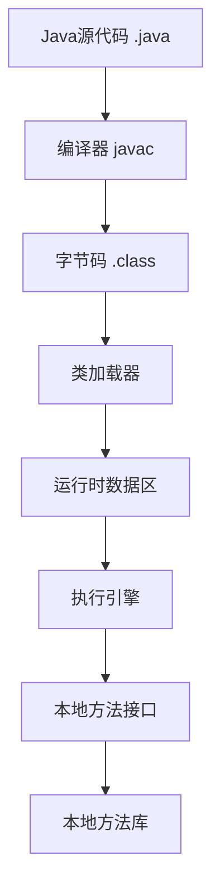

# JVM 基础

Java 虚拟机（JVM）是 Java 程序的运行环境。理解 JVM 的工作原理对于编写高性能的 Java 应用至关重要。

## JVM 架构

### JVM 组成结构



### 运行时数据区

JVM 运行时数据区分为以下几个部分：

```java
/**
 * JVM 运行时数据区示意
 */
public class RuntimeDataAreas {
    // 1. 方法区（Method Area）- 线程共享
    //    存储：类信息、常量、静态变量、即时编译器编译后的代码
    private static String CLASS_INFO = "类信息";
    private static final String CONSTANT = "常量";
    
    // 2. 堆（Heap）- 线程共享
    //    存储：对象实例、数组
    private Object instance = new Object();
    private int[] array = new int[10];
    
    // 3. 虚拟机栈（VM Stack）- 线程私有
    //    存储：局部变量表、操作数栈、动态链接、方法出口
    public void method() {
        int localVar = 10;  // 局部变量存储在栈中
    }
    
    // 4. 本地方法栈（Native Method Stack）- 线程私有
    //    为本地方法服务
    private native void nativeMethod();
    
    // 5. 程序计数器（Program Counter）- 线程私有
    //    当前线程执行的字节码行号指示器
}
```

## 类加载机制

### 类加载过程

类从被加载到虚拟机内存中开始，到卸载出内存为止，整个生命周期包括：

1. **加载（Loading）**
2. **验证（Verification）**
3. **准备（Preparation）**
4. **解析（Resolution）**
5. **初始化（Initialization）**
6. **使用（Using）**
7. **卸载（Unloading）**

```java
public class ClassLoadingExample {
    // 准备阶段：为静态变量分配内存并设置默认初始值 0
    // 初始化阶段：执行静态变量赋值和静态代码块
    private static int value = 123;
    
    static {
        System.out.println("静态代码块执行");
        value = 456;
    }
    
    public static void main(String[] args) {
        System.out.println("value = " + value);  // 456
    }
}
```

### 类加载器

```java
public class ClassLoaderExample {
    public static void main(String[] args) {
        // 获取类加载器
        ClassLoader classLoader = ClassLoaderExample.class.getClassLoader();
        System.out.println("当前类的类加载器: " + classLoader);
        
        // 父类加载器
        ClassLoader parent = classLoader.getParent();
        System.out.println("父类加载器: " + parent);
        
        // 祖父类加载器（Bootstrap ClassLoader 是 C++ 实现，Java中为null）
        ClassLoader grandParent = parent.getParent();
        System.out.println("祖父类加载器: " + grandParent);
        
        // 系统类的类加载器
        ClassLoader systemClassLoader = String.class.getClassLoader();
        System.out.println("String类的类加载器: " + systemClassLoader);
    }
}
```

### 双亲委派模型

```java
/**
 * 自定义类加载器示例
 */
public class CustomClassLoader extends ClassLoader {
    
    @Override
    protected Class<?> findClass(String name) throws ClassNotFoundException {
        // 自定义类加载逻辑
        byte[] classData = loadClassData(name);
        if (classData == null) {
            throw new ClassNotFoundException();
        }
        return defineClass(name, classData, 0, classData.length);
    }
    
    private byte[] loadClassData(String className) {
        // 从文件或网络加载类的字节码
        // 这里省略具体实现
        return null;
    }
    
    public static void main(String[] args) {
        CustomClassLoader loader = new CustomClassLoader();
        try {
            Class<?> clazz = loader.loadClass("com.example.MyClass");
            System.out.println("成功加载类: " + clazz.getName());
        } catch (ClassNotFoundException e) {
            e.printStackTrace();
        }
    }
}
```

## 内存模型

### Java内存模型（JMM）

Java 内存模型定义了线程和主内存之间的抽象关系。

```java
public class JMMExample {
    // volatile 保证可见性和有序性
    private volatile boolean flag = false;
    private int value = 0;
    
    // 线程1：写操作
    public void writer() {
        value = 42;      // 1
        flag = true;     // 2 - volatile写
    }
    
    // 线程2：读操作
    public void reader() {
        if (flag) {      // 3 - volatile读
            int temp = value;  // 4 - 保证能看到42
            System.out.println(temp);
        }
    }
}
```

### happens-before 原则

```java
public class HappensBeforeExample {
    private int x = 0;
    private int y = 0;
    
    // 规则1：程序顺序规则
    public void rule1() {
        x = 1;  // happens-before
        y = 2;  // 这个操作
    }
    
    // 规则2：monitor锁规则
    private final Object lock = new Object();
    public void rule2() {
        synchronized (lock) {
            x = 1;
        }  // 解锁 happens-before 后续的加锁
        
        synchronized (lock) {
            int temp = x;  // 能看到 x = 1
        }
    }
    
    // 规则3：volatile变量规则
    private volatile boolean ready = false;
    public void rule3() {
        x = 1;
        ready = true;  // volatile写 happens-before volatile读
    }
    
    public void rule3Read() {
        if (ready) {
            int temp = x;  // 能看到 x = 1
        }
    }
}
```

## 垃圾回收（GC）

### 判断对象是否存活

#### 引用计数法（不推荐）

```java
public class ReferenceCountingGC {
    public Object instance = null;
    
    public static void main(String[] args) {
        ReferenceCountingGC objA = new ReferenceCountingGC();
        ReferenceCountingGC objB = new ReferenceCountingGC();
        
        // 循环引用
        objA.instance = objB;
        objB.instance = objA;
        
        objA = null;
        objB = null;
        
        // 引用计数法无法回收循环引用的对象
        System.gc();
    }
}
```

#### 可达性分析算法（推荐）

```java
/**
 * GC Roots 包括：
 * 1. 虚拟机栈中引用的对象
 * 2. 方法区中静态属性引用的对象
 * 3. 方法区中常量引用的对象
 * 4. 本地方法栈中引用的对象
 */
public class ReachabilityAnalysis {
    // GC Root - 静态变量
    private static Object staticVar = new Object();
    
    // GC Root - 常量
    private static final Object CONSTANT = new Object();
    
    public void method() {
        // GC Root - 局部变量
        Object localVar = new Object();
        
        // 对象可达，不会被回收
        Object reachable = staticVar;
    }
}
```

### 垃圾回收算法

#### 1. 标记-清除算法

```java
/**
 * 标记-清除算法
 * 优点：简单
 * 缺点：效率低、产生内存碎片
 */
public class MarkSweepGC {
    public static void main(String[] args) {
        // 创建对象
        Object obj1 = new Object();
        Object obj2 = new Object();
        Object obj3 = new Object();
        
        // 置为null，变为垃圾
        obj1 = null;
        obj3 = null;
        
        // GC会标记obj1和obj3，然后清除
        System.gc();
    }
}
```

#### 2. 复制算法

```java
/**
 * 复制算法
 * 优点：不产生碎片、效率高
 * 缺点：浪费一半内存
 * 适用场景：新生代（对象存活率低）
 */
public class CopyingGC {
    public static void main(String[] args) {
        // Eden区创建对象
        for (int i = 0; i < 1000; i++) {
            Object obj = new Object();
        }
        
        // Minor GC后，存活对象复制到Survivor区
        System.gc();
    }
}
```

#### 3. 标记-整理算法

```java
/**
 * 标记-整理算法
 * 优点：不产生碎片、不浪费内存
 * 缺点：效率较低
 * 适用场景：老年代（对象存活率高）
 */
public class MarkCompactGC {
    private static List<byte[]> list = new ArrayList<>();
    
    public static void main(String[] args) {
        // 老年代对象
        for (int i = 0; i < 100; i++) {
            list.add(new byte[1024 * 1024]);  // 1MB
        }
        
        // Full GC时使用标记-整理算法
        System.gc();
    }
}
```

### 分代收集

```java
public class GenerationalGC {
    public static void main(String[] args) {
        // 新生代（Young Generation）
        // - Eden区：新对象分配
        // - Survivor From区
        // - Survivor To区
        for (int i = 0; i < 1000000; i++) {
            Object temp = new Object();  // 在Eden区分配
        }  // 方法结束，temp变为垃圾，Minor GC回收
        
        // 老年代（Old Generation）
        // - 大对象直接进入老年代
        byte[] largeObj = new byte[10 * 1024 * 1024];  // 10MB
        
        // - 长期存活对象进入老年代
        List<Object> longLived = new ArrayList<>();
        for (int i = 0; i < 1000; i++) {
            longLived.add(new Object());
        }
    }
}
```

### 常见垃圾回收器

```java
/**
 * JVM 垃圾回收器参数示例
 */
public class GarbageCollectors {
    public static void main(String[] args) {
        // 1. Serial GC（串行收集器）
        // -XX:+UseSerialGC
        
        // 2. Parallel GC（并行收集器）
        // -XX:+UseParallelGC
        // -XX:ParallelGCThreads=4
        
        // 3. CMS（Concurrent Mark Sweep）
        // -XX:+UseConcMarkSweepGC
        // -XX:CMSInitiatingOccupancyFraction=70
        
        // 4. G1（Garbage First）
        // -XX:+UseG1GC
        // -XX:MaxGCPauseMillis=200
        
        // 5. ZGC（低延迟收集器，JDK 11+）
        // -XX:+UseZGC
        
        System.out.println("垃圾回收器信息:");
        System.out.println(System.getProperty("java.vm.name"));
        
        // 打印GC详细信息
        // -XX:+PrintGCDetails
        // -XX:+PrintGCTimeStamps
    }
}
```

## JVM 调优

### 常用JVM参数

```java
/**
 * JVM 参数配置示例
 */
public class JVMParameters {
    public static void main(String[] args) {
        // 打印当前JVM参数
        System.out.println("最大堆内存: " + 
            Runtime.getRuntime().maxMemory() / 1024 / 1024 + "MB");
        System.out.println("总内存: " + 
            Runtime.getRuntime().totalMemory() / 1024 / 1024 + "MB");
        System.out.println("空闲内存: " + 
            Runtime.getRuntime().freeMemory() / 1024 / 1024 + "MB");
    }
}

/**
 * 常用JVM参数：
 * 
 * 堆内存配置：
 * -Xms2g          # 初始堆大小 2GB
 * -Xmx2g          # 最大堆大小 2GB
 * -Xmn512m        # 新生代大小 512MB
 * -XX:SurvivorRatio=8  # Eden:Survivor = 8:1
 * 
 * 方法区配置：
 * -XX:MetaspaceSize=128m       # 元空间初始大小
 * -XX:MaxMetaspaceSize=256m    # 元空间最大大小
 * 
 * 栈配置：
 * -Xss256k        # 线程栈大小
 * 
 * GC日志：
 * -XX:+PrintGCDetails          # 打印GC详细信息
 * -XX:+PrintGCDateStamps       # 打印GC时间戳
 * -Xloggc:gc.log              # GC日志文件
 * 
 * OOM处理：
 * -XX:+HeapDumpOnOutOfMemoryError    # OOM时生成堆转储
 * -XX:HeapDumpPath=/path/to/dump     # 堆转储文件路径
 */
```

### 内存溢出示例

```java
import java.util.ArrayList;
import java.util.List;

public class OutOfMemoryExample {
    
    // 1. 堆溢出（Heap OOM）
    public static void heapOOM() {
        // -Xms20m -Xmx20m
        List<byte[]> list = new ArrayList<>();
        while (true) {
            list.add(new byte[1024 * 1024]);  // 1MB
        }
        // Exception: java.lang.OutOfMemoryError: Java heap space
    }
    
    // 2. 栈溢出（Stack Overflow）
    private static int depth = 0;
    public static void stackOverflow() {
        // -Xss256k
        depth++;
        stackOverflow();  // 无限递归
        // Exception: java.lang.StackOverflowError
    }
    
    // 3. 元空间溢出（Metaspace OOM）
    public static void metaspaceOOM() {
        // -XX:MaxMetaspaceSize=10m
        while (true) {
            // 动态生成类
            Enhancer enhancer = new Enhancer();
            enhancer.setSuperclass(Object.class);
            enhancer.setCallback((MethodInterceptor) 
                (obj, method, args, proxy) -> proxy.invokeSuper(obj, args));
            enhancer.create();
        }
        // Exception: java.lang.OutOfMemoryError: Metaspace
    }
    
    public static void main(String[] args) {
        // 选择要测试的OOM场景
        // heapOOM();
        // stackOverflow();
        // metaspaceOOM();
    }
}
```

### 性能监控工具

```java
import java.lang.management.*;

public class JVMMonitoring {
    public static void main(String[] args) {
        // 1. 获取内存信息
        MemoryMXBean memoryMXBean = ManagementFactory.getMemoryMXBean();
        MemoryUsage heapUsage = memoryMXBean.getHeapMemoryUsage();
        
        System.out.println("堆内存使用情况:");
        System.out.println("  初始: " + heapUsage.getInit() / 1024 / 1024 + "MB");
        System.out.println("  已用: " + heapUsage.getUsed() / 1024 / 1024 + "MB");
        System.out.println("  提交: " + heapUsage.getCommitted() / 1024 / 1024 + "MB");
        System.out.println("  最大: " + heapUsage.getMax() / 1024 / 1024 + "MB");
        
        // 2. 获取线程信息
        ThreadMXBean threadMXBean = ManagementFactory.getThreadMXBean();
        System.out.println("\n线程信息:");
        System.out.println("  活动线程数: " + threadMXBean.getThreadCount());
        System.out.println("  峰值线程数: " + threadMXBean.getPeakThreadCount());
        
        // 3. 获取GC信息
        List<GarbageCollectorMXBean> gcBeans = 
            ManagementFactory.getGarbageCollectorMXBeans();
        System.out.println("\nGC信息:");
        for (GarbageCollectorMXBean gcBean : gcBeans) {
            System.out.println("  " + gcBean.getName() + ":");
            System.out.println("    次数: " + gcBean.getCollectionCount());
            System.out.println("    时间: " + gcBean.getCollectionTime() + "ms");
        }
    }
}

/**
 * 常用监控工具：
 * 
 * 1. jps - 查看Java进程
 *    jps -l
 * 
 * 2. jstat - 查看GC统计
 *    jstat -gc <pid> 1000
 * 
 * 3. jmap - 生成堆转储
 *    jmap -dump:format=b,file=heap.bin <pid>
 * 
 * 4. jstack - 线程堆栈跟踪
 *    jstack <pid>
 * 
 * 5. jconsole - 图形化监控工具
 * 
 * 6. VisualVM - 可视化监控工具
 * 
 * 7. JProfiler - 商业性能分析工具
 */
```

## 总结

本文介绍了 JVM 的核心概念：

- ✅ JVM 架构和运行时数据区
- ✅ 类加载机制和类加载器
- ✅ Java 内存模型
- ✅ 垃圾回收算法和回收器
- ✅ JVM 调优参数和监控工具

理解 JVM 原理有助于编写高性能、可靠的 Java 应用。下一步可以学习 [性能优化](/docs/java/performance) 相关内容。
