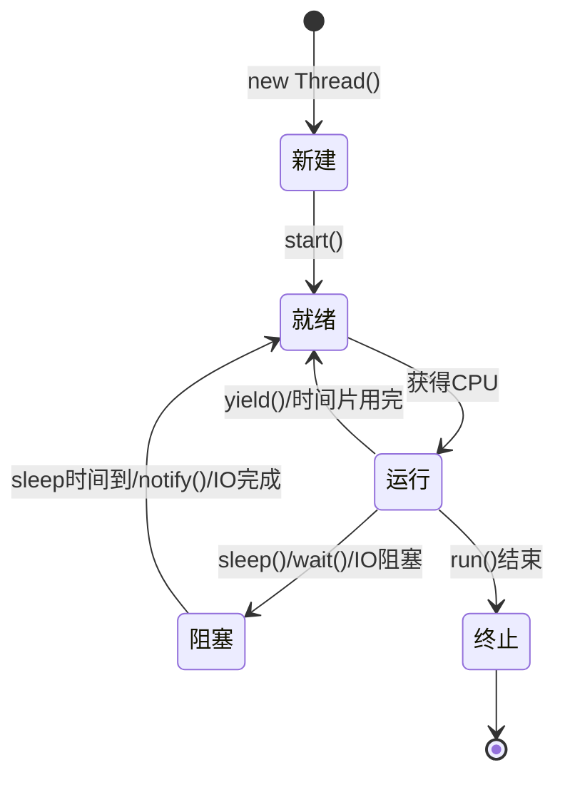

# 多线程编程

多线程是 Java 的重要特性，使程序能够同时执行多个任务。本文介绍线程的创建、同步、线程池等核心概念。

## 线程基础

### 什么是线程

- **进程**：操作系统分配资源的基本单位
- **线程**：CPU 调度的基本单位，一个进程可以有多个线程

### 创建线程的方式

#### 方式 1：继承 Thread 类

```java
public class MyThread extends Thread {
    @Override
    public void run() {
        for (int i = 0; i < 5; i++) {
            System.out.println(Thread.currentThread().getName() + ": " + i);
            try {
                Thread.sleep(100);
            } catch (InterruptedException e) {
                e.printStackTrace();
            }
        }
    }
    
    public static void main(String[] args) {
        MyThread thread1 = new MyThread();
        MyThread thread2 = new MyThread();
        
        thread1.setName("线程1");
        thread2.setName("线程2");
        
        thread1.start();  // 启动线程
        thread2.start();
    }
}
```

#### 方式 2：实现 Runnable 接口（推荐）

```java
public class MyRunnable implements Runnable {
    @Override
    public void run() {
        for (int i = 0; i < 5; i++) {
            System.out.println(Thread.currentThread().getName() + ": " + i);
            try {
                Thread.sleep(100);
            } catch (InterruptedException e) {
                e.printStackTrace();
            }
        }
    }
    
    public static void main(String[] args) {
        MyRunnable runnable = new MyRunnable();
        
        Thread thread1 = new Thread(runnable, "线程1");
        Thread thread2 = new Thread(runnable, "线程2");
        
        thread1.start();
        thread2.start();
    }
}
```

#### 方式 3：实现 Callable 接口（有返回值）

```java
import java.util.concurrent.*;

public class MyCallable implements Callable<Integer> {
    private int number;
    
    public MyCallable(int number) {
        this.number = number;
    }
    
    @Override
    public Integer call() throws Exception {
        int sum = 0;
        for (int i = 1; i <= number; i++) {
            sum += i;
            Thread.sleep(10);
        }
        return sum;
    }
    
    public static void main(String[] args) {
        // 创建线程池
        ExecutorService executor = Executors.newFixedThreadPool(2);
        
        // 提交任务
        Future<Integer> future1 = executor.submit(new MyCallable(100));
        Future<Integer> future2 = executor.submit(new MyCallable(50));
        
        try {
            // 获取结果（阻塞）
            Integer result1 = future1.get();
            Integer result2 = future2.get();
            
            System.out.println("结果1: " + result1);  // 5050
            System.out.println("结果2: " + result2);  // 1275
        } catch (InterruptedException | ExecutionException e) {
            e.printStackTrace();
        }
        
        executor.shutdown();
    }
}
```

#### 方式 4：使用 Lambda 表达式（Java 8+）

```java
public class LambdaThreadExample {
    public static void main(String[] args) {
        // 使用 Lambda 创建线程
        Thread thread = new Thread(() -> {
            for (int i = 0; i < 5; i++) {
                System.out.println("Lambda 线程: " + i);
            }
        });
        
        thread.start();
    }
}
```

## 线程的生命周期



### 线程状态

```java
public class ThreadStateExample {
    public static void main(String[] args) throws InterruptedException {
        Thread thread = new Thread(() -> {
            try {
                Thread.sleep(2000);
            } catch (InterruptedException e) {
                e.printStackTrace();
            }
        });
        
        System.out.println("NEW: " + thread.getState());  // NEW
        
        thread.start();
        System.out.println("RUNNABLE: " + thread.getState());  // RUNNABLE
        
        Thread.sleep(100);
        System.out.println("TIMED_WAITING: " + thread.getState());  // TIMED_WAITING
        
        thread.join();
        System.out.println("TERMINATED: " + thread.getState());  // TERMINATED
    }
}
```

## 线程常用方法

### 基本方法

```java
public class ThreadMethodsExample {
    public static void main(String[] args) throws InterruptedException {
        Thread thread = new Thread(() -> {
            System.out.println("线程运行中...");
            try {
                Thread.sleep(2000);
            } catch (InterruptedException e) {
                System.out.println("线程被中断");
            }
        });
        
        // 设置线程名称
        thread.setName("工作线程");
        
        // 设置优先级 (1-10, 默认5)
        thread.setPriority(Thread.MAX_PRIORITY);
        
        // 设置为守护线程
        thread.setDaemon(true);
        
        // 启动线程
        thread.start();
        
        // 等待线程结束
        thread.join();
        
        // 检查线程是否存活
        System.out.println("线程存活: " + thread.isAlive());
    }
}
```

### sleep() vs wait()

```java
public class SleepVsWait {
    private static final Object lock = new Object();
    
    public static void main(String[] args) {
        // sleep：不释放锁，线程休眠
        Thread sleepThread = new Thread(() -> {
            synchronized (lock) {
                System.out.println("sleep 开始");
                try {
                    Thread.sleep(1000);  // 不释放 lock
                } catch (InterruptedException e) {
                    e.printStackTrace();
                }
                System.out.println("sleep 结束");
            }
        });
        
        // wait：释放锁，等待通知
        Thread waitThread = new Thread(() -> {
            synchronized (lock) {
                System.out.println("wait 开始");
                try {
                    lock.wait();  // 释放 lock，等待 notify
                } catch (InterruptedException e) {
                    e.printStackTrace();
                }
                System.out.println("wait 结束");
            }
        });
        
        waitThread.start();
        sleepThread.start();
        
        // 通知等待的线程
        try {
            Thread.sleep(2000);
        } catch (InterruptedException e) {
            e.printStackTrace();
        }
        
        synchronized (lock) {
            lock.notify();  // 唤醒 waitThread
        }
}
```

## 线程中断

线程中断是一种协作机制，用于请求线程停止当前工作。并不是强制终止线程，而是通知线程应该中断。

### 中断的核心方法

```java
public class InterruptBasics {
    public static void main(String[] args) throws InterruptedException {
        Thread thread = new Thread(() -> {
            System.out.println("线程开始运行");
            try {
                Thread.sleep(5000);
            } catch (InterruptedException e) {
                System.out.println("线程在睡眠时被中断");
            }
            System.out.println("线程结束");
        });
        
        thread.start();
        Thread.sleep(1000);
        
        // 请求中断线程
        thread.interrupt();
        
        System.out.println("主线程发出中断请求");
    }
}
```

### 中断状态检查

```java
public class InterruptStatusCheck {
    public static void main(String[] args) throws InterruptedException {
        Thread thread = new Thread(() -> {
            // 方式1：使用 isInterrupted() 检查
            while (!Thread.currentThread().isInterrupted()) {
                System.out.println("任务执行中...");
                try {
                    Thread.sleep(500);
                } catch (InterruptedException e) {
                    // 重要：捕获异常后，中断状态会被清除
                    // 需要重新设置中断状态
                    Thread.currentThread().interrupt();
                    System.out.println("收到中断信号，准备退出");
                    break;
                }
            }
            System.out.println("线程正常结束");
        });
        
        thread.start();
        Thread.sleep(2000);
        thread.interrupt();
        
        thread.join();
        System.out.println("任务完成");
    }
}
```

### 中断的三种方法对比

```java
public class InterruptMethods {
    public static void main(String[] args) throws InterruptedException {
        Thread thread = new Thread(() -> {
            for (int i = 0; i < 5; i++) {
                System.out.println("计数: " + i);
                
                // 1. isInterrupted()：检查中断状态，不清除标志
                if (Thread.currentThread().isInterrupted()) {
                    System.out.println("检测到中断，状态仍为: " + 
                        Thread.currentThread().isInterrupted());
                    break;
                }
                
                try {
                    Thread.sleep(1000);
                } catch (InterruptedException e) {
                    System.out.println("被中断，状态已清除: " + 
                        Thread.currentThread().isInterrupted());
                    break;
                }
            }
        });
        
        thread.start();
        Thread.sleep(1500);
        thread.interrupt();
        
        // 2. Thread.interrupted()：检查并清除当前线程的中断状态
        Thread mainThread = Thread.currentThread();
        mainThread.interrupt();
        System.out.println("第一次检查: " + Thread.interrupted());  // true，清除标志
        System.out.println("第二次检查: " + Thread.interrupted());  // false，已清除
        
        // 3. interrupt()：设置中断标志
        thread.interrupt();
    }
}
```

### 正确处理中断的模式

#### 模式1：传播中断异常

```java
public class PropagateInterrupt {
    // 不捕获，向上传播异常
    public void task() throws InterruptedException {
        while (true) {
            Thread.sleep(1000);  // 可能抛出 InterruptedException
            System.out.println("执行任务");
        }
    }
    
    public static void main(String[] args) throws InterruptedException {
        Thread thread = new Thread(() -> {
            PropagateInterrupt example = new PropagateInterrupt();
            try {
                example.task();
            } catch (InterruptedException e) {
                System.out.println("任务被中断");
            }
        });
        
        thread.start();
        Thread.sleep(3000);
        thread.interrupt();
    }
}
```

#### 模式2：恢复中断状态

```java
public class RestoreInterrupt {
    public void task() {
        while (!Thread.currentThread().isInterrupted()) {
            try {
                Thread.sleep(1000);
                System.out.println("执行任务");
            } catch (InterruptedException e) {
                // 捕获异常后恢复中断状态
                Thread.currentThread().interrupt();
                System.out.println("恢复中断状态并退出");
                return;
            }
        }
    }
    
    public static void main(String[] args) throws InterruptedException {
        Thread thread = new Thread(() -> {
            new RestoreInterrupt().task();
        });
        
        thread.start();
        Thread.sleep(3000);
        thread.interrupt();
        thread.join();
        System.out.println("线程已终止");
    }
}
```

#### 模式3：使用标志位配合中断

```java
public class InterruptWithFlag {
    private volatile boolean running = true;
    
    public void task() {
        while (running && !Thread.currentThread().isInterrupted()) {
            try {
                // 执行任务
                System.out.println("执行任务...");
                Thread.sleep(1000);
            } catch (InterruptedException e) {
                System.out.println("被中断，准备清理资源");
                Thread.currentThread().interrupt();
                break;
            }
        }
        
        // 清理资源
        cleanup();
    }
    
    private void cleanup() {
        System.out.println("清理资源完成");
    }
    
    public void stop() {
        running = false;
    }
    
    public static void main(String[] args) throws InterruptedException {
        InterruptWithFlag example = new InterruptWithFlag();
        Thread thread = new Thread(() -> example.task());
        
        thread.start();
        Thread.sleep(3000);
        
        // 方式1：使用标志位停止
        // example.stop();
        
        // 方式2：使用中断停止
        thread.interrupt();
        
        thread.join();
    }
}
```

### 阻塞方法的中断处理

```java
import java.io.*;
import java.util.concurrent.*;

public class InterruptBlockingOperations {
    // 1. sleep 中断
    public static void interruptSleep() {
        Thread thread = new Thread(() -> {
            try {
                System.out.println("开始睡眠");
                Thread.sleep(10000);
            } catch (InterruptedException e) {
                System.out.println("睡眠被中断");
            }
        });
        
        thread.start();
        try {
            Thread.sleep(1000);
        } catch (InterruptedException e) {
            e.printStackTrace();
        }
        thread.interrupt();
    }
    
    // 2. wait 中断
    public static void interruptWait() {
        Object lock = new Object();
        Thread thread = new Thread(() -> {
            synchronized (lock) {
                try {
                    System.out.println("开始等待");
                    lock.wait();
                } catch (InterruptedException e) {
                    System.out.println("等待被中断");
                }
            }
        });
        
        thread.start();
        try {
            Thread.sleep(1000);
        } catch (InterruptedException e) {
            e.printStackTrace();
        }
        thread.interrupt();
    }
    
    // 3. join 中断
    public static void interruptJoin() {
        Thread worker = new Thread(() -> {
            try {
                Thread.sleep(5000);
            } catch (InterruptedException e) {
                System.out.println("工作线程被中断");
            }
        });
        
        Thread waiter = new Thread(() -> {
            try {
                System.out.println("等待工作线程完成");
                worker.join();
            } catch (InterruptedException e) {
                System.out.println("等待被中断");
            }
        });
        
        worker.start();
        waiter.start();
        
        try {
            Thread.sleep(1000);
        } catch (InterruptedException e) {
            e.printStackTrace();
        }
        waiter.interrupt();
    }
    
    // 4. BlockingQueue 中断
    public static void interruptBlockingQueue() {
        BlockingQueue<String> queue = new LinkedBlockingQueue<>();
        
        Thread thread = new Thread(() -> {
            try {
                System.out.println("等待队列数据");
                String item = queue.take();  // 阻塞等待
                System.out.println("获取到: " + item);
            } catch (InterruptedException e) {
                System.out.println("队列操作被中断");
            }
        });
        
        thread.start();
        try {
            Thread.sleep(1000);
        } catch (InterruptedException e) {
            e.printStackTrace();
        }
        thread.interrupt();
    }
    
    public static void main(String[] args) {
        System.out.println("=== Sleep 中断 ===");
        interruptSleep();
        
        try {
            Thread.sleep(2000);
        } catch (InterruptedException e) {
            e.printStackTrace();
        }
        
        System.out.println("\n=== Wait 中断 ===");
        interruptWait();
        
        try {
            Thread.sleep(2000);
        } catch (InterruptedException e) {
            e.printStackTrace();
        }
        
        System.out.println("\n=== Join 中断 ===");
        interruptJoin();
        
        try {
            Thread.sleep(2000);
        } catch (InterruptedException e) {
            e.printStackTrace();
        }
        
        System.out.println("\n=== BlockingQueue 中断 ===");
        interruptBlockingQueue();
    }
}
```

### IO 操作的中断

```java
import java.io.*;
import java.nio.channels.*;

public class InterruptIO {
    // 传统 IO 不响应中断
    public static void traditionalIO() {
        Thread thread = new Thread(() -> {
            try {
                ServerSocket serverSocket = new ServerSocket(8888);
                System.out.println("等待连接...");
                Socket socket = serverSocket.accept();  // 阻塞，不响应中断
                System.out.println("连接成功");
            } catch (IOException e) {
                System.out.println("IO 异常: " + e.getMessage());
            }
        });
        
        thread.start();
        try {
            Thread.sleep(1000);
        } catch (InterruptedException e) {
            e.printStackTrace();
        }
        thread.interrupt();  // 不会中断 accept()
        System.out.println("已发送中断，但 accept() 不响应");
    }
    
    // NIO 可中断
    public static void interruptibleIO() throws IOException {
        Thread thread = new Thread(() -> {
            try {
                ServerSocketChannel serverChannel = ServerSocketChannel.open();
                serverChannel.socket().bind(new java.net.InetSocketAddress(9999));
                
                System.out.println("NIO 等待连接...");
                SocketChannel channel = serverChannel.accept();  // 可中断
                System.out.println("连接成功");
            } catch (ClosedByInterruptException e) {
                System.out.println("NIO 操作被中断");
            } catch (IOException e) {
                System.out.println("IO 异常: " + e.getMessage());
            }
        });
        
        thread.start();
        try {
            Thread.sleep(1000);
        } catch (InterruptedException e) {
            e.printStackTrace();
        }
        thread.interrupt();  // 会中断 NIO 操作
    }
}
```

### 线程中断的最佳实践

#### 1. 不要忽略中断

```java
// ❌ 不好：吞掉中断异常
try {
    Thread.sleep(1000);
} catch (InterruptedException e) {
    // 什么都不做
}

// ✅ 好：传播异常
public void method() throws InterruptedException {
    Thread.sleep(1000);
}

// ✅ 好：恢复中断状态
try {
    Thread.sleep(1000);
} catch (InterruptedException e) {
    Thread.currentThread().interrupt();  // 恢复中断状态
    // 或者清理并返回
}
```

#### 2. 及时响应中断

```java
public class ResponsiveInterrupt {
    public void longRunningTask() {
        while (!Thread.currentThread().isInterrupted()) {
            // 定期检查中断状态
            if (Thread.currentThread().isInterrupted()) {
                System.out.println("检测到中断，准备退出");
                cleanup();
                return;
            }
            
            // 执行一小部分工作
            doWork();
        }
    }
    
    private void doWork() {
        // 工作代码
    }
    
    private void cleanup() {
        // 清理资源
    }
}
```

#### 3. 不要使用 Thread.stop()

```java
// ❌ 不好：使用已废弃的 stop() 方法
thread.stop();  // 危险！可能导致数据不一致

// ✅ 好：使用中断机制
thread.interrupt();
```

### 中断状态总结

| 方法 | 作用 | 是否清除标志 | 调用对象 |
|------|------|--------------|----------|
| `interrupt()` | 请求中断线程 | - | Thread 实例 |
| `isInterrupted()` | 检查中断状态 | 否 | Thread 实例 |
| `interrupted()` | 检查并清除中断状态 | 是 | Thread 类（静态） |

### 常见问题

**Q1: 为什么 InterruptedException 会清除中断状态？**

A: 这是设计选择。当抛出 InterruptedException 时，表示线程已经响应了中断，因此清除标志。如果需要保留中断状态，需要在 catch 块中重新设置。

**Q2: 如何优雅地停止线程？**

A:

1. 使用中断机制（interrupt）
2. 使用 volatile 标志位
3. 两者结合使用
4. 避免使用已废弃的 stop()、suspend()、resume()

**Q3: 哪些操作会响应中断？**

A:

- `Thread.sleep()`
- `Object.wait()`
- `Thread.join()`
- `BlockingQueue.take()/put()`
- `Lock.lockInterruptibly()`
- NIO 的可中断通道操作

## 线程同步

### synchronized 关键字

#### 同步方法

```java
public class SynchronizedMethodExample {
    private int count = 0;
    
    // 同步实例方法（锁是 this）
    public synchronized void increment() {
        count++;
    }
    
    // 同步静态方法（锁是 Class 对象）
    public static synchronized void staticMethod() {
        System.out.println("静态同步方法");
    }
    
    public static void main(String[] args) throws InterruptedException {
        SynchronizedMethodExample example = new SynchronizedMethodExample();
        
        // 创建10个线程，每个线程增加1000次
        Thread[] threads = new Thread[10];
        for (int i = 0; i < 10; i++) {
            threads[i] = new Thread(() -> {
                for (int j = 0; j < 1000; j++) {
                    example.increment();
                }
            });
            threads[i].start();
        }
        
        // 等待所有线程结束
        for (Thread thread : threads) {
            thread.join();
        }
        
        System.out.println("最终计数: " + example.count);  // 10000
    }
}
```

#### 同步代码块

```java
public class SynchronizedBlockExample {
    private int count = 0;
    private final Object lock = new Object();
    
    public void increment() {
        // 同步代码块（锁是 lock 对象）
        synchronized (lock) {
            count++;
        }
    }
    
    // 也可以使用 this 作为锁
    public void increment2() {
        synchronized (this) {
            count++;
        }
    }
}
```

### Lock 接口

```java
import java.util.concurrent.locks.*;

public class ReentrantLockExample {
    private int count = 0;
    private final Lock lock = new ReentrantLock();
    
    public void increment() {
        lock.lock();  // 获取锁
        try {
            count++;
        } finally {
            lock.unlock();  // 释放锁（必须在 finally 中）
        }
    }
    
    // 尝试获取锁
    public void tryIncrement() {
        if (lock.tryLock()) {
            try {
                count++;
            } finally {
                lock.unlock();
            }
        } else {
            System.out.println("无法获取锁");
        }
    }
    
    // 读写锁
    private final ReadWriteLock rwLock = new ReentrantReadWriteLock();
    private String data = "";
    
    public String read() {
        rwLock.readLock().lock();
        try {
            return data;
        } finally {
            rwLock.readLock().unlock();
        }
    }
    
    public void write(String newData) {
        rwLock.writeLock().lock();
        try {
            data = newData;
        } finally {
            rwLock.writeLock().unlock();
        }
    }
}
```

## 线程通信

### wait/notify 机制

```java
public class ProducerConsumer {
    private static final int MAX_SIZE = 10;
    private LinkedList<Integer> queue = new LinkedList<>();
    
    // 生产者
    public void produce() throws InterruptedException {
        int value = 0;
        while (true) {
            synchronized (queue) {
                while (queue.size() == MAX_SIZE) {
                    queue.wait();  // 队列满，等待
                }
                
                queue.add(value);
                System.out.println("生产: " + value);
                value++;
                
                queue.notifyAll();  // 通知消费者
                Thread.sleep(100);
            }
        }
    }
    
    // 消费者
    public void consume() throws InterruptedException {
        while (true) {
            synchronized (queue) {
                while (queue.isEmpty()) {
                    queue.wait();  // 队列空，等待
                }
                
                int value = queue.removeFirst();
                System.out.println("消费: " + value);
                
                queue.notifyAll();  // 通知生产者
                Thread.sleep(200);
            }
        }
    }
    
    public static void main(String[] args) {
        ProducerConsumer pc = new ProducerConsumer();
        
        new Thread(() -> {
            try {
                pc.produce();
            } catch (InterruptedException e) {
                e.printStackTrace();
            }
        }).start();
        
        new Thread(() -> {
            try {
                pc.consume();
            } catch (InterruptedException e) {
                e.printStackTrace();
            }
        }).start();
    }
}
```

### Condition 接口

```java
import java.util.concurrent.locks.*;

public class ConditionExample {
    private final Lock lock = new ReentrantLock();
    private final Condition notFull = lock.newCondition();
    private final Condition notEmpty = lock.newCondition();
    private LinkedList<Integer> queue = new LinkedList<>();
    private final int MAX_SIZE = 10;
    
    public void produce(int value) throws InterruptedException {
        lock.lock();
        try {
            while (queue.size() == MAX_SIZE) {
                notFull.await();  // 等待队列不满
            }
            queue.add(value);
            notEmpty.signal();  // 通知消费者
        } finally {
            lock.unlock();
        }
    }
    
    public int consume() throws InterruptedException {
        lock.lock();
        try {
            while (queue.isEmpty()) {
                notEmpty.await();  // 等待队列不空
            }
            int value = queue.removeFirst();
            notFull.signal();  // 通知生产者
            return value;
        } finally {
            lock.unlock();
        }
    }
}
```

## 线程池

### 为什么使用线程池

- 减少线程创建和销毁的开销
- 提高响应速度
- 便于线程管理

### 创建线程池

```java
import java.util.concurrent.*;

public class ThreadPoolExample {
    public static void main(String[] args) {
        // 1. 固定大小线程池
        ExecutorService fixedPool = Executors.newFixedThreadPool(5);
        
        // 2. 缓存线程池
        ExecutorService cachedPool = Executors.newCachedThreadPool();
        
        // 3. 单线程线程池
        ExecutorService singlePool = Executors.newSingleThreadExecutor();
        
        // 4. 定时任务线程池
        ScheduledExecutorService scheduledPool = Executors.newScheduledThreadPool(3);
        
        // 5. 自定义线程池（推荐）
        ThreadPoolExecutor customPool = new ThreadPoolExecutor(
            5,                      // 核心线程数
            10,                     // 最大线程数
            60L,                    // 空闲线程存活时间
            TimeUnit.SECONDS,       // 时间单位
            new LinkedBlockingQueue<>(100),  // 任务队列
            Executors.defaultThreadFactory(),  // 线程工厂
            new ThreadPoolExecutor.AbortPolicy()  // 拒绝策略
        );
        
        // 提交任务
        for (int i = 0; i < 10; i++) {
            final int taskId = i;
            fixedPool.execute(() -> {
                System.out.println(Thread.currentThread().getName() + 
                    " 执行任务 " + taskId);
            });
        }
        
        // 关闭线程池
        fixedPool.shutdown();
    }
}
```

### 定时任务

```java
import java.util.concurrent.*;

public class ScheduledTaskExample {
    public static void main(String[] args) {
        ScheduledExecutorService scheduler = Executors.newScheduledThreadPool(2);
        
        // 延迟 3 秒执行一次
        scheduler.schedule(() -> {
            System.out.println("延迟任务执行");
        }, 3, TimeUnit.SECONDS);
        
        // 延迟 1 秒后，每隔 2 秒执行一次（固定速率）
        scheduler.scheduleAtFixedRate(() -> {
            System.out.println("固定速率任务: " + System.currentTimeMillis());
        }, 1, 2, TimeUnit.SECONDS);
        
        // 延迟 1 秒后，上次执行完成后间隔 2 秒再执行（固定延迟）
        scheduler.scheduleWithFixedDelay(() -> {
            System.out.println("固定延迟任务: " + System.currentTimeMillis());
            try {
                Thread.sleep(1000);  // 模拟任务耗时
            } catch (InterruptedException e) {
                e.printStackTrace();
            }
        }, 1, 2, TimeUnit.SECONDS);
    }
}
```

## 并发工具类

### CountDownLatch

等待多个线程完成。

```java
import java.util.concurrent.CountDownLatch;

public class CountDownLatchExample {
    public static void main(String[] args) throws InterruptedException {
        int threadCount = 5;
        CountDownLatch latch = new CountDownLatch(threadCount);
        
        for (int i = 0; i < threadCount; i++) {
            final int taskId = i;
            new Thread(() -> {
                System.out.println("任务 " + taskId + " 开始");
                try {
                    Thread.sleep(1000);
                } catch (InterruptedException e) {
                    e.printStackTrace();
                }
                System.out.println("任务 " + taskId + " 完成");
                latch.countDown();  // 计数减 1
            }).start();
        }
        
        latch.await();  // 等待所有任务完成
        System.out.println("所有任务完成");
    }
}
```

### CyclicBarrier

让一组线程互相等待。

```java
import java.util.concurrent.*;

public class CyclicBarrierExample {
    public static void main(String[] args) {
        int threadCount = 3;
        CyclicBarrier barrier = new CyclicBarrier(threadCount, () -> {
            System.out.println("所有线程到达屏障，继续执行");
        });
        
        for (int i = 0; i < threadCount; i++) {
            final int taskId = i;
            new Thread(() -> {
                System.out.println("线程 " + taskId + " 到达屏障");
                try {
                    barrier.await();  // 等待其他线程
                } catch (InterruptedException | BrokenBarrierException e) {
                    e.printStackTrace();
                }
                System.out.println("线程 " + taskId + " 继续执行");
            }).start();
        }
    }
}
```

### Semaphore

控制同时访问资源的线程数。

```java
import java.util.concurrent.Semaphore;

public class SemaphoreExample {
    public static void main(String[] args) {
        // 最多允许 3 个线程同时访问
        Semaphore semaphore = new Semaphore(3);
        
        for (int i = 0; i < 10; i++) {
            final int taskId = i;
            new Thread(() -> {
                try {
                    semaphore.acquire();  // 获取许可
                    System.out.println("线程 " + taskId + " 获得许可");
                    Thread.sleep(2000);
                    System.out.println("线程 " + taskId + " 释放许可");
                } catch (InterruptedException e) {
                    e.printStackTrace();
                } finally {
                    semaphore.release();  // 释放许可
                }
            }).start();
        }
    }
}
```

## 线程安全的集合

### ConcurrentHashMap

ConcurrentHashMap 使用分段锁（分桶）提高并发性能，比 synchronized HashMap 效率高很多。

```java
import java.util.concurrent.*;
import java.util.*;

public class ConcurrentHashMapExample {
    public static void main(String[] args) throws InterruptedException {
        ConcurrentHashMap<String, Integer> map = new ConcurrentHashMap<>();
        
        // 基本操作
        map.put("count", 0);
        System.out.println("初始值: " + map.get("count"));
        
        // 多线程安全的操作
        Thread[] threads = new Thread[5];
        for (int i = 0; i < 5; i++) {
            final int threadId = i;
            threads[i] = new Thread(() -> {
                for (int j = 0; j < 1000; j++) {
                    // putIfAbsent：原子操作，如果不存在才插入
                    map.putIfAbsent("count", 0);
                    
                    // 虽然线程安全，但复合操作仍需同步
                    synchronized (map) {
                        int value = map.get("count");
                        map.put("count", value + 1);
                    }
                }
            });
            threads[i].start();
        }
        
        for (Thread thread : threads) {
            thread.join();
        }
        
        System.out.println("最终值: " + map.get("count"));
        
        // 遍历（迭代期间其他线程可修改）
        for (Map.Entry<String, Integer> entry : map.entrySet()) {
            System.out.println(entry.getKey() + ": " + entry.getValue());
        }
        
        // compute：原子性的计算
        map.compute("count", (key, value) -> value == null ? 1 : value + 1);
        System.out.println("compute 后: " + map.get("count"));
    }
}
```

### BlockingQueue

BlockingQueue 是线程安全的队列，支持阻塞的插入和移除操作。

```java
import java.util.concurrent.*;

public class BlockingQueueExample {
    public static void main(String[] args) {
        BlockingQueue<String> queue = new LinkedBlockingQueue<>(5);
        
        // 生产者
        new Thread(() -> {
            try {
                for (int i = 0; i < 10; i++) {
                    System.out.println("生产: " + i);
                    queue.put("item-" + i);  // 队列满时阻塞
                    Thread.sleep(100);
                }
            } catch (InterruptedException e) {
                e.printStackTrace();
            }
        }).start();
        
        // 消费者
        new Thread(() -> {
            try {
                while (true) {
                    String item = queue.take();  // 队列空时阻塞
                    System.out.println("消费: " + item);
                    Thread.sleep(300);
                }
            } catch (InterruptedException e) {
                e.printStackTrace();
            }
        }).start();
    }
}
```

### CopyOnWriteArrayList

CopyOnWriteArrayList 用于读多写少的场景，每次写操作都复制一份数组。

```java
import java.util.concurrent.CopyOnWriteArrayList;
import java.util.List;

public class CopyOnWriteArrayListExample {
    public static void main(String[] args) throws InterruptedException {
        CopyOnWriteArrayList<String> list = new CopyOnWriteArrayList<>();
        
        // 写入（创建新的数组副本）
        list.add("item1");
        list.add("item2");
        list.add("item3");
        
        // 多线程读
        Thread[] readers = new Thread[3];
        for (int i = 0; i < 3; i++) {
            final int id = i;
            readers[i] = new Thread(() -> {
                for (int j = 0; j < 5; j++) {
                    System.out.println("读取线程-" + id + ": " + list);
                    try {
                        Thread.sleep(50);
                    } catch (InterruptedException e) {
                        e.printStackTrace();
                    }
                }
            });
            readers[i].start();
        }
        
        // 单线程写
        new Thread(() -> {
            try {
                for (int i = 4; i < 6; i++) {
                    Thread.sleep(100);
                    list.add("item" + i);
                    System.out.println("添加: item" + i);
                }
            } catch (InterruptedException e) {
                e.printStackTrace();
            }
        }).start();
        
        for (Thread reader : readers) {
            reader.join();
        }
    }
}
```

### CopyOnWriteArraySet

CopyOnWriteArraySet 是线程安全的 Set，基于 CopyOnWriteArrayList 实现。

```java
import java.util.concurrent.CopyOnWriteArraySet;
import java.util.Set;

public class CopyOnWriteArraySetExample {
    public static void main(String[] args) {
        CopyOnWriteArraySet<String> set = new CopyOnWriteArraySet<>();
        
        set.add("A");
        set.add("B");
        set.add("C");
        set.add("A");  // 重复元素不会添加
        
        System.out.println("集合大小: " + set.size());  // 3
        
        // 迭代期间可以安全地修改
        set.forEach(item -> {
            System.out.println(item);
            if (item.equals("B")) {
                set.add("D");  // 不会抛出 ConcurrentModificationException
            }
        });
        
        System.out.println("最终集合: " + set);
    }
}
```

### ConcurrentLinkedQueue

ConcurrentLinkedQueue 是非阻塞的线程安全队列，基于链表实现。

```java
import java.util.concurrent.ConcurrentLinkedQueue;
import java.util.Queue;

public class ConcurrentLinkedQueueExample {
    public static void main(String[] args) throws InterruptedException {
        ConcurrentLinkedQueue<Integer> queue = new ConcurrentLinkedQueue<>();
        
        // 生产者
        new Thread(() -> {
            for (int i = 0; i < 5; i++) {
                queue.offer(i);  // 加入队列（非阻塞）
                System.out.println("生产: " + i);
                try {
                    Thread.sleep(100);
                } catch (InterruptedException e) {
                    e.printStackTrace();
                }
            }
        }).start();
        
        // 消费者
        new Thread(() -> {
            while (true) {
                Integer item = queue.poll();  // 移除队列头（非阻塞）
                if (item != null) {
                    System.out.println("消费: " + item);
                } else {
                    System.out.println("队列为空");
                }
                try {
                    Thread.sleep(200);
                } catch (InterruptedException e) {
                    e.printStackTrace();
                }
            }
        }).start();
        
        Thread.sleep(2000);
    }
}
```

### 各种线程安全集合对比

```java
import java.util.*;
import java.util.concurrent.*;

public class ConcurrentCollectionComparison {
    public static void main(String[] args) {
        // 1. ConcurrentHashMap：线程安全的 Map
        ConcurrentHashMap<String, Integer> concurrentMap = new ConcurrentHashMap<>();
        // 适用于多线程读写
        
        // 2. Collections.synchronizedMap：同步的 Map
        Map<String, Integer> synchronizedMap = Collections.synchronizedMap(new HashMap<>());
        // 整个 Map 被锁，性能较差
        
        // 3. Hashtable：已过时
        Hashtable<String, Integer> hashtable = new Hashtable<>();
        // 不推荐使用，使用 ConcurrentHashMap 替代
        
        // 4. CopyOnWriteArrayList：读多写少场景
        CopyOnWriteArrayList<String> cowList = new CopyOnWriteArrayList<>();
        // 适用于读操作远多于写操作的场景
        
        // 5. Collections.synchronizedList：同步的 List
        List<String> syncList = Collections.synchronizedList(new ArrayList<>());
        // 性能不如 CopyOnWriteArrayList
        
        // 6. BlockingQueue：队列，支持阻塞操作
        BlockingQueue<String> blockingQueue = new LinkedBlockingQueue<>();
        // 适用于生产者-消费者模式
        
        // 7. ConcurrentLinkedQueue：非阻塞队列
        Queue<String> concurrentQueue = new ConcurrentLinkedQueue<>();
        // 性能更高但不支持阻塞操作
    }
}
```

### 推荐用法总结

| 数据结构 | 线程安全方案 | 使用场景 |
|---------|-----------|---------|
| Map | ConcurrentHashMap | 多线程读写 |
| List | CopyOnWriteArrayList | 读多写少 |
| Set | CopyOnWriteArraySet | 读多写少 |
| Queue（有界） | LinkedBlockingQueue | 生产者-消费者 |
| Queue（无界） | ConcurrentLinkedQueue | 高并发场景 |
| 计数 | AtomicInteger | 原子操作 |

```java
import java.util.concurrent.*;
import java.util.concurrent.atomic.AtomicInteger;

public class ConcurrentCollections {
    public static void main(String[] args) {
        // 线程安全的 HashMap
        ConcurrentHashMap<String, Integer> map = new ConcurrentHashMap<>();
        map.put("key", 1);
        
        // 线程安全的队列
        BlockingQueue<String> queue = new LinkedBlockingQueue<>();
        
        // 线程安全的 List
        CopyOnWriteArrayList<String> list = new CopyOnWriteArrayList<>();
        
        // 线程安全的 Set
        CopyOnWriteArraySet<String> set = new CopyOnWriteArraySet<>();
        
        // 线程安全的整数
        AtomicInteger counter = new AtomicInteger(0);
        counter.incrementAndGet();
    }
}
```

## 最佳实践

### 1. 避免死锁

```java
// 不好：可能死锁
synchronized (lock1) {
    synchronized (lock2) {
        // ...
    }
}

// 好：统一加锁顺序
if (System.identityHashCode(lock1) < System.identityHashCode(lock2)) {
    synchronized (lock1) {
        synchronized (lock2) {
            // ...
        }
    }
} else {
    synchronized (lock2) {
        synchronized (lock1) {
            // ...
        }
    }
}
```

### 2. 使用线程池

```java
// 不好：频繁创建线程
for (int i = 0; i < 1000; i++) {
    new Thread(() -> {
        // 任务
    }).start();
}

// 好：使用线程池
ExecutorService executor = Executors.newFixedThreadPool(10);
for (int i = 0; i < 1000; i++) {
    executor.execute(() -> {
        // 任务
    });
}
executor.shutdown();
```

### 3. 使用并发集合

```java
// 不好：使用 Collections.synchronizedMap
Map<String, Integer> map = Collections.synchronizedMap(new HashMap<>());

// 好：使用 ConcurrentHashMap
Map<String, Integer> map = new ConcurrentHashMap<>();
```

## 总结

本文介绍了 Java 多线程编程的核心内容：

- ✅ 线程创建的多种方式
- ✅ 线程的生命周期和状态
- ✅ 线程同步：synchronized、Lock
- ✅ 线程通信：wait/notify、Condition
- ✅ 线程池的使用
- ✅ 并发工具类：CountDownLatch、CyclicBarrier、Semaphore
- ✅ 线程安全的集合

掌握多线程后，继续学习 [IO 流](./io-streams) 和 [函数式编程](./functional-programming)。
