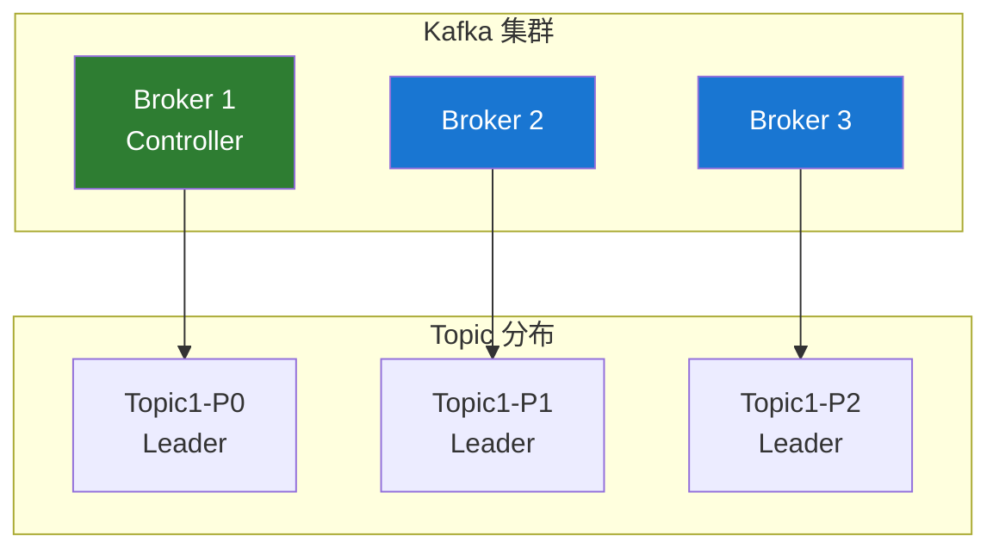

# Kafka 集群管理

## 集群架构

### 基本架构



### 集群规模建议

| 场景     | Broker 数量 | 副本因子 | 分区数 |
| -------- | ----------- | -------- | ------ |
| 开发测试 | 1-3         | 1        | 1-3    |
| 小型生产 | 3-5         | 2        | 6-12   |
| 中型生产 | 5-10        | 3        | 50-100 |
| 大型生产 | 10+         | 3        | 100+   |

## 集群部署

### KRaft 模式部署（推荐）

```bash
# 1. 生成集群 ID
KAFKA_CLUSTER_ID="$(bin/kafka-storage.sh random-uuid)"

# 2. 配置每个节点
# server.properties for node 1
node.id=1
process.roles=broker,controller
controller.quorum.voters=1@node1:9093,2@node2:9093,3@node3:9093
listeners=PLAINTEXT://:9092,CONTROLLER://:9093
advertised.listeners=PLAINTEXT://node1:9092

# 3. 格式化存储
bin/kafka-storage.sh format -t $KAFKA_CLUSTER_ID -c config/kraft/server.properties

# 4. 启动 Kafka
bin/kafka-server-start.sh config/kraft/server.properties
```

### Broker 配置

```properties
# 基础配置
broker.id=1
log.dirs=/data/kafka-logs
num.network.threads=8
num.io.threads=16

# 网络配置
listeners=PLAINTEXT://0.0.0.0:9092
advertised.listeners=PLAINTEXT://host1:9092

# 日志配置
log.retention.hours=168
log.segment.bytes=1073741824
log.retention.check.interval.ms=300000

# 副本配置
default.replication.factor=3
min.insync.replicas=2
unclean.leader.election.enable=false

# 性能配置
num.partitions=8
message.max.bytes=10485760
replica.fetch.max.bytes=10485760
```

## 分区管理

### 创建 Topic

```bash
# 创建 Topic
kafka-topics.sh --create \
  --topic my-topic \
  --bootstrap-server localhost:9092 \
  --partitions 6 \
  --replication-factor 3

# 指定分区副本分配
kafka-topics.sh --create \
  --topic my-topic \
  --bootstrap-server localhost:9092 \
  --replica-assignment 1:2:3,2:3:1,3:1:2
```

### 增加分区

```bash
# 增加分区数（只能增加，不能减少）
kafka-topics.sh --alter \
  --topic my-topic \
  --partitions 12 \
  --bootstrap-server localhost:9092
```

### 分区重分配

```json
// reassignment.json
{
  "version": 1,
  "partitions": [
    { "topic": "my-topic", "partition": 0, "replicas": [1, 2, 3] },
    { "topic": "my-topic", "partition": 1, "replicas": [2, 3, 1] },
    { "topic": "my-topic", "partition": 2, "replicas": [3, 1, 2] }
  ]
}
```

```bash
# 执行重分配
kafka-reassign-partitions.sh --execute \
  --reassignment-json-file reassignment.json \
  --bootstrap-server localhost:9092

# 验证重分配状态
kafka-reassign-partitions.sh --verify \
  --reassignment-json-file reassignment.json \
  --bootstrap-server localhost:9092
```

## 副本管理

### Leader 选举

```bash
# 触发首选 Leader 选举
kafka-leader-election.sh --election-type preferred \
  --bootstrap-server localhost:9092 \
  --all-topic-partitions
```

### 查看副本状态

```bash
kafka-topics.sh --describe \
  --topic my-topic \
  --bootstrap-server localhost:9092

# 输出示例
# Topic: my-topic  Partition: 0  Leader: 1  Replicas: 1,2,3  Isr: 1,2,3
```

## 配置管理

### 动态配置

```bash
# 修改 Topic 配置
kafka-configs.sh --alter \
  --entity-type topics \
  --entity-name my-topic \
  --add-config retention.ms=604800000 \
  --bootstrap-server localhost:9092

# 修改 Broker 配置
kafka-configs.sh --alter \
  --entity-type brokers \
  --entity-name 1 \
  --add-config log.retention.hours=72 \
  --bootstrap-server localhost:9092

# 查看配置
kafka-configs.sh --describe \
  --entity-type topics \
  --entity-name my-topic \
  --bootstrap-server localhost:9092
```

### 常用 Topic 配置

| 配置项                | 说明         | 默认值           |
| --------------------- | ------------ | ---------------- |
| `retention.ms`        | 消息保留时间 | 604800000 (7 天) |
| `retention.bytes`     | 分区最大存储 | -1 (无限制)      |
| `cleanup.policy`      | 清理策略     | delete           |
| `compression.type`    | 压缩类型     | producer         |
| `max.message.bytes`   | 最大消息大小 | 1048588          |
| `min.insync.replicas` | 最小同步副本 | 1                |

## 安全配置

### SASL/SCRAM 认证

```properties
# server.properties
listeners=SASL_PLAINTEXT://0.0.0.0:9092
security.inter.broker.protocol=SASL_PLAINTEXT
sasl.mechanism.inter.broker.protocol=SCRAM-SHA-256
sasl.enabled.mechanisms=SCRAM-SHA-256
```

```bash
# 创建用户
kafka-configs.sh --alter \
  --bootstrap-server localhost:9092 \
  --entity-type users \
  --entity-name admin \
  --add-config 'SCRAM-SHA-256=[password=admin-secret]'
```

### ACL 权限管理

```bash
# 添加生产者权限
kafka-acls.sh --add --allow-principal User:producer \
  --operation Write --topic my-topic \
  --bootstrap-server localhost:9092

# 添加消费者权限
kafka-acls.sh --add --allow-principal User:consumer \
  --operation Read --topic my-topic \
  --group my-group \
  --bootstrap-server localhost:9092

# 查看权限
kafka-acls.sh --list --topic my-topic \
  --bootstrap-server localhost:9092
```

## 故障处理

### Broker 宕机恢复

```bash
# 1. 检查集群状态
kafka-metadata.sh --snapshot /data/kraft-logs/\@metadata-0/00000000000000000000.log --cluster-id $CLUSTER_ID

# 2. 检查分区分布
kafka-topics.sh --describe --unavailable-partitions \
  --bootstrap-server localhost:9092

# 3. 重新分配分区（如需要）
kafka-reassign-partitions.sh --execute \
  --reassignment-json-file reassign.json \
  --bootstrap-server localhost:9092
```

### Under-Replicated 分区

```bash
# 查看欠复制分区
kafka-topics.sh --describe --under-replicated-partitions \
  --bootstrap-server localhost:9092
```

## 最佳实践

### 1. 硬件配置建议

```
CPU: 8-16 核
内存: 32-64 GB
磁盘: SSD，RAID10 或 JBOD
网络: 万兆网卡
```

### 2. JVM 配置

```bash
export KAFKA_HEAP_OPTS="-Xms6g -Xmx6g"
export KAFKA_JVM_PERFORMANCE_OPTS="-XX:+UseG1GC \
  -XX:MaxGCPauseMillis=20 \
  -XX:InitiatingHeapOccupancyPercent=35"
```

### 3. 操作系统优化

```bash
# 文件描述符限制
echo "* soft nofile 100000" >> /etc/security/limits.conf
echo "* hard nofile 100000" >> /etc/security/limits.conf

# 虚拟内存设置
echo "vm.swappiness=1" >> /etc/sysctl.conf
echo "vm.dirty_ratio=60" >> /etc/sysctl.conf
echo "vm.dirty_background_ratio=5" >> /etc/sysctl.conf
```

## 下一步

- ⚡ [性能优化](/docs/kafka/performance-optimization) - 深入性能调优
- 🔒 [最佳实践](/docs/kafka/best-practices) - 生产环境最佳实践
- 📊 [监控与运维](/docs/kafka/monitoring) - 监控和告警配置

## 参考资料

- [Kafka 运维文档](https://kafka.apache.org/documentation/#operations)
- [KRaft 模式配置](https://kafka.apache.org/documentation/#kraft)
