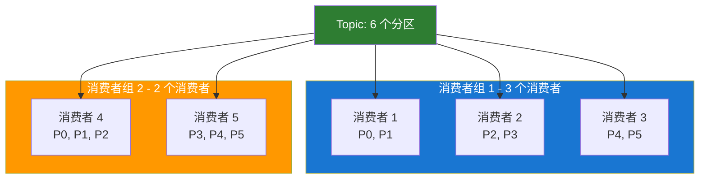

# Kafka 消费者 API

本文档详细介绍 Kafka Consumer API 的使用方法、配置参数和最佳实践。

## 基本配置

```java
Properties props = new Properties();

// Kafka 集群地址
props.put("bootstrap.servers", "localhost:9092");

// 消费者组 ID（必需）
props.put("group.id", "my-consumer-group");

// Key 反序列化器
props.put("key.deserializer",
    "org.apache.kafka.common.serialization.StringDeserializer");

// Value 反序列化器
props.put("value.deserializer",
    "org.apache.kafka.common.serialization.StringDeserializer");

// 创建消费者
KafkaConsumer<String, String> consumer = new KafkaConsumer<>(props);
```

## 订阅 Topic

### 1. 订阅单个 Topic

```java
consumer.subscribe(Collections.singletonList("my-topic"));
```

### 2. 订阅多个 Topic

```java
consumer.subscribe(Arrays.asList("topic1", "topic2", "topic3"));
```

### 3. 使用正则表达式订阅

```java
// 订阅所有以 "test-" 开头的 Topic
consumer.subscribe(Pattern.compile("test-.*"));
```

### 4. 手动分配分区

```java
// 手动分配特定分区
TopicPartition partition0 = new TopicPartition("my-topic", 0);
TopicPartition partition1 = new TopicPartition("my-topic", 1);
consumer.assign(Arrays.asList(partition0, partition1));
```

## 消费消息

### 基本消费模式

```java
try {
    consumer.subscribe(Arrays.asList("my-topic"));

    while (true) {
        // 拉取消息，超时时间 100ms
        ConsumerRecords<String, String> records =
            consumer.poll(Duration.ofMillis(100));

        for (ConsumerRecord<String, String> record : records) {
            System.out.printf("topic=%s, partition=%d, offset=%d, key=%s, value=%s%n",
                record.topic(), record.partition(), record.offset(),
                record.key(), record.value());
        }
    }
} finally {
    consumer.close();
}
```

### 按分区处理

```java
ConsumerRecords<String, String> records = consumer.poll(Duration.ofMillis(100));

// 按分区迭代
for (TopicPartition partition : records.partitions()) {
    List<ConsumerRecord<String, String>> partitionRecords =
        records.records(partition);

    for (ConsumerRecord<String, String> record : partitionRecords) {
        System.out.printf("分区 %d 的消息: %s%n",
            partition.partition(), record.value());
    }
}
```

## 位移提交

### 1. 自动提交（默认）

```java
props.put("enable.auto.commit", "true");
props.put("auto.commit.interval.ms", "5000"); // 每 5 秒提交一次
```

**优点：** 简单，无需手动管理  
**缺点：** 可能重复消费或丢失消息

### 2. 手动同步提交

```java
props.put("enable.auto.commit", "false");

try {
    while (true) {
        ConsumerRecords<String, String> records =
            consumer.poll(Duration.ofMillis(100));

        for (ConsumerRecord<String, String> record : records) {
            // 处理消息
            processRecord(record);
        }

        // 同步提交位移（阻塞）
        consumer.commitSync();
    }
} catch (CommitFailedException e) {
    e.printStackTrace();
}
```

**优点：** 可靠性高  
**缺点：** 阻塞，性能较低

### 3. 手动异步提交（推荐）

```java
props.put("enable.auto.commit", "false");

consumer.subscribe(Arrays.asList("my-topic"));

while (true) {
    ConsumerRecords<String, String> records =
        consumer.poll(Duration.ofMillis(100));

    for (ConsumerRecord<String, String> record : records) {
        processRecord(record);
    }

    // 异步提交
    consumer.commitAsync((offsets, exception) -> {
        if (exception != null) {
            System.err.println("提交失败: " + exception.getMessage());
        }
    });
}
```

### 4. 组合同步和异步提交

```java
try {
    while (true) {
        ConsumerRecords<String, String> records =
            consumer.poll(Duration.ofMillis(100));

        for (ConsumerRecord<String, String> record : records) {
            processRecord(record);
        }

        // 正常情况使用异步提交
        consumer.commitAsync();
    }
} catch (Exception e) {
    e.printStackTrace();
} finally {
    try {
        // 关闭前使用同步提交，确保位移提交成功
        consumer.commitSync();
    } finally {
        consumer.close();
    }
}
```

### 5. 提交特定位移

```java
Map<TopicPartition, OffsetAndMetadata> offsets = new HashMap<>();
int count = 0;

while (true) {
    ConsumerRecords<String, String> records =
        consumer.poll(Duration.ofMillis(100));

    for (ConsumerRecord<String, String> record : records) {
        processRecord(record);

        // 记录位移
        offsets.put(
            new TopicPartition(record.topic(), record.partition()),
            new OffsetAndMetadata(record.offset() + 1)
        );

        // 每处理 100 条消息提交一次
        if (++count % 100 == 0) {
            consumer.commitSync(offsets);
            offsets.clear();
        }
    }
}
```

## 重要配置参数

### 消费策略

```java
// 自动提交
props.put("enable.auto.commit", "true");
props.put("auto.commit.interval.ms", "5000");

// 位移重置策略
props.put("auto.offset.reset", "earliest");  // earliest, latest, none

// 单次拉取最大记录数
props.put("max.poll.records", 500);

// 拉取最大间隔（防止被踢出消费者组）
props.put("max.poll.interval.ms", 300000);  // 5 分钟

// 会话超时时间
props.put("session.timeout.ms", 10000);  // 10 秒

// 心跳间隔
props.put("heartbeat.interval.ms", 3000);  // 3 秒
```

### 性能优化

```java
// 拉取最小字节数
props.put("fetch.min.bytes", 1024);

// 拉取最大等待时间
props.put("fetch.max.wait.ms", 500);

// 单次拉取最大字节数
props.put("fetch.max.bytes", 52428800);  // 50MB

// 单个分区拉取最大字节数
props.put("max.partition.fetch.bytes", 1048576);  // 1MB
```

## 消费者组

### 消费者组特点



### 再均衡（Rebalance）

当消费者组成员变化时会触发再均衡：

```java
consumer.subscribe(Arrays.asList("my-topic"), new ConsumerRebalanceListener() {
    @Override
    public void onPartitionsRevoked(Collection<TopicPartition> partitions) {
        // 再均衡开始前调用
        System.out.println("分区被回收: " + partitions);
        // 提交位移
        consumer.commitSync();
    }

    @Override
    public void onPartitionsAssigned(Collection<TopicPartition> partitions) {
        // 再均衡完成后调用
        System.out.println("分配新分区: " + partitions);
    }
});
```

## 位移管理

### 重置位移

```java
// 从最早位置开始消费
consumer.seekToBeginning(consumer.assignment());

// 从最新位置开始消费
consumer.seekToEnd(consumer.assignment());

// 从指定位移开始消费
TopicPartition partition = new TopicPartition("my-topic", 0);
consumer.seek(partition, 100);

// 从指定时间戳开始消费
Map<TopicPartition, Long> timestampsToSearch = new HashMap<>();
timestampsToSearch.put(partition, System.currentTimeMillis() - 24 * 60 * 60 * 1000);
Map<TopicPartition, OffsetAndTimestamp> offsets =
    consumer.offsetsForTimes(timestampsToSearch);
consumer.seek(partition, offsets.get(partition).offset());
```

### 查询位移

```java
// 查询当前位移
Set<TopicPartition> assignment = consumer.assignment();
Map<TopicPartition, Long> endOffsets = consumer.endOffsets(assignment);
Map<TopicPartition, Long> beginningOffsets = consumer.beginningOffsets(assignment);

for (TopicPartition partition : assignment) {
    long position = consumer.position(partition);
    long committed = consumer.committed(partition).offset();
    System.out.printf("分区 %d: 当前位移=%d, 已提交位移=%d%n",
        partition.partition(), position, committed);
}
```

## 消息反序列化

### 自定义反序列化器

```java
public class JsonDeserializer<T> implements Deserializer<T> {
    private final ObjectMapper objectMapper = new ObjectMapper();
    private Class<T> targetClass;

    @Override
    public void configure(Map<String, ?> configs, boolean isKey) {
        String className = (String) configs.get("value.deserializer.class");
        try {
            this.targetClass = (Class<T>) Class.forName(className);
        } catch (ClassNotFoundException e) {
            throw new SerializationException("Error configuring deserializer", e);
        }
    }

    @Override
    public T deserialize(String topic, byte[] data) {
        if (data == null) {
            return null;
        }
        try {
            return objectMapper.readValue(data, targetClass);
        } catch (Exception e) {
            throw new SerializationException("Error deserializing JSON", e);
        }
    }
}
```

## 暂停和恢复消费

```java
Set<TopicPartition> assignment = consumer.assignment();

// 暂停消费
consumer.pause(assignment);

// 检查是否已暂停
Set<TopicPartition> paused = consumer.paused();

// 恢复消费
consumer.resume(assignment);
```

## 独立消费者

```java
// 不使用消费者组，手动分配分区
List<TopicPartition> partitions = new ArrayList<>();
partitions.add(new TopicPartition("my-topic", 0));
partitions.add(new TopicPartition("my-topic", 1));

consumer.assign(partitions);

while (true) {
    ConsumerRecords<String, String> records =
        consumer.poll(Duration.ofMillis(100));

    for (ConsumerRecord<String, String> record : records) {
        processRecord(record);
    }
}
```

## 多线程消费

### 方案一：每个线程一个消费者

```java
public class ConsumerThread extends Thread {
    private final KafkaConsumer<String, String> consumer;

    public ConsumerThread(Properties props, String topic) {
        this.consumer = new KafkaConsumer<>(props);
        this.consumer.subscribe(Collections.singletonList(topic));
    }

    @Override
    public void run() {
        try {
            while (true) {
                ConsumerRecords<String, String> records =
                    consumer.poll(Duration.ofMillis(100));

                for (ConsumerRecord<String, String> record : records) {
                    processRecord(record);
                }

                consumer.commitAsync();
            }
        } finally {
            consumer.close();
        }
    }
}

// 启动多个消费者线程
for (int i = 0; i < 3; i++) {
    new ConsumerThread(props, "my-topic").start();
}
```

### 方案二：单消费者+线程池处理

```java
ExecutorService executor = Executors.newFixedThreadPool(10);

consumer.subscribe(Arrays.asList("my-topic"));

while (true) {
    ConsumerRecords<String, String> records =
        consumer.poll(Duration.ofMillis(100));

    for (ConsumerRecord<String, String> record : records) {
        executor.submit(() -> processRecord(record));
    }
}
```

## 最佳实践

### 1. 优雅关闭

```java
Runtime.getRuntime().addShutdownHook(new Thread(() -> {
    System.out.println("优雅关闭消费者...");
    consumer.wakeup();
}));

try {
    while (true) {
        ConsumerRecords<String, String> records =
            consumer.poll(Duration.ofMillis(100));
        // 处理消息
    }
} catch (WakeupException e) {
    // 忽略，准备关闭
} finally {
    consumer.commitSync();
    consumer.close();
}
```

### 2. 避免再均衡

```java
// 增加 session timeout
props.put("session.timeout.ms", 30000);

// 增加 max.poll.interval.ms
props.put("max.poll.interval.ms", 600000);

// 减少单次拉取数量
props.put("max.poll.records", 100);
```

### 3. 精确一次消费

```java
// 配置事务隔离级别
props.put("isolation.level", "read_committed");

// 手动提交位移
props.put("enable.auto.commit", "false");

while (true) {
    ConsumerRecords<String, String> records = consumer.poll(Duration.ofMillis(100));

    for (ConsumerRecord<String, String> record : records) {
        // 处理消息和提交位移在同一个事务中
        processRecordInTransaction(record);
    }
}
```

## 下一步

- 💾 [消息存储机制](/docs/kafka/message-storage) - 了解 Kafka 如何存储消息
- 🔧 [集群管理](/docs/kafka/cluster-management) - 学习集群管理
- ⚡ [性能优化](/docs/kafka/performance-optimization) - 优化消费性能

## 参考资料

- [Consumer API 官方文档](https://kafka.apache.org/documentation/#consumerapi)
- [Consumer Configuration](https://kafka.apache.org/documentation/#consumerconfigs)
