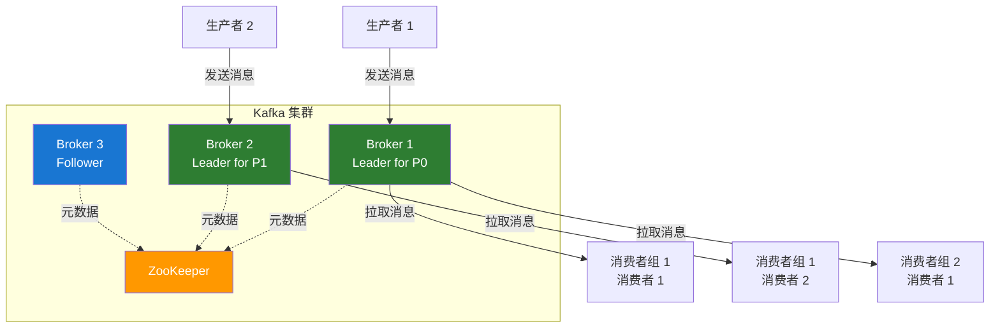
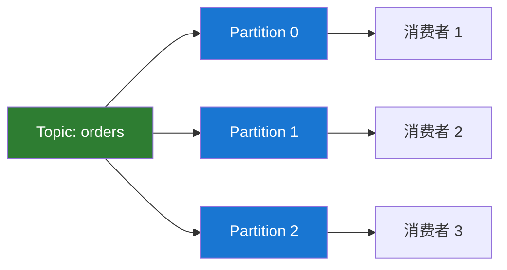
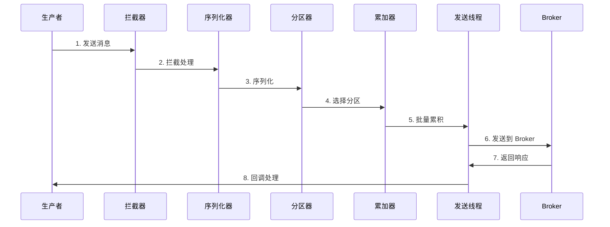
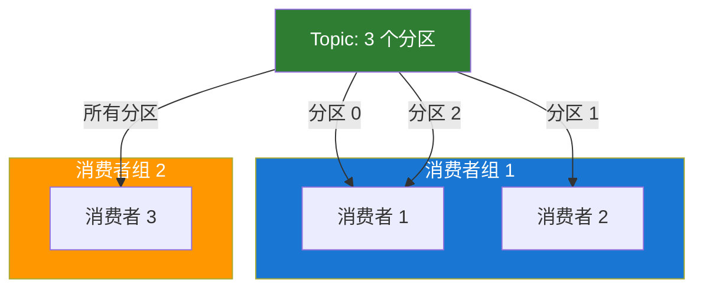
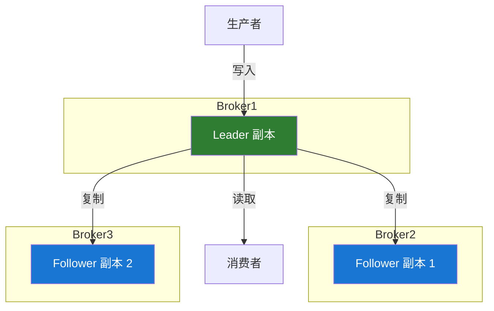

# Kafka 核心概念

## 架构概览



## Topic（主题）

### 定义

Topic 是 Kafka 中消息的分类单元，类似于数据库中的表或文件系统中的文件夹。

### 特点

- **逻辑概念**：Topic 是逻辑上的消息容器
- **多订阅者**：一个 Topic 可以被多个消费者订阅
- **持久化**：消息持久化存储到磁盘
- **可配置保留期**：可以设置消息的保留时间或大小

### 创建 Topic

```bash
# 创建一个 3 分区、2 副本的 Topic
bin/kafka-topics.sh --create \
  --bootstrap-server localhost:9092 \
  --topic my-topic \
  --partitions 3 \
  --replication-factor 2
```

### Topic 配置

```bash
# 查看 Topic 配置
bin/kafka-configs.sh --describe \
  --bootstrap-server localhost:9092 \
  --topic my-topic

# 修改 Topic 配置
bin/kafka-configs.sh --alter \
  --bootstrap-server localhost:9092 \
  --topic my-topic \
  --add-config retention.ms=86400000
```

### Topic 命名规范

```java
// 推荐的命名规范
// 格式：<业务域>.<实体>.<事件类型>
String topicName = "order.payment.completed";
String topicName = "user.registration.created";
String topicName = "inventory.stock.updated";
```

## Partition（分区）

### 定义

Partition 是 Topic 的物理分区，每个分区是一个有序的、不可变的消息序列。

### 分区的作用

#### 1. **实现并行处理**



#### 2. **提供扩展性**

通过增加分区数量来提升 Topic 的吞吐量。

#### 3. **保证分区内有序**

同一分区内的消息保持写入顺序。

### 分区策略

```java
// 1. 指定分区
producer.send(new ProducerRecord<>(
    "topic",
    0,  // 分区号
    "key",
    "value"
));

// 2. 使用 key 的哈希值（默认）
producer.send(new ProducerRecord<>("topic", "key", "value"));

// 3. 自定义分区器
public class CustomPartitioner implements Partitioner {
    @Override
    public int partition(String topic, Object key, byte[] keyBytes,
                        Object value, byte[] valueBytes, Cluster cluster) {
        // 自定义分区逻辑
        int numPartitions = cluster.partitionCountForTopic(topic);
        return Math.abs(key.hashCode()) % numPartitions;
    }
}
```

### 分区数量选择

```java
// 分区数量计算建议
// 分区数 = max(t/p, t/c)
// t: 目标吞吐量
// p: 单个分区的生产者吞吐量
// c: 单个分区的消费者吞吐量

// 示例：
// 目标吞吐量: 1000 MB/s
// 生产者单分区吞吐量: 100 MB/s
// 消费者单分区吞吐量: 50 MB/s
// 建议分区数 = max(1000/100, 1000/50) = max(10, 20) = 20
```

## Producer（生产者）

### 定义

Producer 负责向 Kafka Topic 发布消息。

### 工作流程



### 生产者配置

```java
Properties props = new Properties();

// 必需配置
props.put("bootstrap.servers", "localhost:9092");
props.put("key.serializer", "org.apache.kafka.common.serialization.StringSerializer");
props.put("value.serializer", "org.apache.kafka.common.serialization.StringSerializer");

// 性能配置
props.put("batch.size", 16384);           // 批次大小
props.put("linger.ms", 10);               // 等待时间
props.put("buffer.memory", 33554432);     // 缓冲区大小
props.put("compression.type", "lz4");     // 压缩类型

// 可靠性配置
props.put("acks", "all");                 // 确认级别
props.put("retries", 3);                  // 重试次数
props.put("max.in.flight.requests.per.connection", 1); // 保证顺序

KafkaProducer<String, String> producer = new KafkaProducer<>(props);
```

### ACK 机制

| acks 值     | 说明                       | 可靠性 | 性能 |
| ----------- | -------------------------- | ------ | ---- |
| **0**       | 不等待确认                 | 低     | 高   |
| **1**       | Leader 写入成功即返回      | 中     | 中   |
| **all(-1)** | 所有同步副本写入成功才返回 | 高     | 低   |

## Consumer（消费者）

### 定义

Consumer 从 Kafka Topic 订阅并消费消息。

### Consumer Group（消费者组）



### 消费者组特点

1. **负载均衡**：一个分区只能被组内一个消费者消费
2. **故障转移**：消费者宕机后，分区自动分配给其他消费者
3. **独立消费**：不同消费者组可以独立消费同一个 Topic

### 消费者配置

```java
Properties props = new Properties();

// 必需配置
props.put("bootstrap.servers", "localhost:9092");
props.put("group.id", "my-consumer-group");
props.put("key.deserializer", "org.apache.kafka.common.serialization.StringDeserializer");
props.put("value.deserializer", "org.apache.kafka.common.serialization.StringDeserializer");

// 消费策略
props.put("enable.auto.commit", "false");     // 手动提交
props.put("auto.offset.reset", "earliest");    // 从最早开始消费
props.put("max.poll.records", 500);           // 单次拉取数量
props.put("fetch.min.bytes", 1024);           // 最小拉取字节数

KafkaConsumer<String, String> consumer = new KafkaConsumer<>(props);
```

### Offset（位移）

#### 位移管理

```java
// 自动提交
props.put("enable.auto.commit", "true");
props.put("auto.commit.interval.ms", "5000");

// 手动提交（推荐）
consumer.poll(Duration.ofMillis(100));
consumer.commitSync();  // 同步提交
// 或
consumer.commitAsync(); // 异步提交
```

#### 重置位移

```bash
# 重置到最早
bin/kafka-consumer-groups.sh --reset-offsets \
  --to-earliest \
  --bootstrap-server localhost:9092 \
  --group my-group \
  --topic my-topic \
  --execute

# 重置到指定时间
bin/kafka-consumer-groups.sh --reset-offsets \
  --to-datetime 2024-01-01T00:00:00.000 \
  --bootstrap-server localhost:9092 \
  --group my-group \
  --topic my-topic \
  --execute
```

## Broker（代理）

### 定义

Broker 是 Kafka 集群中的服务器节点，负责消息的存储和转发。

### 主要职责

1. **消息存储**：持久化消息到磁盘
2. **服务请求**：处理生产者和消费者的请求
3. **副本管理**：管理分区副本
4. **集群协调**：与其他 Broker 协调工作

### Controller

集群中有一个 Broker 会被选举为 Controller，负责：

- 分区 Leader 选举
- Topic 创建/删除
- 分区重新分配

## Replication（副本）

### 副本机制



### Leader 和 Follower

- **Leader**：处理所有读写请求
- **Follower**：被动复制 Leader 的数据

### ISR（In-Sync Replicas）

同步副本集合，包含所有"同步"的副本。

```bash
# 查看 ISR 信息
bin/kafka-topics.sh --describe \
  --bootstrap-server localhost:9092 \
  --topic my-topic
```

### 副本分配策略

```java
// 创建 Topic 时指定副本因子
bin/kafka-topics.sh --create \
  --bootstrap-server localhost:9092 \
  --topic my-topic \
  --partitions 3 \
  --replication-factor 3  // 每个分区 3 个副本
```

## ZooKeeper

### 作用（传统模式）

- 存储集群元数据
- Controller 选举
- Topic 配置管理
- ACL 权限管理

### KRaft 模式（推荐）

Kafka 3.x 引入了 KRaft 模式，移除了对 ZooKeeper 的依赖。

```bash
# 生成集群 ID
KAFKA_CLUSTER_ID="$(bin/kafka-storage.sh random-uuid)"

# 格式化存储目录
bin/kafka-storage.sh format -t $KAFKA_CLUSTER_ID -c config/kraft/server.properties

# 启动 Kafka（无需 ZooKeeper）
bin/kafka-server-start.sh config/kraft/server.properties
```

## 消息格式

### 消息结构

```
Message {
    Offset: 8 bytes
    Length: 4 bytes
    CRC: 4 bytes
    Magic: 1 byte
    Attributes: 1 byte
    Timestamp: 8 bytes
    Key length: 4 bytes
    Key: K bytes
    Value length: 4 bytes
    Value: V bytes
}
```

### 消息压缩

支持的压缩类型：

- **gzip**：压缩率高，CPU 消耗大
- **snappy**：压缩速度快
- **lz4**：平衡压缩率和速度（推荐）
- **zstd**：新一代压缩算法

```java
props.put("compression.type", "lz4");
```

## 下一步

- 🚀 [快速开始](./quick-start.md) - 实践 Kafka 核心操作
- 💻 [生产者 API](./producer-api.md) - 深入学习消息发送
- 📊 [消费者 API](./consumer-api.md) - 深入学习消息消费

## 参考资料

- [Kafka 架构文档](https://kafka.apache.org/documentation/#design)
- [KRaft 模式介绍](https://kafka.apache.org/documentation/#kraft)
