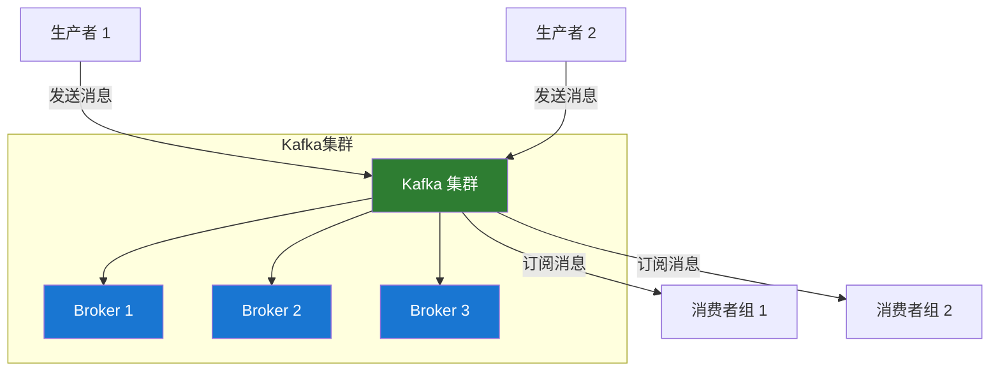

# Apache Kafka 概述

## 什么是 Kafka？

Apache Kafka 是一个开源的分布式事件流平台，被数千家公司用于高性能数据管道、流分析、数据集成和关键任务应用。

## 核心特性

### 🚀 **高吞吐量**

- 单集群每秒可处理百万级消息
- 支持 TB 级数据存储
- 低延迟消息传递

### 💪 **可扩展性**

- 水平扩展无需停机
- 自动分区和负载均衡
- 支持跨数据中心复制

### 🔒 **持久性和可靠性**

- 消息持久化到磁盘
- 支持副本机制
- 故障自动恢复

### 🎯 **实时流处理**

- 支持流式数据处理
- 与 Kafka Streams 无缝集成
- 事件时间处理

## 主要使用场景

### 📊 消息队列

替代传统的消息中间件（如 ActiveMQ、RabbitMQ），提供更高的吞吐量和更好的可扩展性。

```java
// 简单的生产者示例
Properties props = new Properties();
props.put("bootstrap.servers", "localhost:9092");
props.put("key.serializer", "org.apache.kafka.common.serialization.StringSerializer");
props.put("value.serializer", "org.apache.kafka.common.serialization.StringSerializer");

KafkaProducer<String, String> producer = new KafkaProducer<>(props);
producer.send(new ProducerRecord<>("my-topic", "key", "value"));
```

### 📈 日志聚合

从多个服务收集日志，统一处理和存储。

### 🔄 流处理

实时处理数据流，进行实时分析和转换。

### 💾 事件溯源

将应用状态的变化存储为事件序列。

### 🔗 数据集成

在不同系统之间实时同步数据。

## Kafka 核心概念

### Topic（主题）

- 消息的分类容器
- 类似于数据库中的表
- 支持多个生产者和消费者

### Partition（分区）

- Topic 的物理分片
- 实现并行处理和扩展
- 保证分区内消息有序

### Producer（生产者）

- 向 Topic 发布消息
- 决定消息发送到哪个分区
- 支持异步和同步发送

### Consumer（消费者）

- 从 Topic 订阅并消费消息
- 支持消费者组实现负载均衡
- 维护消费位移（offset）

### Broker（代理）

- Kafka 集群中的服务器节点
- 负责存储和转发消息
- 支持副本和故障转移

## 架构优势



### ✅ 解耦性

生产者和消费者相互独立，可以独立扩展和升级。

### ✅ 可扩展性

通过增加分区和 Broker 轻松扩展容量和吞吐量。

### ✅ 容错性

副本机制确保数据不丢失，即使部分节点故障。

### ✅ 高性能

批量处理、压缩、零拷贝等技术优化性能。

## Kafka 生态系统

### Kafka Connect

用于在 Kafka 和外部系统之间可靠地传输数据的框架。

### Kafka Streams

用于构建实时流处理应用的客户端库。

### Schema Registry

管理和验证数据模式，确保数据兼容性。

### KSQL

基于 SQL 的流处理引擎，简化流处理开发。

## 版本特性

### Kafka 3.x

- 更好的性能优化
- 移除 ZooKeeper 依赖（KRaft 模式）
- 增强的安全特性
- 改进的监控和管理工具

## 适用场景

✅ **适合使用 Kafka 的场景：**

- 需要高吞吐量的消息传递
- 实时数据流处理
- 日志收集和分析
- 事件驱动架构
- 微服务之间的异步通信

❌ **不适合使用 Kafka 的场景：**

- 需要事务性消息队列
- 简单的请求-响应模式
- 消息量很小的场景
- 需要复杂路由和过滤的场景

## 与其他消息队列的对比

| 特性         | Kafka      | RabbitMQ   | ActiveMQ   |
| ------------ | ---------- | ---------- | ---------- |
| **吞吐量**   | 非常高     | 中等       | 中等       |
| **延迟**     | 低         | 低         | 中         |
| **持久化**   | 是         | 是         | 是         |
| **顺序保证** | 分区内有序 | 队列内有序 | 队列内有序 |
| **消息回溯** | 支持       | 不支持     | 有限支持   |
| **学习曲线** | 陡峭       | 中等       | 中等       |

## 下一步

- 📖 [Kafka 简介](./introduction.md) - 深入了解 Kafka 的基本概念
- 🚀 [快速开始](./quick-start.md) - 快速搭建 Kafka 环境
- 🎯 [核心概念](./core-concepts.md) - 理解 Kafka 的核心组件
- 💻 [生产者 API](./producer-api.md) - 学习如何发送消息
- 📊 [消费者 API](./consumer-api.md) - 学习如何消费消息

## 参考资源

- [Apache Kafka 官方文档](https://kafka.apache.org/documentation/)
- [Confluent Platform](https://docs.confluent.io/)
- [Kafka: The Definitive Guide](https://www.confluent.io/resources/kafka-the-definitive-guide/)

---

**💡 提示：** 建议从 [快速开始](./quick-start.md) 章节开始，通过实际操作来学习 Kafka。
