# Kafka 简介

## Kafka 的诞生

Apache Kafka 最初由 LinkedIn 公司开发，于 2011 年初开源，2012 年成为 Apache 顶级项目。

### 🎯 设计目标

Kafka 的设计初衷是解决 LinkedIn 面临的大规模数据处理挑战：

- 处理每天数十亿条消息
- 支持实时数据流处理
- 提供高吞吐量、低延迟的数据传输
- 确保数据的持久性和可靠性

## Kafka 是什么？

Kafka 是一个**分布式事件流平台**，主要用于：

### 1. 发布和订阅消息流

类似于消息队列或企业消息系统。

```java
// 发布消息
producer.send(new ProducerRecord<>("orders", orderId, orderData));

// 订阅消息
consumer.subscribe(Arrays.asList("orders"));
ConsumerRecords<String, String> records = consumer.poll(Duration.ofMillis(100));
```

### 2. 持久化存储消息流

以容错的方式存储消息流。

### 3. 实时处理消息流

在消息流产生时立即进行处理。

## 核心能力

### 🚀 **高性能**

- **高吞吐量**：单个 broker 可以处理数百 MB/s 的读写流量
- **低延迟**：单次消息传递延迟可以低至 2ms
- **横向扩展**：通过增加机器轻松扩展容量

```bash
# 性能测试示例
bin/kafka-producer-perf-test.sh \
  --topic test-topic \
  --num-records 1000000 \
  --record-size 1000 \
  --throughput -1 \
  --producer-props bootstrap.servers=localhost:9092
```

### 💾 **数据持久化**

Kafka 将所有消息持久化到磁盘，并支持数据复制以防止数据丢失。

```mermaid
graph LR
    P[生产者] -->|写入| Leader[Leader 分区]
    Leader -->|复制| F1[Follower 1]
    Leader -->|复制| F2[Follower 2]
    Leader -->|读取| C[消费者]

    style Leader fill:#2e7d32,color:#fff
    style F1 fill:#1976d2,color:#fff
    style F2 fill:#1976d2,color:#fff
```



### 📊 **分布式架构**

- **集群部署**：多个 broker 组成集群
- **分区机制**：topic 划分为多个分区，实现并行处理
- **副本机制**：每个分区有多个副本，确保高可用

### 🔄 **实时流处理**

通过 Kafka Streams 或 KSQL 进行实时数据处理。

## 关键特性

### ✅ 消息顺序保证

在同一个分区内，消息保持严格的顺序。

```java
// 通过 key 确保相同 key 的消息进入同一分区
producer.send(new ProducerRecord<>("topic", key, value));
```

### ✅ 消息回溯

消费者可以重新消费历史消息，这在传统消息队列中很难实现。

```java
// 重置消费位移到指定时间点
consumer.seek(partition, offset);
```

### ✅ 多订阅者模式

同一个 topic 可以被多个消费者组独立消费。

### ✅ 容错性

- 数据副本机制
- 自动故障转移
- 数据不丢失保证

## 应用场景

### 📨 消息传递

替代传统消息中间件，提供更好的性能和扩展性。

**优势：**

- 更高的吞吐量
- 内置分区和复制
- 消息持久化

### 📊 网站活动跟踪

这是 Kafka 最初的使用场景，用于跟踪用户活动（页面浏览、搜索等）。

```java
// 跟踪用户行为
public void trackUserActivity(String userId, String action) {
    UserActivity activity = new UserActivity(userId, action, System.currentTimeMillis());
    producer.send(new ProducerRecord<>("user-activities", userId, activity));
}
```

### 📈 指标监控

收集和聚合分布式应用的指标数据。

### 📝 日志聚合

从多个服务收集日志，统一存储和处理。

```mermaid
graph TB
    S1[服务 1] -->|日志| Kafka[Kafka 集群]
    S2[服务 2] -->|日志| Kafka
    S3[服务 3] -->|日志| Kafka
    Kafka -->|消费| ES[Elasticsearch]
    ES --> Kibana[Kibana 可视化]

    style Kafka fill:#2e7d32,color:#fff
```



### 🔄 流处理

实时处理和转换数据流。

```java
// Kafka Streams 示例
StreamsBuilder builder = new StreamsBuilder();
KStream<String, String> source = builder.stream("input-topic");
source
    .filter((key, value) -> value.length() > 5)
    .mapValues(value -> value.toUpperCase())
    .to("output-topic");
```

### 💾 事件溯源

将应用状态的所有变更记录为事件序列。

### 🔗 提交日志

作为分布式系统的提交日志，同步状态变更。

## Kafka 与传统消息队列的区别

### 消息持久化方式

| 特性       | Kafka              | 传统 MQ    |
| ---------- | ------------------ | ---------- |
| **存储**   | 磁盘持久化         | 内存为主   |
| **保留期** | 可配置（天/周/月） | 消费后删除 |
| **回溯**   | 支持               | 不支持     |

### 消费模型

**传统 MQ（如 RabbitMQ）：**

- 消息被消费后从队列删除
- 只有一个消费者可以消费消息

**Kafka：**

- 消息保留一段时间，可被多次消费
- 支持多个消费者组独立消费

```java
// Kafka 的多消费者组模式
// 消费者组 1：处理订单
consumerGroup1.subscribe(Arrays.asList("orders"));

// 消费者组 2：统计分析
consumerGroup2.subscribe(Arrays.asList("orders"));
```

### 性能特点

**Kafka 优势：**

- 更高的吞吐量（TB/s 级别）
- 水平扩展更容易
- 更适合大数据场景

**传统 MQ 优势：**

- 更低的消息延迟
- 更丰富的路由功能
- 更简单的事务支持

## Kafka 生态系统

### Kafka Core

核心消息系统，提供基本的发布-订阅功能。

### Kafka Connect

连接 Kafka 和外部系统的框架。

```bash
# 启动 JDBC 连接器，从数据库导入数据
bin/connect-standalone.sh \
  config/connect-standalone.properties \
  config/connect-jdbc-source.properties
```

### Kafka Streams

Java 流处理库，用于构建实时应用。

### KSQL

基于 SQL 的流处理引擎。

```sql
-- KSQL 查询示例
CREATE STREAM orders_stream (
    order_id VARCHAR,
    user_id VARCHAR,
    amount DOUBLE
) WITH (
    KAFKA_TOPIC='orders',
    VALUE_FORMAT='JSON'
);

SELECT user_id, SUM(amount) as total
FROM orders_stream
WINDOW TUMBLING (SIZE 1 HOUR)
GROUP BY user_id;
```

### Schema Registry

管理和验证消息模式，确保数据兼容性。

## Kafka 设计理念

### 1. 追求高吞吐量

- 批量处理消息
- 数据压缩
- 零拷贝技术
- 顺序写磁盘

### 2. 简化复杂性

- Pull 模型而非 Push
- 简单的消息格式
- 无状态 broker

### 3. 分布式优先

- 天然支持集群
- 自动分区和复制
- 负载均衡

## 版本演进

### Kafka 0.x - 1.x

- 基于 ZooKeeper 的元数据管理
- 基本的消息队列功能
- Kafka Streams 引入

### Kafka 2.x

- 性能优化
- 更好的安全性
- 改进的监控

### Kafka 3.x

- **KRaft 模式**：移除 ZooKeeper 依赖
- 更强的性能
- 更简单的运维

```bash
# KRaft 模式启动（无需 ZooKeeper）
bin/kafka-server-start.sh config/kraft/server.properties
```

## 下一步

- 🚀 [快速开始](/docs/kafka/quick-start) - 快速搭建 Kafka 环境
- 🎯 [核心概念](/docs/kafka/core-concepts) - 深入理解 Kafka 架构
- 💻 [生产者 API](/docs/kafka/producer-api) - 学习如何发送消息

## 参考资料

- [Kafka 官方文档](https://kafka.apache.org/documentation/)
- [Kafka 设计理念](https://kafka.apache.org/documentation/#design)
- [Kafka 论文](https://www.microsoft.com/en-us/research/publication/kafka-a-distributed-messaging-system-for-log-processing/)
