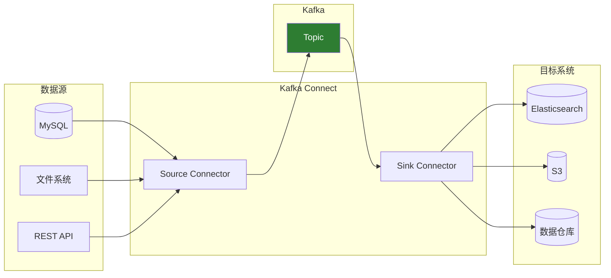

# Kafka Connect

## 概述

Kafka Connect 是 Kafka 的数据集成框架，用于在 Kafka 和外部系统之间可靠地传输数据。



## 核心概念

### Connector 类型

| 类型                 | 作用                 | 数据流向         |
| -------------------- | -------------------- | ---------------- |
| **Source Connector** | 从外部系统导入数据   | 外部系统 → Kafka |
| **Sink Connector**   | 将数据导出到外部系统 | Kafka → 外部系统 |

### 核心组件

- **Connector**：定义数据如何在 Kafka 和外部系统之间流动
- **Task**：实际执行数据复制的工作单元
- **Worker**：运行 Connector 和 Task 的 JVM 进程
- **Converter**：数据格式转换（JSON、Avro 等）
- **Transform**：数据转换处理

## 部署模式

### 单机模式

适用于开发和测试：

```bash
# 启动单机模式
bin/connect-standalone.sh \
  config/connect-standalone.properties \
  config/connect-file-source.properties
```

**配置文件（connect-standalone.properties）：**

```properties
bootstrap.servers=localhost:9092
key.converter=org.apache.kafka.connect.json.JsonConverter
value.converter=org.apache.kafka.connect.json.JsonConverter
key.converter.schemas.enable=false
value.converter.schemas.enable=false

# 位移存储
offset.storage.file.filename=/tmp/connect.offsets
```

### 分布式模式

适用于生产环境：

```bash
# 启动分布式模式
bin/connect-distributed.sh config/connect-distributed.properties
```

**配置文件（connect-distributed.properties）：**

```properties
bootstrap.servers=kafka1:9092,kafka2:9092,kafka3:9092
group.id=connect-cluster

key.converter=org.apache.kafka.connect.json.JsonConverter
value.converter=org.apache.kafka.connect.json.JsonConverter

# 内部 Topic 配置
config.storage.topic=connect-configs
config.storage.replication.factor=3
offset.storage.topic=connect-offsets
offset.storage.replication.factor=3
status.storage.topic=connect-status
status.storage.replication.factor=3

# REST API 端口
rest.port=8083
rest.advertised.host.name=connect-worker1
```

## 常用 Connector

### JDBC Source Connector

从数据库导入数据：

```json
{
  "name": "jdbc-source-connector",
  "config": {
    "connector.class": "io.confluent.connect.jdbc.JdbcSourceConnector",
    "connection.url": "jdbc:mysql://localhost:3306/mydb",
    "connection.user": "user",
    "connection.password": "password",
    "table.whitelist": "users,orders",
    "mode": "incrementing",
    "incrementing.column.name": "id",
    "topic.prefix": "mysql-",
    "poll.interval.ms": 1000
  }
}
```

### JDBC Sink Connector

将数据写入数据库：

```json
{
  "name": "jdbc-sink-connector",
  "config": {
    "connector.class": "io.confluent.connect.jdbc.JdbcSinkConnector",
    "connection.url": "jdbc:postgresql://localhost:5432/analytics",
    "connection.user": "user",
    "connection.password": "password",
    "topics": "mysql-users,mysql-orders",
    "insert.mode": "upsert",
    "pk.mode": "record_key",
    "pk.fields": "id",
    "auto.create": true
  }
}
```

### Elasticsearch Sink Connector

将数据写入 Elasticsearch：

```json
{
  "name": "elasticsearch-sink",
  "config": {
    "connector.class": "io.confluent.connect.elasticsearch.ElasticsearchSinkConnector",
    "connection.url": "http://elasticsearch:9200",
    "topics": "logs",
    "type.name": "_doc",
    "key.ignore": true,
    "schema.ignore": true
  }
}
```

### S3 Sink Connector

将数据写入 S3：

```json
{
  "name": "s3-sink",
  "config": {
    "connector.class": "io.confluent.connect.s3.S3SinkConnector",
    "s3.bucket.name": "my-bucket",
    "s3.region": "us-east-1",
    "topics": "events",
    "format.class": "io.confluent.connect.s3.format.parquet.ParquetFormat",
    "flush.size": 10000,
    "rotate.interval.ms": 3600000,
    "storage.class": "io.confluent.connect.s3.storage.S3Storage"
  }
}
```

### File Source Connector

从文件读取数据：

```json
{
  "name": "file-source",
  "config": {
    "connector.class": "org.apache.kafka.connect.file.FileStreamSourceConnector",
    "file": "/var/log/app.log",
    "topic": "app-logs"
  }
}
```

## REST API 操作

### 查看 Connector 状态

```bash
# 列出所有 Connector
curl http://localhost:8083/connectors

# 查看 Connector 详情
curl http://localhost:8083/connectors/jdbc-source-connector

# 查看 Connector 状态
curl http://localhost:8083/connectors/jdbc-source-connector/status

# 查看 Connector 配置
curl http://localhost:8083/connectors/jdbc-source-connector/config
```

### 管理 Connector

```bash
# 创建 Connector
curl -X POST http://localhost:8083/connectors \
  -H "Content-Type: application/json" \
  -d @connector-config.json

# 更新 Connector 配置
curl -X PUT http://localhost:8083/connectors/my-connector/config \
  -H "Content-Type: application/json" \
  -d @new-config.json

# 暂停 Connector
curl -X PUT http://localhost:8083/connectors/my-connector/pause

# 恢复 Connector
curl -X PUT http://localhost:8083/connectors/my-connector/resume

# 重启 Connector
curl -X POST http://localhost:8083/connectors/my-connector/restart

# 删除 Connector
curl -X DELETE http://localhost:8083/connectors/my-connector
```

## 数据转换（SMT）

### 内置转换

```json
{
  "name": "jdbc-source",
  "config": {
    "connector.class": "io.confluent.connect.jdbc.JdbcSourceConnector",
    "transforms": "route,filter,mask",

    "transforms.route.type": "org.apache.kafka.connect.transforms.RegexRouter",
    "transforms.route.regex": "(.*)orders(.*)",
    "transforms.route.replacement": "$1orders_v2$2",

    "transforms.filter.type": "org.apache.kafka.connect.transforms.Filter",
    "transforms.filter.predicate": "IsTest",
    "transforms.filter.negate": true,

    "transforms.mask.type": "org.apache.kafka.connect.transforms.MaskField$Value",
    "transforms.mask.fields": "password,ssn",
    "transforms.mask.replacement": "***",

    "predicates": "IsTest",
    "predicates.IsTest.type": "org.apache.kafka.connect.transforms.predicates.RecordIsTombstone"
  }
}
```

### 常用 SMT

| 转换              | 作用             |
| ----------------- | ---------------- |
| `InsertField`     | 添加字段         |
| `ReplaceField`    | 重命名/删除字段  |
| `MaskField`       | 脱敏字段         |
| `ExtractField`    | 提取字段         |
| `TimestampRouter` | 按时间路由 Topic |
| `RegexRouter`     | 正则路由 Topic   |
| `Flatten`         | 扁平化嵌套结构   |
| `Cast`            | 类型转换         |

## 自定义 Connector

### 开发 Source Connector

```java
public class MySourceConnector extends SourceConnector {
    private Map<String, String> configProperties;

    @Override
    public void start(Map<String, String> props) {
        this.configProperties = props;
    }

    @Override
    public Class<? extends Task> taskClass() {
        return MySourceTask.class;
    }

    @Override
    public List<Map<String, String>> taskConfigs(int maxTasks) {
        List<Map<String, String>> configs = new ArrayList<>();
        for (int i = 0; i < maxTasks; i++) {
            Map<String, String> config = new HashMap<>(configProperties);
            config.put("task.id", String.valueOf(i));
            configs.add(config);
        }
        return configs;
    }

    @Override
    public void stop() {
        // 清理资源
    }

    @Override
    public ConfigDef config() {
        return new ConfigDef()
            .define("my.config", ConfigDef.Type.STRING,
                    ConfigDef.Importance.HIGH, "My configuration");
    }

    @Override
    public String version() {
        return "1.0.0";
    }
}
```

### 开发 Source Task

```java
public class MySourceTask extends SourceTask {
    private String topic;
    private long offset = 0;

    @Override
    public void start(Map<String, String> props) {
        this.topic = props.get("topic");
    }

    @Override
    public List<SourceRecord> poll() throws InterruptedException {
        List<SourceRecord> records = new ArrayList<>();

        // 从外部系统获取数据
        String data = fetchData();

        if (data != null) {
            Map<String, ?> sourcePartition = Collections.singletonMap("partition", 0);
            Map<String, ?> sourceOffset = Collections.singletonMap("offset", offset++);

            records.add(new SourceRecord(
                sourcePartition,
                sourceOffset,
                topic,
                Schema.STRING_SCHEMA,
                data
            ));
        }

        return records;
    }

    @Override
    public void stop() {
        // 清理资源
    }

    @Override
    public String version() {
        return "1.0.0";
    }
}
```

## 监控与运维

### 关键指标

| 指标                              | 说明                  |
| --------------------------------- | --------------------- |
| `connector-count`                 | 运行的 Connector 数量 |
| `task-count`                      | 运行的 Task 数量      |
| `connector-startup-success-total` | 成功启动次数          |
| `connector-startup-failure-total` | 启动失败次数          |
| `source-record-poll-rate`         | Source 拉取速率       |
| `sink-record-send-rate`           | Sink 发送速率         |

### 日志排查

```bash
# 查看 Connector 日志
grep "my-connector" /var/log/kafka-connect/connect.log

# 查看 Task 错误
curl http://localhost:8083/connectors/my-connector/tasks/0/status
```

### 常见问题

**Q: Connector 启动失败**

```bash
# 检查 Connector 状态
curl http://localhost:8083/connectors/my-connector/status | jq '.tasks[0].trace'
```

**Q: 数据延迟**

- 增加 Task 数量
- 调整 `poll.interval.ms`
- 检查目标系统性能

## 最佳实践

### 配置建议

```properties
# 增加 Task 数量提高并行
tasks.max=4

# 错误处理
errors.tolerance=all
errors.deadletterqueue.topic.name=dlq-topic
errors.deadletterqueue.topic.replication.factor=3
errors.log.enable=true
errors.log.include.messages=true

# 生产者优化
producer.batch.size=32768
producer.linger.ms=100
producer.compression.type=lz4
```

### 高可用部署

1. **多 Worker 节点**：至少 3 个 Worker
2. **内部 Topic 副本**：replication.factor >= 3
3. **监控告警**：Prometheus + Grafana
4. **容量规划**：预留足够资源

## 参考资料

- [Kafka Connect 官方文档](https://kafka.apache.org/documentation/#connect)
- [Confluent Connect 文档](https://docs.confluent.io/platform/current/connect/)
- [Connector Hub](https://www.confluent.io/hub/)
