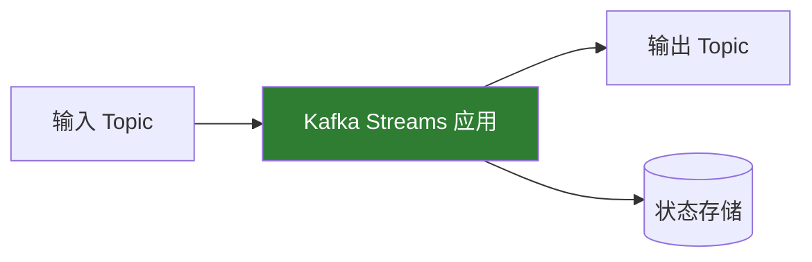

# Kafka Streams

## 概述

Kafka Streams 是构建在 Kafka 之上的流处理库，用于构建实时数据处理应用。



### 核心特点

- **轻量级**：只是一个 Java 库，无需集群
- **容错**：自动处理故障恢复
- **可扩展**：通过增加实例水平扩展
- **精确一次**：支持 Exactly-Once 语义
- **有状态处理**：内置状态存储

## 快速开始

### Maven 依赖

```xml
<dependency>
    <groupId>org.apache.kafka</groupId>
    <artifactId>kafka-streams</artifactId>
    <version>3.6.0</version>
</dependency>
```

### 基本示例

```java
Properties props = new Properties();
props.put(StreamsConfig.APPLICATION_ID_CONFIG, "my-streams-app");
props.put(StreamsConfig.BOOTSTRAP_SERVERS_CONFIG, "localhost:9092");
props.put(StreamsConfig.DEFAULT_KEY_SERDE_CLASS_CONFIG, Serdes.String().getClass());
props.put(StreamsConfig.DEFAULT_VALUE_SERDE_CLASS_CONFIG, Serdes.String().getClass());

// 构建处理拓扑
StreamsBuilder builder = new StreamsBuilder();
KStream<String, String> source = builder.stream("input-topic");

source
    .filter((key, value) -> value.length() > 5)
    .mapValues(value -> value.toUpperCase())
    .to("output-topic");

// 启动应用
KafkaStreams streams = new KafkaStreams(builder.build(), props);
streams.start();

// 优雅关闭
Runtime.getRuntime().addShutdownHook(new Thread(streams::close));
```

## 核心概念

### KStream

不可变的记录流，代表无限的数据流：

```java
// 创建 KStream
KStream<String, String> stream = builder.stream("orders");

// 无状态转换
stream
    .filter((key, value) -> value != null)           // 过滤
    .map((key, value) -> KeyValue.pair(               // 映射
        key.toUpperCase(),
        value.toLowerCase()
    ))
    .flatMapValues(value -> Arrays.asList(            // 扁平化
        value.split(",")
    ))
    .peek((key, value) -> log.info("Key: {}", key))   // 调试
    .to("processed-orders");                          // 输出
```

### KTable

变更日志流，代表可更新的键值表：

```java
// 创建 KTable
KTable<String, Long> table = builder.table("user-balances");

// 或从 KStream 转换
KTable<String, Long> counts = stream
    .groupByKey()
    .count();

// KTable 操作
table
    .filter((key, value) -> value > 100)
    .mapValues(value -> value * 2)
    .toStream()
    .to("high-balances");
```

### GlobalKTable

全局状态表，每个实例都有完整副本：

```java
// 创建 GlobalKTable（用于广播数据）
GlobalKTable<String, String> countries = builder.globalTable("countries");

// 与 KStream 连接
stream.join(countries,
    (streamKey, streamValue) -> streamKey,  // 选择连接键
    (streamValue, tableValue) -> streamValue + " - " + tableValue
);
```

## 无状态操作

### 过滤和映射

```java
KStream<String, Order> orders = builder.stream("orders");

// 过滤
KStream<String, Order> validOrders = orders
    .filter((key, order) -> order.getAmount() > 0);

// 映射键值
KStream<String, OrderSummary> summaries = orders
    .map((key, order) -> KeyValue.pair(
        order.getUserId(),
        new OrderSummary(order.getId(), order.getAmount())
    ));

// 仅映射值
KStream<String, Double> amounts = orders
    .mapValues(Order::getAmount);
```

### 扁平化和分支

```java
// 扁平化
KStream<String, String> words = lines
    .flatMapValues(line -> Arrays.asList(line.split("\\s+")));

// 分支（Kafka 2.8+）
Map<String, KStream<String, Order>> branches = orders
    .split(Named.as("branch-"))
    .branch((key, order) -> order.getAmount() > 1000, Branched.as("large"))
    .branch((key, order) -> order.getAmount() > 100, Branched.as("medium"))
    .defaultBranch(Branched.as("small"));

KStream<String, Order> largeOrders = branches.get("branch-large");
```

## 有状态操作

### 聚合

```java
// 按键分组
KGroupedStream<String, Order> grouped = orders.groupByKey();

// 计数
KTable<String, Long> orderCounts = grouped.count();

// 求和
KTable<String, Double> totalAmounts = grouped.aggregate(
    () -> 0.0,                                    // 初始值
    (key, order, total) -> total + order.getAmount(),  // 聚合逻辑
    Materialized.with(Serdes.String(), Serdes.Double())
);

// reduce
KTable<String, Order> maxOrders = grouped.reduce(
    (order1, order2) ->
        order1.getAmount() > order2.getAmount() ? order1 : order2
);
```

### 窗口操作

```java
// 滚动窗口（Tumbling Window）
KTable<Windowed<String>, Long> tumblingCounts = orders
    .groupByKey()
    .windowedBy(TimeWindows.ofSizeWithNoGrace(Duration.ofMinutes(5)))
    .count();

// 滑动窗口（Hopping Window）
KTable<Windowed<String>, Long> hoppingCounts = orders
    .groupByKey()
    .windowedBy(TimeWindows.ofSizeAndGrace(
        Duration.ofMinutes(5),   // 窗口大小
        Duration.ofMinutes(1)    // 容忍延迟
    ).advanceBy(Duration.ofMinutes(1)))  // 滑动间隔
    .count();

// 会话窗口（Session Window）
KTable<Windowed<String>, Long> sessionCounts = orders
    .groupByKey()
    .windowedBy(SessionWindows.ofInactivityGapWithNoGrace(Duration.ofMinutes(30)))
    .count();

// 处理窗口结果
tumblingCounts
    .toStream()
    .map((windowedKey, count) -> {
        String key = windowedKey.key();
        long windowStart = windowedKey.window().start();
        return KeyValue.pair(key, String.format("%s: %d (window: %d)", key, count, windowStart));
    })
    .to("windowed-counts");
```

### 连接操作

```java
// KStream-KStream 连接（需要窗口）
KStream<String, Order> orders = builder.stream("orders");
KStream<String, Payment> payments = builder.stream("payments");

KStream<String, OrderPayment> joined = orders.join(
    payments,
    (order, payment) -> new OrderPayment(order, payment),
    JoinWindows.ofTimeDifferenceWithNoGrace(Duration.ofMinutes(5)),
    StreamJoined.with(Serdes.String(), orderSerde, paymentSerde)
);

// KStream-KTable 连接
KTable<String, User> users = builder.table("users");

KStream<String, EnrichedOrder> enriched = orders.join(
    users,
    (order, user) -> new EnrichedOrder(order, user)
);

// 左连接
KStream<String, EnrichedOrder> leftJoined = orders.leftJoin(
    users,
    (order, user) -> new EnrichedOrder(order, user != null ? user : User.UNKNOWN)
);
```

## 状态存储

### 内置状态存储

```java
// 使用命名状态存储
KTable<String, Long> counts = orders
    .groupByKey()
    .count(Materialized.<String, Long, KeyValueStore<Bytes, byte[]>>as("order-counts-store")
        .withKeySerde(Serdes.String())
        .withValueSerde(Serdes.Long()));

// 查询状态存储
ReadOnlyKeyValueStore<String, Long> store =
    streams.store(StoreQueryParameters.fromNameAndType(
        "order-counts-store",
        QueryableStoreTypes.keyValueStore()
    ));

Long count = store.get("user-123");
```

### 交互式查询

```java
// 启用交互式查询
props.put(StreamsConfig.APPLICATION_SERVER_CONFIG, "localhost:8080");

// 获取所有实例的元数据
Collection<StreamsMetadata> metadata = streams.metadataForAllStreamsClients();

// 查询本地或远程状态
for (StreamsMetadata meta : metadata) {
    if (meta.stateStoreNames().contains("my-store")) {
        String host = meta.hostInfo().host();
        int port = meta.hostInfo().port();
        // 发送请求到对应实例
    }
}
```

## Processor API

### 自定义处理器

```java
public class MyProcessor implements Processor<String, String, String, String> {
    private ProcessorContext<String, String> context;
    private KeyValueStore<String, Long> store;

    @Override
    public void init(ProcessorContext<String, String> context) {
        this.context = context;
        this.store = context.getStateStore("my-store");

        // 定时任务
        this.context.schedule(
            Duration.ofSeconds(60),
            PunctuationType.WALL_CLOCK_TIME,
            this::punctuate
        );
    }

    @Override
    public void process(Record<String, String> record) {
        Long count = store.get(record.key());
        store.put(record.key(), count == null ? 1L : count + 1);

        // 转发到下游
        context.forward(new Record<>(
            record.key(),
            String.valueOf(count),
            record.timestamp()
        ));
    }

    private void punctuate(long timestamp) {
        // 定期处理逻辑
        try (KeyValueIterator<String, Long> iter = store.all()) {
            while (iter.hasNext()) {
                KeyValue<String, Long> kv = iter.next();
                context.forward(new Record<>(kv.key, String.valueOf(kv.value), timestamp));
            }
        }
    }

    @Override
    public void close() {
        // 清理资源
    }
}
```

### 使用 Processor

```java
Topology topology = new Topology();

topology.addSource("source", "input-topic")
    .addProcessor("processor", MyProcessor::new, "source")
    .addStateStore(
        Stores.keyValueStoreBuilder(
            Stores.persistentKeyValueStore("my-store"),
            Serdes.String(),
            Serdes.Long()
        ),
        "processor"
    )
    .addSink("sink", "output-topic", "processor");

KafkaStreams streams = new KafkaStreams(topology, props);
```

## 精确一次语义

### 配置

```java
// Kafka Streams 2.6+
props.put(StreamsConfig.PROCESSING_GUARANTEE_CONFIG, StreamsConfig.EXACTLY_ONCE_V2);

// 或旧版本
props.put(StreamsConfig.PROCESSING_GUARANTEE_CONFIG, StreamsConfig.EXACTLY_ONCE);
```

### 工作原理

1. **事务生产者**：输出消息使用事务
2. **消费者隔离**：只读取已提交的消息
3. **状态检查点**：状态变更与输出原子提交

## 错误处理

### 反序列化错误

```java
// 配置错误处理
props.put(StreamsConfig.DEFAULT_DESERIALIZATION_EXCEPTION_HANDLER_CLASS_CONFIG,
    LogAndContinueExceptionHandler.class);

// 自定义处理器
public class MyDeserializationHandler implements DeserializationExceptionHandler {
    @Override
    public DeserializationHandlerResponse handle(ProcessorContext context,
                                                   ConsumerRecord<byte[], byte[]> record,
                                                   Exception exception) {
        log.error("Deserialization error for record: {}", record, exception);
        // 发送到死信队列
        sendToDLQ(record);
        return DeserializationHandlerResponse.CONTINUE;
    }
}
```

### 生产错误

```java
props.put(StreamsConfig.DEFAULT_PRODUCTION_EXCEPTION_HANDLER_CLASS_CONFIG,
    DefaultProductionExceptionHandler.class);

public class MyProductionHandler implements ProductionExceptionHandler {
    @Override
    public ProductionExceptionHandlerResponse handle(ProducerRecord<byte[], byte[]> record,
                                                      Exception exception) {
        log.error("Production error", exception);
        return ProductionExceptionHandlerResponse.CONTINUE;
    }
}
```

## 测试

### TopologyTestDriver

```java
@Test
void testTopology() {
    // 创建测试驱动
    TopologyTestDriver testDriver = new TopologyTestDriver(topology, props);

    // 创建测试输入 Topic
    TestInputTopic<String, String> inputTopic = testDriver.createInputTopic(
        "input-topic",
        new StringSerializer(),
        new StringSerializer()
    );

    // 创建测试输出 Topic
    TestOutputTopic<String, String> outputTopic = testDriver.createOutputTopic(
        "output-topic",
        new StringDeserializer(),
        new StringDeserializer()
    );

    // 发送测试数据
    inputTopic.pipeInput("key1", "value1");

    // 验证输出
    assertThat(outputTopic.readValue()).isEqualTo("VALUE1");

    testDriver.close();
}
```

## 监控

### 关键指标

| 指标                  | 说明         |
| --------------------- | ------------ |
| `process-rate`        | 处理速率     |
| `process-latency-avg` | 平均处理延迟 |
| `commit-rate`         | 提交速率     |
| `poll-rate`           | 拉取速率     |

### JMX 监控

```java
// 获取指标
Metrics metrics = streams.metrics();
for (Metric metric : metrics.values()) {
    log.info("{}: {}", metric.metricName(), metric.metricValue());
}
```

## 最佳实践

### 配置优化

```java
// 并行度
props.put(StreamsConfig.NUM_STREAM_THREADS_CONFIG, 4);

// 缓存大小
props.put(StreamsConfig.CACHE_MAX_BYTES_BUFFERING_CONFIG, 10 * 1024 * 1024);

// 提交间隔
props.put(StreamsConfig.COMMIT_INTERVAL_MS_CONFIG, 100);

// 状态目录
props.put(StreamsConfig.STATE_DIR_CONFIG, "/var/kafka-streams");
```

### 容错与恢复

```java
// 设置状态监听器
streams.setStateListener((newState, oldState) -> {
    if (newState == KafkaStreams.State.ERROR) {
        log.error("Stream entered error state");
        // 触发告警
    }
});

// 设置未捕获异常处理器
streams.setUncaughtExceptionHandler((thread, exception) -> {
    log.error("Uncaught exception in thread {}", thread, exception);
    return StreamsUncaughtExceptionHandler.StreamThreadExceptionResponse.REPLACE_THREAD;
});
```

## 参考资料

- [Kafka Streams 官方文档](https://kafka.apache.org/documentation/streams/)
- [Kafka Streams DSL](https://kafka.apache.org/documentation/streams/developer-guide/dsl-api.html)
- [Kafka Streams 示例](https://github.com/apache/kafka/tree/trunk/streams/examples)
