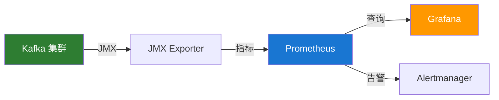

# Kafka 监控与运维

## 监控架构



## 核心监控指标

### Broker 指标

| 指标名称                    | 说明         | 告警阈值 |
| --------------------------- | ------------ | -------- |
| `UnderReplicatedPartitions` | 欠复制分区数 | > 0      |
| `OfflinePartitionsCount`    | 离线分区数   | > 0      |
| `ActiveControllerCount`     | 活跃控制器   | = 1      |
| `BytesInPerSec`             | 入站字节/秒  | 监控趋势 |
| `BytesOutPerSec`            | 出站字节/秒  | 监控趋势 |
| `RequestsPerSec`            | 请求数/秒    | 监控趋势 |

### 生产者指标

| 指标                  | 说明     |
| --------------------- | -------- |
| `record-send-rate`    | 发送速率 |
| `record-error-rate`   | 错误率   |
| `request-latency-avg` | 平均延迟 |
| `batch-size-avg`      | 批次大小 |

### 消费者指标

| 指标                    | 说明     |
| ----------------------- | -------- |
| `records-consumed-rate` | 消费速率 |
| `records-lag-max`       | 最大积压 |
| `fetch-latency-avg`     | 拉取延迟 |

## JMX 监控

### 启用 JMX

```bash
# 启动 Kafka 时设置
export KAFKA_JMX_OPTS="-Dcom.sun.management.jmxremote \
  -Dcom.sun.management.jmxremote.port=9999 \
  -Dcom.sun.management.jmxremote.authenticate=false \
  -Dcom.sun.management.jmxremote.ssl=false"

bin/kafka-server-start.sh config/server.properties
```

### JMX Exporter 配置

```yaml
# jmx_exporter_config.yml
lowercaseOutputName: true
rules:
  - pattern: kafka.server<type=(.+), name=(.+)><>(\w+)
    name: kafka_server_$1_$2_$3
  - pattern: kafka.controller<type=(.+), name=(.+)><>(\w+)
    name: kafka_controller_$1_$2_$3
  - pattern: kafka.network<type=(.+), name=(.+)><>(\w+)
    name: kafka_network_$1_$2_$3
```

## Prometheus + Grafana

### Prometheus 配置

```yaml
# prometheus.yml
scrape_configs:
  - job_name: "kafka"
    static_configs:
      - targets: ["kafka1:9999", "kafka2:9999", "kafka3:9999"]

  - job_name: "kafka-exporter"
    static_configs:
      - targets: ["kafka-exporter:9308"]
```

### 常用告警规则

```yaml
groups:
  - name: kafka-alerts
    rules:
      - alert: KafkaBrokerDown
        expr: up{job="kafka"} == 0
        for: 1m
        labels:
          severity: critical
        annotations:
          summary: "Kafka Broker 宕机"

      - alert: KafkaUnderReplicated
        expr: kafka_server_replica_manager_under_replicated_partitions > 0
        for: 1m
        labels:
          severity: critical
        annotations:
          summary: "存在欠复制分区"

      - alert: KafkaConsumerLag
        expr: kafka_consumergroup_lag > 10000
        for: 5m
        labels:
          severity: warning
        annotations:
          summary: "消费者积压过高"

      - alert: KafkaDiskUsage
        expr: (node_filesystem_size_bytes - node_filesystem_free_bytes) / node_filesystem_size_bytes > 0.8
        for: 5m
        labels:
          severity: warning
        annotations:
          summary: "磁盘使用率超过 80%"
```

## 常用运维命令

### 集群状态检查

```bash
# 查看 Broker 列表
kafka-broker-api-versions.sh --bootstrap-server localhost:9092

# 查看 Topic 列表
kafka-topics.sh --list --bootstrap-server localhost:9092

# 查看 Topic 详情
kafka-topics.sh --describe --topic my-topic --bootstrap-server localhost:9092

# 查看消费者组
kafka-consumer-groups.sh --list --bootstrap-server localhost:9092

# 查看消费者积压
kafka-consumer-groups.sh --describe --group my-group --bootstrap-server localhost:9092
```

### 日志管理

```bash
# 查看日志目录信息
kafka-log-dirs.sh --describe --bootstrap-server localhost:9092 --broker-list 1,2,3

# 检查日志一致性
kafka-log-dirs.sh --describe --bootstrap-server localhost:9092 --topic-list my-topic
```

### 分区管理

```bash
# 查看欠复制分区
kafka-topics.sh --describe --under-replicated-partitions --bootstrap-server localhost:9092

# 查看离线分区
kafka-topics.sh --describe --unavailable-partitions --bootstrap-server localhost:9092

# 首选 Leader 选举
kafka-leader-election.sh --election-type preferred --all-topic-partitions --bootstrap-server localhost:9092
```

## 日志分析

### 重要日志文件

| 日志文件            | 内容            |
| ------------------- | --------------- |
| `server.log`        | Broker 主日志   |
| `controller.log`    | Controller 日志 |
| `state-change.log`  | 状态变更日志    |
| `kafka-request.log` | 请求日志        |

### 常见错误排查

```bash
# 查找 ERROR 日志
grep -i "error" /var/log/kafka/server.log | tail -20

# 查找连接问题
grep -i "connection" /var/log/kafka/server.log | tail -20

# 查找 ISR 变化
grep -i "shrinking ISR" /var/log/kafka/server.log
```

## 故障处理

### Broker 宕机

```bash
# 1. 检查进程
jps | grep Kafka

# 2. 查看日志
tail -100 /var/log/kafka/server.log

# 3. 检查磁盘
df -h /data/kafka

# 4. 重启 Broker
bin/kafka-server-start.sh -daemon config/server.properties
```

### 消费者积压

```bash
# 1. 查看积压情况
kafka-consumer-groups.sh --describe --group my-group --bootstrap-server localhost:9092

# 2. 增加消费者实例
# 3. 跳过积压消息（如果允许）
kafka-consumer-groups.sh --reset-offsets --to-latest \
  --group my-group --topic my-topic \
  --bootstrap-server localhost:9092 --execute
```

### 磁盘空间不足

```bash
# 1. 查看磁盘使用
du -sh /data/kafka/*

# 2. 修改保留策略
kafka-configs.sh --alter \
  --entity-type topics --entity-name my-topic \
  --add-config retention.ms=86400000 \
  --bootstrap-server localhost:9092

# 3. 手动清理日志
kafka-delete-records.sh --bootstrap-server localhost:9092 \
  --offset-json-file delete.json
```

## 运维检查清单

### 日常检查

- [ ] Broker 进程运行正常
- [ ] 消费者积压在合理范围
- [ ] 磁盘使用率低于 70%
- [ ] 无欠复制分区
- [ ] 网络延迟正常

### 周度检查

- [ ] 日志轮转正常
- [ ] 备份验证
- [ ] 性能趋势分析
- [ ] 安全审计日志

## 参考资料

- [Kafka 运维文档](https://kafka.apache.org/documentation/#operations)
- [Prometheus Kafka Exporter](https://github.com/danielqsj/kafka_exporter)
