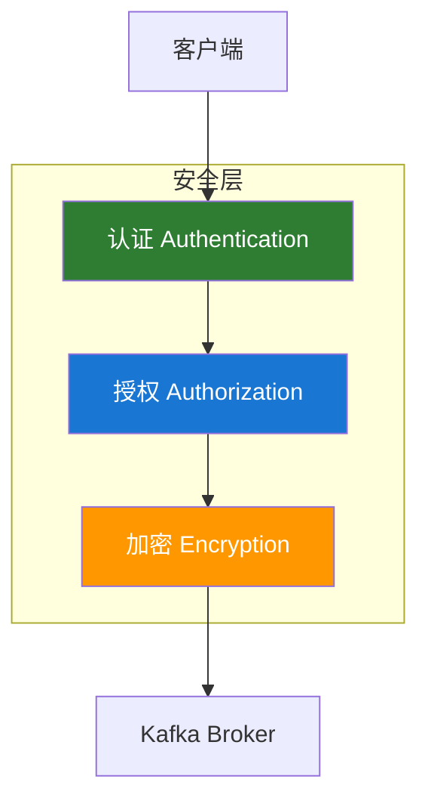

# Kafka 安全配置

## 安全概述

Kafka 提供多层安全机制保护数据和系统：



| 安全层   | 作用             | 支持方式  |
| -------- | ---------------- | --------- |
| **认证** | 验证客户端身份   | SSL、SASL |
| **授权** | 控制资源访问权限 | ACL       |
| **加密** | 保护数据传输     | SSL/TLS   |

## SSL/TLS 加密

### 生成证书

```bash
#!/bin/bash
# 1. 生成 CA 证书
openssl req -new -x509 -keyout ca-key -out ca-cert -days 365 \
  -subj "/CN=Kafka-CA" -passout pass:ca-password

# 2. 为每个 Broker 生成密钥库
keytool -keystore kafka.server.keystore.jks -alias localhost \
  -keyalg RSA -validity 365 -genkey -storepass password \
  -dname "CN=kafka-broker1"

# 3. 生成证书签名请求
keytool -keystore kafka.server.keystore.jks -alias localhost \
  -certreq -file cert-file -storepass password

# 4. 用 CA 签名
openssl x509 -req -CA ca-cert -CAkey ca-key -in cert-file \
  -out cert-signed -days 365 -CAcreateserial -passin pass:ca-password

# 5. 导入 CA 证书
keytool -keystore kafka.server.keystore.jks -alias CARoot \
  -import -file ca-cert -storepass password -noprompt

# 6. 导入签名证书
keytool -keystore kafka.server.keystore.jks -alias localhost \
  -import -file cert-signed -storepass password

# 7. 创建信任库
keytool -keystore kafka.server.truststore.jks -alias CARoot \
  -import -file ca-cert -storepass password -noprompt
```

### Broker SSL 配置

```properties
# server.properties
listeners=SSL://kafka-broker1:9093
advertised.listeners=SSL://kafka-broker1:9093

# SSL 配置
ssl.keystore.location=/var/ssl/kafka.server.keystore.jks
ssl.keystore.password=password
ssl.key.password=password
ssl.truststore.location=/var/ssl/kafka.server.truststore.jks
ssl.truststore.password=password

# 客户端认证（可选）
ssl.client.auth=required

# 推荐的协议和密码套件
ssl.enabled.protocols=TLSv1.2,TLSv1.3
ssl.cipher.suites=TLS_AES_256_GCM_SHA384,TLS_ECDHE_RSA_WITH_AES_256_GCM_SHA384
```

### 客户端 SSL 配置

```java
Properties props = new Properties();
props.put("bootstrap.servers", "kafka-broker1:9093");
props.put("security.protocol", "SSL");

// SSL 配置
props.put("ssl.truststore.location", "/var/ssl/client.truststore.jks");
props.put("ssl.truststore.password", "password");

// 双向认证时需要
props.put("ssl.keystore.location", "/var/ssl/client.keystore.jks");
props.put("ssl.keystore.password", "password");
props.put("ssl.key.password", "password");
```

## SASL 认证

### 认证机制对比

| 机制            | 说明                | 适用场景 |
| --------------- | ------------------- | -------- |
| **PLAIN**       | 用户名/密码（明文） | 开发环境 |
| **SCRAM**       | 加盐挑战响应        | 生产环境 |
| **GSSAPI**      | Kerberos            | 企业环境 |
| **OAUTHBEARER** | OAuth 2.0           | 云原生   |

### SASL/PLAIN 配置

**Broker 配置：**

```properties
# server.properties
listeners=SASL_PLAINTEXT://kafka-broker1:9092
advertised.listeners=SASL_PLAINTEXT://kafka-broker1:9092
security.inter.broker.protocol=SASL_PLAINTEXT

# SASL 配置
sasl.enabled.mechanisms=PLAIN
sasl.mechanism.inter.broker.protocol=PLAIN
```

**Broker JAAS 配置：**

```properties
# kafka_server_jaas.conf
KafkaServer {
    org.apache.kafka.common.security.plain.PlainLoginModule required
    username="admin"
    password="admin-secret"
    user_admin="admin-secret"
    user_producer="producer-secret"
    user_consumer="consumer-secret";
};
```

启动 Broker 时指定 JAAS 配置：

```bash
export KAFKA_OPTS="-Djava.security.auth.login.config=/etc/kafka/kafka_server_jaas.conf"
bin/kafka-server-start.sh config/server.properties
```

**客户端配置：**

```java
Properties props = new Properties();
props.put("bootstrap.servers", "kafka-broker1:9092");
props.put("security.protocol", "SASL_PLAINTEXT");
props.put("sasl.mechanism", "PLAIN");
props.put("sasl.jaas.config",
    "org.apache.kafka.common.security.plain.PlainLoginModule required " +
    "username=\"producer\" password=\"producer-secret\";");
```

### SASL/SCRAM 配置

**创建 SCRAM 用户：**

```bash
# 创建管理员用户
kafka-configs.sh --bootstrap-server localhost:9092 \
  --alter --add-config 'SCRAM-SHA-256=[password=admin-secret]' \
  --entity-type users --entity-name admin

# 创建普通用户
kafka-configs.sh --bootstrap-server localhost:9092 \
  --alter --add-config 'SCRAM-SHA-256=[password=user-secret]' \
  --entity-type users --entity-name producer
```

**Broker 配置：**

```properties
# server.properties
listeners=SASL_SSL://kafka-broker1:9093
security.inter.broker.protocol=SASL_SSL
sasl.enabled.mechanisms=SCRAM-SHA-256
sasl.mechanism.inter.broker.protocol=SCRAM-SHA-256
```

**客户端配置：**

```java
props.put("security.protocol", "SASL_SSL");
props.put("sasl.mechanism", "SCRAM-SHA-256");
props.put("sasl.jaas.config",
    "org.apache.kafka.common.security.scram.ScramLoginModule required " +
    "username=\"producer\" password=\"user-secret\";");
```

## ACL 权限控制

### 启用 ACL

```properties
# server.properties
authorizer.class.name=kafka.security.authorizer.AclAuthorizer
super.users=User:admin
allow.everyone.if.no.acl.found=false
```

### ACL 操作命令

```bash
# 查看所有 ACL
kafka-acls.sh --bootstrap-server localhost:9092 --list

# 授予生产者写权限
kafka-acls.sh --bootstrap-server localhost:9092 \
  --add --allow-principal User:producer \
  --operation Write --topic my-topic

# 授予消费者读权限
kafka-acls.sh --bootstrap-server localhost:9092 \
  --add --allow-principal User:consumer \
  --operation Read --topic my-topic \
  --group my-group

# 授予全部权限
kafka-acls.sh --bootstrap-server localhost:9092 \
  --add --allow-principal User:admin \
  --operation All --topic '*' --group '*'

# 删除 ACL
kafka-acls.sh --bootstrap-server localhost:9092 \
  --remove --allow-principal User:producer \
  --operation Write --topic my-topic
```

### ACL 权限类型

| 权限              | 说明     | 适用资源              |
| ----------------- | -------- | --------------------- |
| **Read**          | 读取     | Topic、Group          |
| **Write**         | 写入     | Topic                 |
| **Create**        | 创建     | Topic、Cluster        |
| **Delete**        | 删除     | Topic                 |
| **Alter**         | 修改     | Topic、Cluster        |
| **Describe**      | 查看     | Topic、Group、Cluster |
| **ClusterAction** | 集群操作 | Cluster               |
| **All**           | 全部权限 | 所有资源              |

### 常用 ACL 配置示例

```bash
# 生产者权限
kafka-acls.sh --bootstrap-server localhost:9092 \
  --add --allow-principal User:producer \
  --operation Write --operation Describe \
  --topic 'orders-*' --resource-pattern-type prefixed

# 消费者权限
kafka-acls.sh --bootstrap-server localhost:9092 \
  --add --allow-principal User:consumer \
  --operation Read --operation Describe \
  --topic 'orders-*' --resource-pattern-type prefixed

kafka-acls.sh --bootstrap-server localhost:9092 \
  --add --allow-principal User:consumer \
  --operation Read \
  --group 'order-consumer-*' --resource-pattern-type prefixed

# Kafka Connect 权限
kafka-acls.sh --bootstrap-server localhost:9092 \
  --add --allow-principal User:connect \
  --operation Read --operation Write --operation Create \
  --topic '*' --group '*'
```

## 安全最佳实践

### 网络安全

1. **使用专用网络**：Kafka 集群部署在内网
2. **防火墙规则**：仅开放必要端口
3. **TLS 加密**：生产环境必须启用
4. **最小权限原则**：仅授予必要权限

### 认证配置

```properties
# 推荐的安全配置
listeners=SASL_SSL://0.0.0.0:9093
security.inter.broker.protocol=SASL_SSL
sasl.mechanism.inter.broker.protocol=SCRAM-SHA-256
sasl.enabled.mechanisms=SCRAM-SHA-256

# SSL 配置
ssl.client.auth=required
ssl.enabled.protocols=TLSv1.2,TLSv1.3

# 禁用不安全选项
allow.everyone.if.no.acl.found=false
auto.create.topics.enable=false
```

### 密码管理

```java
// 使用环境变量或密钥管理服务
String password = System.getenv("KAFKA_SSL_PASSWORD");
props.put("ssl.keystore.password", password);

// 或使用 Secret Manager
// AWS Secrets Manager、HashiCorp Vault 等
```

### 审计日志

```properties
# 启用审计日志
log4j.logger.kafka.authorizer.logger=INFO, authorizerAppender
log4j.additivity.kafka.authorizer.logger=false

log4j.appender.authorizerAppender=org.apache.log4j.DailyRollingFileAppender
log4j.appender.authorizerAppender.File=/var/log/kafka/kafka-authorizer.log
log4j.appender.authorizerAppender.layout=org.apache.log4j.PatternLayout
log4j.appender.authorizerAppender.layout.ConversionPattern=[%d] %p %m%n
```

## 安全配置检查清单

### 生产环境必备

- [ ] 启用 SASL 认证
- [ ] 启用 TLS 加密
- [ ] 配置 ACL 权限控制
- [ ] 禁用匿名访问
- [ ] Broker 间通信加密
- [ ] 使用强密码

### 增强安全

- [ ] 启用客户端证书认证（双向 TLS）
- [ ] 定期轮换证书和密码
- [ ] 启用审计日志
- [ ] 配置网络隔离
- [ ] 监控异常访问

## 常见问题

### Q: SSL 握手失败怎么办？

**A:** 排查步骤：

1. 检查证书是否过期
2. 确认 truststore 包含正确的 CA 证书
3. 检查主机名是否匹配证书 CN
4. 确认 TLS 协议版本兼容

```bash
# 测试 SSL 连接
openssl s_client -connect kafka-broker1:9093 -CAfile ca-cert
```

### Q: SASL 认证失败怎么办？

**A:** 排查步骤：

1. 检查 JAAS 配置文件路径
2. 确认用户名密码正确
3. 检查 SASL 机制配置一致
4. 查看 Broker 日志

```bash
# 查看认证错误
grep -i "authentication" /var/log/kafka/server.log
```

## 参考资料

- [Kafka 安全文档](https://kafka.apache.org/documentation/#security)
- [SSL 配置指南](https://kafka.apache.org/documentation/#security_ssl)
- [SASL 配置指南](https://kafka.apache.org/documentation/#security_sasl)
