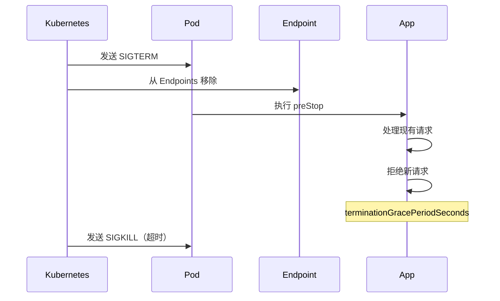

# Kubernetes 最佳实践

## 资源配置

### 设置资源请求和限制

```yaml
spec:
  containers:
    - name: app
      resources:
        # 请求：调度时保证的资源
        requests:
          memory: "256Mi"
          cpu: "250m"
        # 限制：运行时的资源上限
        limits:
          memory: "512Mi"
          cpu: "500m"
```

**最佳实践**：

| 建议                   | 说明                       |
| ---------------------- | -------------------------- |
| 始终设置 requests      | 确保调度器能够正确分配资源 |
| limits ≤ 2x requests   | 避免过度承诺导致节点压力   |
| 内存 limits = requests | 防止 OOMKilled，提高稳定性 |
| CPU 可适当放宽 limits  | CPU 是可压缩资源           |

### 资源配额

```yaml
apiVersion: v1
kind: ResourceQuota
metadata:
  name: team-quota
  namespace: team-a
spec:
  hard:
    requests.cpu: "10"
    requests.memory: "20Gi"
    limits.cpu: "20"
    limits.memory: "40Gi"
    pods: "50"
    services: "10"
    secrets: "20"
    configmaps: "20"
```

### LimitRange

```yaml
apiVersion: v1
kind: LimitRange
metadata:
  name: default-limits
  namespace: production
spec:
  limits:
    - default: # 默认 limits
        cpu: "500m"
        memory: "512Mi"
      defaultRequest: # 默认 requests
        cpu: "100m"
        memory: "128Mi"
      max: # 最大值
        cpu: "2"
        memory: "4Gi"
      min: # 最小值
        cpu: "50m"
        memory: "64Mi"
      type: Container
```

## 健康检查

### 三种探针完整配置

```yaml
spec:
  containers:
    - name: app
      image: my-app:1.0
      # 启动探针：判断应用是否启动完成
      startupProbe:
        httpGet:
          path: /healthz
          port: 8080
        initialDelaySeconds: 0
        periodSeconds: 5
        failureThreshold: 30 # 允许启动时间：5s × 30 = 150s
        successThreshold: 1

      # 存活探针：判断容器是否需要重启
      livenessProbe:
        httpGet:
          path: /healthz
          port: 8080
        initialDelaySeconds: 0 # startupProbe 成功后立即开始
        periodSeconds: 10
        timeoutSeconds: 5
        failureThreshold: 3

      # 就绪探针：判断是否可以接收流量
      readinessProbe:
        httpGet:
          path: /ready
          port: 8080
        initialDelaySeconds: 0
        periodSeconds: 5
        timeoutSeconds: 3
        failureThreshold: 3
        successThreshold: 1
```

**最佳实践**：

1. **始终配置 readinessProbe**：确保只有就绪的 Pod 接收流量
2. **慢启动应用使用 startupProbe**：避免 livenessProbe 误杀启动中的容器
3. **livenessProbe 阈值要宽松**：避免因临时问题导致不必要的重启
4. **health 和 ready 端点分离**：健康检查和就绪检查逻辑不同

## 高可用设计

### Pod 反亲和性

```yaml
spec:
  affinity:
    podAntiAffinity:
      # 强制分散到不同节点
      requiredDuringSchedulingIgnoredDuringExecution:
        - labelSelector:
            matchLabels:
              app: my-app
          topologyKey: kubernetes.io/hostname
      # 尽量分散到不同可用区
      preferredDuringSchedulingIgnoredDuringExecution:
        - weight: 100
          podAffinityTerm:
            labelSelector:
              matchLabels:
                app: my-app
            topologyKey: topology.kubernetes.io/zone
```

### Pod 中断预算

```yaml
apiVersion: policy/v1
kind: PodDisruptionBudget
metadata:
  name: my-app-pdb
spec:
  # 至少保持 2 个可用
  minAvailable: 2
  # 或者：最多允许 1 个不可用
  # maxUnavailable: 1
  selector:
    matchLabels:
      app: my-app
```

### 拓扑分布约束

```yaml
spec:
  topologySpreadConstraints:
    # 跨可用区分布
    - maxSkew: 1
      topologyKey: topology.kubernetes.io/zone
      whenUnsatisfiable: DoNotSchedule
      labelSelector:
        matchLabels:
          app: my-app
    # 跨节点分布
    - maxSkew: 2
      topologyKey: kubernetes.io/hostname
      whenUnsatisfiable: ScheduleAnyway
      labelSelector:
        matchLabels:
          app: my-app
```

## 安全最佳实践

### Pod 安全上下文

```yaml
spec:
  securityContext:
    runAsNonRoot: true
    runAsUser: 1000
    runAsGroup: 1000
    fsGroup: 1000
    seccompProfile:
      type: RuntimeDefault
  containers:
    - name: app
      securityContext:
        allowPrivilegeEscalation: false
        readOnlyRootFilesystem: true
        capabilities:
          drop:
            - ALL
```

### 网络策略隔离

```yaml
# 默认拒绝所有入站流量
apiVersion: networking.k8s.io/v1
kind: NetworkPolicy
metadata:
  name: default-deny-ingress
  namespace: production
spec:
  podSelector: {}
  policyTypes:
    - Ingress
---
# 只允许同命名空间访问
apiVersion: networking.k8s.io/v1
kind: NetworkPolicy
metadata:
  name: allow-same-namespace
  namespace: production
spec:
  podSelector: {}
  policyTypes:
    - Ingress
  ingress:
    - from:
        - podSelector: {}
```

### Secret 管理

```yaml
# 使用外部 Secret 管理器（如 External Secrets Operator）
apiVersion: external-secrets.io/v1beta1
kind: ExternalSecret
metadata:
  name: app-secrets
spec:
  refreshInterval: 1h
  secretStoreRef:
    kind: ClusterSecretStore
    name: vault
  target:
    name: app-secrets
    creationPolicy: Owner
  data:
    - secretKey: database-password
      remoteRef:
        key: production/database
        property: password
```

## 优雅终止

### 配置优雅终止

```yaml
spec:
  terminationGracePeriodSeconds: 60 # 给予充足的终止时间
  containers:
    - name: app
      lifecycle:
        preStop:
          exec:
            command:
              - /bin/sh
              - -c
              - |
                # 通知应用停止接收新请求
                touch /tmp/shutdown
                # 等待现有请求处理完成
                sleep 15
```

**终止流程**：



## 标签与注解

### 标签规范

```yaml
metadata:
  labels:
    # 推荐标签（Kubernetes 官方）
    app.kubernetes.io/name: my-app
    app.kubernetes.io/instance: my-app-prod
    app.kubernetes.io/version: "1.0.0"
    app.kubernetes.io/component: frontend
    app.kubernetes.io/part-of: my-platform
    app.kubernetes.io/managed-by: helm
    # 自定义标签
    environment: production
    team: platform
    cost-center: engineering
```

### 注解最佳实践

```yaml
metadata:
  annotations:
    # 文档链接
    docs.example.com/runbook: "https://wiki.example.com/runbooks/my-app"
    # 变更记录
    kubernetes.io/change-cause: "Update to version 1.0.0"
    # 告警配置
    prometheus.io/scrape: "true"
    prometheus.io/port: "9090"
    prometheus.io/path: "/metrics"
```

## 日志与监控

### 结构化日志

```yaml
spec:
  containers:
    - name: app
      env:
        - name: LOG_FORMAT
          value: "json"
        - name: LOG_LEVEL
          value: "info"
```

**日志格式建议**：

```json
{
  "timestamp": "2024-01-15T10:30:00Z",
  "level": "info",
  "message": "Request processed",
  "service": "my-app",
  "trace_id": "abc123",
  "duration_ms": 150
}
```

### 监控指标暴露

```yaml
spec:
  containers:
    - name: app
      ports:
        - name: metrics
          containerPort: 9090
          protocol: TCP
---
apiVersion: v1
kind: Service
metadata:
  name: my-app
  labels:
    app: my-app
  annotations:
    prometheus.io/scrape: "true"
    prometheus.io/port: "9090"
spec:
  ports:
    - name: http
      port: 80
    - name: metrics
      port: 9090
```

## CI/CD 集成

### GitOps 工作流


### 镜像标签策略

| 策略       | 示例         | 适用场景  |
| ---------- | ------------ | --------- |
| Git SHA    | `app:abc123` | 精确追溯  |
| 语义化版本 | `app:1.2.3`  | 正式发布  |
| 分支名     | `app:main`   | 开发环境  |
| latest     | `app:latest` | ❌ 不推荐 |

## 成本优化

### 资源优化

```yaml
# 使用 VPA 自动调整资源
apiVersion: autoscaling.k8s.io/v1
kind: VerticalPodAutoscaler
metadata:
  name: my-app-vpa
spec:
  targetRef:
    apiVersion: apps/v1
    kind: Deployment
    name: my-app
  updatePolicy:
    updateMode: "Auto"
  resourcePolicy:
    containerPolicies:
      - containerName: "*"
        minAllowed:
          cpu: "100m"
          memory: "128Mi"
        maxAllowed:
          cpu: "2"
          memory: "4Gi"
```

### 节点池策略

| 节点类型    | 用途               | 成本 |
| ----------- | ------------------ | ---- |
| 按需节点    | 关键服务           | 高   |
| Spot/抢占式 | 批处理、可中断任务 | 低   |
| ARM 节点    | 适配应用           | 中   |

```yaml
# 使用 Spot 节点
spec:
  tolerations:
    - key: "kubernetes.azure.com/scalesetpriority"
      operator: "Equal"
      value: "spot"
      effect: "NoSchedule"
  affinity:
    nodeAffinity:
      preferredDuringSchedulingIgnoredDuringExecution:
        - weight: 1
          preference:
            matchExpressions:
              - key: "kubernetes.azure.com/scalesetpriority"
                operator: In
                values:
                  - "spot"
```

## 快速检查清单

### 生产就绪检查

- [ ] 设置了资源请求和限制
- [ ] 配置了健康检查（liveness/readiness）
- [ ] 副本数 ≥ 2
- [ ] 配置了 PodDisruptionBudget
- [ ] 使用了 Pod 反亲和性
- [ ] 容器以非 root 用户运行
- [ ] 配置了优雅终止
- [ ] 使用了标准化标签
- [ ] 暴露了监控指标
- [ ] 配置了日志收集
