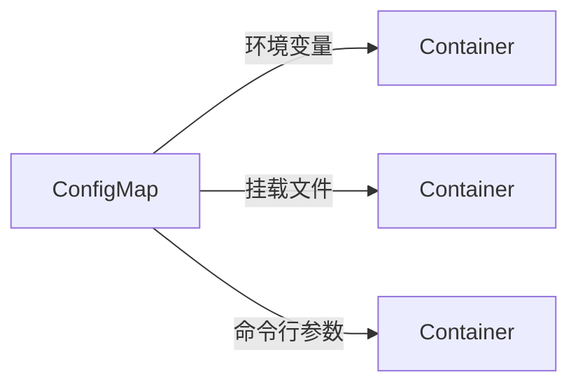

# ConfigMap 与 Secret

## ConfigMap 概述

ConfigMap 用于存储非机密的配置数据，以键值对形式保存。



## 创建 ConfigMap

### 从字面量创建

```bash
# 创建单个键值对
kubectl create configmap my-config --from-literal=key1=value1

# 创建多个键值对
kubectl create configmap my-config \
  --from-literal=database.host=mysql \
  --from-literal=database.port=3306
```

### 从文件创建

```bash
# 从单个文件创建
kubectl create configmap my-config --from-file=config.properties

# 指定键名
kubectl create configmap my-config --from-file=mykey=config.properties

# 从目录创建
kubectl create configmap my-config --from-file=./configs/
```

### 从 YAML 创建

```yaml
apiVersion: v1
kind: ConfigMap
metadata:
  name: app-config
  namespace: default
data:
  # 简单键值对
  database.host: "mysql-service"
  database.port: "3306"
  log.level: "INFO"

  # 多行配置文件
  application.properties: |
    server.port=8080
    spring.datasource.url=jdbc:mysql://mysql:3306/mydb
    spring.datasource.username=root
    logging.level.root=INFO

  # JSON 配置
  config.json: |
    {
      "database": {
        "host": "mysql-service",
        "port": 3306
      },
      "cache": {
        "enabled": true,
        "ttl": 3600
      }
    }

# 二进制数据使用 binaryData
binaryData:
  logo.png: <base64-encoded-data>
```

## 使用 ConfigMap

### 作为环境变量

```yaml
apiVersion: v1
kind: Pod
metadata:
  name: app
spec:
  containers:
    - name: app
      image: my-app:1.0
      env:
        # 单个键
        - name: DB_HOST
          valueFrom:
            configMapKeyRef:
              name: app-config
              key: database.host
        - name: DB_PORT
          valueFrom:
            configMapKeyRef:
              name: app-config
              key: database.port
              optional: true # 可选，configMap 不存在不报错

      # 导入所有键（带前缀）
      envFrom:
        - configMapRef:
            name: app-config
          prefix: CONFIG_ # 前缀
```

### 作为文件挂载

```yaml
apiVersion: v1
kind: Pod
metadata:
  name: app
spec:
  containers:
    - name: app
      image: my-app:1.0
      volumeMounts:
        - name: config-volume
          mountPath: /etc/config
          readOnly: true

  volumes:
    - name: config-volume
      configMap:
        name: app-config
        # 可选：只挂载部分键
        items:
          - key: application.properties
            path: app.properties # 自定义文件名
          - key: config.json
            path: config.json
            mode: 0644 # 自定义权限
```

### 挂载单个文件

使用 `subPath` 避免覆盖目录中的其他文件。

```yaml
volumeMounts:
  - name: config-volume
    mountPath: /etc/app/application.properties
    subPath: application.properties
```

## Secret 概述

Secret 用于存储敏感数据，如密码、令牌、密钥等。

### Secret 类型

| 类型                                | 说明                |
| ----------------------------------- | ------------------- |
| Opaque                              | 通用 Secret（默认） |
| kubernetes.io/tls                   | TLS 证书            |
| kubernetes.io/dockerconfigjson      | Docker 仓库凭证     |
| kubernetes.io/basic-auth            | 基本认证凭证        |
| kubernetes.io/ssh-auth              | SSH 认证凭证        |
| kubernetes.io/service-account-token | ServiceAccount 令牌 |

## 创建 Secret

### 从字面量创建

```bash
# 创建通用 Secret
kubectl create secret generic my-secret \
  --from-literal=username=admin \
  --from-literal=password=s3cr3t

# 创建 Docker 仓库凭证
kubectl create secret docker-registry my-registry \
  --docker-server=https://registry.example.com \
  --docker-username=user \
  --docker-password=password \
  --docker-email=user@example.com

# 创建 TLS 证书
kubectl create secret tls my-tls \
  --cert=path/to/tls.crt \
  --key=path/to/tls.key
```

### 从文件创建

```bash
# 从文件创建
kubectl create secret generic my-secret --from-file=ssh-privatekey=~/.ssh/id_rsa

# 从目录创建
kubectl create secret generic my-secret --from-file=./secrets/
```

### 从 YAML 创建

```yaml
apiVersion: v1
kind: Secret
metadata:
  name: db-secret
type: Opaque
# data 中的值必须是 Base64 编码
data:
  username: YWRtaW4= # echo -n 'admin' | base64
  password: czNjcjN0 # echo -n 's3cr3t' | base64

# 或使用 stringData（会自动编码）
stringData:
  api-key: my-api-key-12345
  config.yaml: |
    database:
      password: secret123
```

### TLS Secret

```yaml
apiVersion: v1
kind: Secret
metadata:
  name: tls-secret
type: kubernetes.io/tls
data:
  tls.crt: <base64-encoded-cert>
  tls.key: <base64-encoded-key>
```

### Docker Registry Secret

```yaml
apiVersion: v1
kind: Secret
metadata:
  name: registry-secret
type: kubernetes.io/dockerconfigjson
data:
  .dockerconfigjson: <base64-encoded-docker-config>
```

## 使用 Secret

### 作为环境变量

```yaml
apiVersion: v1
kind: Pod
metadata:
  name: app
spec:
  containers:
    - name: app
      image: my-app:1.0
      env:
        - name: DB_USERNAME
          valueFrom:
            secretKeyRef:
              name: db-secret
              key: username
        - name: DB_PASSWORD
          valueFrom:
            secretKeyRef:
              name: db-secret
              key: password

      # 导入所有键
      envFrom:
        - secretRef:
            name: db-secret
```

### 作为文件挂载

```yaml
apiVersion: v1
kind: Pod
metadata:
  name: app
spec:
  containers:
    - name: app
      image: my-app:1.0
      volumeMounts:
        - name: secret-volume
          mountPath: /etc/secrets
          readOnly: true

  volumes:
    - name: secret-volume
      secret:
        secretName: db-secret
        defaultMode: 0400 # 设置权限
        items:
          - key: password
            path: db-password
```

### 拉取私有镜像

```yaml
apiVersion: v1
kind: Pod
metadata:
  name: app
spec:
  imagePullSecrets:
    - name: registry-secret
  containers:
    - name: app
      image: registry.example.com/my-app:1.0
```

## 配置更新

### ConfigMap 更新

```bash
# 编辑 ConfigMap
kubectl edit configmap my-config

# 或通过 apply 更新
kubectl apply -f configmap.yaml
```

**更新行为**：

- 卷挂载：自动更新（有一定延迟）
- 环境变量：需要重启 Pod
- `subPath` 挂载：不会自动更新

### 不可变 ConfigMap/Secret

```yaml
apiVersion: v1
kind: ConfigMap
metadata:
  name: immutable-config
immutable: true # 不可修改
data:
  key: value
```

好处：

- 防止意外修改
- 降低 API Server 负载
- 提高集群性能

## 加密 Secret

### 启用加密

```yaml
# /etc/kubernetes/encryption-config.yaml
apiVersion: apiserver.config.k8s.io/v1
kind: EncryptionConfiguration
resources:
  - resources:
      - secrets
    providers:
      - aescbc:
          keys:
            - name: key1
              secret: <base64-encoded-key>
      - identity: {}
```

### 外部密钥管理

推荐使用外部密钥管理工具：

- **HashiCorp Vault**
- **AWS Secrets Manager**
- **Azure Key Vault**
- **Google Secret Manager**
- **External Secrets Operator**

```yaml
# External Secrets Operator 示例
apiVersion: external-secrets.io/v1beta1
kind: ExternalSecret
metadata:
  name: my-secret
spec:
  refreshInterval: 1h
  secretStoreRef:
    name: vault-backend
    kind: SecretStore
  target:
    name: my-secret
  data:
    - secretKey: password
      remoteRef:
        key: secret/data/myapp
        property: password
```

## 常用操作

```bash
# 查看 ConfigMap
kubectl get configmaps
kubectl describe configmap my-config
kubectl get configmap my-config -o yaml

# 查看 Secret
kubectl get secrets
kubectl describe secret my-secret
kubectl get secret my-secret -o yaml

# 解码 Secret
kubectl get secret my-secret -o jsonpath='{.data.password}' | base64 -d

# 删除
kubectl delete configmap my-config
kubectl delete secret my-secret
```

## 最佳实践

1. **不要在 Secret 中存储明文**：虽然 Secret 数据是 Base64 编码，但不是加密

2. **使用外部密钥管理**：生产环境推荐使用 Vault 等工具

3. **限制访问权限**：使用 RBAC 控制 ConfigMap/Secret 访问

4. **使用不可变配置**：对于不会更改的配置，设置 `immutable: true`

5. **分离配置和代码**：配置应该与应用镜像分离

6. **使用命名约定**：如 `app-name-config`、`app-name-secret`
