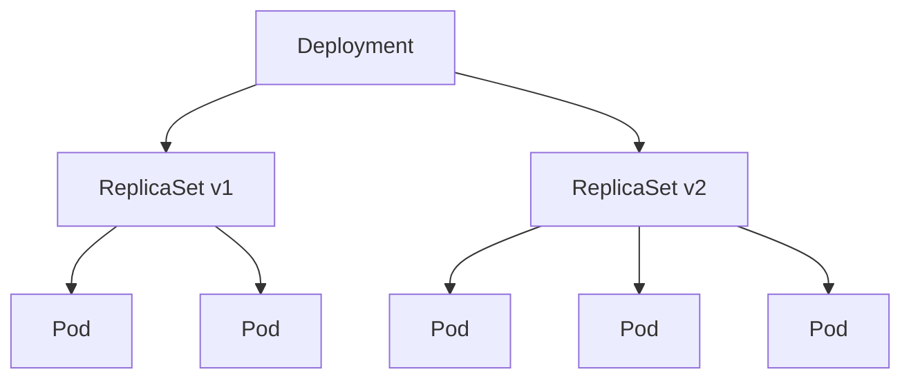

# Deployment 与 ReplicaSet

## Deployment 概述

Deployment 是管理无状态应用的推荐方式，提供声明式更新、滚动发布、回滚等功能。



## 基本 Deployment

```yaml
apiVersion: apps/v1
kind: Deployment
metadata:
  name: nginx-deployment
  labels:
    app: nginx
spec:
  replicas: 3
  selector:
    matchLabels:
      app: nginx
  template:
    metadata:
      labels:
        app: nginx
    spec:
      containers:
        - name: nginx
          image: nginx:1.24
          ports:
            - containerPort: 80
          resources:
            requests:
              memory: "64Mi"
              cpu: "250m"
            limits:
              memory: "128Mi"
              cpu: "500m"
```

## 完整配置示例

```yaml
apiVersion: apps/v1
kind: Deployment
metadata:
  name: web-app
  namespace: production
  labels:
    app: web
    version: v1.0.0
  annotations:
    kubernetes.io/change-cause: "Update to version 1.0.0"
spec:
  replicas: 5
  revisionHistoryLimit: 10 # 保留的历史版本数
  progressDeadlineSeconds: 600 # 部署超时时间

  selector:
    matchLabels:
      app: web

  strategy:
    type: RollingUpdate
    rollingUpdate:
      maxSurge: 25% # 最大额外 Pod 数
      maxUnavailable: 25% # 最大不可用 Pod 数

  template:
    metadata:
      labels:
        app: web
        version: v1.0.0
    spec:
      containers:
        - name: web
          image: my-web-app:1.0.0
          ports:
            - name: http
              containerPort: 8080

          env:
            - name: APP_ENV
              value: "production"

          resources:
            requests:
              memory: "256Mi"
              cpu: "500m"
            limits:
              memory: "512Mi"
              cpu: "1000m"

          livenessProbe:
            httpGet:
              path: /healthz
              port: 8080
            initialDelaySeconds: 30
            periodSeconds: 10

          readinessProbe:
            httpGet:
              path: /ready
              port: 8080
            initialDelaySeconds: 5
            periodSeconds: 5

      # 优雅终止时间
      terminationGracePeriodSeconds: 60
```

## 更新策略

### RollingUpdate（滚动更新）

```yaml
spec:
  strategy:
    type: RollingUpdate
    rollingUpdate:
      maxSurge: 1 # 额外创建 1 个 Pod
      maxUnavailable: 0 # 不允许不可用
```

**更新过程**：

1. 创建新的 ReplicaSet
2. 逐步增加新 ReplicaSet 的副本
3. 逐步减少旧 ReplicaSet 的副本
4. 直到全部更新完成

### Recreate（重建）

```yaml
spec:
  strategy:
    type: Recreate
```

**更新过程**：

1. 删除所有旧 Pod
2. 创建所有新 Pod

适用于：不允许多版本同时运行的应用

## Deployment 操作

### 创建与查看

```bash
# 创建 Deployment
kubectl apply -f deployment.yaml

# 快速创建
kubectl create deployment nginx --image=nginx:1.24 --replicas=3

# 查看 Deployment
kubectl get deployments
kubectl get deploy nginx -o wide

# 查看详情
kubectl describe deployment nginx

# 查看关联的 ReplicaSet
kubectl get rs -l app=nginx

# 查看关联的 Pod
kubectl get pods -l app=nginx
```

### 扩缩容

```bash
# 扩缩容
kubectl scale deployment nginx --replicas=5

# 自动扩缩容
kubectl autoscale deployment nginx --min=2 --max=10 --cpu-percent=80

# 查看 HPA
kubectl get hpa
```

### 更新镜像

```bash
# 更新镜像
kubectl set image deployment/nginx nginx=nginx:1.25

# 更新多个容器
kubectl set image deployment/web web=app:v2 sidecar=sidecar:v2

# 编辑 Deployment
kubectl edit deployment nginx

# 记录更新原因
kubectl annotate deployment nginx kubernetes.io/change-cause="Update to 1.25"
```

### 查看更新状态

```bash
# 查看滚动更新状态
kubectl rollout status deployment/nginx

# 查看更新历史
kubectl rollout history deployment/nginx

# 查看特定版本
kubectl rollout history deployment/nginx --revision=2
```

### 回滚

```bash
# 回滚到上一版本
kubectl rollout undo deployment/nginx

# 回滚到指定版本
kubectl rollout undo deployment/nginx --to-revision=2

# 暂停更新
kubectl rollout pause deployment/nginx

# 恢复更新
kubectl rollout resume deployment/nginx

# 重启 Deployment
kubectl rollout restart deployment/nginx
```

## ReplicaSet

ReplicaSet 确保指定数量的 Pod 副本运行。通常由 Deployment 自动管理。

```yaml
apiVersion: apps/v1
kind: ReplicaSet
metadata:
  name: nginx-rs
  labels:
    app: nginx
spec:
  replicas: 3
  selector:
    matchLabels:
      app: nginx
  template:
    metadata:
      labels:
        app: nginx
    spec:
      containers:
        - name: nginx
          image: nginx:1.24
```

### 标签选择器

```yaml
spec:
  selector:
    # 等值选择
    matchLabels:
      app: nginx
      env: production

    # 集合选择
    matchExpressions:
      - key: tier
        operator: In
        values:
          - frontend
          - backend
      - key: environment
        operator: NotIn
        values:
          - dev
```

操作符：

- `In`：标签值在列表中
- `NotIn`：标签值不在列表中
- `Exists`：标签存在
- `DoesNotExist`：标签不存在

## 蓝绿部署

```yaml
# Blue Deployment
apiVersion: apps/v1
kind: Deployment
metadata:
  name: app-blue
spec:
  replicas: 3
  selector:
    matchLabels:
      app: myapp
      version: blue
  template:
    metadata:
      labels:
        app: myapp
        version: blue
    spec:
      containers:
        - name: app
          image: myapp:1.0

---
# Green Deployment
apiVersion: apps/v1
kind: Deployment
metadata:
  name: app-green
spec:
  replicas: 3
  selector:
    matchLabels:
      app: myapp
      version: green
  template:
    metadata:
      labels:
        app: myapp
        version: green
    spec:
      containers:
        - name: app
          image: myapp:2.0

---
# Service（切换 selector 实现蓝绿切换）
apiVersion: v1
kind: Service
metadata:
  name: app-service
spec:
  selector:
    app: myapp
    version: blue # 切换为 green 实现蓝绿切换
  ports:
    - port: 80
      targetPort: 8080
```

## 金丝雀发布

```yaml
# 稳定版本
apiVersion: apps/v1
kind: Deployment
metadata:
  name: app-stable
spec:
  replicas: 9 # 90% 流量
  selector:
    matchLabels:
      app: myapp
      track: stable
  template:
    metadata:
      labels:
        app: myapp
        track: stable
    spec:
      containers:
        - name: app
          image: myapp:1.0

---
# 金丝雀版本
apiVersion: apps/v1
kind: Deployment
metadata:
  name: app-canary
spec:
  replicas: 1 # 10% 流量
  selector:
    matchLabels:
      app: myapp
      track: canary
  template:
    metadata:
      labels:
        app: myapp
        track: canary
    spec:
      containers:
        - name: app
          image: myapp:2.0

---
# Service（同时选择两个版本）
apiVersion: v1
kind: Service
metadata:
  name: app-service
spec:
  selector:
    app: myapp # 不包含 track 标签，同时选择两个版本
  ports:
    - port: 80
      targetPort: 8080
```

## 最佳实践

### 1. 设置资源限制

```yaml
resources:
  requests:
    memory: "128Mi"
    cpu: "100m"
  limits:
    memory: "256Mi"
    cpu: "200m"
```

### 2. 配置健康检查

```yaml
livenessProbe:
  httpGet:
    path: /healthz
    port: 8080
  initialDelaySeconds: 30
  periodSeconds: 10

readinessProbe:
  httpGet:
    path: /ready
    port: 8080
  initialDelaySeconds: 5
  periodSeconds: 5
```

### 3. 使用 Pod Disruption Budget

```yaml
apiVersion: policy/v1
kind: PodDisruptionBudget
metadata:
  name: app-pdb
spec:
  minAvailable: 2 # 或 maxUnavailable: 1
  selector:
    matchLabels:
      app: myapp
```

### 4. 配置反亲和性

```yaml
spec:
  affinity:
    podAntiAffinity:
      preferredDuringSchedulingIgnoredDuringExecution:
        - weight: 100
          podAffinityTerm:
            labelSelector:
              matchLabels:
                app: myapp
            topologyKey: kubernetes.io/hostname
```

### 5. 设置优雅终止

```yaml
spec:
  terminationGracePeriodSeconds: 60
  containers:
    - name: app
      lifecycle:
        preStop:
          exec:
            command: ["/bin/sh", "-c", "sleep 10"]
```
