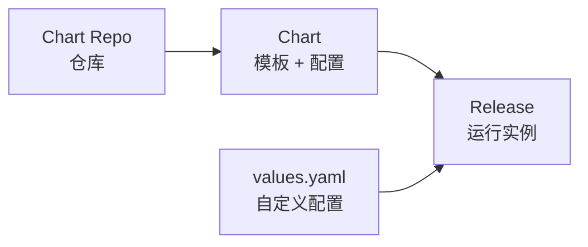

# Helm 包管理

## Helm 概述

Helm 是 Kubernetes 的包管理器，类似于 Linux 的 apt/yum。



### 核心概念

| 概念       | 说明                      |
| ---------- | ------------------------- |
| Chart      | 应用包，包含 K8s 资源定义 |
| Repository | Chart 仓库                |
| Release    | Chart 的运行实例          |
| Values     | 配置参数                  |

## 安装 Helm

```bash
# macOS
brew install helm

# Linux
curl https://raw.githubusercontent.com/helm/helm/main/scripts/get-helm-3 | bash

# Windows
choco install kubernetes-helm

# 验证安装
helm version
```

## Chart 仓库管理

```bash
# 添加仓库
helm repo add bitnami https://charts.bitnami.com/bitnami
helm repo add stable https://charts.helm.sh/stable

# 更新仓库
helm repo update

# 列出仓库
helm repo list

# 搜索 Chart
helm search repo nginx
helm search hub nginx    # 搜索 Artifact Hub

# 删除仓库
helm repo remove stable
```

## 安装 Chart

```bash
# 安装到默认命名空间
helm install my-nginx bitnami/nginx

# 指定命名空间
helm install my-nginx bitnami/nginx -n production --create-namespace

# 使用自定义配置
helm install my-nginx bitnami/nginx -f values.yaml
helm install my-nginx bitnami/nginx --set replicaCount=3

# 预览安装（不实际安装）
helm install my-nginx bitnami/nginx --dry-run

# 等待就绪
helm install my-nginx bitnami/nginx --wait --timeout 5m

# 从本地 Chart 安装
helm install my-app ./my-chart

# 从压缩包安装
helm install my-app ./my-chart-1.0.0.tgz

# 从 URL 安装
helm install my-app https://example.com/charts/my-chart-1.0.0.tgz
```

## 管理 Release

```bash
# 列出 Release
helm list
helm list -A           # 所有命名空间
helm list --pending    # 等待中

# 查看状态
helm status my-nginx

# 查看历史
helm history my-nginx

# 查看配置值
helm get values my-nginx
helm get values my-nginx --all    # 包含默认值

# 查看生成的 manifest
helm get manifest my-nginx

# 卸载
helm uninstall my-nginx
helm uninstall my-nginx --keep-history    # 保留历史
```

## 升级与回滚

```bash
# 升级
helm upgrade my-nginx bitnami/nginx --set replicaCount=5
helm upgrade my-nginx bitnami/nginx -f new-values.yaml

# 升级或安装
helm upgrade --install my-nginx bitnami/nginx

# 回滚
helm rollback my-nginx              # 回滚到上一版本
helm rollback my-nginx 2            # 回滚到指定版本

# 查看历史
helm history my-nginx
```

## 创建 Chart

### 初始化 Chart

```bash
# 创建新 Chart
helm create my-chart

# 目录结构
my-chart/
├── Chart.yaml          # Chart 元数据
├── values.yaml         # 默认配置
├── charts/             # 依赖 Chart
├── templates/          # 模板文件
│   ├── deployment.yaml
│   ├── service.yaml
│   ├── ingress.yaml
│   ├── _helpers.tpl    # 模板助手
│   ├── hpa.yaml
│   ├── serviceaccount.yaml
│   └── NOTES.txt       # 安装说明
└── .helmignore         # 忽略文件
```

### Chart.yaml

```yaml
apiVersion: v2
name: my-chart
description: A Helm chart for my application
type: application
version: 1.0.0 # Chart 版本
appVersion: "1.16.0" # 应用版本

keywords:
  - app
  - web

home: https://example.com
sources:
  - https://github.com/example/my-chart

maintainers:
  - name: John Doe
    email: john@example.com

dependencies:
  - name: mysql
    version: "9.0.0"
    repository: https://charts.bitnami.com/bitnami
    condition: mysql.enabled
```

### values.yaml

```yaml
# 副本数
replicaCount: 3

# 镜像配置
image:
  repository: nginx
  pullPolicy: IfNotPresent
  tag: "1.24"

# 服务配置
service:
  type: ClusterIP
  port: 80

# Ingress 配置
ingress:
  enabled: false
  className: nginx
  hosts:
    - host: chart-example.local
      paths:
        - path: /
          pathType: Prefix

# 资源限制
resources:
  limits:
    cpu: 100m
    memory: 128Mi
  requests:
    cpu: 100m
    memory: 128Mi

# 自动扩缩
autoscaling:
  enabled: false
  minReplicas: 1
  maxReplicas: 10
  targetCPUUtilizationPercentage: 80
```

### 模板语法

```yaml
# templates/deployment.yaml
apiVersion: apps/v1
kind: Deployment
metadata:
  name: {{ include "my-chart.fullname" . }}
  labels:
    {{- include "my-chart.labels" . | nindent 4 }}
spec:
  replicas: {{ .Values.replicaCount }}
  selector:
    matchLabels:
      {{- include "my-chart.selectorLabels" . | nindent 6 }}
  template:
    metadata:
      labels:
        {{- include "my-chart.selectorLabels" . | nindent 8 }}
    spec:
      containers:
      - name: {{ .Chart.Name }}
        image: "{{ .Values.image.repository }}:{{ .Values.image.tag | default .Chart.AppVersion }}"
        imagePullPolicy: {{ .Values.image.pullPolicy }}
        ports:
        - name: http
          containerPort: 80
        {{- if .Values.resources }}
        resources:
          {{- toYaml .Values.resources | nindent 12 }}
        {{- end }}
```

### 模板函数

```yaml
# 字符串函数
{{ .Values.name | upper }}
{{ .Values.name | lower }}
{{ .Values.name | quote }}
{{ .Values.name | default "default-value" }}
{{ .Values.name | required "name is required" }}

# 条件判断
{{- if .Values.ingress.enabled }}
  # ...
{{- else }}
  # ...
{{- end }}

# 循环
{{- range .Values.hosts }}
- host: {{ .name }}
  port: {{ .port }}
{{- end }}

# 字典
{{- range $key, $val := .Values.labels }}
{{ $key }}: {{ $val }}
{{- end }}

# 包含模板
{{ include "my-chart.labels" . }}
{{- include "my-chart.labels" . | nindent 4 }}

# 内置对象
.Release.Name        # Release 名称
.Release.Namespace   # 命名空间
.Chart.Name          # Chart 名称
.Chart.Version       # Chart 版本
.Values              # values.yaml 值
```

### \_helpers.tpl

```yaml
{{/*
完整名称
*/}}
{{- define "my-chart.fullname" -}}
{{- if .Values.fullnameOverride }}
{{- .Values.fullnameOverride | trunc 63 | trimSuffix "-" }}
{{- else }}
{{- $name := default .Chart.Name .Values.nameOverride }}
{{- printf "%s-%s" .Release.Name $name | trunc 63 | trimSuffix "-" }}
{{- end }}
{{- end }}

{{/*
通用标签
*/}}
{{- define "my-chart.labels" -}}
helm.sh/chart: {{ include "my-chart.chart" . }}
{{ include "my-chart.selectorLabels" . }}
app.kubernetes.io/version: {{ .Chart.AppVersion | quote }}
app.kubernetes.io/managed-by: {{ .Release.Service }}
{{- end }}
```

## Chart 开发

### 调试

```bash
# 渲染模板（不安装）
helm template my-release ./my-chart

# 渲染并查看
helm template my-release ./my-chart -f values.yaml

# 调试模式安装
helm install my-release ./my-chart --dry-run --debug

# 验证 Chart
helm lint ./my-chart
```

### 依赖管理

```bash
# 更新依赖
helm dependency update ./my-chart

# 构建依赖
helm dependency build ./my-chart

# 列出依赖
helm dependency list ./my-chart
```

### 打包与发布

```bash
# 打包 Chart
helm package ./my-chart

# 生成索引
helm repo index ./charts --url https://example.com/charts

# 推送到 OCI 仓库
helm push my-chart-1.0.0.tgz oci://registry.example.com/charts
```

## Helmfile

管理多个 Helm Release。

```yaml
# helmfile.yaml
repositories:
  - name: bitnami
    url: https://charts.bitnami.com/bitnami

releases:
  - name: nginx
    namespace: web
    chart: bitnami/nginx
    version: 13.0.0
    values:
      - values/nginx.yaml
    set:
      - name: replicaCount
        value: 3

  - name: mysql
    namespace: database
    chart: bitnami/mysql
    version: 9.0.0
    values:
      - values/mysql.yaml
```

```bash
# 安装所有
helmfile apply

# 同步
helmfile sync

# 差异对比
helmfile diff
```

## 常用 Chart

| Chart                           | 用途               |
| ------------------------------- | ------------------ |
| bitnami/nginx                   | Web 服务器         |
| bitnami/mysql                   | MySQL 数据库       |
| bitnami/redis                   | Redis 缓存         |
| bitnami/kafka                   | Kafka 消息队列     |
| prometheus-community/prometheus | 监控               |
| grafana/grafana                 | 可视化             |
| ingress-nginx/ingress-nginx     | Ingress Controller |
| cert-manager/cert-manager       | 证书管理           |

## 最佳实践

1. **使用语义化版本**：Chart 和应用版本分开管理

2. **提供合理默认值**：values.yaml 应包含生产可用配置

3. **使用 NOTES.txt**：提供安装后说明

4. **验证输入**：使用 `required` 函数验证必需值

5. **使用 Helmfile**：管理多环境多 Release

6. **版本锁定**：在生产环境锁定 Chart 版本
