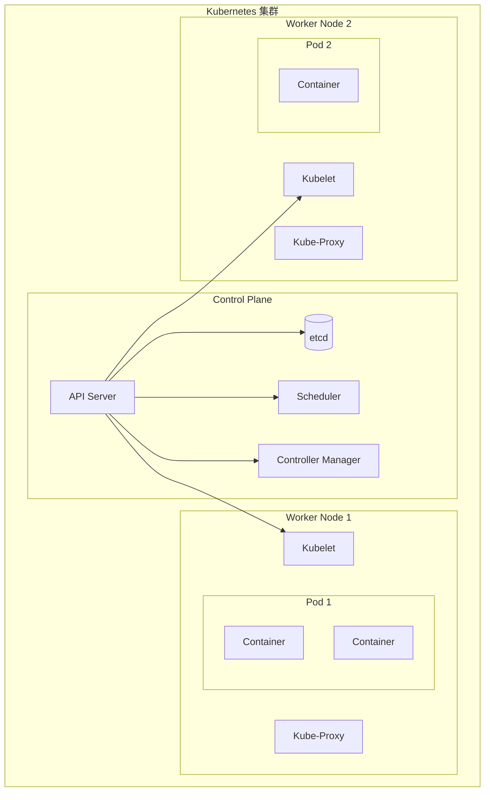
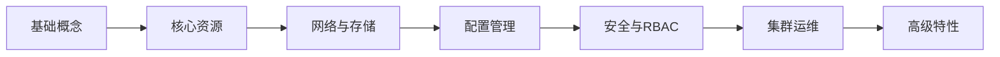

# Kubernetes 概述

## 什么是 Kubernetes？

**Kubernetes**（简称 K8s）是一个开源的容器编排平台，用于自动化容器化应用程序的部署、扩展和管理。它由 Google 开发，现由 Cloud Native Computing Foundation (CNCF) 维护。



## 为什么选择 Kubernetes？

| 特性           | 说明                         |
| -------------- | ---------------------------- |
| **自动化部署** | 声明式配置，自动完成应用部署 |
| **服务发现**   | 内置 DNS 和负载均衡          |
| **自动扩缩容** | 根据负载自动调整副本数量     |
| **自愈能力**   | 自动重启失败容器、替换节点   |
| **滚动更新**   | 零停机更新应用程序           |
| **存储编排**   | 自动挂载存储系统             |

## 核心概念

### 集群架构

- **Control Plane（控制平面）**：集群的大脑

  - API Server：所有操作的入口
  - etcd：分布式键值存储
  - Scheduler：调度 Pod 到节点
  - Controller Manager：运行控制器进程

- **Worker Node（工作节点）**：运行应用容器
  - Kubelet：节点代理
  - Kube-Proxy：网络代理
  - Container Runtime：容器运行时

### 基本对象

```yaml
# Pod - 最小部署单元
apiVersion: v1
kind: Pod
metadata:
  name: nginx-pod
spec:
  containers:
    - name: nginx
      image: nginx:1.24
      ports:
        - containerPort: 80
```

## 学习路线图



### 推荐学习顺序

1. **入门阶段**

   - 安装 kubectl 和本地集群（Minikube/Kind）
   - 理解 Pod、Deployment、Service 概念
   - 掌握基础 kubectl 命令

2. **核心技能**

   - ConfigMap 和 Secret 配置管理
   - 持久化存储（PV/PVC）
   - 网络策略和 Ingress

3. **进阶主题**

   - RBAC 权限控制
   - Helm 包管理
   - 监控与日志

4. **生产实践**
   - 高可用集群搭建
   - CI/CD 集成
   - 性能调优

## 版本信息

| 版本 | 发布日期 | 支持状态 |
| ---- | -------- | -------- |
| 1.31 | 2024-08  | 当前最新 |
| 1.30 | 2024-04  | 支持中   |
| 1.29 | 2023-12  | 支持中   |
| 1.28 | 2023-08  | 支持中   |

> **版本策略**：Kubernetes 每年发布 3 个小版本，每个版本支持约 14 个月。

## 快速开始

```bash
# 安装 kubectl
curl -LO "https://dl.k8s.io/release/$(curl -L -s https://dl.k8s.io/release/stable.txt)/bin/darwin/amd64/kubectl"
chmod +x kubectl
sudo mv kubectl /usr/local/bin/

# 验证安装
kubectl version --client

# 创建本地集群（使用 Minikube）
minikube start

# 查看集群状态
kubectl cluster-info
kubectl get nodes
```

## 文档导航

import DocCardList from '@theme/DocCardList';

<DocCardList />
