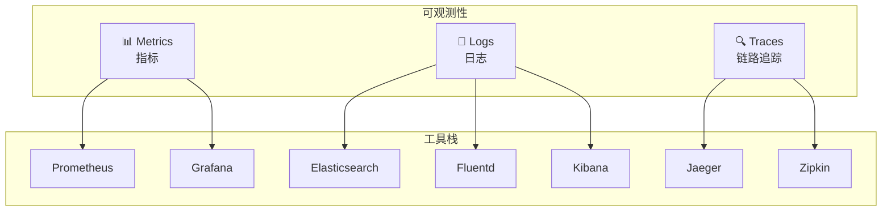

# 监控与告警

## 可观测性概述

Kubernetes 可观测性包含三个核心支柱：



## Metrics Server

Metrics Server 提供集群资源使用数据，是 HPA/VPA 的基础。

### 安装 Metrics Server

```bash
# 安装
kubectl apply -f https://github.com/kubernetes-sigs/metrics-server/releases/latest/download/components.yaml

# 如果是本地集群（自签名证书），需添加参数
kubectl patch deployment metrics-server -n kube-system --type='json' -p='[
  {"op": "add", "path": "/spec/template/spec/containers/0/args/-", "value": "--kubelet-insecure-tls"}
]'

# 验证
kubectl top nodes
kubectl top pods -A
```

### 资源查看

```bash
# 查看节点资源
kubectl top nodes
# NAME     CPU(cores)   CPU%   MEMORY(bytes)   MEMORY%
# node-1   250m         12%    1024Mi          25%

# 查看 Pod 资源
kubectl top pods -n default
kubectl top pods --containers  # 按容器显示

# 按资源排序
kubectl top pods --sort-by=cpu
kubectl top pods --sort-by=memory
```

## Prometheus 监控

### 使用 Helm 安装 kube-prometheus-stack

```bash
# 添加 Helm 仓库
helm repo add prometheus-community https://prometheus-community.github.io/helm-charts
helm repo update

# 安装 kube-prometheus-stack（包含 Prometheus、Grafana、Alertmanager）
helm install prometheus prometheus-community/kube-prometheus-stack \
  --namespace monitoring \
  --create-namespace \
  --set grafana.adminPassword=admin123

# 查看安装的组件
kubectl get pods -n monitoring
```

### 访问 Prometheus UI

```bash
# 端口转发
kubectl port-forward svc/prometheus-kube-prometheus-prometheus -n monitoring 9090:9090

# 访问 http://localhost:9090
```

### 常用 PromQL 查询

```promql
# CPU 使用率（按节点）
100 - (avg by(instance) (irate(node_cpu_seconds_total{mode="idle"}[5m])) * 100)

# 内存使用率（按节点）
(1 - node_memory_MemAvailable_bytes / node_memory_MemTotal_bytes) * 100

# Pod CPU 使用率
sum(rate(container_cpu_usage_seconds_total{container!=""}[5m])) by (namespace, pod)

# Pod 内存使用
sum(container_memory_working_set_bytes{container!=""}) by (namespace, pod)

# Pod 重启次数
sum(kube_pod_container_status_restarts_total) by (namespace, pod)

# API Server 请求延迟
histogram_quantile(0.99, sum(rate(apiserver_request_duration_seconds_bucket[5m])) by (le, verb))
```

### 自定义 ServiceMonitor

```yaml
apiVersion: monitoring.coreos.com/v1
kind: ServiceMonitor
metadata:
  name: my-app-monitor
  namespace: monitoring
  labels:
    release: prometheus # 匹配 Prometheus Operator 的 selector
spec:
  selector:
    matchLabels:
      app: my-app
  namespaceSelector:
    matchNames:
      - production
  endpoints:
    - port: metrics
      path: /metrics
      interval: 30s
      scrapeTimeout: 10s
```

## Grafana 可视化

### 访问 Grafana

```bash
# 获取 Grafana 密码
kubectl get secret prometheus-grafana -n monitoring -o jsonpath="{.data.admin-password}" | base64 -d

# 端口转发
kubectl port-forward svc/prometheus-grafana -n monitoring 3000:80

# 访问 http://localhost:3000
# 用户名: admin
```

### 推荐 Dashboard

| Dashboard ID | 名称                          | 用途            |
| ------------ | ----------------------------- | --------------- |
| 315          | Kubernetes cluster monitoring | 集群概览        |
| 13770        | Kubernetes All-in-One         | 全面监控        |
| 6417         | Kubernetes Pod Resources      | Pod 资源        |
| 11074        | Node Exporter                 | 节点监控        |
| 747          | Kubernetes Deployments        | Deployment 监控 |

### 导入 Dashboard

1. 访问 Grafana UI
2. 左侧菜单 → Dashboards → Import
3. 输入 Dashboard ID 或上传 JSON
4. 选择数据源（Prometheus）
5. 点击 Import

## Alertmanager 告警

### 告警规则示例

```yaml
apiVersion: monitoring.coreos.com/v1
kind: PrometheusRule
metadata:
  name: custom-alerts
  namespace: monitoring
  labels:
    release: prometheus
spec:
  groups:
    - name: kubernetes-apps
      rules:
        # Pod CrashLoopBackOff 告警
        - alert: PodCrashLoopBackOff
          expr: |
            max_over_time(kube_pod_container_status_waiting_reason{reason="CrashLoopBackOff"}[5m]) >= 1
          for: 5m
          labels:
            severity: critical
          annotations:
            summary: "Pod {{ $labels.namespace }}/{{ $labels.pod }} CrashLoopBackOff"
            description: "Pod {{ $labels.pod }} in namespace {{ $labels.namespace }} is in CrashLoopBackOff state."

        # Pod 内存使用超过 80%
        - alert: PodHighMemoryUsage
          expr: |
            (container_memory_working_set_bytes / container_spec_memory_limit_bytes) * 100 > 80
          for: 5m
          labels:
            severity: warning
          annotations:
            summary: "Pod {{ $labels.namespace }}/{{ $labels.pod }} memory usage > 80%"

        # 节点 NotReady
        - alert: NodeNotReady
          expr: kube_node_status_condition{condition="Ready",status="true"} == 0
          for: 5m
          labels:
            severity: critical
          annotations:
            summary: "Node {{ $labels.node }} is NotReady"
```

### 配置告警通知

```yaml
# 创建 Alertmanager 配置的 Secret
apiVersion: v1
kind: Secret
metadata:
  name: alertmanager-prometheus-kube-prometheus-alertmanager
  namespace: monitoring
type: Opaque
stringData:
  alertmanager.yaml: |
    global:
      resolve_timeout: 5m
      slack_api_url: 'https://hooks.slack.com/services/xxx'

    route:
      group_by: ['alertname', 'namespace']
      group_wait: 30s
      group_interval: 5m
      repeat_interval: 4h
      receiver: 'default'
      routes:
        - match:
            severity: critical
          receiver: 'slack-critical'

    receivers:
      - name: 'default'
        webhook_configs:
          - url: 'http://alertmanager-webhook:8080/webhook'

      - name: 'slack-critical'
        slack_configs:
          - channel: '#alerts-critical'
            send_resolved: true
            title: '{{ .Status | toUpper }}: {{ .CommonAnnotations.summary }}'
            text: '{{ .CommonAnnotations.description }}'
```

## HPA 自动扩缩容

### 基于 CPU 的 HPA

```yaml
apiVersion: autoscaling/v2
kind: HorizontalPodAutoscaler
metadata:
  name: my-app-hpa
spec:
  scaleTargetRef:
    apiVersion: apps/v1
    kind: Deployment
    name: my-app
  minReplicas: 2
  maxReplicas: 10
  metrics:
    - type: Resource
      resource:
        name: cpu
        target:
          type: Utilization
          averageUtilization: 70
    - type: Resource
      resource:
        name: memory
        target:
          type: Utilization
          averageUtilization: 80
  behavior:
    scaleDown:
      stabilizationWindowSeconds: 300
      policies:
        - type: Percent
          value: 10
          periodSeconds: 60
    scaleUp:
      stabilizationWindowSeconds: 0
      policies:
        - type: Percent
          value: 100
          periodSeconds: 15
```

### 基于自定义指标的 HPA

```yaml
apiVersion: autoscaling/v2
kind: HorizontalPodAutoscaler
metadata:
  name: my-app-hpa
spec:
  scaleTargetRef:
    apiVersion: apps/v1
    kind: Deployment
    name: my-app
  minReplicas: 2
  maxReplicas: 20
  metrics:
    - type: Pods
      pods:
        metric:
          name: http_requests_per_second
        target:
          type: AverageValue
          averageValue: 1000
```

### HPA 操作

```bash
# 创建 HPA
kubectl apply -f hpa.yaml

# 查看 HPA
kubectl get hpa
kubectl describe hpa my-app-hpa

# 命令行创建 HPA
kubectl autoscale deployment my-app --cpu-percent=70 --min=2 --max=10

# 查看扩缩容事件
kubectl get events --field-selector reason=SuccessfulRescale
```

## 日志收集

### 使用 Fluent Bit

```yaml
apiVersion: v1
kind: ConfigMap
metadata:
  name: fluent-bit-config
data:
  fluent-bit.conf: |
    [SERVICE]
        Flush         5
        Log_Level     info
        Daemon        off

    [INPUT]
        Name              tail
        Tag               kube.*
        Path              /var/log/containers/*.log
        Parser            docker
        DB                /var/log/flb_kube.db
        Mem_Buf_Limit     50MB
        Skip_Long_Lines   On
        Refresh_Interval  10

    [FILTER]
        Name                kubernetes
        Match               kube.*
        Kube_URL            https://kubernetes.default.svc:443
        Kube_CA_File        /var/run/secrets/kubernetes.io/serviceaccount/ca.crt
        Kube_Token_File     /var/run/secrets/kubernetes.io/serviceaccount/token
        Merge_Log           On
        K8S-Logging.Parser  On
        K8S-Logging.Exclude On

    [OUTPUT]
        Name            es
        Match           *
        Host            elasticsearch
        Port            9200
        Index           kubernetes
        Type            _doc
```

### 日志查看命令

```bash
# 查看 Pod 日志
kubectl logs <pod-name>
kubectl logs <pod-name> -c <container-name>  # 多容器
kubectl logs <pod-name> --previous           # 上一个容器实例
kubectl logs <pod-name> -f                   # 实时日志
kubectl logs <pod-name> --tail=100          # 最后 100 行
kubectl logs <pod-name> --since=1h          # 最近 1 小时

# 查看多个 Pod 日志
kubectl logs -l app=my-app --all-containers

# 使用 stern 工具
stern my-app -n production
```

## 常用操作

```bash
# 资源监控
kubectl top nodes
kubectl top pods -A

# 事件查看
kubectl get events -A --sort-by='.lastTimestamp'
kubectl get events -w  # 实时事件

# 组件健康检查
kubectl get componentstatuses
kubectl get --raw /healthz
kubectl get --raw /readyz

# API Server 指标
kubectl get --raw /metrics | head -100
```
