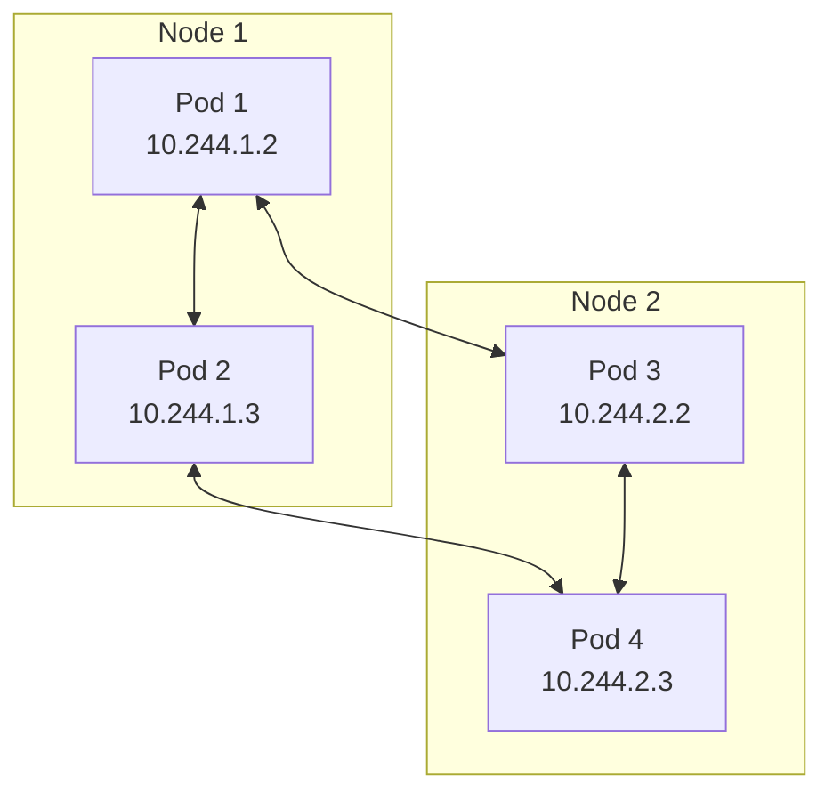
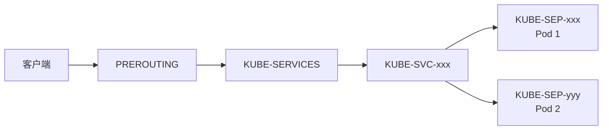

# Kubernetes 网络详解

## 网络模型

Kubernetes 网络模型基于以下核心原则：

- **每个 Pod 有独立 IP**：Pod 内所有容器共享网络命名空间
- **Pod 间直接通信**：所有 Pod 之间可以不经过 NAT 直接通信
- **节点与 Pod 互通**：节点可以直接与所有 Pod 通信



## CNI 插件

CNI（Container Network Interface）是 Kubernetes 网络的标准接口。

### 常用 CNI 插件对比

| 插件        | 特点                 | 适用场景           |
| ----------- | -------------------- | ------------------ |
| **Calico**  | 高性能，支持网络策略 | 生产环境首选       |
| **Flannel** | 简单易用，配置少     | 学习和小规模集群   |
| **Cilium**  | 基于 eBPF，功能强大  | 大规模、高性能需求 |
| **Weave**   | 加密通信，易于安装   | 安全要求高的场景   |

### Calico 安装

```bash
# 安装 Calico
kubectl apply -f https://raw.githubusercontent.com/projectcalico/calico/v3.26.0/manifests/calico.yaml

# 查看 Calico 状态
kubectl get pods -n kube-system -l k8s-app=calico-node

# 安装 calicoctl
curl -L https://github.com/projectcalico/calico/releases/download/v3.26.0/calicoctl-linux-amd64 -o calicoctl
chmod +x calicoctl
sudo mv calicoctl /usr/local/bin/

# 查看节点状态
calicoctl node status
```

### Flannel 安装

```bash
# 初始化集群时指定 Pod 网段
kubeadm init --pod-network-cidr=10.244.0.0/16

# 安装 Flannel
kubectl apply -f https://raw.githubusercontent.com/flannel-io/flannel/master/Documentation/kube-flannel.yml

# 查看 Flannel 状态
kubectl get pods -n kube-flannel
```

### Cilium 安装

```bash
# 使用 Cilium CLI 安装
curl -L --remote-name https://github.com/cilium/cilium-cli/releases/latest/download/cilium-linux-amd64.tar.gz
tar xzvfC cilium-linux-amd64.tar.gz /usr/local/bin

# 安装 Cilium
cilium install

# 查看状态
cilium status

# 连通性测试
cilium connectivity test
```

## kube-proxy 模式

kube-proxy 负责实现 Service 的负载均衡。

### iptables 模式（默认）

```bash
# 查看 iptables 规则
iptables -t nat -L -n | grep <service-name>

# 查看 Service 的 iptables 链
iptables -t nat -L KUBE-SERVICES -n --line-numbers
```



### IPVS 模式

IPVS（IP Virtual Server）提供更好的性能和更多负载均衡算法。

```bash
# 启用 IPVS 模式
# 编辑 kube-proxy ConfigMap
kubectl edit configmap kube-proxy -n kube-system
```

```yaml
# kube-proxy 配置
apiVersion: kubeproxy.config.k8s.io/v1alpha1
kind: KubeProxyConfiguration
mode: "ipvs"
ipvs:
  scheduler: "rr" # 轮询算法
  # 其他算法: lc(最小连接), dh(目标哈希), sh(源哈希)
```

```bash
# 重启 kube-proxy
kubectl rollout restart daemonset kube-proxy -n kube-system

# 查看 IPVS 规则
ipvsadm -Ln
```

### 模式对比

| 特性 | iptables      | IPVS             |
| ---- | ------------- | ---------------- |
| 性能 | O(n) 规则匹配 | O(1) 哈希查找    |
| 规模 | 适合小规模    | 适合大规模       |
| 算法 | 随机          | 多种负载均衡算法 |
| 调试 | iptables 命令 | ipvsadm 命令     |

## 网络策略

NetworkPolicy 用于控制 Pod 间的网络流量。

### 默认拒绝所有入站流量

```yaml
apiVersion: networking.k8s.io/v1
kind: NetworkPolicy
metadata:
  name: deny-all-ingress
  namespace: production
spec:
  podSelector: {} # 匹配所有 Pod
  policyTypes:
    - Ingress
  # 不指定 ingress 规则，即拒绝所有
```

### 允许特定命名空间访问

```yaml
apiVersion: networking.k8s.io/v1
kind: NetworkPolicy
metadata:
  name: allow-from-frontend
  namespace: backend
spec:
  podSelector:
    matchLabels:
      app: api
  policyTypes:
    - Ingress
  ingress:
    - from:
        - namespaceSelector:
            matchLabels:
              name: frontend
      ports:
        - protocol: TCP
          port: 8080
```

### 限制出站流量

```yaml
apiVersion: networking.k8s.io/v1
kind: NetworkPolicy
metadata:
  name: restrict-egress
  namespace: production
spec:
  podSelector:
    matchLabels:
      app: web
  policyTypes:
    - Egress
  egress:
    # 允许访问 DNS
    - to:
        - namespaceSelector: {}
          podSelector:
            matchLabels:
              k8s-app: kube-dns
      ports:
        - protocol: UDP
          port: 53
    # 允许访问数据库
    - to:
        - podSelector:
            matchLabels:
              app: database
      ports:
        - protocol: TCP
          port: 5432
```

### 多条件组合

```yaml
apiVersion: networking.k8s.io/v1
kind: NetworkPolicy
metadata:
  name: complex-policy
spec:
  podSelector:
    matchLabels:
      role: db
  policyTypes:
    - Ingress
  ingress:
    # 条件 1: 来自 frontend 命名空间且带有 role=frontend 标签的 Pod
    - from:
        - namespaceSelector:
            matchLabels:
              name: frontend
          podSelector:
            matchLabels:
              role: frontend
      ports:
        - protocol: TCP
          port: 5432
    # 条件 2: 来自 10.0.0.0/24 网段
    - from:
        - ipBlock:
            cidr: 10.0.0.0/24
            except:
              - 10.0.0.1/32
      ports:
        - protocol: TCP
          port: 5432
```

## Ingress Controller

### NGINX Ingress Controller 安装

```bash
# 使用 Helm 安装
helm repo add ingress-nginx https://kubernetes.github.io/ingress-nginx
helm repo update

helm install ingress-nginx ingress-nginx/ingress-nginx \
  --namespace ingress-nginx \
  --create-namespace \
  --set controller.service.type=LoadBalancer

# 查看状态
kubectl get pods -n ingress-nginx
kubectl get svc -n ingress-nginx
```

### Ingress 配置示例

```yaml
apiVersion: networking.k8s.io/v1
kind: Ingress
metadata:
  name: app-ingress
  annotations:
    nginx.ingress.kubernetes.io/rewrite-target: /
    nginx.ingress.kubernetes.io/ssl-redirect: "true"
    nginx.ingress.kubernetes.io/proxy-body-size: "50m"
    nginx.ingress.kubernetes.io/proxy-read-timeout: "60"
spec:
  ingressClassName: nginx
  tls:
    - hosts:
        - app.example.com
      secretName: app-tls-secret
  rules:
    - host: app.example.com
      http:
        paths:
          - path: /api
            pathType: Prefix
            backend:
              service:
                name: api-service
                port:
                  number: 80
          - path: /
            pathType: Prefix
            backend:
              service:
                name: web-service
                port:
                  number: 80
```

### 常用 Ingress 注解

| 注解                                             | 说明            |
| ------------------------------------------------ | --------------- |
| `nginx.ingress.kubernetes.io/rewrite-target`     | URL 重写目标    |
| `nginx.ingress.kubernetes.io/ssl-redirect`       | 强制 HTTPS 跳转 |
| `nginx.ingress.kubernetes.io/proxy-body-size`    | 请求体大小限制  |
| `nginx.ingress.kubernetes.io/proxy-read-timeout` | 读取超时时间    |
| `nginx.ingress.kubernetes.io/affinity`           | 会话亲和性      |
| `nginx.ingress.kubernetes.io/cors-allow-origin`  | CORS 允许来源   |

## DNS 服务

### CoreDNS 配置

```yaml
# 查看 CoreDNS ConfigMap
kubectl get configmap coredns -n kube-system -o yaml
```

```yaml
apiVersion: v1
kind: ConfigMap
metadata:
  name: coredns
  namespace: kube-system
data:
  Corefile: |
    .:53 {
        errors
        health {
           lameduck 5s
        }
        ready
        kubernetes cluster.local in-addr.arpa ip6.arpa {
           pods insecure
           fallthrough in-addr.arpa ip6.arpa
           ttl 30
        }
        prometheus :9153
        forward . /etc/resolv.conf {
           max_concurrent 1000
        }
        cache 30
        loop
        reload
        loadbalance
    }
```

### DNS 调试

```bash
# 运行 DNS 调试 Pod
kubectl run dnsutils --image=registry.k8s.io/e2e-test-images/jessie-dnsutils:1.3 -it --rm -- /bin/sh

# 测试 DNS 解析
nslookup kubernetes.default
nslookup my-service.my-namespace.svc.cluster.local

# 查看 Pod 的 DNS 配置
kubectl exec <pod-name> -- cat /etc/resolv.conf
```

## 网络排查

### 常用排查命令

```bash
# 查看 Pod 网络配置
kubectl exec <pod-name> -- ip addr
kubectl exec <pod-name> -- ip route

# 测试 Pod 间连通性
kubectl exec <pod-1> -- ping <pod-2-ip>
kubectl exec <pod-1> -- curl <service-name>:<port>

# 查看 Service 后端
kubectl get endpoints <service-name>

# 使用 netshoot 调试
kubectl run netshoot --image=nicolaka/netshoot -it --rm -- /bin/bash
```

### 常见问题

| 问题           | 可能原因         | 排查方法                     |
| -------------- | ---------------- | ---------------------------- |
| Pod 无法通信   | CNI 插件问题     | 检查 CNI Pod 状态            |
| Service 不可达 | kube-proxy 问题  | 检查 iptables/IPVS 规则      |
| DNS 解析失败   | CoreDNS 问题     | 检查 CoreDNS Pod 日志        |
| 外部无法访问   | Ingress 配置问题 | 检查 Ingress Controller 日志 |
