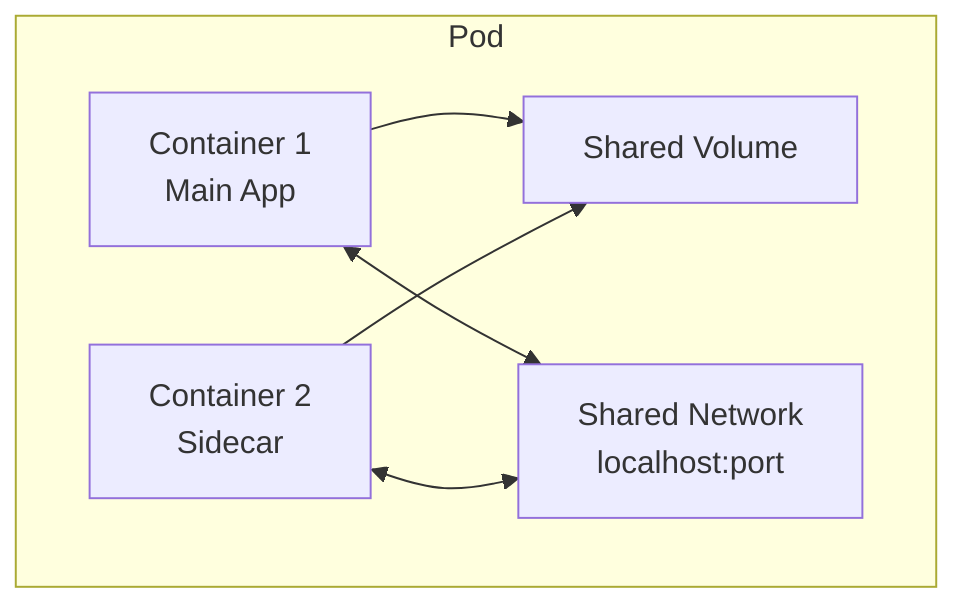

# Pod 详解

## 什么是 Pod？

Pod 是 Kubernetes 中最小的可部署单元，代表集群中运行的一个或多个容器的组合。



### Pod 特性

- **共享网络**：同一 Pod 中的容器共享网络命名空间，可通过 localhost 通信
- **共享存储**：可以挂载共享卷
- **生命周期**：Pod 是临时的，不会"重启"，只会被替换
- **唯一 IP**：每个 Pod 在集群中有唯一的 IP 地址

## 基础 Pod 定义

```yaml
apiVersion: v1
kind: Pod
metadata:
  name: my-pod
  namespace: default
  labels:
    app: my-app
    environment: dev
  annotations:
    description: "My first pod"
spec:
  containers:
    - name: main-container
      image: nginx:1.24
      ports:
        - containerPort: 80
          name: http
      resources:
        requests:
          memory: "64Mi"
          cpu: "250m"
        limits:
          memory: "128Mi"
          cpu: "500m"
```

## 多容器 Pod 模式

### Sidecar 模式

```yaml
apiVersion: v1
kind: Pod
metadata:
  name: app-with-sidecar
spec:
  containers:
    # 主应用容器
    - name: app
      image: my-app:1.0
      ports:
        - containerPort: 8080
      volumeMounts:
        - name: logs
          mountPath: /var/log/app

    # Sidecar: 日志收集
    - name: log-collector
      image: fluentd:latest
      volumeMounts:
        - name: logs
          mountPath: /var/log/app
          readOnly: true

  volumes:
    - name: logs
      emptyDir: {}
```

### Ambassador 模式

```yaml
apiVersion: v1
kind: Pod
metadata:
  name: app-with-ambassador
spec:
  containers:
    - name: app
      image: my-app:1.0
      env:
        - name: DB_HOST
          value: "localhost" # 通过 ambassador 访问
        - name: DB_PORT
          value: "5432"

    # Ambassador: 代理外部数据库
    - name: db-ambassador
      image: haproxy:2.8
      ports:
        - containerPort: 5432
```

### Adapter 模式

```yaml
apiVersion: v1
kind: Pod
metadata:
  name: app-with-adapter
spec:
  containers:
    - name: app
      image: legacy-app:1.0
      volumeMounts:
        - name: data
          mountPath: /var/data

    # Adapter: 格式转换
    - name: format-adapter
      image: prometheus-adapter:1.0
      volumeMounts:
        - name: data
          mountPath: /var/data
          readOnly: true
      ports:
        - containerPort: 9090 # Prometheus 格式输出

  volumes:
    - name: data
      emptyDir: {}
```

## 容器配置

### 环境变量

```yaml
spec:
  containers:
    - name: app
      image: my-app:1.0
      env:
        # 直接定义
        - name: APP_ENV
          value: "production"

        # 来自 ConfigMap
        - name: DB_HOST
          valueFrom:
            configMapKeyRef:
              name: db-config
              key: host

        # 来自 Secret
        - name: DB_PASSWORD
          valueFrom:
            secretKeyRef:
              name: db-secret
              key: password

        # 来自 Pod 字段
        - name: POD_NAME
          valueFrom:
            fieldRef:
              fieldPath: metadata.name

        # 来自容器资源
        - name: MEMORY_LIMIT
          valueFrom:
            resourceFieldRef:
              containerName: app
              resource: limits.memory

      # 从 ConfigMap 导入所有
      envFrom:
        - configMapRef:
            name: app-config
        - secretRef:
            name: app-secrets
```

### 资源限制

```yaml
spec:
  containers:
    - name: app
      image: my-app:1.0
      resources:
        # 请求：调度时考虑
        requests:
          memory: "256Mi"
          cpu: "500m" # 0.5 核
          ephemeral-storage: "1Gi"
        # 限制：运行时限制
        limits:
          memory: "512Mi"
          cpu: "1000m" # 1 核
          ephemeral-storage: "2Gi"
```

### 端口配置

```yaml
spec:
  containers:
    - name: app
      image: my-app:1.0
      ports:
        - name: http
          containerPort: 8080
          protocol: TCP
        - name: metrics
          containerPort: 9090
          protocol: TCP
        - name: health
          containerPort: 8081
          protocol: TCP
```

## 健康检查

### Liveness Probe（存活探针）

检测容器是否在运行，失败则重启容器。

```yaml
spec:
  containers:
    - name: app
      image: my-app:1.0
      livenessProbe:
        # HTTP 检查
        httpGet:
          path: /healthz
          port: 8080
          httpHeaders:
            - name: Custom-Header
              value: Awesome
        initialDelaySeconds: 30 # 启动后等待
        periodSeconds: 10 # 检查间隔
        timeoutSeconds: 5 # 超时时间
        successThreshold: 1 # 成功阈值
        failureThreshold: 3 # 失败阈值
```

### Readiness Probe（就绪探针）

检测容器是否准备好接收流量，失败则从 Service 移除。

```yaml
spec:
  containers:
    - name: app
      image: my-app:1.0
      readinessProbe:
        # TCP 检查
        tcpSocket:
          port: 8080
        initialDelaySeconds: 5
        periodSeconds: 10
```

### Startup Probe（启动探针）

检测容器是否已启动完成，用于慢启动应用。

```yaml
spec:
  containers:
    - name: app
      image: my-app:1.0
      startupProbe:
        # 命令检查
        exec:
          command:
            - cat
            - /tmp/healthy
        initialDelaySeconds: 0
        periodSeconds: 5
        failureThreshold: 30 # 30 * 5 = 150s 最大启动时间
```

### 探针类型对比

| 探针类型  | 用途                 | 失败后果        |
| --------- | -------------------- | --------------- |
| Liveness  | 检测容器是否存活     | 重启容器        |
| Readiness | 检测容器是否就绪     | 从 Service 移除 |
| Startup   | 检测容器是否启动完成 | 禁用其他探针    |

## 生命周期钩子

```yaml
spec:
  containers:
    - name: app
      image: my-app:1.0
      lifecycle:
        postStart:
          exec:
            command: ["/bin/sh", "-c", "echo 'Container started'"]
        preStop:
          httpGet:
            path: /shutdown
            port: 8080
          # 或使用命令
          # exec:
          #   command: ["/bin/sh", "-c", "nginx -s quit; sleep 10"]
```

## Init Containers

在主容器启动前运行的初始化容器。

```yaml
apiVersion: v1
kind: Pod
metadata:
  name: app-with-init
spec:
  initContainers:
    # 等待数据库就绪
    - name: wait-for-db
      image: busybox:1.36
      command:
        [
          "sh",
          "-c",
          "until nc -z db-service 5432; do echo waiting...; sleep 2; done",
        ]

    # 下载配置
    - name: download-config
      image: busybox:1.36
      command:
        ["wget", "-O", "/config/app.conf", "http://config-server/app.conf"]
      volumeMounts:
        - name: config
          mountPath: /config

  containers:
    - name: app
      image: my-app:1.0
      volumeMounts:
        - name: config
          mountPath: /etc/app

  volumes:
    - name: config
      emptyDir: {}
```

## Pod 调度

### NodeSelector

```yaml
spec:
  nodeSelector:
    disktype: ssd
    zone: cn-beijing-a
```

### Node Affinity

```yaml
spec:
  affinity:
    nodeAffinity:
      requiredDuringSchedulingIgnoredDuringExecution:
        nodeSelectorTerms:
          - matchExpressions:
              - key: kubernetes.io/os
                operator: In
                values:
                  - linux
      preferredDuringSchedulingIgnoredDuringExecution:
        - weight: 1
          preference:
            matchExpressions:
              - key: disktype
                operator: In
                values:
                  - ssd
```

### Pod Affinity/Anti-Affinity

```yaml
spec:
  affinity:
    podAffinity:
      requiredDuringSchedulingIgnoredDuringExecution:
        - labelSelector:
            matchLabels:
              app: cache
          topologyKey: kubernetes.io/hostname

    podAntiAffinity:
      preferredDuringSchedulingIgnoredDuringExecution:
        - weight: 100
          podAffinityTerm:
            labelSelector:
              matchLabels:
                app: web
            topologyKey: kubernetes.io/hostname
```

### Tolerations

```yaml
spec:
  tolerations:
    - key: "node-role.kubernetes.io/master"
      operator: "Exists"
      effect: "NoSchedule"
    - key: "special"
      operator: "Equal"
      value: "true"
      effect: "NoExecute"
      tolerationSeconds: 3600
```

## Pod 安全上下文

```yaml
spec:
  securityContext:
    runAsUser: 1000
    runAsGroup: 3000
    fsGroup: 2000
    runAsNonRoot: true

  containers:
    - name: app
      image: my-app:1.0
      securityContext:
        allowPrivilegeEscalation: false
        readOnlyRootFilesystem: true
        capabilities:
          drop:
            - ALL
          add:
            - NET_BIND_SERVICE
```

## 常用操作

```bash
# 创建 Pod
kubectl apply -f pod.yaml

# 查看 Pod
kubectl get pods
kubectl get pods -o wide

# 查看详情
kubectl describe pod my-pod

# 查看日志
kubectl logs my-pod
kubectl logs my-pod -c container-name  # 多容器

# 进入容器
kubectl exec -it my-pod -- /bin/bash

# 删除 Pod
kubectl delete pod my-pod
kubectl delete pod my-pod --force --grace-period=0
```
