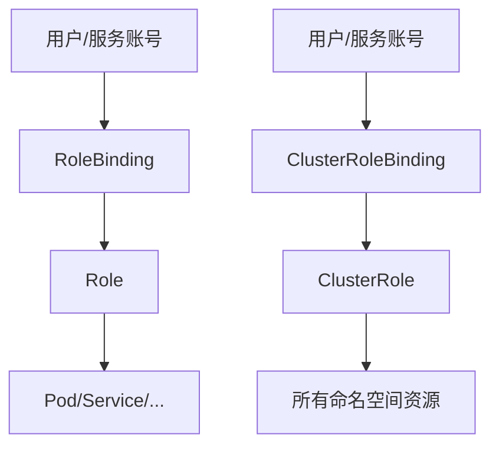

# RBAC 权限控制

## RBAC 概述

RBAC（Role-Based Access Control）是 Kubernetes 中的授权机制，通过角色和绑定来控制用户和服务对资源的访问。



### 核心概念

| 概念               | 作用域   | 说明                      |
| ------------------ | -------- | ------------------------- |
| Role               | 命名空间 | 定义命名空间内的权限      |
| ClusterRole        | 集群     | 定义集群级别的权限        |
| RoleBinding        | 命名空间 | 将 Role 绑定到主体        |
| ClusterRoleBinding | 集群     | 将 ClusterRole 绑定到主体 |

## ServiceAccount

ServiceAccount 是 Pod 使用的身份标识。

```yaml
apiVersion: v1
kind: ServiceAccount
metadata:
  name: my-service-account
  namespace: default
automountServiceAccountToken: true
imagePullSecrets:
  - name: registry-secret
```

### 在 Pod 中使用

```yaml
apiVersion: v1
kind: Pod
metadata:
  name: my-pod
spec:
  serviceAccountName: my-service-account
  automountServiceAccountToken: true
  containers:
    - name: app
      image: my-app
```

### 创建 ServiceAccount

```bash
# 创建 ServiceAccount
kubectl create serviceaccount my-sa

# 查看 ServiceAccount
kubectl get serviceaccounts
kubectl describe sa my-sa

# 获取 Token（Kubernetes 1.24+）
kubectl create token my-sa --duration=24h
```

## Role 与 ClusterRole

### Role（命名空间级别）

```yaml
apiVersion: rbac.authorization.k8s.io/v1
kind: Role
metadata:
  name: pod-reader
  namespace: default
rules:
  - apiGroups: [""] # 核心 API 组
    resources: ["pods"]
    verbs: ["get", "list", "watch"]

  - apiGroups: [""]
    resources: ["pods/log"]
    verbs: ["get"]

  - apiGroups: ["apps"]
    resources: ["deployments"]
    verbs: ["get", "list", "watch", "create", "update", "patch", "delete"]
```

### ClusterRole（集群级别）

```yaml
apiVersion: rbac.authorization.k8s.io/v1
kind: ClusterRole
metadata:
  name: cluster-admin-readonly
rules:
  # 查看所有资源
  - apiGroups: ["*"]
    resources: ["*"]
    verbs: ["get", "list", "watch"]

  # 访问非资源端点
  - nonResourceURLs: ["/healthz", "/metrics"]
    verbs: ["get"]
```

### 权限动词（Verbs）

| 动词             | 说明         |
| ---------------- | ------------ |
| get              | 获取单个资源 |
| list             | 列出资源集合 |
| watch            | 监视资源变化 |
| create           | 创建资源     |
| update           | 更新资源     |
| patch            | 补丁更新     |
| delete           | 删除资源     |
| deletecollection | 批量删除     |

### 常用 API Groups

| API Group                 | 资源示例                              |
| ------------------------- | ------------------------------------- |
| "" (core)                 | pods, services, configmaps, secrets   |
| apps                      | deployments, statefulsets, daemonsets |
| batch                     | jobs, cronjobs                        |
| networking.k8s.io         | ingresses, networkpolicies            |
| rbac.authorization.k8s.io | roles, clusterroles                   |

## RoleBinding 与 ClusterRoleBinding

### RoleBinding

```yaml
apiVersion: rbac.authorization.k8s.io/v1
kind: RoleBinding
metadata:
  name: read-pods
  namespace: default
subjects:
  # 绑定 ServiceAccount
  - kind: ServiceAccount
    name: my-service-account
    namespace: default

  # 绑定用户
  - kind: User
    name: jane
    apiGroup: rbac.authorization.k8s.io

  # 绑定用户组
  - kind: Group
    name: developers
    apiGroup: rbac.authorization.k8s.io

roleRef:
  kind: Role
  name: pod-reader
  apiGroup: rbac.authorization.k8s.io
```

### ClusterRoleBinding

```yaml
apiVersion: rbac.authorization.k8s.io/v1
kind: ClusterRoleBinding
metadata:
  name: cluster-admin-binding
subjects:
  - kind: User
    name: admin
    apiGroup: rbac.authorization.k8s.io
roleRef:
  kind: ClusterRole
  name: cluster-admin
  apiGroup: rbac.authorization.k8s.io
```

### RoleBinding 引用 ClusterRole

将 ClusterRole 的权限限制在特定命名空间。

```yaml
apiVersion: rbac.authorization.k8s.io/v1
kind: RoleBinding
metadata:
  name: developer-view
  namespace: development
subjects:
  - kind: Group
    name: developers
    apiGroup: rbac.authorization.k8s.io
roleRef:
  kind: ClusterRole # 引用 ClusterRole
  name: view # 内置只读角色
  apiGroup: rbac.authorization.k8s.io
```

## 内置 ClusterRole

Kubernetes 提供了一些内置的 ClusterRole：

| ClusterRole   | 权限             |
| ------------- | ---------------- |
| cluster-admin | 完全访问权限     |
| admin         | 命名空间管理权限 |
| edit          | 读写大部分资源   |
| view          | 只读权限         |

```bash
# 查看内置角色
kubectl get clusterroles | grep -E '^(cluster-admin|admin|edit|view)'

# 查看角色详情
kubectl describe clusterrole view
```

## 聚合 ClusterRole

通过标签自动聚合权限。

```yaml
apiVersion: rbac.authorization.k8s.io/v1
kind: ClusterRole
metadata:
  name: monitoring-endpoints
  labels:
    rbac.authorization.k8s.io/aggregate-to-view: "true" # 聚合到 view
    rbac.authorization.k8s.io/aggregate-to-edit: "true" # 聚合到 edit
    rbac.authorization.k8s.io/aggregate-to-admin: "true" # 聚合到 admin
rules:
  - apiGroups: [""]
    resources: ["endpoints"]
    verbs: ["get", "list", "watch"]
```

## 实战示例

### 只读访问 Pod

```yaml
---
apiVersion: v1
kind: ServiceAccount
metadata:
  name: pod-viewer
  namespace: default

---
apiVersion: rbac.authorization.k8s.io/v1
kind: Role
metadata:
  name: pod-viewer-role
  namespace: default
rules:
  - apiGroups: [""]
    resources: ["pods", "pods/log"]
    verbs: ["get", "list", "watch"]

---
apiVersion: rbac.authorization.k8s.io/v1
kind: RoleBinding
metadata:
  name: pod-viewer-binding
  namespace: default
subjects:
  - kind: ServiceAccount
    name: pod-viewer
    namespace: default
roleRef:
  kind: Role
  name: pod-viewer-role
  apiGroup: rbac.authorization.k8s.io
```

### CI/CD 部署权限

```yaml
---
apiVersion: v1
kind: ServiceAccount
metadata:
  name: ci-deployer
  namespace: production

---
apiVersion: rbac.authorization.k8s.io/v1
kind: Role
metadata:
  name: deployer
  namespace: production
rules:
  - apiGroups: ["apps"]
    resources: ["deployments"]
    verbs: ["get", "list", "watch", "create", "update", "patch"]
  - apiGroups: [""]
    resources: ["services", "configmaps", "secrets"]
    verbs: ["get", "list", "watch", "create", "update", "patch"]
  - apiGroups: ["networking.k8s.io"]
    resources: ["ingresses"]
    verbs: ["get", "list", "watch", "create", "update", "patch"]

---
apiVersion: rbac.authorization.k8s.io/v1
kind: RoleBinding
metadata:
  name: ci-deployer-binding
  namespace: production
subjects:
  - kind: ServiceAccount
    name: ci-deployer
    namespace: production
roleRef:
  kind: Role
  name: deployer
  apiGroup: rbac.authorization.k8s.io
```

### 命名空间管理员

```yaml
apiVersion: rbac.authorization.k8s.io/v1
kind: RoleBinding
metadata:
  name: namespace-admin
  namespace: team-a
subjects:
  - kind: User
    name: team-a-lead
    apiGroup: rbac.authorization.k8s.io
roleRef:
  kind: ClusterRole
  name: admin
  apiGroup: rbac.authorization.k8s.io
```

## 权限检查

```bash
# 检查当前用户权限
kubectl auth can-i list pods
kubectl auth can-i create deployments -n production

# 检查特定用户权限
kubectl auth can-i list pods --as jane
kubectl auth can-i create secrets --as system:serviceaccount:default:my-sa

# 列出所有权限
kubectl auth can-i --list

# 列出特定命名空间权限
kubectl auth can-i --list -n production
```

## 常用操作

```bash
# 创建 ServiceAccount
kubectl create serviceaccount my-sa

# 创建 Role
kubectl create role pod-reader --verb=get,list,watch --resource=pods

# 创建 ClusterRole
kubectl create clusterrole pod-reader --verb=get,list,watch --resource=pods

# 创建 RoleBinding
kubectl create rolebinding my-binding --role=pod-reader --serviceaccount=default:my-sa

# 创建 ClusterRoleBinding
kubectl create clusterrolebinding my-binding --clusterrole=cluster-admin --user=admin

# 查看角色
kubectl get roles,rolebindings
kubectl get clusterroles,clusterrolebindings
```

## 最佳实践

1. **最小权限原则**：只授予必需的权限

2. **使用命名空间隔离**：不同团队/环境使用不同命名空间

3. **避免使用 cluster-admin**：除非绝对必要

4. **使用 ServiceAccount**：应用使用专用 SA

5. **审计权限**：定期检查 RBAC 配置

6. **使用内置角色**：优先使用 view/edit/admin

7. **禁用自动挂载 Token**：不需要 API 访问时禁用
   ```yaml
   automountServiceAccountToken: false
   ```
