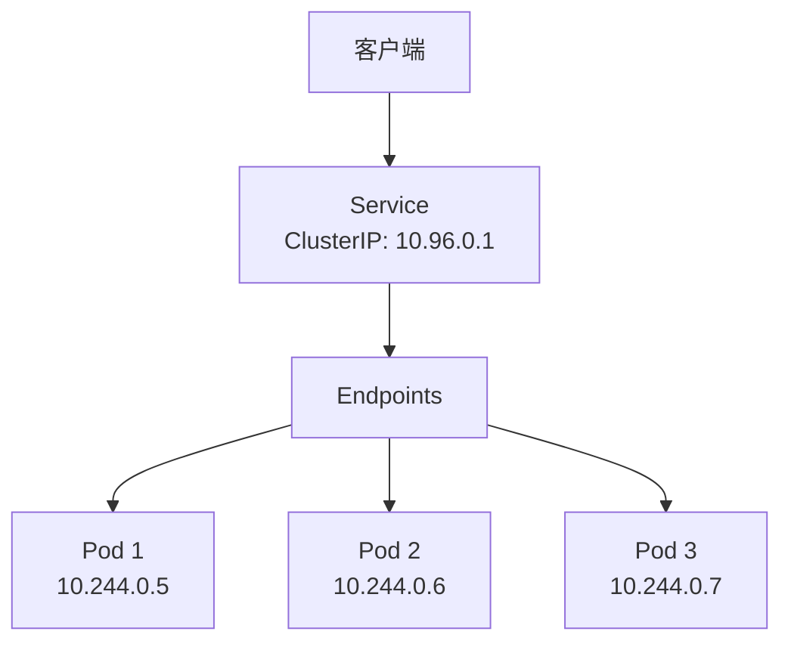

# Service 服务发现

## Service 概述

Service 是 Kubernetes 中用于暴露应用的抽象，提供稳定的网络端点和负载均衡。



## Service 类型

| 类型         | 说明                 | 使用场景     |
| ------------ | -------------------- | ------------ |
| ClusterIP    | 仅集群内部访问       | 内部服务     |
| NodePort     | 通过节点端口暴露     | 开发测试     |
| LoadBalancer | 使用云厂商负载均衡器 | 生产环境     |
| ExternalName | 映射外部 DNS 名称    | 外部服务集成 |

## ClusterIP

默认类型，仅在集群内部可访问。

```yaml
apiVersion: v1
kind: Service
metadata:
  name: my-service
  namespace: default
spec:
  type: ClusterIP # 默认类型
  selector:
    app: my-app
  ports:
    - name: http
      port: 80 # Service 端口
      targetPort: 8080 # Pod 端口
      protocol: TCP
    - name: https
      port: 443
      targetPort: 8443
```

### 访问方式

```bash
# 在集群内通过 DNS 访问
curl http://my-service.default.svc.cluster.local:80
curl http://my-service.default:80
curl http://my-service:80  # 同命名空间

# 通过 ClusterIP 访问
curl http://10.96.0.100:80
```

### Headless Service

不分配 ClusterIP，直接返回 Pod IP 列表。

```yaml
apiVersion: v1
kind: Service
metadata:
  name: headless-service
spec:
  clusterIP: None # Headless
  selector:
    app: my-app
  ports:
    - port: 80
      targetPort: 8080
```

```bash
# DNS 查询返回所有 Pod IP
nslookup headless-service.default.svc.cluster.local
```

## NodePort

通过每个节点的固定端口暴露服务。

```yaml
apiVersion: v1
kind: Service
metadata:
  name: nodeport-service
spec:
  type: NodePort
  selector:
    app: my-app
  ports:
    - port: 80
      targetPort: 8080
      nodePort: 30080 # 节点端口（30000-32767）
```

```bash
# 通过任意节点 IP 访问
curl http://<node-ip>:30080
```

## LoadBalancer

在云环境中自动创建负载均衡器。

```yaml
apiVersion: v1
kind: Service
metadata:
  name: loadbalancer-service
  annotations:
    # 云厂商特定注解
    service.beta.kubernetes.io/aws-load-balancer-type: nlb
spec:
  type: LoadBalancer
  selector:
    app: my-app
  ports:
    - port: 80
      targetPort: 8080
  loadBalancerSourceRanges: # 访问白名单
    - 192.168.1.0/24
    - 10.0.0.0/8
```

```bash
# 查看外部 IP
kubectl get svc loadbalancer-service
# NAME                   TYPE           CLUSTER-IP     EXTERNAL-IP    PORT(S)
# loadbalancer-service   LoadBalancer   10.96.0.100    203.0.113.10   80:30080/TCP
```

## ExternalName

将服务映射到外部 DNS 名称。

```yaml
apiVersion: v1
kind: Service
metadata:
  name: external-db
spec:
  type: ExternalName
  externalName: db.example.com
```

```bash
# 集群内访问会解析到外部 DNS
curl http://external-db.default.svc.cluster.local
# 实际解析到 db.example.com
```

## 多端口 Service

```yaml
apiVersion: v1
kind: Service
metadata:
  name: multi-port-service
spec:
  selector:
    app: my-app
  ports:
    - name: http # 多端口时必须指定 name
      port: 80
      targetPort: 8080
    - name: https
      port: 443
      targetPort: 8443
    - name: grpc
      port: 9090
      targetPort: 9090
```

## Session Affinity

保持客户端会话粘性。

```yaml
apiVersion: v1
kind: Service
metadata:
  name: sticky-service
spec:
  selector:
    app: my-app
  sessionAffinity: ClientIP
  sessionAffinityConfig:
    clientIP:
      timeoutSeconds: 3600 # 会话保持时间
  ports:
    - port: 80
      targetPort: 8080
```

## Endpoints

Service 通过 Endpoints 追踪后端 Pod。

```bash
# 查看 Endpoints
kubectl get endpoints my-service
kubectl describe endpoints my-service
```

### 手动 Endpoints

用于连接外部服务。

```yaml
apiVersion: v1
kind: Service
metadata:
  name: external-service
spec:
  ports:
    - port: 80
---
apiVersion: v1
kind: Endpoints
metadata:
  name: external-service # 必须与 Service 名称相同
subsets:
  - addresses:
      - ip: 192.168.1.100
      - ip: 192.168.1.101
    ports:
      - port: 8080
```

## EndpointSlice

Endpoints 的改进版本，支持更大规模集群。

```yaml
apiVersion: discovery.k8s.io/v1
kind: EndpointSlice
metadata:
  name: my-service-abc
  labels:
    kubernetes.io/service-name: my-service
addressType: IPv4
ports:
  - name: http
    port: 8080
    protocol: TCP
endpoints:
  - addresses:
      - "10.244.0.5"
    conditions:
      ready: true
      serving: true
      terminating: false
    nodeName: node-1
```

## 服务发现

### DNS 解析

```bash
# 完整域名格式
<service-name>.<namespace>.svc.<cluster-domain>

# 示例
my-service.default.svc.cluster.local
my-service.default.svc
my-service.default
my-service  # 同命名空间
```

### 环境变量

Pod 会自动注入 Service 环境变量：

```bash
# 格式：<SERVICE_NAME>_SERVICE_HOST, <SERVICE_NAME>_SERVICE_PORT
MY_SERVICE_SERVICE_HOST=10.96.0.100
MY_SERVICE_SERVICE_PORT=80
MY_SERVICE_PORT=tcp://10.96.0.100:80
```

## Ingress

七层负载均衡，基于 HTTP/HTTPS 路由。

```yaml
apiVersion: networking.k8s.io/v1
kind: Ingress
metadata:
  name: my-ingress
  annotations:
    nginx.ingress.kubernetes.io/rewrite-target: /
spec:
  ingressClassName: nginx
  tls:
    - hosts:
        - example.com
      secretName: tls-secret
  rules:
    - host: example.com
      http:
        paths:
          - path: /api
            pathType: Prefix
            backend:
              service:
                name: api-service
                port:
                  number: 80
          - path: /
            pathType: Prefix
            backend:
              service:
                name: web-service
                port:
                  number: 80
```

### Path 类型

| 类型                   | 说明                       | 匹配 `/foo`        |
| ---------------------- | -------------------------- | ------------------ |
| Exact                  | 精确匹配                   | 仅 `/foo`          |
| Prefix                 | 前缀匹配                   | `/foo`, `/foo/bar` |
| ImplementationSpecific | 由 Ingress Controller 决定 | 取决于实现         |

### 常用 Ingress Controller

- **NGINX Ingress Controller**：最常用
- **Traefik**：云原生边缘路由
- **HAProxy**：高性能负载均衡
- **Kong**：API 网关
- **Istio Gateway**：服务网格

## 网络策略

控制 Pod 之间的网络流量。

```yaml
apiVersion: networking.k8s.io/v1
kind: NetworkPolicy
metadata:
  name: allow-web-traffic
spec:
  podSelector:
    matchLabels:
      app: web
  policyTypes:
    - Ingress
    - Egress
  ingress:
    - from:
        - namespaceSelector:
            matchLabels:
              name: frontend
        - podSelector:
            matchLabels:
              role: api-gateway
      ports:
        - protocol: TCP
          port: 80
  egress:
    - to:
        - podSelector:
            matchLabels:
              app: database
      ports:
        - protocol: TCP
          port: 5432
```

## 常用操作

```bash
# 创建 Service
kubectl apply -f service.yaml
kubectl expose deployment nginx --port=80 --target-port=8080

# 查看 Service
kubectl get services
kubectl get svc -o wide

# 查看详情
kubectl describe service my-service

# 查看 Endpoints
kubectl get endpoints my-service

# 临时暴露
kubectl port-forward svc/my-service 8080:80

# 删除 Service
kubectl delete service my-service
```

## 调试技巧

```bash
# 测试 DNS 解析
kubectl run dns-test --image=busybox:1.36 -it --rm -- nslookup my-service

# 测试连通性
kubectl run curl-test --image=curlimages/curl -it --rm -- curl http://my-service

# 查看 kube-proxy 规则
iptables -t nat -L -n | grep my-service
ipvsadm -Ln
```
