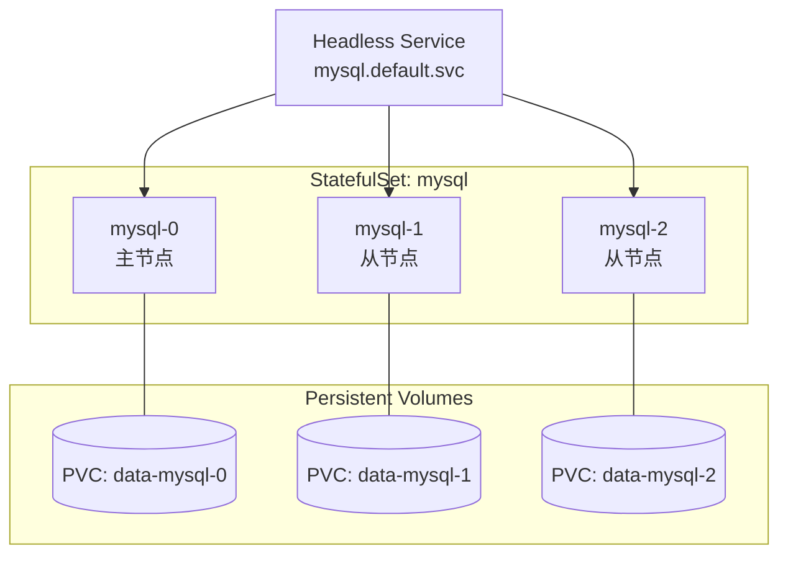

# StatefulSet 有状态应用

## 什么是 StatefulSet？

StatefulSet 用于管理有状态应用，提供稳定的网络标识和持久化存储。



## StatefulSet vs Deployment

| 特性     | Deployment | StatefulSet                   |
| -------- | ---------- | ----------------------------- |
| Pod 名称 | 随机后缀   | 有序索引（0, 1, 2...）        |
| 网络标识 | 不稳定     | 稳定（通过 Headless Service） |
| 存储     | 共享 PVC   | 每个 Pod 独立 PVC             |
| 部署顺序 | 并行       | 有序（0→1→2）                 |
| 删除顺序 | 并行       | 逆序（2→1→0）                 |
| 适用场景 | 无状态应用 | 数据库、缓存、MQ              |

## 基本配置

```yaml
apiVersion: v1
kind: Service
metadata:
  name: mysql
spec:
  clusterIP: None # Headless Service
  selector:
    app: mysql
  ports:
    - port: 3306
      targetPort: 3306
---
apiVersion: apps/v1
kind: StatefulSet
metadata:
  name: mysql
spec:
  serviceName: "mysql" # 关联的 Headless Service
  replicas: 3
  selector:
    matchLabels:
      app: mysql
  template:
    metadata:
      labels:
        app: mysql
    spec:
      containers:
        - name: mysql
          image: mysql:8.0
          ports:
            - containerPort: 3306
          env:
            - name: MYSQL_ROOT_PASSWORD
              valueFrom:
                secretKeyRef:
                  name: mysql-secret
                  key: password
          volumeMounts:
            - name: data
              mountPath: /var/lib/mysql
  volumeClaimTemplates:
    - metadata:
        name: data
      spec:
        accessModes: ["ReadWriteOnce"]
        storageClassName: "standard"
        resources:
          requests:
            storage: 10Gi
```

## 网络标识

### 稳定的 DNS 名称

每个 Pod 都有稳定的 DNS 名称：

```bash
# 格式：<pod-name>.<service-name>.<namespace>.svc.cluster.local
mysql-0.mysql.default.svc.cluster.local
mysql-1.mysql.default.svc.cluster.local
mysql-2.mysql.default.svc.cluster.local

# 简写（同命名空间）
mysql-0.mysql
mysql-1.mysql
```

### 验证 DNS 解析

```bash
# 创建测试 Pod
kubectl run dns-test --image=busybox:1.36 -it --rm -- sh

# 测试 DNS 解析
nslookup mysql-0.mysql
nslookup mysql.default.svc.cluster.local
```

## 更新策略

### RollingUpdate（默认）

按逆序逐个更新 Pod。

```yaml
spec:
  updateStrategy:
    type: RollingUpdate
    rollingUpdate:
      partition: 0 # 只更新索引 >= partition 的 Pod
```

### 分区更新（金丝雀发布）

```yaml
spec:
  updateStrategy:
    type: RollingUpdate
    rollingUpdate:
      partition: 2 # 只更新 Pod 2，0 和 1 保持旧版本
```

```bash
# 更新镜像
kubectl set image statefulset/mysql mysql=mysql:8.0.35

# 验证：mysql-2 更新，mysql-0 和 mysql-1 保持原版本
kubectl get pods -l app=mysql -o jsonpath='{range .items[*]}{.metadata.name}: {.spec.containers[0].image}{"\n"}{end}'

# 完成金丝雀后，更新所有 Pod
kubectl patch statefulset mysql -p '{"spec":{"updateStrategy":{"rollingUpdate":{"partition":0}}}}'
```

### OnDelete

手动删除 Pod 触发更新。

```yaml
spec:
  updateStrategy:
    type: OnDelete
```

## Pod 管理策略

### OrderedReady（默认）

- 按顺序创建：0 → 1 → 2
- 按逆序删除：2 → 1 → 0
- 等待前一个 Pod Ready 才创建下一个

### Parallel

```yaml
spec:
  podManagementPolicy: Parallel
```

- 并行创建和删除所有 Pod
- 适用于不需要顺序启动的有状态应用

## 实践案例

### Redis 主从集群

```yaml
apiVersion: v1
kind: ConfigMap
metadata:
  name: redis-config
data:
  redis.conf: |
    bind 0.0.0.0
    port 6379
    dir /data

  sentinel.conf: |
    sentinel monitor mymaster redis-0.redis 6379 2
    sentinel down-after-milliseconds mymaster 5000
    sentinel failover-timeout mymaster 60000
---
apiVersion: v1
kind: Service
metadata:
  name: redis
spec:
  clusterIP: None
  selector:
    app: redis
  ports:
    - port: 6379
      name: redis
---
apiVersion: apps/v1
kind: StatefulSet
metadata:
  name: redis
spec:
  serviceName: redis
  replicas: 3
  selector:
    matchLabels:
      app: redis
  template:
    metadata:
      labels:
        app: redis
    spec:
      initContainers:
        - name: config
          image: redis:7-alpine
          command:
            - sh
            - -c
            - |
              if [ "$(hostname)" = "redis-0" ]; then
                cp /mnt/redis.conf /etc/redis/redis.conf
              else
                cp /mnt/redis.conf /etc/redis/redis.conf
                echo "replicaof redis-0.redis 6379" >> /etc/redis/redis.conf
              fi
          volumeMounts:
            - name: config
              mountPath: /mnt
            - name: redis-config
              mountPath: /etc/redis
      containers:
        - name: redis
          image: redis:7-alpine
          command: ["redis-server", "/etc/redis/redis.conf"]
          ports:
            - containerPort: 6379
          volumeMounts:
            - name: data
              mountPath: /data
            - name: redis-config
              mountPath: /etc/redis
              readOnly: true
      volumes:
        - name: config
          configMap:
            name: redis-config
        - name: redis-config
          emptyDir: {}
  volumeClaimTemplates:
    - metadata:
        name: data
      spec:
        accessModes: ["ReadWriteOnce"]
        resources:
          requests:
            storage: 5Gi
```

### ZooKeeper 集群

```yaml
apiVersion: v1
kind: Service
metadata:
  name: zookeeper-headless
spec:
  clusterIP: None
  selector:
    app: zookeeper
  ports:
    - port: 2181
      name: client
    - port: 2888
      name: server
    - port: 3888
      name: leader-election
---
apiVersion: apps/v1
kind: StatefulSet
metadata:
  name: zookeeper
spec:
  serviceName: zookeeper-headless
  replicas: 3
  selector:
    matchLabels:
      app: zookeeper
  template:
    metadata:
      labels:
        app: zookeeper
    spec:
      containers:
        - name: zookeeper
          image: zookeeper:3.9
          ports:
            - containerPort: 2181
            - containerPort: 2888
            - containerPort: 3888
          env:
            - name: ZOO_MY_ID
              valueFrom:
                fieldRef:
                  fieldPath: metadata.name
            - name: ZOO_SERVERS
              value: "server.1=zookeeper-0.zookeeper-headless:2888:3888;2181 server.2=zookeeper-1.zookeeper-headless:2888:3888;2181 server.3=zookeeper-2.zookeeper-headless:2888:3888;2181"
          volumeMounts:
            - name: data
              mountPath: /data
  volumeClaimTemplates:
    - metadata:
        name: data
      spec:
        accessModes: ["ReadWriteOnce"]
        resources:
          requests:
            storage: 5Gi
```

## 扩缩容

### 扩容

```bash
# 扩容到 5 个副本（按序创建 3, 4）
kubectl scale statefulset mysql --replicas=5
```

### 缩容

```bash
# 缩容到 2 个副本（按逆序删除 4, 3, 2）
kubectl scale statefulset mysql --replicas=2

# 注意：PVC 不会自动删除，需要手动清理
kubectl get pvc -l app=mysql
kubectl delete pvc data-mysql-2 data-mysql-3 data-mysql-4
```

## 常用操作

```bash
# 创建 StatefulSet
kubectl apply -f statefulset.yaml

# 查看 StatefulSet
kubectl get statefulsets
kubectl get sts

# 查看详情
kubectl describe statefulset mysql

# 查看 Pod
kubectl get pods -l app=mysql -o wide

# 查看 PVC
kubectl get pvc -l app=mysql

# 查看 Pod 日志
kubectl logs mysql-0

# 进入 Pod
kubectl exec -it mysql-0 -- mysql -uroot -p

# 删除 StatefulSet（保留 PVC）
kubectl delete statefulset mysql

# 删除 StatefulSet 和 PVC
kubectl delete statefulset mysql
kubectl delete pvc -l app=mysql
```

## 最佳实践

1. **使用 Headless Service**：确保 Pod 有稳定的 DNS 名称
2. **配置健康检查**：设置合适的 readinessProbe 和 livenessProbe
3. **使用 PodDisruptionBudget**：保证最小可用副本数
4. **数据备份**：定期备份 PVC 数据
5. **优雅终止**：配置合理的 terminationGracePeriodSeconds
6. **资源限制**：设置 CPU 和内存的 requests 和 limits
