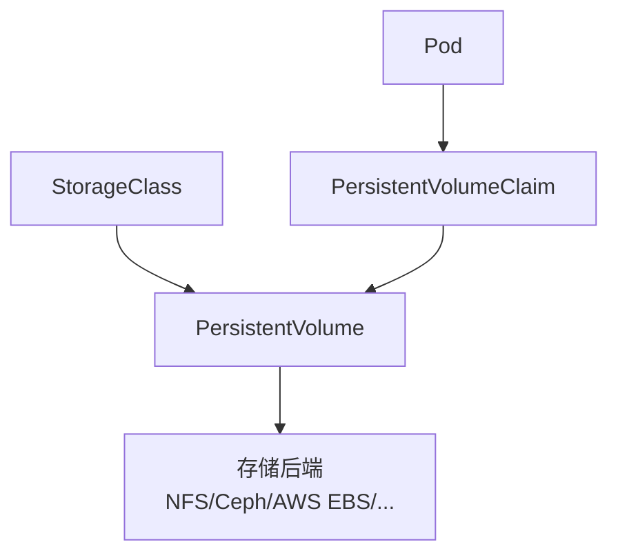

# 存储管理

## 存储概述

Kubernetes 提供了灵活的存储抽象，支持多种存储后端。



## Volume 类型

### 临时卷

```yaml
apiVersion: v1
kind: Pod
metadata:
  name: temp-volume-pod
spec:
  containers:
    - name: app
      image: nginx
      volumeMounts:
        - name: cache
          mountPath: /cache
        - name: shared
          mountPath: /shared

  volumes:
    # emptyDir：Pod 删除时数据丢失
    - name: cache
      emptyDir:
        sizeLimit: 500Mi
        medium: Memory # 使用内存（tmpfs）

    # 共享目录
    - name: shared
      emptyDir: {}
```

### hostPath

将节点文件系统挂载到 Pod（仅用于特殊场景）。

```yaml
volumes:
  - name: host-volume
    hostPath:
      path: /data
      type: DirectoryOrCreate # 不存在则创建
```

hostPath 类型：

- `Directory`：目录必须存在
- `DirectoryOrCreate`：不存在则创建
- `File`：文件必须存在
- `FileOrCreate`：不存在则创建
- `Socket`：Unix Socket

## PersistentVolume (PV)

PV 是集群级别的存储资源。

```yaml
apiVersion: v1
kind: PersistentVolume
metadata:
  name: my-pv
  labels:
    type: local
spec:
  capacity:
    storage: 10Gi

  volumeMode: Filesystem # 或 Block
  accessModes:
    - ReadWriteOnce # RWO
    - ReadOnlyMany # ROX

  persistentVolumeReclaimPolicy: Retain

  storageClassName: manual

  # NFS 示例
  nfs:
    server: nfs-server.example.com
    path: /exports/data
```

### 访问模式

| 模式             | 简写 | 说明                 |
| ---------------- | ---- | -------------------- |
| ReadWriteOnce    | RWO  | 单节点读写           |
| ReadOnlyMany     | ROX  | 多节点只读           |
| ReadWriteMany    | RWX  | 多节点读写           |
| ReadWriteOncePod | RWOP | 单 Pod 读写（1.22+） |

### 回收策略

| 策略    | 说明               |
| ------- | ------------------ |
| Retain  | 保留数据，手动回收 |
| Delete  | 删除 PV 和后端存储 |
| Recycle | 已弃用             |

## PersistentVolumeClaim (PVC)

PVC 是用户对存储的请求。

```yaml
apiVersion: v1
kind: PersistentVolumeClaim
metadata:
  name: my-pvc
  namespace: default
spec:
  accessModes:
    - ReadWriteOnce

  resources:
    requests:
      storage: 5Gi

  storageClassName: manual

  # 可选：选择特定 PV
  selector:
    matchLabels:
      type: local
    matchExpressions:
      - key: environment
        operator: In
        values:
          - production
```

### 使用 PVC

```yaml
apiVersion: v1
kind: Pod
metadata:
  name: app
spec:
  containers:
    - name: app
      image: nginx
      volumeMounts:
        - name: data
          mountPath: /data

  volumes:
    - name: data
      persistentVolumeClaim:
        claimName: my-pvc
        readOnly: false
```

## StorageClass

StorageClass 定义动态存储供应。

```yaml
apiVersion: storage.k8s.io/v1
kind: StorageClass
metadata:
  name: fast
  annotations:
    storageclass.kubernetes.io/is-default-class: "true"
provisioner: kubernetes.io/aws-ebs
parameters:
  type: gp3
  iops: "3000"
  throughput: "125"
  encrypted: "true"
reclaimPolicy: Delete
allowVolumeExpansion: true
volumeBindingMode: WaitForFirstConsumer
```

### 常用 Provisioner

| Provisioner                  | 存储类型            |
| ---------------------------- | ------------------- |
| kubernetes.io/aws-ebs        | AWS EBS             |
| kubernetes.io/gce-pd         | GCE Persistent Disk |
| kubernetes.io/azure-disk     | Azure Disk          |
| kubernetes.io/azure-file     | Azure File          |
| kubernetes.io/cinder         | OpenStack Cinder    |
| kubernetes.io/no-provisioner | 手动供应            |

### 动态供应

使用 StorageClass 自动创建 PV。

```yaml
apiVersion: v1
kind: PersistentVolumeClaim
metadata:
  name: dynamic-pvc
spec:
  accessModes:
    - ReadWriteOnce
  resources:
    requests:
      storage: 10Gi
  storageClassName: fast # 指定 StorageClass
```

## StatefulSet 与存储

StatefulSet 为每个 Pod 创建独立的 PVC。

```yaml
apiVersion: apps/v1
kind: StatefulSet
metadata:
  name: mysql
spec:
  serviceName: mysql
  replicas: 3
  selector:
    matchLabels:
      app: mysql
  template:
    metadata:
      labels:
        app: mysql
    spec:
      containers:
        - name: mysql
          image: mysql:8.0
          volumeMounts:
            - name: data
              mountPath: /var/lib/mysql

  # VolumeClaimTemplate
  volumeClaimTemplates:
    - metadata:
        name: data
      spec:
        accessModes:
          - ReadWriteOnce
        storageClassName: fast
        resources:
          requests:
            storage: 20Gi
```

生成的 PVC：`data-mysql-0`、`data-mysql-1`、`data-mysql-2`

## 卷扩容

### 启用扩容

```yaml
apiVersion: storage.k8s.io/v1
kind: StorageClass
metadata:
  name: expandable
provisioner: kubernetes.io/aws-ebs
allowVolumeExpansion: true # 允许扩容
```

### 扩容 PVC

```bash
# 编辑 PVC
kubectl edit pvc my-pvc

# 修改 spec.resources.requests.storage
# 只能增大，不能缩小
```

## 卷快照

```yaml
# VolumeSnapshotClass
apiVersion: snapshot.storage.k8s.io/v1
kind: VolumeSnapshotClass
metadata:
  name: csi-snapclass
driver: ebs.csi.aws.com
deletionPolicy: Delete

---
# VolumeSnapshot
apiVersion: snapshot.storage.k8s.io/v1
kind: VolumeSnapshot
metadata:
  name: my-snapshot
spec:
  volumeSnapshotClassName: csi-snapclass
  source:
    persistentVolumeClaimName: my-pvc

---
# 从快照恢复
apiVersion: v1
kind: PersistentVolumeClaim
metadata:
  name: restored-pvc
spec:
  accessModes:
    - ReadWriteOnce
  storageClassName: fast
  dataSource:
    name: my-snapshot
    kind: VolumeSnapshot
    apiGroup: snapshot.storage.k8s.io
  resources:
    requests:
      storage: 10Gi
```

## CSI (Container Storage Interface)

CSI 是容器存储的标准接口。

### 常用 CSI 驱动

| 驱动                   | 存储类型   |
| ---------------------- | ---------- |
| aws-ebs-csi-driver     | AWS EBS    |
| aws-efs-csi-driver     | AWS EFS    |
| azuredisk-csi-driver   | Azure Disk |
| gce-pd-csi-driver      | GCE PD     |
| ceph-csi               | Ceph       |
| longhorn               | Longhorn   |
| local-path-provisioner | 本地路径   |

### 安装 CSI 驱动

```bash
# AWS EBS CSI 驱动示例
kubectl apply -k "github.com/kubernetes-sigs/aws-ebs-csi-driver/deploy/kubernetes/overlays/stable/?ref=release-1.20"
```

## 本地存储

### Local PV

```yaml
apiVersion: v1
kind: PersistentVolume
metadata:
  name: local-pv
spec:
  capacity:
    storage: 100Gi
  volumeMode: Filesystem
  accessModes:
    - ReadWriteOnce
  persistentVolumeReclaimPolicy: Delete
  storageClassName: local-storage
  local:
    path: /mnt/disks/ssd1
  nodeAffinity:
    required:
      nodeSelectorTerms:
        - matchExpressions:
            - key: kubernetes.io/hostname
              operator: In
              values:
                - node1

---
apiVersion: storage.k8s.io/v1
kind: StorageClass
metadata:
  name: local-storage
provisioner: kubernetes.io/no-provisioner
volumeBindingMode: WaitForFirstConsumer
```

## 常用操作

```bash
# 查看 StorageClass
kubectl get storageclass
kubectl get sc

# 查看 PV
kubectl get pv
kubectl describe pv my-pv

# 查看 PVC
kubectl get pvc
kubectl describe pvc my-pvc

# 查看 PVC 绑定状态
kubectl get pvc -o wide

# 删除 PVC
kubectl delete pvc my-pvc

# 删除 PV
kubectl delete pv my-pv
```

## 最佳实践

1. **使用 StorageClass 动态供应**：减少手动管理

2. **设置合适的访问模式**：根据应用需求选择

3. **启用卷扩容**：预留扩容能力

4. **使用 WaitForFirstConsumer**：延迟绑定，优化调度

5. **定期备份**：使用快照或备份工具

6. **监控存储使用**：及时扩容避免空间不足

7. **使用 CSI 驱动**：标准化存储接口
