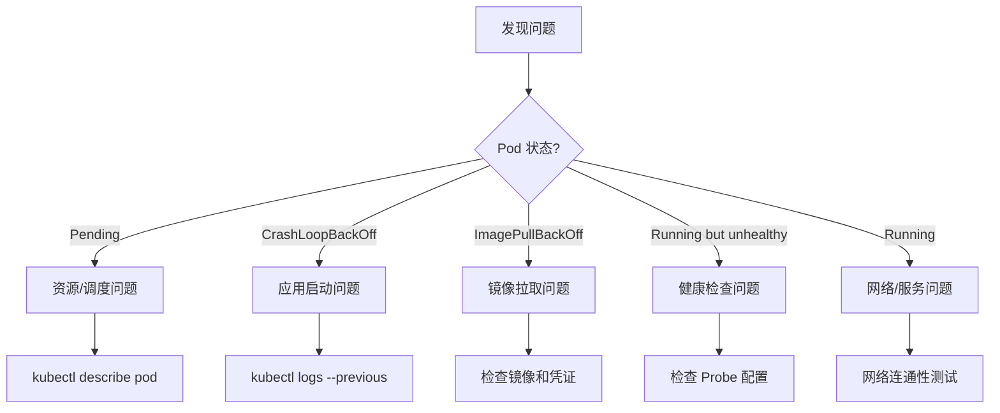

# 故障排查

## 排查流程



## Pod 状态排查

### Pending 状态

**常见原因**：

1. 资源不足
2. 节点不满足调度条件
3. PVC 未绑定

**排查步骤**：

```bash
# 查看 Pod 事件
kubectl describe pod <pod-name>

# 查看调度事件
kubectl get events --field-selector involvedObject.name=<pod-name>

# 检查节点资源
kubectl describe nodes | grep -A 5 "Allocated resources"

# 检查 PVC 状态
kubectl get pvc
kubectl describe pvc <pvc-name>
```

**解决方案**：

```yaml
# 调整资源请求
resources:
  requests:
    memory: "128Mi" # 降低请求
    cpu: "100m"
# 或移除不满足的调度约束
# nodeSelector:
#   disktype: ssd  # 移除此约束
```

### CrashLoopBackOff 状态

**常见原因**：

1. 应用启动失败
2. 配置错误
3. 依赖服务不可用
4. 健康检查失败

**排查步骤**：

```bash
# 查看当前日志
kubectl logs <pod-name>

# 查看上一个容器的日志
kubectl logs <pod-name> --previous

# 查看容器退出原因
kubectl describe pod <pod-name> | grep -A 10 "Last State"

# 进入容器调试
kubectl exec -it <pod-name> -- /bin/sh
```

**常见退出码**：

| 退出码 | 含义                  |
| ------ | --------------------- |
| 0      | 正常退出              |
| 1      | 一般错误              |
| 137    | OOMKilled（内存不足） |
| 139    | 分段错误              |
| 143    | SIGTERM 终止          |

### ImagePullBackOff 状态

**常见原因**：

1. 镜像名称错误
2. 镜像不存在
3. 仓库认证失败
4. 网络问题

**排查步骤**：

```bash
# 查看错误详情
kubectl describe pod <pod-name> | grep -A 5 "Events"

# 在节点上手动拉取镜像
docker pull <image-name>
# 或
crictl pull <image-name>

# 检查 Secret
kubectl get secrets
kubectl describe secret <registry-secret>
```

**解决方案**：

```bash
# 创建镜像拉取凭证
kubectl create secret docker-registry my-registry \
  --docker-server=registry.example.com \
  --docker-username=user \
  --docker-password=pass \
  --docker-email=user@example.com

# 在 Pod 中使用
kubectl patch serviceaccount default -p '{"imagePullSecrets": [{"name": "my-registry"}]}'
```

### OOMKilled 状态

**排查步骤**：

```bash
# 查看退出原因
kubectl describe pod <pod-name> | grep -A 5 "Last State"
# Reason: OOMKilled

# 查看资源使用
kubectl top pod <pod-name>

# 查看容器内存限制
kubectl get pod <pod-name> -o jsonpath='{.spec.containers[*].resources.limits.memory}'
```

**解决方案**：

```yaml
resources:
  limits:
    memory: "512Mi" # 增加内存限制
  requests:
    memory: "256Mi"
```

## 网络问题排查

### Service 不可达

```bash
# 检查 Service
kubectl get svc <service-name>
kubectl describe svc <service-name>

# 检查 Endpoints
kubectl get endpoints <service-name>
# 如果 Endpoints 为空，说明没有匹配的 Pod

# 检查 Pod 标签
kubectl get pods --show-labels
kubectl get pods -l <label-selector>

# DNS 解析测试
kubectl run dns-test --image=busybox:1.36 -it --rm -- nslookup <service-name>

# 连通性测试
kubectl run curl-test --image=curlimages/curl -it --rm -- curl -v http://<service-name>:<port>
```

### Pod 间无法通信

```bash
# 获取 Pod IP
kubectl get pods -o wide

# 测试 Pod 间连通性
kubectl exec -it <pod-1> -- ping <pod-2-ip>
kubectl exec -it <pod-1> -- curl <pod-2-ip>:<port>

# 检查 NetworkPolicy
kubectl get networkpolicy -A
kubectl describe networkpolicy <policy-name>

# 检查 CNI 插件状态
kubectl get pods -n kube-system -l k8s-app=calico-node
kubectl logs -n kube-system -l k8s-app=calico-node
```

### DNS 问题

```bash
# 检查 CoreDNS 状态
kubectl get pods -n kube-system -l k8s-app=kube-dns

# 查看 CoreDNS 日志
kubectl logs -n kube-system -l k8s-app=kube-dns

# 检查 DNS 配置
kubectl get configmap coredns -n kube-system -o yaml

# 测试 DNS 解析
kubectl run dnsutils --image=registry.k8s.io/e2e-test-images/jessie-dnsutils:1.3 -it --rm -- bash
nslookup kubernetes.default
nslookup <service-name>.<namespace>
```

## 节点问题排查

### 节点 NotReady

```bash
# 查看节点状态
kubectl get nodes
kubectl describe node <node-name>

# 检查节点条件
kubectl get node <node-name> -o jsonpath='{.status.conditions[*]}' | jq

# SSH 到节点检查
# 检查 kubelet 状态
sudo systemctl status kubelet
sudo journalctl -u kubelet -f

# 检查容器运行时
sudo systemctl status containerd
sudo crictl ps

# 检查磁盘空间
df -h

# 检查内存
free -m
```

### 节点资源压力

```bash
# 查看节点资源
kubectl top nodes
kubectl describe node <node-name> | grep -A 10 "Conditions"

# 常见压力条件
# MemoryPressure: True  -> 内存不足
# DiskPressure: True    -> 磁盘不足
# PIDPressure: True     -> PID 不足

# 查找资源消耗大的 Pod
kubectl top pods -A --sort-by=memory
kubectl top pods -A --sort-by=cpu

# 驱逐 Pod 释放资源
kubectl drain <node-name> --ignore-daemonsets --delete-emptydir-data
```

## 存储问题排查

### PVC Pending

```bash
# 查看 PVC 状态
kubectl get pvc
kubectl describe pvc <pvc-name>

# 检查 StorageClass
kubectl get storageclass
kubectl describe storageclass <storage-class>

# 检查 PV
kubectl get pv
kubectl describe pv <pv-name>

# 检查存储 Provisioner
kubectl get pods -n kube-system | grep provisioner
kubectl logs -n kube-system <provisioner-pod>
```

### 挂载失败

```bash
# 查看 Pod 事件
kubectl describe pod <pod-name> | grep -A 20 "Events"

# 常见错误
# MountVolume.SetUp failed: mount failed: exit status 32
# -> 检查节点是否安装 NFS 客户端

# VolumeAttributes requested do not match the PersistentVolume
# -> PVC 和 PV 属性不匹配
```

## 控制平面问题

### API Server 不可用

```bash
# 检查 API Server 健康
kubectl get --raw /healthz
kubectl get --raw /readyz

# 查看 API Server 日志（kubeadm 集群）
kubectl logs -n kube-system kube-apiserver-<node-name>
# 或直接查看日志
sudo journalctl -u kubelet | grep apiserver

# 检查证书过期
openssl x509 -in /etc/kubernetes/pki/apiserver.crt -noout -dates
kubeadm certs check-expiration
```

### etcd 问题

```bash
# 检查 etcd 状态
kubectl get pods -n kube-system -l component=etcd

# 查看 etcd 日志
kubectl logs -n kube-system etcd-<node-name>

# etcd 健康检查
sudo ETCDCTL_API=3 etcdctl \
  --endpoints=https://127.0.0.1:2379 \
  --cacert=/etc/kubernetes/pki/etcd/ca.crt \
  --cert=/etc/kubernetes/pki/etcd/server.crt \
  --key=/etc/kubernetes/pki/etcd/server.key \
  endpoint health

# 查看 etcd 成员
sudo ETCDCTL_API=3 etcdctl member list ...
```

## 调试工具

### kubectl debug

```bash
# 创建调试容器（K8s 1.18+）
kubectl debug <pod-name> -it --image=busybox

# 在节点上调试
kubectl debug node/<node-name> -it --image=ubuntu

# 创建 Pod 副本进行调试
kubectl debug <pod-name> --copy-to=debug-pod --container=app -- /bin/sh
```

### 临时调试 Pod

```bash
# 网络调试
kubectl run netshoot --image=nicolaka/netshoot -it --rm -- bash

# 常用命令
curl http://service-name:port
nslookup service-name
tcpdump -i eth0 port 80
netstat -tulpn

# DNS 调试
kubectl run dnsutils --image=registry.k8s.io/e2e-test-images/jessie-dnsutils:1.3 -it --rm -- bash
```

### 常用排查命令汇总

```bash
# 查看所有问题 Pod
kubectl get pods -A | grep -v Running | grep -v Completed

# 查看最近事件
kubectl get events -A --sort-by='.lastTimestamp' | tail -20

# 查看资源使用
kubectl top nodes
kubectl top pods -A --sort-by=memory | head -20

# 检查组件健康
kubectl get componentstatuses
kubectl get nodes
kubectl get pods -n kube-system

# 查看 API Server 日志
kubectl logs -n kube-system -l component=kube-apiserver

# 导出诊断信息
kubectl cluster-info dump --output-directory=/tmp/cluster-dump
```

## 常见问题速查

| 问题                 | 可能原因              | 排查命令                                          |
| -------------------- | --------------------- | ------------------------------------------------- |
| Pod Pending          | 资源不足/调度约束     | `kubectl describe pod`                            |
| Pod CrashLoopBackOff | 应用错误/配置问题     | `kubectl logs --previous`                         |
| Service 不可达       | Endpoints 空/网络策略 | `kubectl get endpoints`                           |
| DNS 解析失败         | CoreDNS 问题          | `kubectl logs -n kube-system -l k8s-app=kube-dns` |
| 节点 NotReady        | kubelet 问题/资源压力 | `kubectl describe node`                           |
| PVC Pending          | StorageClass 问题     | `kubectl describe pvc`                            |
