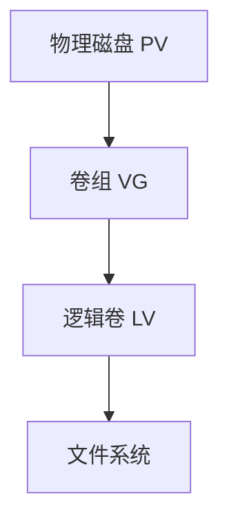

# Linux 磁盘和存储管理

磁盘管理是 Linux 系统管理的重要部分，包括分区、格式化、挂载、LVM 和 RAID 等。

## 磁盘基础

### 磁盘类型

```bash
# SATA 磁盘
/dev/sda, /dev/sdb, /dev/sdc...

# NVMe 磁盘
/dev/nvme0n1, /dev/nvme0n2...

# SCSI 磁盘
/dev/sd*

# 虚拟磁盘（云环境）
/dev/vda, /dev/vdb...
```

### 查看磁盘信息

```bash
# 列出块设备
lsblk
lsblk -f        # 显示文件系统

# 磁盘分区详情
sudo fdisk -l
sudo parted -l

# 磁盘使用情况
df -h
df -i           # inodes 使用

# 目录大小
du -sh /path
du -h --max-depth=1 /

# 查找特定大小的文件
find / -type f -size +100M 2>/dev/null
find / -type f -size +1G 2>/dev/null

# 磁盘 IO 统计
iostat
iostat -x 1

# 磁盘信息详情
sudo hdparm -I /dev/sda
sudo smartctl -a /dev/sda
```

## 分区管理

### fdisk 分区（MBR）

```bash
# 启动 fdisk
sudo fdisk /dev/sdb

# fdisk 命令
m       # 帮助
p       # 打印分区表
n       # 新建分区
d       # 删除分区
t       # 更改分区类型
w       # 写入并退出
q       # 不保存退出

# 示例：创建新分区
sudo fdisk /dev/sdb
n       # 新建
p       # 主分区
1       # 分区号
[Enter] # 默认起始扇区
+10G    # 大小10GB
w       # 写入
```

### parted 分区（GPT）

```bash
# 启动 parted
sudo parted /dev/sdb

# 创建 GPT 分区表
(parted) mklabel gpt

# 创建分区
(parted) mkpart primary ext4 0% 100%
(parted) mkpart primary ext4 0GB 50GB
(parted) mkpart primary ext4 50GB 100GB

# 查看分区
(parted) print

# 删除分区
(parted) rm 1

# 退出
(parted) quit
```

### gdisk 分区（GPT）

```bash
# 使用 gdisk（GPT fdisk）
sudo gdisk /dev/sdb

# 命令类似 fdisk
n       # 新建分区
d       # 删除分区
p       # 打印分区表
w       # 写入并退出
```

## 文件系统

### 创建文件系统

```bash
# ext4（推荐使用）
sudo mkfs.ext4 /dev/sdb1

# xfs
sudo mkfs.xfs /dev/sdb1

# btrfs
sudo mkfs.btrfs /dev/sdb1

# FAT32（兼容性好）
sudo mkfs.vfat -F 32 /dev/sdb1

# NTFS（与 Windows 兼容）
sudo mkfs.ntfs /dev/sdb1
sudo mkfs.ntfs -f /dev/sdb1    # 快速格式化

# 使用标签
sudo mkfs.ext4 -L MyData /dev/sdb1
```

### 查看文件系统

```bash
# 查看文件系统类型
lsblk -f
blkid

# 查看文件系统详情
sudo tune2fs -l /dev/sdb1       # ext 文件系统
sudo xfs_info /dev/sdb1         # xfs 文件系统

# 修改文件系统标签
sudo e2label /dev/sdb1 NewLabel        # ext
sudo xfs_admin -L NewLabel /dev/sdb1   # xfs
```

### 文件系统检查和修复

```bash
# ext 文件系统检查（需先卸载）
sudo umount /dev/sdb1
sudo fsck /dev/sdb1
sudo e2fsck /dev/sdb1

# 自动修复
sudo fsck -y /dev/sdb1
sudo e2fsck -p /dev/sdb1

# 强制检查
sudo fsck -f /dev/sdb1

# xfs 文件系统修复
sudo xfs_repair /dev/sdb1
```

## 挂载管理

### 临时挂载

```bash
# 创建挂载点
sudo mkdir /mnt/data

# 挂载分区
sudo mount /dev/sdb1 /mnt/data

# 挂载 ISO 文件
sudo mount -o loop image.iso /mnt/iso

# 只读挂载
sudo mount -o ro /dev/sdb1 /mnt/data

# 挂载网络文件系统（NFS）
sudo mount -t nfs server:/path /mnt/nfs

# 卸载
sudo umount /mnt/data
sudo umount /dev/sdb1

# 强制卸载
sudo umount -f /mnt/data
sudo umount -l /mnt/data    # 懒卸载
```

### 永久挂载（/etc/fstab）

```bash
# 编辑 fstab
sudo vim /etc/fstab

# fstab 格式
# <设备> <挂载点> <文件系统> <选项> <dump> <fsck>

# UUID 挂载（推荐）
UUID=xxx-xxx-xxx /mnt/data ext4 defaults 0 2

# 设备路径挂载
/dev/sdb1 /mnt/data ext4 defaults 0 2

# 网络挂载
server:/export /mnt/nfs nfs defaults 0 0

# 获取 UUID
sudo blkid /dev/sdb1
lsblk -f

# 测试 fstab
sudo mount -a

# fstab dump 选项
# 0 - 不备份
# 1 - 备份

# fstab fsck 选项
# 0 - 不检查
# 1 - 根文件系统
# 2 - 其他文件系统
```

### 挂载选项

```bash
# 常用选项
defaults    # 默认选项（rw,suid,dev,exec,auto,nouser,async）
rw          # 读写
ro          # 只读
noexec      # 禁止执行
nosuid      # 禁用 SUID
nodev       # 禁止设备文件
noatime     # 不更新访问时间（性能优化）
nodiratime  # 不更新目录访问时间
user        # 允许普通用户挂载
auto        # 开机自动挂载
noauto      # 不自动挂载

# 示例
UUID=xxx /mnt/data ext4 defaults,noatime 0 2
```

## LVM（逻辑卷管理）

### LVM 概念



### 创建 LVM

```bash
# 1. 创建物理卷（PV）
sudo pvcreate /dev/sdb1
sudo pvcreate /dev/sdc1

# 查看 PV
sudo pvdisplay
sudo pvs

# 2. 创建卷组（VG）
sudo vgcreate vg_data /dev/sdb1 /dev/sdc1

# 查看 VG
sudo vgdisplay
sudo vgs

# 3. 创建逻辑卷（LV）
sudo lvcreate -L 10G -n lv_data vg_data
sudo lvcreate -l 100%FREE -n lv_data vg_data    # 使用全部空间

# 查看 LV
sudo lvdisplay
sudo lvs

# 4. 格式化并挂载
sudo mkfs.ext4 /dev/vg_data/lv_data
sudo mkdir /mnt/lvm
sudo mount /dev/vg_data/lv_data /mnt/lvm
```

### 扩展 LVM

```bash
# 扩展VG（添加新硬盘）
sudo pvcreate /dev/sdd1
sudo vgextend vg_data /dev/sdd1

# 扩展 LV
sudo lvextend -L +5G /dev/vg_data/lv_data       # 增加5GB
sudo lvextend -l +100%FREE /dev/vg_data/lv_data  # 使用所有空间

# 扩展文件系统
sudo resize2fs /dev/vg_data/lv_data             # ext4
sudo xfs_growfs /mnt/lvm                         # xfs

# 一步完成（扩展LV和文件系统）
sudo lvextend -r -L +5G /dev/vg_data/lv_data
```

### 缩小 LVM

```bash
# 注意：xfs 不支持缩小，只有 ext 系列支持

# 1. 卸载
sudo umount /mnt/lvm

# 2. 检查文件系统
sudo e2fsck -f /dev/vg_data/lv_data

# 3. 缩小文件系统
sudo resize2fs /dev/vg_data/lv_data 5G

# 4. 缩小 LV
sudo lvreduce -L 5G /dev/vg_data/lv_data

# 5. 重新挂载
sudo mount /dev/vg_data/lv_data /mnt/lvm
```

### LVM 快照

```bash
# 创建快照
sudo lvcreate -L 1G -s -n lv_snap /dev/vg_data/lv_data

# 挂载快照
sudo mkdir /mnt/snapshot
sudo mount /dev/vg_data/lv_snap /mnt/snapshot

# 恢复快照
sudo umount /mnt/lvm
sudo lvconvert --merge /dev/vg_data/lv_snap

# 删除快照
sudo lvremove /dev/vg_data/lv_snap
```

## RAID

### RAID 级别

| RAID    | 最少磁盘 | 容量    | 容错      | 性能 | 说明           |
| ------- | -------- | ------- | --------- | ---- | -------------- |
| RAID 0  | 2        | 100%    | 无        | 高   | 条带化，无冗余 |
| RAID 1  | 2        | 50%     | 1 块      | 读快 | 镜像           |
| RAID 5  | 3        | (n-1)/n | 1 块      | 均衡 | 分布式奇偶校验 |
| RAID 6  | 4        | (n-2)/n | 2 块      | 读快 | 双重奇偶校验   |
| RAID 10 | 4        | 50%     | 每组 1 块 | 高   | 镜像+条带      |

### 创建 RAID

```bash
# 安装 mdadm
sudo apt install mdadm

# 创建 RAID 1
sudo mdadm --create /dev/md0 --level=1 --raid-devices=2 /dev/sdb1 /dev/sdc1

# 创建 RAID 5
sudo mdadm --create /dev/md0 --level=5 --raid-devices=3 /dev/sdb1 /dev/sdc1 /dev/sdd1

# 查看 RAID 状态
cat /proc/mdstat
sudo mdadm --detail /dev/md0

# 格式化 RAID
sudo mkfs.ext4 /dev/md0

# 挂载
sudo mkdir /mnt/raid
sudo mount /dev/md0 /mnt/raid

# 保存 RAID 配置
sudo mdadm --detail --scan | sudo tee -a /etc/mdadm/mdadm.conf
sudo update-initramfs -u
```

### RAID 管理

```bash
# 添加热备盘
sudo mdadm --add /dev/md0 /dev/sde1

# 标记磁盘为故障
sudo mdadm --fail /dev/md0 /dev/sdb1

# 移除故障磁盘
sudo mdadm --remove /dev/md0 /dev/sdb1

# 替换磁盘
sudo mdadm --add /dev/md0 /dev/sdf1    # 会自动开始重建

# 停止 RAID
sudo mdadm --stop /dev/md0

# 删除 RAID
sudo mdadm --zero-superblock /dev/sdb1
```

## 存储优化

### 性能优化

```bash
# 挂载选项优化
noatime,nodiratime    # 不更新访问时间

# 查看磁盘调度器
cat /sys/block/sda/queue/scheduler

# 修改调度器
echo noop | sudo tee /sys/block/sda/queue/scheduler
echo deadline | sudo tee /sys/block/sda/queue/scheduler

# IO优先级
ionice -c3 command    # 空闲时运行
ionice -c2 -n0 command  # 最高优先级
```

### 磁盘清理

```bash
# 查找大文件
sudo find / -type f -size +1G 2>/dev/null

# 清理包缓存
sudo apt clean
sudo yum clean all

# 清理日志
sudo journalctl --vacuum-time=7d

# 查找空目录
find . -type d -empty

# 删除旧内核
sudo apt autoremove
dpkg --list | grep linux-image
```

## 最佳实践

### 1. 使用 LVM

```bash
# ✅ 预留空间便于扩展
# ✅ 使用快照进行备份
# ✅ 合理规划卷组大小
```

### 2. 定期检查

```bash
# 定期检查磁盘健康
sudo smartctl -a /dev/sda

# 监控磁盘使用
df -h
du -sh /*
```

### 3. 备份策略

```bash
# 重要数据使用 RAID 1 或 RAID 10
# 定期异地备份
# 使用 LVM 快照
```

## 总结

本文介绍了 Linux 磁盘和存储管理：

- ✅ 磁盘分区（fdisk、parted）
- ✅ 文件系统创建和管理
- ✅ 挂载配置（fstab）
- ✅ LVM 逻辑卷管理
- ✅ RAID 磁盘阵列
- ✅ 存储性能优化

继续学习 [性能优化](./performance-tuning) 和 [系统安全](./security)。
