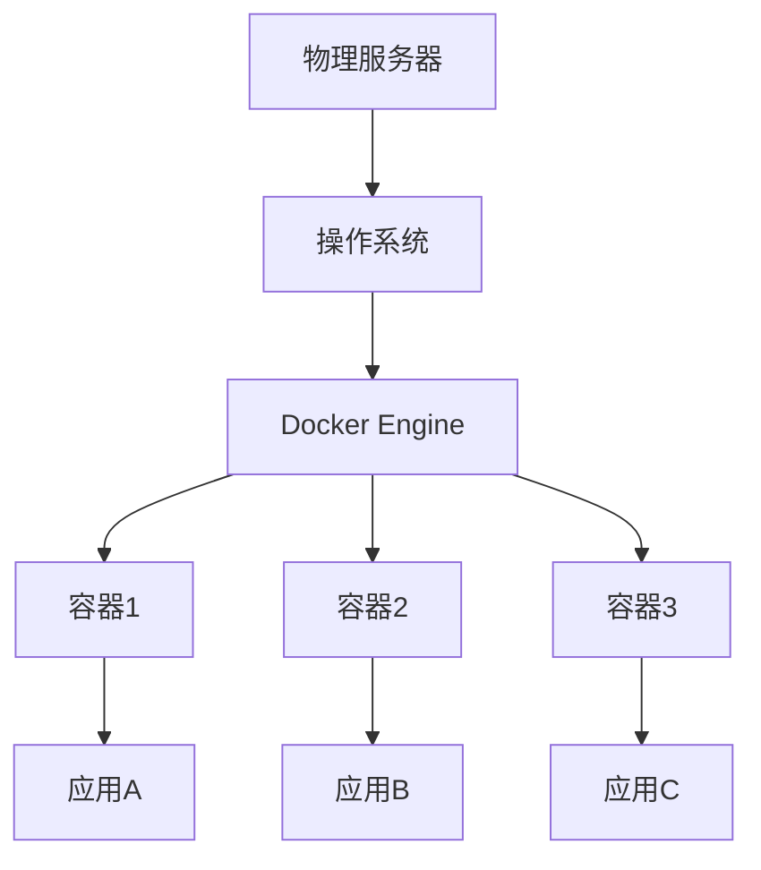

# Docker 容器基础

Docker 是一个开源的容器化平台，可以将应用程序及其依赖打包到一个可移植的容器中。

## Docker 概述

### 什么是容器



### 容器 vs 虚拟机

| 特性     | 容器     | 虚拟机 |
| -------- | -------- | ------ |
| 启动速度 | 秒级     | 分钟级 |
| 资源占用 | 低       | 高     |
| 隔离级别 | 进程级   | 系统级 |
| 镜像大小 | MB 级    | GB 级  |
| 性能     | 接近原生 | 有损耗 |

## 安装 Docker

### Ubuntu/Debian

```bash
# 更新包索引
sudo apt update

# 安装依赖
sudo apt install apt-transport-https ca-certificates curl gnupg lsb-release

# 添加 Docker 官方 GPG 密钥
curl -fsSL https://download.docker.com/linux/ubuntu/gpg | sudo gpg --dearmor -o /usr/share/keyrings/docker-archive-keyring.gpg

# 添加 Docker 仓库
echo "deb [arch=amd64 signed-by=/usr/share/keyrings/docker-archive-keyring.gpg] https://download.docker.com/linux/ubuntu $(lsb_release -cs) stable" | sudo tee /etc/apt/sources.list.d/docker.list > /dev/null

# 安装 Docker
sudo apt update
sudo apt install docker-ce docker-ce-cli containerd.io

# 启动 Docker
sudo systemctl start docker
sudo systemctl enable docker

# 将当前用户添加到 docker 组
sudo usermod -aG docker $USER
# 重新登录后生效
```

### CentOS/RHEL

```bash
# 安装依赖
sudo yum install -y yum-utils

# 添加 Docker 仓库
sudo yum-config-manager --add-repo https://download.docker.com/linux/centos/docker-ce.repo

# 安装 Docker
sudo yum install docker-ce docker-ce-cli containerd.io

# 启动 Docker
sudo systemctl start docker
sudo systemctl enable docker
```

### 验证安装

```bash
# 查看版本
docker --version
docker version

# 运行测试容器
docker run hello-world

# 查看系统信息
docker info
```

## 镜像管理

### 镜像操作

```bash
# 搜索镜像
docker search nginx

# 拉取镜像
docker pull nginx
docker pull nginx:1.21
docker pull nginx:latest

# 列出本地镜像
docker images
docker image ls

# 查看镜像详情
docker inspect nginx

# 查看镜像历史
docker history nginx

# 删除镜像
docker rmi nginx
docker rmi nginx:1.21
docker image rm nginx

# 清理未使用的镜像
docker image prune
docker image prune -a  # 删除所有未使用的镜像
```

### 镜像加速

```bash
# 配置镜像加速器
sudo vim /etc/docker/daemon.json

{
  "registry-mirrors": [
    "https://mirror.ccs.tencentyun.com",
    "https://docker.mirrors.ustc.edu.cn"
  ]
}

# 重启 Docker
sudo systemctl daemon-reload
sudo systemctl restart docker
```

### 构建镜像

```dockerfile
# Dockerfile 示例
FROM ubuntu:20.04

# 设置工作目录
WORKDIR /app

# 复制文件
COPY . .

# 安装依赖
RUN apt-get update && apt-get install -y python3 python3-pip \
    && pip3 install -r requirements.txt \
    && apt-get clean

# 暴露端口
EXPOSE 8080

# 启动命令
CMD ["python3", "app.py"]
```

```bash
# 构建镜像
docker build -t myapp:1.0 .
docker build -t myapp:latest -f Dockerfile.prod .

# 标记镜像
docker tag myapp:1.0 myregistry/myapp:1.0

# 推送镜像
docker push myregistry/myapp:1.0
```

## 容器操作

### 运行容器

```bash
# 基本运行
docker run nginx

# 后台运行
docker run -d nginx

# 指定名称
docker run -d --name my-nginx nginx

# 端口映射
docker run -d -p 8080:80 nginx
docker run -d -p 127.0.0.1:8080:80 nginx

# 挂载卷
docker run -d -v /host/path:/container/path nginx
docker run -d -v myvolume:/data nginx

# 环境变量
docker run -d -e MYSQL_ROOT_PASSWORD=password mysql

# 资源限制
docker run -d --memory=512m --cpus=1 nginx

# 网络设置
docker run -d --network=mynet nginx

# 交互式运行
docker run -it ubuntu /bin/bash
docker run -it --rm ubuntu /bin/bash  # 退出后自动删除
```

### 容器管理

```bash
# 列出容器
docker ps           # 运行中的容器
docker ps -a        # 所有容器
docker ps -q        # 只显示ID

# 启动/停止/重启
docker start container_name
docker stop container_name
docker restart container_name

# 暂停/恢复
docker pause container_name
docker unpause container_name

# 删除容器
docker rm container_name
docker rm -f container_name       # 强制删除运行中的容器
docker rm $(docker ps -aq)        # 删除所有容器

# 清理已停止的容器
docker container prune
```

### 容器交互

```bash
# 进入运行中的容器
docker exec -it container_name /bin/bash
docker exec -it container_name sh

# 执行命令
docker exec container_name ls -la
docker exec -u root container_name whoami

# 查看日志
docker logs container_name
docker logs -f container_name         # 实时查看
docker logs --tail 100 container_name # 最后100行
docker logs --since 1h container_name # 最近1小时

# 查看资源使用
docker stats
docker stats container_name

# 查看容器详情
docker inspect container_name

# 查看端口映射
docker port container_name

# 查看进程
docker top container_name

# 复制文件
docker cp container_name:/path/file /host/path
docker cp /host/file container_name:/path/
```

## 数据管理

### 数据卷

```bash
# 创建卷
docker volume create myvolume

# 列出卷
docker volume ls

# 查看卷详情
docker volume inspect myvolume

# 删除卷
docker volume rm myvolume

# 清理未使用的卷
docker volume prune

# 使用卷
docker run -d -v myvolume:/data nginx
```

### 挂载类型

```bash
# 命名卷（推荐）
docker run -d -v myvolume:/app/data nginx

# 绑定挂载
docker run -d -v /host/path:/container/path nginx

# 只读挂载
docker run -d -v /host/path:/container/path:ro nginx

# tmpfs 挂载（内存）
docker run -d --tmpfs /tmp nginx
```

## 网络管理

### 网络操作

```bash
# 列出网络
docker network ls

# 创建网络
docker network create mynet
docker network create --driver bridge mynet

# 查看网络详情
docker network inspect mynet

# 删除网络
docker network rm mynet

# 连接容器到网络
docker network connect mynet container_name

# 断开容器与网络
docker network disconnect mynet container_name
```

### 网络类型

```bash
# bridge（默认）- 容器间通信
docker network create --driver bridge mybridge

# host - 使用主机网络
docker run --network=host nginx

# none - 无网络
docker run --network=none nginx

# overlay - 跨主机通信（Swarm）
docker network create --driver overlay myoverlay
```

### 容器间通信

```bash
# 创建网络
docker network create app-net

# 运行容器并加入网络
docker run -d --name db --network app-net mysql
docker run -d --name web --network app-net nginx

# 容器可通过名称互相访问
# 在 web 容器中可以访问 db:3306
```

## Docker Compose

### 安装 Docker Compose

```bash
# 下载 Docker Compose
sudo curl -L "https://github.com/docker/compose/releases/latest/download/docker-compose-$(uname -s)-$(uname -m)" -o /usr/local/bin/docker-compose

# 添加执行权限
sudo chmod +x /usr/local/bin/docker-compose

# 验证安装
docker-compose --version
```

### docker-compose.yml 示例

```yaml
version: "3.8"

services:
  web:
    build: .
    ports:
      - "8080:80"
    volumes:
      - ./app:/app
    environment:
      - NODE_ENV=production
    depends_on:
      - db
    networks:
      - app-net

  db:
    image: mysql:8.0
    environment:
      MYSQL_ROOT_PASSWORD: password
      MYSQL_DATABASE: myapp
    volumes:
      - db-data:/var/lib/mysql
    networks:
      - app-net

volumes:
  db-data:

networks:
  app-net:
```

### Compose 命令

```bash
# 启动服务
docker-compose up
docker-compose up -d        # 后台运行
docker-compose up --build   # 重新构建

# 停止服务
docker-compose down
docker-compose down -v      # 同时删除卷

# 查看服务状态
docker-compose ps

# 查看日志
docker-compose logs
docker-compose logs -f web

# 执行命令
docker-compose exec web bash

# 扩展服务
docker-compose up -d --scale web=3

# 重启服务
docker-compose restart
docker-compose restart web
```

## 常用命令速查

### 镜像相关

```bash
docker images                    # 列出镜像
docker pull image:tag            # 拉取镜像
docker build -t name:tag .       # 构建镜像
docker push name:tag             # 推送镜像
docker rmi image                 # 删除镜像
docker save -o file.tar image    # 导出镜像
docker load -i file.tar          # 导入镜像
```

### 容器相关

```bash
docker run -d -p 80:80 image     # 运行容器
docker ps                        # 列出容器
docker start/stop/restart name   # 管理容器
docker rm name                   # 删除容器
docker exec -it name bash        # 进入容器
docker logs -f name              # 查看日志
docker cp src dest               # 复制文件
```

### 清理命令

```bash
docker system prune              # 清理所有未使用资源
docker system prune -a           # 包括未使用的镜像
docker container prune           # 清理停止的容器
docker image prune               # 清理悬空镜像
docker volume prune              # 清理未使用的卷
docker network prune             # 清理未使用的网络
```

## 最佳实践

### Dockerfile 优化

```dockerfile
# 使用官方基础镜像
FROM python:3.9-slim

# 使用 .dockerignore 排除无关文件
# .dockerignore 内容:
# .git
# __pycache__
# *.pyc
# node_modules

# 合并 RUN 命令减少层数
RUN apt-get update \
    && apt-get install -y --no-install-recommends gcc \
    && pip install --no-cache-dir requirements.txt \
    && apt-get remove -y gcc \
    && apt-get autoremove -y \
    && rm -rf /var/lib/apt/lists/*

# 使用非 root 用户
RUN useradd -m myuser
USER myuser

# 使用多阶段构建
FROM golang:1.17 AS builder
WORKDIR /app
COPY . .
RUN go build -o main .

FROM alpine:latest
COPY --from=builder /app/main /main
CMD ["/main"]
```

### 安全建议

```bash
# 使用特定版本标签
FROM nginx:1.21.0  # 而不是 nginx:latest

# 扫描镜像漏洞
docker scan myimage

# 限制容器资源
docker run --memory=512m --cpus=1 myimage

# 使用只读文件系统
docker run --read-only myimage

# 禁用 root
docker run --user 1000:1000 myimage
```

## 总结

本文介绍了 Docker 容器基础：

- ✅ Docker 概念和安装
- ✅ 镜像管理和构建
- ✅ 容器操作和交互
- ✅ 数据卷和挂载
- ✅ 网络管理
- ✅ Docker Compose
- ✅ 最佳实践

继续学习 [系统安全](/docs/linux/security) 和 [性能调优](/docs/linux/performance-tuning)。
